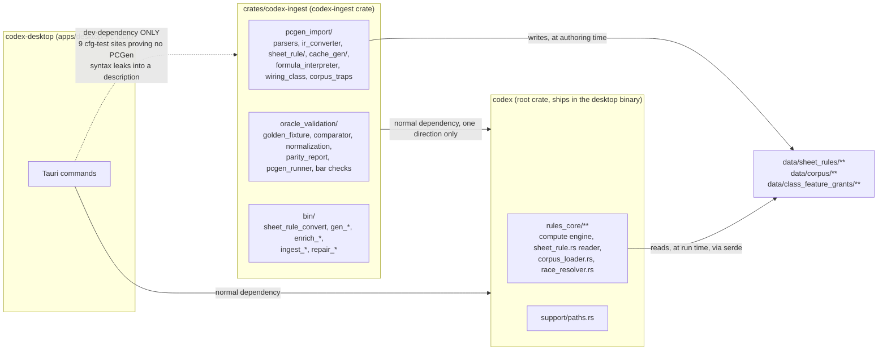
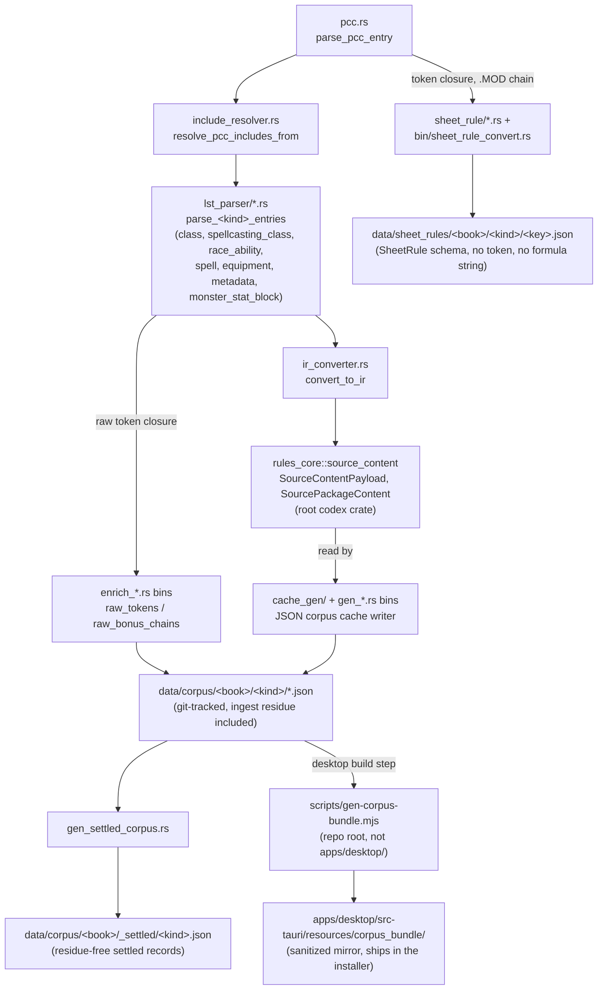
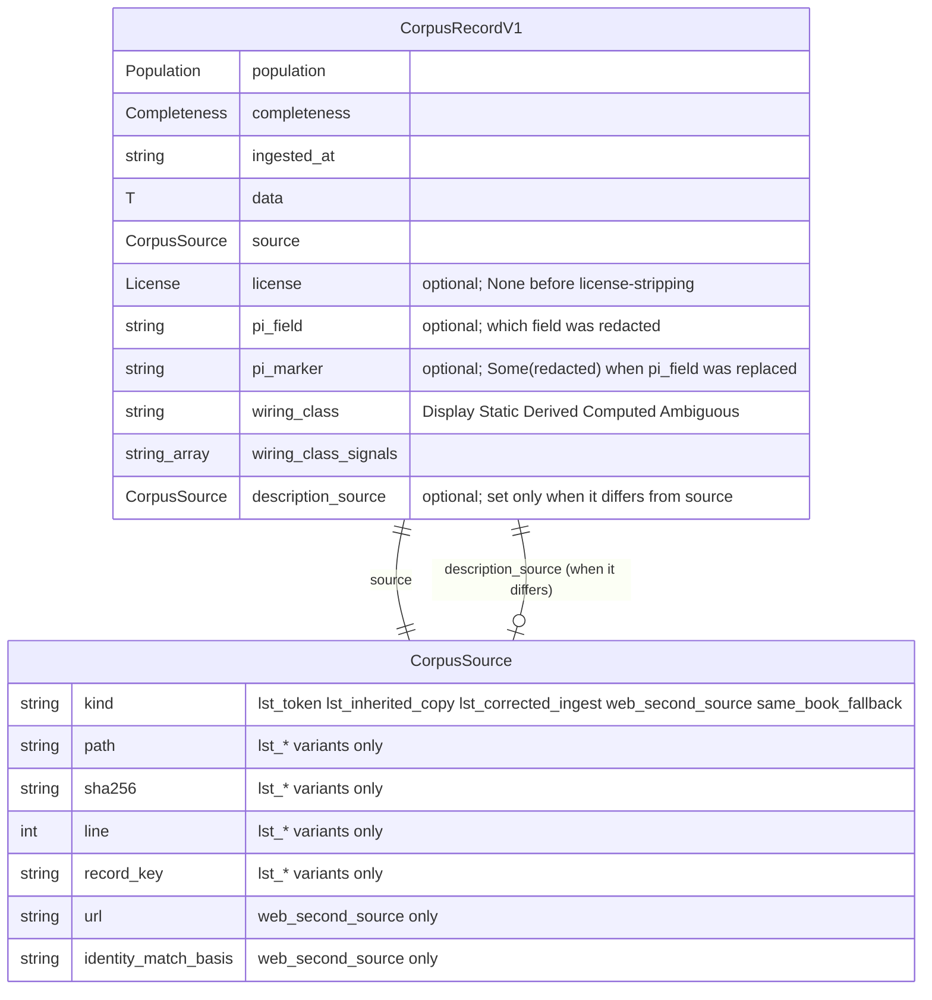

# Corpus Ingest

> Scope: the crate wall between the PCGen converter/oracle and the live engine, and how real PCGen corpus files (`.pcc`/`.lst` data files) are parsed and projected into the canonical source-IR the rules engine consumes.
> Last verified: **2026-09-20 against `tranche/16` (`b22ea9e113`)** for the new §"The crate wall"
> section and the path corrections it required throughout this document: the old src/pcgen_import/
> and src/oracle_validation/ directories do not exist any more — SD-36 Epic A (operator ruling D1)
> moved the whole converter/oracle tree to `crates/codex-ingest/src/pcgen_import/` and
> `crates/codex-ingest/src/oracle_validation/`, and every generator/enrichment binary that used to
> live at `src/bin/*` moved to `crates/codex-ingest/src/bin/*` (only `pi_sweep_rules_tables.rs`,
> `v06_class_state_dump.rs`, and `v06_content_state_dump.rs` remain in `src/bin/`, re-derived with
> `ls src/bin/` vs `ls crates/codex-ingest/src/bin/`). This pass also added the converter-pipeline
> flowchart, the corpus record erDiagram, and the generated PCGen-free desktop corpus bundle section.
> Prior pass **2026-09-15 against `tranche/15`** (SD-35 closure epilogue) verified §"The sheet-rule
> converter" and the `cache_gen` relocation (unaffected in substance by the Epic A crate move — only
> the path prefix changed); the parsing-pipeline stages (1-6) are otherwise unchanged since the
> 2026-08-07 tranche/8 pass.
> Maintenance: updated at SD closure — see [README.md](./README.md) §Maintenance contract

## The crate wall

*New 2026-09-20, SD-36 Epic A / operator ruling D1.* The whole of this document's subject — the
PCGen converter, its `.lst`/`.pcc` parsers, and the oracle-parity harness — lives in a **separate
Cargo crate**, `codex-ingest` (`crates/codex-ingest/`), not in the root `codex` crate that ships in
the desktop binary. This is the mechanical enforcement of the same boundary
[overview.md](./overview.md) describes as "the converter/live boundary": before Epic A that boundary
was a `grep`-checked convention (`scripts/pcgen_residue_gate.py` scanning `src/rules_core/**` for
PCGen token syntax); after Epic A it is also a **build-graph fact** `cargo tree` can show directly.



*Dependency direction is `codex-ingest -> codex`, never the reverse, in the normal/build graph —
`codex` may only reach `codex-ingest` as a `[dev-dependencies]` entry (`apps/desktop/src-tauri/Cargo.toml`),
and only for tests. A `codex` production path that imported `codex-ingest` would make the crate wall
meaningless; the `crate-wall` verify stage below fails the build before that ships.*

**Why a separate crate, not just separate files.** `Cargo.toml` at the repo root declares a
`[workspace] members = ["crates/*"]` with **no `default-members`** — `cargo build`/`cargo test` run
at the repo root therefore build only the root `codex` package by default, "the wall's cheapest
proof" per the workspace manifest's own comment. `crates/codex-ingest/Cargo.toml` depends on `codex`
by path (`codex = { path = "../.." }`), the *opposite* direction from what a converter-in-the-same-crate
arrangement would have allowed silently.

**What may depend on what:**

| Crate | May depend on (normal graph) | May depend on (dev-only) |
|---|---|---|
| `codex` (root, `Cargo.toml`) | nothing under `crates/` | never `codex-ingest` |
| `codex-ingest` (`crates/codex-ingest/`) | `codex` | — |
| `codex-desktop` (`apps/desktop/src-tauri/`) | `codex` | `codex-ingest` (9 `#[cfg(test)]` sites proving a player-facing description never leaks raw PCGen syntax — see `apps/desktop/src-tauri/Cargo.toml`'s own comment on the entry) |

**The `crate-wall` verify stage** (`scripts/verify.sh`, `run_crate_wall`) proves this structurally,
not by convention: it runs `cargo tree -e normal,build` from the desktop crate and asserts zero
`codex-ingest` entries in that edge set, an awk check that every mention of `codex-ingest` in
`apps/desktop/src-tauri/Cargo.toml` sits under the `[dev-dependencies]` header specifically, and then
re-runs `scripts/pcgen_residue_gate.py --check` as a second, independent proof of the same boundary
from the token-content side. Both must pass for the stage to pass.

**What moved, and what stayed.** Every file that reads a PCGen token — the whole parsing pipeline
below, the sheet-rule converter, `wiring_class.rs`, `corpus_traps.rs`, the formula interpreter, and
`oracle_validation/`'s six submodules — moved from `src/` to `crates/codex-ingest/src/`. Every
generator/enrichment/ingest binary that used to live at `src/bin/*.rs` moved to
`crates/codex-ingest/src/bin/*.rs` with it, because each one reads or re-derives from raw corpus
text. Nothing about *what* any of these modules do changed — this was a pure relocation, verified by
`crate-wall`'s and `pcgen-residue-gate`'s stages both passing unchanged in substance, only in which
crate they run against.

## Purpose

`crates/codex-ingest/src/pcgen_import/` turns real PCGen corpus text — `.pcc` campaign entry
files and the `.lst` object-data files they include — into the canonical
source-IR envelope (`src/rules_core/source_content.rs`, still in the root `codex` crate — see
[rules-engine.md](./rules-engine.md) §"The corpus loaders") that the rules
engine consumes. The corpus itself is never vendored into this repo: it
is an external checkout of PCGen data, located by the `PCGEN_CORPUS_ROOT`
environment variable at test time. Every corpus-gated test skips gracefully
(or hard-skips via `#[ignore]`) rather than failing when the corpus isn't
present — see [testing.md](./testing.md) §"Corpus-gated tests" for the full
catalog of patterns and which one to copy for a new test.

Parsing and semantic conversion are deliberately separate stages, per
`crates/codex-ingest/src/pcgen_import/mod.rs`'s module doc comment. Nothing in this module
interprets PF1 rule semantics (BONUS trees, pipe-delimited qualifiers,
spell-slot math); it only recognizes directive shapes and carries their
tokens forward with source provenance.

## The converter pipeline, end to end



*Everything left of the dotted line between `corpus_data`/`settled`/`sheet_rules` and the desktop
lives in `codex-ingest`; `data/corpus/`, `data/sheet_rules/`, and the desktop's `corpus_bundle/`
mirror are ordinary committed data files any crate can read — the crate wall is about which CODE may
read a PCGen TOKEN, not about who may read the JSON these tools produce.*

## The sheet-rule converter (`data/sheet_rules/`) — new 2026-09-15, SD-35

The stages below produce the source-IR the engine's hand-transcribed chassis consumes. SD-35
added a **second, terminal output** of this module, and it is the one that carries the whole
corpus: `crates/codex-ingest/src/pcgen_import/sheet_rule/` (`closure.rs`, `convert.rs`, `ctx.rs`, `formula.rs`,
`mod.rs`, `prereq.rs`, `prose.rs`, `table.rs`), driven by the `crates/codex-ingest/src/bin/sheet_rule_convert.rs`
binary.

**Why it exists.** It is the whole of the converter/live boundary
([overview.md](./overview.md)). Before SD-35 the live engine read PCGen tokens at run time
through a formula evaluator. Now the reading happens **once, here, at ingest**, and the live side
reads only our own schema. `sheet_rule_convert` is a tool: it never ships in the desktop binary
and is never called at run time.

**Input.** One corpus record's *token closure* — the base `.lst` row plus every `.MOD` row —
read in PCGen's own order (`.COPY=` base → own row → `.MOD` rows in file order), from the pinned
tree named by `scripts/pcgen-oracle-pin.env`. `_pfs/` files are skipped by path; `.MOD` rows match
on (file kind, CATEGORY, KEY-else-name); a base record resolves corpus-wide
(`crates/codex-ingest/src/pcgen_import/sheet_rule/closure.rs`). The closure also reads the numbered class level lines
(`PinnedTree.level_lines`) that `data/corpus/` never held.

**Output.** `data/sheet_rules/<book>/<kind>/<key>.json` — one `SheetRule` per record in **our**
schema (`src/rules_core/sheet_rule.rs`; no token, no formula string, no PCGen variable name),
plus `_vars/<VarId>.json` contribution tables and `_defects/*.json`. The tree's root carries a
`data/sheet_rules/GENERATED` marker file — "written by `cargo run --locked --bin
sheet_rule_convert`; regenerated whole; never hand-edited". `data/corpus/` itself is not touched
by this stage. Every emitted rule carries its own `provenance`: the `book`, the `kind`, the exact
`closure_rows` (`<file>:<line>`) it was built from, the `oracle_pin` SHA, and the
`converter_version`.

**Its own report is the gate.** `data/sheet_rules/_report.json`, re-derivable with
`cargo run --locked -p codex-ingest --bin sheet_rule_convert -- --check` (the
`-p codex-ingest` is required — the root `Cargo.toml` has no
`default-members`, so a bare `--bin sheet_rule_convert` from the repo root
cannot resolve the binary; `scripts/verify.sh`'s `sheet-rules-check` stage
runs the same `-p`-qualified form):

| figure | value | re-derive |
|---|---|---|
| records converted | 49,450 of 49,450, **0 refused** | `python3 -c "import json;d=json.load(open('data/sheet_rules/_report.json'));print(d['converted'],d['records'],d['refused'])"` |
| rules written | 70,317 | `python3 -c "import json;print(json.load(open('data/sheet_rules/_report.json'))['rules_written'])"` |
| variable contribution tables | 5,294 | `python3 -c "import json;print(json.load(open('data/sheet_rules/_report.json'))['var_tables'])"` |
| degraded records (converted, some token dropped to words) | 423 | `python3 -c "import json;print(json.load(open('data/sheet_rules/_report.json'))['degraded_records'])"` |

`scripts/token_coverage.py --check` is the companion instrument: it names the remainder **by
token type** and checks the type counts sum to the record count, so "the rest" can never be a
category. A refused token type is the next cycle's scope, never an exemption.

**One shape rule, mechanically enforced:** our data files carry none of the source format.

```
$ grep -rlE 'BONUS:|DEFINE:|PRE[A-Z]+:|%CHOICE|CL=' data/sheet_rules/ | wc -l
0
```

**`cache_gen` moved.** The corpus-cache generators live at `crates/codex-ingest/src/pcgen_import/cache_gen/` as of
SD-35 (`AT-35-E6-002`). They were under a `cache_gen/` directory in `src/rules_core/`, which put
PCGen-reading code on the live side of the boundary; the code is unchanged, only its side is.
There is no `cache_gen/` under `src/rules_core/` any more — the path in any older doc or comment
is stale.

## Pipeline stages

The pipeline runs in one direction, each stage consuming the previous
stage's output type:

```
pcc.rs                  parse_pcc_entry            -> PccEntryFile
include_resolver.rs      resolve_pcc_includes_from  -> IncludeResolution
lst_parser/<kind>.rs     parse_<kind>_entries        -> per-kind parse result
ir_converter.rs          convert_to_ir / convert_*   -> SourceContentRecord<'a>
rules_core::source_content SourceContentPayload<'a>   (payload enum, referenced above)
rules_core::source_content SourcePackageContent<'a>  (corpus-rooted aggregate)
```

### Stage 1 — `pcc.rs`: structural include edges

`crates/codex-ingest/src/pcgen_import/pcc.rs`'s `parse_pcc_entry(source_path, input_text)`
walks a `.pcc` file line by line and recognizes exactly one construct:
`PCC:` include directives. Every other line (`CLASS:`, `RACE:`,
`SKILL:`, ...) is ignored at this stage — no LST semantics are
interpreted here. The result is a `PccEntryFile` carrying:

- `includes: Vec<PccIncludeEdge>` — one entry per `PCC:` directive, with
  `source_path`, one-based `line_number`, verbatim `raw_directive`, and
  the parsed `target` text.
- `diagnostics: Vec<PccDiagnostic>` — a `PccDiagnosticKind::MalformedInclude`
  record for a `PCC:` line with no target, rather than a silently
  dropped line.

### Stage 2 — `include_resolver.rs`: deterministic include graph

`crates/codex-ingest/src/pcgen_import/include_resolver.rs` composes `pcc::parse_pcc_entry`
(it does not shadow it) and resolves the raw include-directive text into
an actual filesystem graph. `resolve_pcc_includes_from(corpus_root,
source_pcc_path)` performs a deterministic DFS over `PCC:` edges,
resolving PCGen's `@/` and `*/` path conventions against `corpus_root`
(see `resolve_pcgen_path`), and returns an `IncludeResolution` with:

- `pcc_files: Vec<ResolvedPccFile>` — every PCC file visited, in DFS
  preorder.
- `pcc_edges: Vec<ResolvedPccEdge>` — directed include edges with
  resolved absolute `target_path`.
- `lst_files: Vec<ResolvedLstFile>` — flat LST references discovered on
  non-`PCC:` lines (any line of the form `<KIND>:<path>.lst`), each
  tagged with its directive `kind` (e.g. `CLASS`, `RACE`, `SPELL`,
  `DATACONTROL`) and the line that emitted it.
- `diagnostics: Vec<IncludeDiagnostic>` — `IncludeDiagnosticKind`
  variants `MalformedInclude` (propagated from the B-family PCC parser),
  `MissingTarget` (an include or LST reference resolves to a
  non-existent file), `CycleDetected` (a `PCC:` include points back to a
  file already on the active DFS stack — the diagnostic message includes
  the full cycle path), and `ReadFailed` (a PCC file could not be read).

Downstream parsers (Stage 3) discover which `.lst` files to parse from
`IncludeResolution::lst_files`; this module does not parse LST content
itself.

### Stage 3 — `lst_parser/`: per-kind LST parsers

`crates/codex-ingest/src/pcgen_import/lst_parser/mod.rs` partitions LST parsing by object
kind, one module per kind:

- `class.rs` — `parse_class_entries` recognizes `CLASS:<name>` lines for
  a fixed allowlist, `MARTIAL_CLASS_NAMES` (Fighter, Barbarian, Monk,
  Rogue, Ranger, Paladin, Cavalier, Brawler, Slayer, Swashbuckler, plus
  each name's `Ex-<name>` mirror). A class name outside the allowlist is
  skipped silently (no diagnostic) — it belongs to a different parser or
  a future widening. Output is `ClassEntry` (tokens plus `###Block:`
  `ClassFeatureBlock`/`ClassLevelLine` feature data), aggregated into a
  `ClassParseResult`.
- `spellcasting_class.rs` — the same allowlist pattern via
  `SPELLCASTING_CLASS_NAMES` (Cleric, Druid, Wizard, Sorcerer, Bard,
  Alchemist, Inquisitor, Oracle, Summoner, Witch, Arcanist, Bloodrager,
  Hunter, Investigator, Shaman, Skald, Warpriest). `parse_spellcasting_class_entries`
  additionally derives a `CastingPosture` (Prepared / Spontaneous /
  Spellbook) from `SPELLSTAT:`/`MEMORIZE:`/`SPELLBOOK:` tokens and
  harvests progression-curve and domain-selection `###Block:` rows into
  `SpellcastingClassEntry`. Both allowlists widen one class at a time as
  SD-22 ingest cycles verify each class's real `CLASS:` line shape
  against the corpus — putting a class on the wrong allowlist (martial
  vs. spellcasting) is a correctness bug the module doc comments call
  out per class.
- `race_ability.rs` — `parse_lst_entry` recognizes `RACE:`/`RACES:`
  pointer lines and `ABILITY:` declarations (pointer or full
  pipe-delimited form), producing `LstEntryFile` with `race_pointers:
  Vec<RaceDeclaration>` and `ability_declarations: Vec<AbilityDeclaration>`.
- `spell.rs` — row-shaped `SPELL:` parsing (`LstSpellRecord`), tolerant
  of both "tight TSV" and "aligned TSV" corpus layouts via a known-tag
  scan (`KNOWN_TAGS`) rather than fixed column indices.
- `equipment.rs` — `EQUIP:`/`EQUIPMOD:` row parsing (`EquipmentRecord`),
  including flattened `BONUS:` chains (`BonusToken`) so a chain with
  many pipe-delimited qualifiers still parses in O(n) without recursion.
- `metadata.rs` — the six flat metadata kinds (`MetadataKind::{Deity,
  Domain, Kits, Language, Template, CompanionMod}`), each occurrence
  becoming one `LstRecord`.
- `monster_stat_block.rs` — a bare tab-delimited row parser
  (`parse_monster_stat_block_entries`), written for SD-22 Epic 5's
  Bestiary 1 ingest because `race_ability.rs`'s `RACE:`/`ABILITY:`-only
  recognizer extracts zero records from `b1_races.lst` (monster rows
  there have no directive prefix — the name is the unprefixed first tab
  field). A row qualifies only if it carries a `CR:` token (rows
  without one, like the bare `Skeleton`/`Zombie` template-shim rows, are
  skipped without a diagnostic) and is not a `.MOD`/`.COPY=` override
  row. **This parser is not wired into `ir_converter.rs` or
  `SourceContentPayload`** — there is no `MonsterStatBlockRecord`
  variant on either enum, and its only caller in the repo is the
  parser's own test suite (`crates/codex-ingest/tests/sd17_b_monster_stat_block.rs`). Its
  output is read and hand-transcribed into `rules_tables` book modules
  rather than flowing through the canonical-IR projection path
  automatically (see [rules-data-tables.md](./rules-data-tables.md)'s
  hand-transcription convention).

Every per-kind parser's outputs are reachable through one kind-tagged
union: `ParsedLstRecord<'a>` (`crates/codex-ingest/src/pcgen_import/lst_parser/mod.rs`,
canonical home; re-exported from `crates/codex-ingest/src/pcgen_import/mod.rs` and from
`ir_converter.rs` for backward compatibility). Its seven variants —
`Class`, `SpellcastingClass`, `Race`, `Ability`, `Spell`, `Equipment`,
`Metadata` — each borrow (`&'a ...`) the corresponding B-family entry
type. `monster_stat_block.rs`'s `MonsterStatBlockRecord` has no
`ParsedLstRecord` variant, consistent with it sitting outside the
canonical-IR pipeline.

### Stage 4 — `ir_converter.rs`: canonical projection

`crates/codex-ingest/src/pcgen_import/ir_converter.rs` is the canonical projection path. Its
public entry point, `convert_to_ir(parsed_record: &ParsedLstRecord<'a>,
_schema: &IRSchema) -> SourceContentRecord<'a>`, is a total,
enum-discriminated trampoline over seven per-family converters
(`convert_class_entry`, `convert_spellcasting_class_entry`,
`convert_race_declaration`, `convert_ability_declaration`,
`convert_spell_record`, `convert_equipment_record`,
`convert_metadata_record`) — every `ParsedLstRecord` variant has exactly
one canonical envelope shape; there is no rejection path at this stage.
Per-document converters (`convert_class_parse_result`,
`convert_lst_entry_file`, `convert_spell_file`, ...) and corpus-rooted
`convert_package_from_*` builders wrap the per-record converters to
consume a whole B-family parse-result container in one O(n) pass,
accumulating a `SourcePackageContent` plus a forwarded-diagnostics
vector.

`IRSchema::canonical_v1()` describes (not enforces) the directive-token
vocabulary the schema recognizes; `IRSchema::recognizes` is advisory,
not a filter the converter itself applies.

`IRDiagnostic` (converter-side; distinct from the canonical
`SourceContentDiagnostic`) is reshaped by `IRDiagnostic::to_canonical`:
codes prefixed `IR_FORWARDED_*` (a diagnostic forwarded verbatim from a
B-family parser) map to `SourceContentSeverity::Error` +
`SourceContentDiagnosticKind::MalformedRecord`; every other
converter-originated code maps to `SourceContentSeverity::Info` +
`SourceContentDiagnosticKind::PartialTranslation`.

### Stage 5 — `source_content.rs`: the payload enum

`SourceContentPayload<'a>` (`src/rules_core/source_content.rs`; until 2026-09-15 this doc
cited a `source_content_payload.rs` under `crates/codex-ingest/src/pcgen_import/` that has never existed —
path corrected at the SD-35 closure)
is the typed, kind-tagged union of borrowed B-family entries
(`Class(&'a ClassEntry)`, `SpellcastingClass(&'a SpellcastingClassEntry)`,
`Race(&'a RaceDeclaration)`, `Ability(&'a AbilityDeclaration)`,
`Spell(&'a LstSpellRecord)`, `Equipment(&'a EquipmentRecord)`,
`Metadata(&'a LstRecord)`) that lives behind every
`SourceContentRecord`.

Its own doc comment explains why it lives in `pcgen_import` rather than
in `rules_core::source_content`, where the rest of the canonical
envelope lives: the variants reference parser entry types from
`pcgen_import::lst_parser::*`. If the enum lived in
`rules_core::source_content` instead, the import graph would cycle —
`pcgen_import::ir_converter` already constructs `SourceContentRecord`
and would need to import from `rules_core::source_content`, which would
in turn need parser types from `pcgen_import`. Keeping the payload enum
beside the parser surface keeps the dependency one-directional:
**Path correction 2026-09-15 (SD-35 closure):** the enum is *defined* in
`src/rules_core/source_content.rs` (`pub enum SourceContentPayload<'a>` at :79) and there
is no `pcgen_import::source_content_payload` module and no re-export — the
paragraph above described an arrangement that never shipped. The dependency is
still one-directional, just the other way round: `pcgen_import::ir_converter`
constructs the enum from `rules_core`, and the only thing crossing the boundary
is the finished envelope
`pcgen_import::ir_converter` builds. The module also carries the total,
mechanical `MetadataKind` <-> `MetadataKindInner` mapping
(`b6_metadata_kind_to_canonical` and its inverse) for the same reason.

### Stage 6 — `rules_core::source_content`: the canonical envelope

`src/rules_core/source_content.rs` defines the rest of the envelope that
the rules engine eventually consumes:

- `SourceRef { lst_file: String, line: u32 }` — the provenance anchor
  every record and diagnostic carries.
- `SourceContentKind` — a tag mirroring the seven payload variants, with
  `Metadata(MetadataKindInner)` distinguishing the six metadata kinds
  under one shared payload variant.
- `SourceContentRecord<'a> { source_ref, kind, payload }` — one record
  per LST directive.
- `SourceContentDiagnostic { severity, kind, message, source_ref }` —
  the projection-side diagnostic surface (distinct from converter-side
  `IRDiagnostic`).
- `SourcePackageContent<'a> { package_id, source_ref, records, diagnostics }`
  — the corpus-rooted aggregate; `records_by_kind` returns a
  deterministically ordered (sorted by `(lst_file, line)`, ties broken by
  insertion order via a stable sort) filtered `Vec`.
- `SourceContentLoadResult<'a> { content: Option<SourcePackageContent<'a>>, diagnostics }`
  — the top-level load result; `content` is `None` only when projection
  hit a blocking error.

## Zero-copy / borrowed design

Every `SourceContentPayload` variant is a borrow, never an owned clone
of the underlying parser entry — `SourceContentRecord<'a>` and
`SourcePackageContent<'a>` are lifetime-parameterized over the B-family
parse-result container that produced them. Per-record conversion
(Stage 4) is O(1); per-document conversion is O(n) in record count; the
whole pipeline never clones a parsed entry on the hot path. Consumers
that need to own a projected record clone the underlying entry
explicitly — the canonical-IR surface itself never does.

For contributors, this means: the B-family parse-result container (e.g.
`ClassParseResult`, `LstEntryFile`) must outlive every
`SourceContentRecord`/`SourcePackageContent` built from it. Code that
tries to return a `SourcePackageContent<'a>` from a function that owns
the parse result locally will not compile — the parse result has to be
kept alive by the caller for as long as the projected records are used.

## Diagnostics posture during ingest

Diagnostics accumulate at every stage rather than aborting the parse.
The canonical `SourceContentDiagnosticKind` (`src/rules_core/source_content.rs`)
has four variants, each with a fixed severity via its constructor:
`MalformedRecord` (`SourceContentDiagnostic::malformed`, `Error` — a
malformed-record diagnostic forwarded from a B-family parser; the
consumer must treat the record as absent), `LossyMapping`
(`::lossy_mapping`, `Warning` — part of the content was preserved as a
raw token string rather than a structured form), `UnsupportedToken`
(`::unsupported_token`, `Warning` — a directive/value token the corpus
supports but the source-IR does not currently recognize), and
`PartialTranslation` (`::partial_translation`, `Info` — known fields
are populated; unknown fields remain on the underlying entry but are
not surfaced in the canonical shape).

Every diagnostic carries a `SourceRef`, so a diagnostic can always be
traced back to the exact LST file and line that produced it — including
container-level diagnostics with no specific line, which anchor to
`line == 0` as the canonical placeholder (see
`IRDiagnostic::to_canonical`'s doc comment).

## The corpus record schema (`data/corpus/**/*.json`)

`src/rules_core/shape_b_v1.rs` (still in the root `codex` crate — this is the on-disk schema, not
converter logic) defines `CorpusRecordV1<T>`, the JSON shape every record in `data/corpus/` is
written in, generic over a book-specific `data: T` payload (an equipment record, a race record, a
spell record, ...).



*`source` answers "where did the RECORD come from" and `description_source` separately answers
"where did the DESCRIPTION come from, when that differs" (see §"Provenance is per-FIELD, not
per-record" below) — the two-slot split exists because 412 equipment records' identity/cost/weight
were corpus-derived while their prose was web-sourced, and collapsing both into one `source` field
would misattribute one or the other.*

`license`/`pi_field`/`pi_marker` are `#[serde(default)]` specifically so a pre-license-stripping
record deserializes with `license: None` rather than a hard parse failure or a silently-assumed-safe
`Ogl` default — an unreviewed record must never be treated as cleared for redistribution by default.
`wiring_class` is the GE-01 taxonomy (`Display` < `Static` < `Derived` < `Computed`, or `Ambiguous`)
every writer now stamps — see [rules-data-tables.md](./rules-data-tables.md) §"`wiring_class`" for
the full determination and drift-guard story.

## `data/corpus/` directory layout

```
data/corpus/
  <book>/                    # one directory per ingested book, e.g. core_rulebook/
    equipment/*.json         # one file per record, CorpusRecordV1<EquipmentCacheData>
    race/*.json               # CorpusRecordV1<CorpusRaceRecord>-shaped
    race_trait/*.json
    spell/*.json
    class_feature/*.json
    monster/*.json
    monster_ability/*.json
    companion/*.json
    _settled/                 # SD-35 AT-35-E6-003-RULED: per-book settled bundles
      equipment.json          # keyed by record path relative to equipment/
      race.json
      race_trait.json
    _parity/                  # generator-internal scratch; every corpus walk skips this
    LICENSE.json              # book-level license metadata; every corpus walk skips this file by name
```

See [rules-engine.md](./rules-engine.md) §"The corpus loaders" for how `corpus_loader.rs` and
`race_resolver.rs` walk this tree at run time (via the `_settled/` bundles, not the raw per-record
JSON) and what a settled bundle adds over the raw per-record JSON.

## The generated PCGen-free corpus bundle for the packaged app

*New since the prior pass — SD-36 consolidation, "corpus-bundle correctness follow-up,"
`decisions.md` §8.* `data/corpus/**/*.json` is **not** what ships inside the Tauri installer. It
carries ingest-time PCGen residue no live consumer reads (`data.raw_tokens`/`raw_bonus_chains`
arrays, an unstripped trailing PCGen token clause on some `description` fields, and free-text
provenance fields that can themselves quote token syntax) — shipping any of that verbatim would put
PCGen token text on a user's disk, which the residue gate's ruling B17 forbids on the shipped side.

**The generator.** `scripts/gen-corpus-bundle.mjs` — deliberately at the **repo root**, not under
`apps/desktop/`, because the script's own source text necessarily names the PCGen token vocabulary it
strips, and `apps/desktop/**` is a zero-carve-out live root for `scripts/pcgen_residue_gate.py`. It
runs as a `pre`-build step of `npm run build` (`apps/desktop/package.json`, before `vite build`) and
as its own `scripts/verify.sh` stage, `corpus-bundle`.

**What it strips**, mirroring exactly what the live loaders actually read (grep-verified against
`src/rules_core/corpus_loader.rs`, `race_resolver.rs`, `trait_pool.rs` — no other kind directory is
read by any live/packaged code path):

| Kind directory | What ships |
|---|---|
| `_settled/` | kept, sanitized — already residue-free; `settled_corpus::read_*_bundle` deserializes it fully |
| `equipment/` | `{}` — `load_equipment_corpus` never opens these files; it derives the record key from the file PATH and reads content from `_settled/equipment.json`. Only the file's on-disk presence (for key enumeration) matters |
| `race/`, `race_trait/` | trimmed `CorpusRecordV1` envelope — `data` → `{}` (ignored); `source` kept (`path`/`line` feed `lst_citation`); `license`/`pi_field`/`pi_marker` kept (`race_trait`'s `description_redacted` flag reads them) — sanitized |
| `spell/` | `{"data": {"key", "school"}}` only — the two fields `load_spell_corpus`/`spell_record_from_json` actually read |

As a defense-in-depth net over every string value that survives the trim, the generator additionally
strips every occurrence of the residue gate's own pattern vocabulary
(`scripts/pcgen_residue_gate.py`'s `DATA_PATTERNS`) — **duplicated**, not imported, in the `.mjs`
script, because it must run on every OS the release workflow builds on (Linux, macOS, Windows) and
only Node, not Python, is guaranteed on all three. The `corpus-bundle` verify stage checks the
duplication hasn't drifted (re-expresses `DATA_PATTERNS` and diffs) before trusting the generator's
own residue-free claim.

**The parity/correctness gate.** The `corpus-bundle` verify stage (re)runs the generator, requires a
positive `files_copied=` count in its own log, requires the output directory to actually exist, and
then runs `pcgen_residue_gate.py --check` against the regenerated bundle specifically — all *before*
the general `pcgen-residue-gate`/`crate-wall`/`desktop` stages run, so a defect here is attributed to
the bundle generator rather than surfacing later as an unattributed residue-gate failure. This closes
a real incident: commit `217f712bab` (tranche/16) had bundled the raw, git-tracked `data/corpus/`
tree wholesale into the Tauri installer (to fix an empty race roster in off-checkout packaged
builds), which fixed the roster but shipped the residue this generator now strips instead.

## Adding support for a new record kind

To add a seventh (or eighth) B-family record kind end to end, touch, in
order:

1. `crates/codex-ingest/src/pcgen_import/lst_parser/<new_kind>.rs` — new parser module,
   producing a parse-result struct and an entry struct with source
   provenance (`source_path`/`line_number` or a container-level
   equivalent), following the existing per-kind modules' shape.
2. `crates/codex-ingest/src/pcgen_import/lst_parser/mod.rs` — register `pub mod <new_kind>;`,
   re-export the new entry type, add a `ParsedLstRecord::<NewKind>(&'a NewKindEntry)`
   variant and a `from_<new_kind>` convenience constructor.
3. `src/rules_core/source_content.rs` — add a matching
   `SourceContentPayload::<NewKind>(&'a NewKindEntry)` variant, and wire
   it into `kind_token()` and `source_slice()`.
4. `src/rules_core/source_content.rs` — add the matching
   `SourceContentKind::<NewKind>` variant, and wire it into `token()`
   and `source_slice()`.
5. `crates/codex-ingest/src/pcgen_import/ir_converter.rs` — add a `convert_<new_kind>_entry`
   per-family converter, wire it into `convert_to_ir`'s match, and add a
   `forward_<new_kind>_diagnostics` helper plus a per-document/
   corpus-rooted converter if the new kind's parser groups records into
   a document container.
6. If the new kind needs its own include-graph discovery convention
   (a new PCC directive prefix), extend
   `crates/codex-ingest/src/pcgen_import/include_resolver.rs`'s LST-reference recognizer —
   otherwise the existing generic `<KIND>:<path>.lst` scan already
   covers it.

## Provenance is per-FIELD, not per-record (new 2026-08-18, SD-31 wave 14)

`shape_b_v1::CorpusRecordV1` carries **two** provenance slots, and they answer
different questions:

* `source: CorpusSource` — where the RECORD came from. For a repo-resident
  cache record this is normally `lst_token` (a pinned `path`/`sha256`/`line`
  into the oracle), or one of the two honest variants
  `lst_corrected_ingest` / `lst_inherited_copy`.
* `description_source: Option<CorpusSource>` — where the record's DESCRIPTION
  came from, when that differs. Populated only where it genuinely differs.

The split exists because SD-26 `decisions.md §11.2` made `source` a
discriminated union to record the provenance of the FIELD each intake cycle
was closing, and for 412 already-shipped equipment records that field was the
description alone: their identity, `cost_gp` and `weight` were generated from
real `KEY:`/`COST:`/`WT:` tokens, while the prose came from a web second
source because APG's three equipment `.lst` files carry **zero** `DESC:`
tokens. Those records were stamped `web_second_source` outright, which put
them **outside `corpus_literal_sweep`'s population entirely** (it walks
`lst_token` + `raw_tokens`), so nothing had ever byte-compared them against
the oracle.

`rules_core::cache_gen::lst_provenance_repair` (driven by
`crates/codex-ingest/src/bin/repair_lst_provenance.rs`, `--check` for a dry run) narrows such a record:
it resolves the real row with `equipment_gap::find_citation`, verifies it
against the closure `corpus_literal_sweep::token_closure` itself builds,
**refuses** unless every claimed `cost_gp`/`weight` is numerically stated by a
`COST:`/`WT:` token in that closure, moves the web citation intact to
`description_source`, and refreshes the record's `wiring_class` from the row
it has just cited (a record that had no citation legitimately read
`ambiguous`/`no_corpus_line`; keeping that stamp after narrowing would be a
self-contradiction). Refusals are reported by name and the record is left
alone — two records currently refuse (`hammer_ricochet`, whose cited row is a
`.COPY=` declaration, and `rag_armor_dark_creeper`, whose identity matches no
row).

**Known gap, and the operating rule that follows from it.** Neither
`cache_gen::apg::generate_equipment` nor
`gen_core_rulebook_cache::equipment_source` emits the narrowed shape yet —
both still stamp `web_second_source` and neither knows the
`description_source` key — and no `verify.sh` stage runs either generator.
Re-running one therefore REVERTS the narrowing. `tests/sd31_lst_provenance_
repair_is_durable.rs` makes that a red gate rather than a silent regression,
and the standing rule until the generators are taught the shape is: **after
running either equipment cache generator, re-run
`cargo run --locked --bin repair_lst_provenance` before committing.**

## `raw_tokens` enrichment and the corpus-literal sweep's own closure builder (SD-33)

Every book's equipment codegen pipeline evolved independently (CRB reads a
hand-curated static table; APG/ACG/Bestiary use their own pre-compiled
tables with a `weight` field name instead of CRB's `weight_lbs`; ARG/PU
parse raw LST directly) — but every Shape B v1 equipment record, regardless
of pipeline, already carries an exact citation back to its real PCGen LST
source line (`source.path` + `source.line`, a `lst_token`-kind source).
`crates/codex-ingest/src/bin/enrich_equipment_raw_tokens.rs` uses that citation directly: it
re-parses the cited raw LST file, finds the record whose header line matches
`source.line`, and adds `raw_tokens`/`raw_bonus_chains` keys onto the
on-disk JSON's `data` object — without touching any other field. It
deliberately operates on raw `serde_json::Value`, never a typed Rust struct:
an earlier version deserialized into a typed cache struct and re-serialized
the whole record, silently dropping every field that struct didn't know
about (APG/ACG/Bestiary's `weight`, PU's `equip_type`/`plus` — a real,
caught-before-commit data loss). Records whose `source.kind` is not
`lst_token` (a `web_second_source` or `same_book_fallback` record — no raw
LST line to enrich from) are left untouched and counted separately, not
treated as an error.

`crates/codex-ingest/src/pcgen_import/corpus_literal_sweep.rs` (see above, "the closure, not the
base row alone, is the correct comparand") is the independent verifier that
byte-compares those populated `raw_tokens` against its own `.MOD`-chain
closure derived from the pinned oracle. Two real defects in the sweep's own
closure builder, not in the enriched data, were found and fixed once
`enrich_equipment_raw_tokens.rs` populated `raw_tokens` corpus-wide and gave
the sweep something non-vacuous to check:

1. **`copy_base_row` resolved a `.COPY=` base by walking the whole book in
   `std::fs::read_dir`'s own unsorted, filesystem-order-dependent order**
   (affected 9 of 10 mismatching records). A same-named-but-structurally-
   different row (e.g. a weapon-proficiency-list definition carrying only
   `TYPE:`, no `COST:`/`WT:`/`DAMAGE:`) living in a *separate* file in the
   same book could win the old book-wide "first match" race ahead of the
   real base row that lives in the *same* file as the citing `.COPY=` row.
   Fixed: `copy_base_row` now checks the citing record's own file first,
   always, falling back to the rest of the book (sorted, for determinism —
   matching `wiring_class::build_mod_index`'s existing precedent) only when
   no same-file base exists.
2. **`compare_tokens`'s blacklist-rescreen exemption unconditionally
   excluded `DESC`** (1 of 10 mismatching records). PI screening on `DESC`
   applies independently of whether a record's own `license`/`pi_field`
   declare a redaction — so an undeclared-but-correctly-redacted `DESC:`
   token (protecting real PI the same mechanism already protects elsewhere)
   was reported as a false mismatch. Fixed: the exemption now covers `DESC`
   too, checked after the `codex_generated_name` branch rather than folded
   into it.

Neither fix touches `data/corpus/**` or `enrich_equipment_raw_tokens.rs` —
both hand-checked records' `raw_tokens` were already byte-correct; the
defect was entirely in the sweep's own reconstruction of the comparand.
`cargo run --locked --bin corpus_literal_sweep` is a `scripts/verify.sh`
stage (`corpus-sweep`); see [testing.md](./testing.md).

See [rules-data-tables.md](./rules-data-tables.md) for what happens
downstream once a corpus record is projected: transcribing its values
into the hand-authored `rules_tables` book modules, and — new as of the
wiring_class/PI-screening convergence cycle — the GE-01 `wiring_class`
taxonomy every corpus record now carries (`crates/codex-ingest/src/pcgen_import/wiring_class.rs` —
moved out of `src/rules_core/` by SD-35 `AT-35-E6-002`, because it reads PCGen
tokens and so belongs on the converter side,
determined from a unit's full token closure, not the base row alone),
`Trap::WiringClassMismatch` (`crates/codex-ingest/src/pcgen_import/corpus_traps.rs`) which
guards that stamp against drift, and the shared PI-screening pass
(`src/rules_core/pi_screening.rs`) every JSON-cache writer now runs
through. See
[rules-engine.md](./rules-engine.md) for how the rules engine consumes
`SourcePackageContent` once corpus content is wired into compute, and
[testing.md](./testing.md) for the corpus-gated test conventions beyond
the graceful-skip pattern shown above.

## How to onboard a book (historical process; PF1e ingestion is closed)

**PF1e ingestion is closed.** `docs/governance/book-ingestion-playbook.md`, the procedure this
section summarizes, is itself marked RETIRED as of SD-36 Epic B (operator ruling D3, 2026-09-15):
`docs/work-inventory.json` reached 49,450 of 49,450 units and is now a frozen snapshot
(`docs/work-inventory.FROZEN.md`); the two tools the playbook was built around
(the `v06_work_inventory` binary and the desktop crate's former reach_gate.rs) are both deleted, and none of its
commands run any more. It stays as the historical record of how this repo's ~30+ book directories
(see [rules-data-tables.md](./rules-data-tables.md)'s module map) were actually onboarded, and is the
starting point a future ingestion effort (Starfinder, most plausibly — this is why the converter and
oracle harness were *kept*, not deleted, in `crates/codex-ingest/`) would adapt rather than redesign
from nothing.

**The per-file count-pinning tax, the one lesson worth carrying forward regardless of tooling.**
Every real book-onboarding cycle in this project's history found that **the cost is per file, not
per record** — a book with 3,000 equipment records and one with 30 cost roughly the same amount of
onboarding labor, because the tax is touching each of ~7 places that pin a *count*, not transcribing
each record by hand:

1. The `rules_tables/<book>/` (or shared cross-book table's) resolver and its acceptance test.
2. The corpus-cache generator/enrichment binary and its round-trip test.
3. Every hand-pinned count assertion anywhere in `tests/` that names the book (spell counts, feat
   counts, description-population percentages — `docs/governance/book-ingestion-playbook.md §6`'s own
   table of "claimed vs. actual" corrections exists because every one of these was wrong on a first
   pass).
4. `RuleSetId` and whatever cross-book registry the new content family joins (`feats_all.rs`,
   `monster_chassis::MONSTER_BOOKS`, `class_spell_levels.rs`) — see
   [rules-data-tables.md](./rules-data-tables.md).
5. The PI-screening/`wiring_class` stamping path, if the book introduces a genuinely new record
   shape the shared blacklist (`PI_BLACKLIST_TERMS`, 61 terms as of this pass — see
   [rules-data-tables.md](./rules-data-tables.md) §"PI screening" for the re-derive command) or the
   wiring-class determinator hasn't seen before.

The playbook's own §6 rule is the one to keep regardless of which tool enforces it in a future
ingestion effort: **derive every count mechanically, cite the command that produced it, and re-derive
at time of use rather than quoting a remembered figure** — a shared checkout's inventory decays
silently, and a number without a reproducing command is a number nobody can re-check.

## How to extend

- **A new record kind end to end** (a seventh/eighth `ParsedLstRecord` family): follow "Adding
  support for a new record kind" above — every touch point in that six-step list is inside
  `crates/codex-ingest/`, except the two `source_content.rs` steps, which are in the root `codex`
  crate (`src/rules_core/source_content.rs`) because that is where the canonical envelope lives.
- **A new converter output** (a second thing produced at ingest time, alongside `data/corpus/**` and
  `data/sheet_rules/**`): write the generator as a new `crates/codex-ingest/src/bin/*.rs`, give it its
  own `--check` mode that regenerates in memory and byte-compares (the shared contract
  `sheet_rule_convert --check`/`gen_settled_corpus --check`/`gen_desktop_fixture_corpus --check` all
  follow), and wire that `--check` into a new `scripts/verify.sh` stage rather than trusting a
  developer to remember to re-run it — see the count-pinning tax above for what happens when a
  regeneration step is undocumented.
- **A new desktop-shipped data mirror** (a second sanitized bundle alongside `corpus_bundle/`): put
  the generator at repo-root `scripts/`, not under `apps/desktop/`, for the same reason
  `gen-corpus-bundle.mjs` is there — a script that must name PCGen token vocabulary in order to strip
  it cannot itself live inside a zero-carve-out live root. Add its own residue-gate proof as a
  `scripts/verify.sh` stage following `corpus-bundle`'s shape (regenerate, require non-empty output,
  re-run `pcgen_residue_gate.py --check` against the regenerated output specifically, before the
  general stages run).
- **Widening `codex-ingest`'s dependency surface**: remember the wall only runs one direction.
  `codex-ingest` may depend on `codex` freely; `codex` must never gain a dependency — normal or
  dev — on `codex-ingest`, and `codex-desktop`'s one dev-dependency on it exists only to prove
  descriptions stay clean, not as a precedent for a second use.

## Pitfalls

- **A path cited as starting src/pcgen_import/ or src/oracle_validation/ no longer exists
  anywhere in this repo** — SD-36 Epic A moved both trees under `crates/codex-ingest/src/`. Any older
  doc, comment, or dispatch prompt that still uses the old `src/`-rooted spelling is citing a path
  from before 2026-09-20; verify before trusting it (this document itself needed the same correction
  this pass).
- **Almost every generator/enrichment/ingest binary moved to `crates/codex-ingest/src/bin/`, but not
  all three remaining `src/bin/*.rs` files did** (`pi_sweep_rules_tables.rs`,
  `v06_class_state_dump.rs`, `v06_content_state_dump.rs` stay in the root crate, because none of them
  reads a raw corpus token — they walk already-compiled `rules_tables` state). Don't assume every
  `src/bin/` binary moved, or that every `crates/codex-ingest/src/bin/` binary is new; check both
  directories.
- **Regenerating an equipment cache without re-running `enrich_equipment_raw_tokens` afterward
  silently reverts `raw_tokens`/`raw_bonus_chains` to absent or stale** — no generator populates those
  fields itself; the enricher is a mandatory, separate post-step (`book-ingestion-playbook.md` DoD
  item 9), and this has been the cause of a real, previously-shipped regression.
- **`corpus_literal_sweep`'s closure builder had its own defects, independent of the data it was
  checking** — `copy_base_row`'s unsorted `read_dir` walk and `compare_tokens`'s `DESC` blacklist
  exemption both produced false mismatches while the underlying `raw_tokens` were already correct.
  When a sweep/gate disagrees with data that was hand-verified correct, check the checker's own
  reconstruction logic before assuming the data is wrong.
- **`SourceContentPayload` and `SourceContentKind` both live in `src/rules_core/source_content.rs`
  today, not in `pcgen_import`** — an earlier draft of this document (corrected 2026-09-15) described
  an arrangement where the payload enum lived on the converter side to avoid an import cycle; that
  arrangement never shipped. The dependency is one-directional the other way: `ir_converter`
  (converter side) constructs the enum from types the root crate defines.
- **A malformed record is diagnosed, never dropped silently** — every stage from `pcc.rs` through
  `ir_converter.rs` accumulates diagnostics rather than aborting. A resolver that returns fewer
  records than expected should be traced through the diagnostics list before being treated as a
  parser bug; the record may be present with a `MalformedRecord`/`Error` diagnostic explaining why
  the consumer must treat it as absent.
