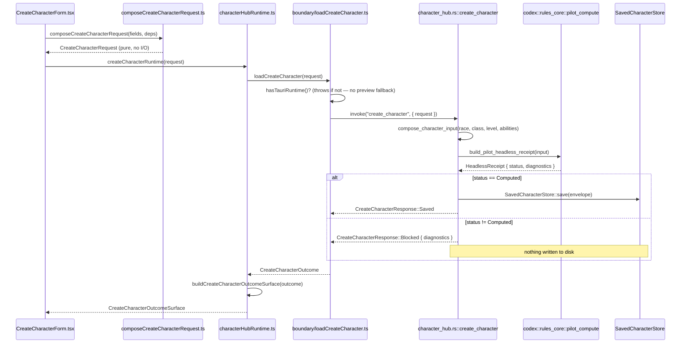
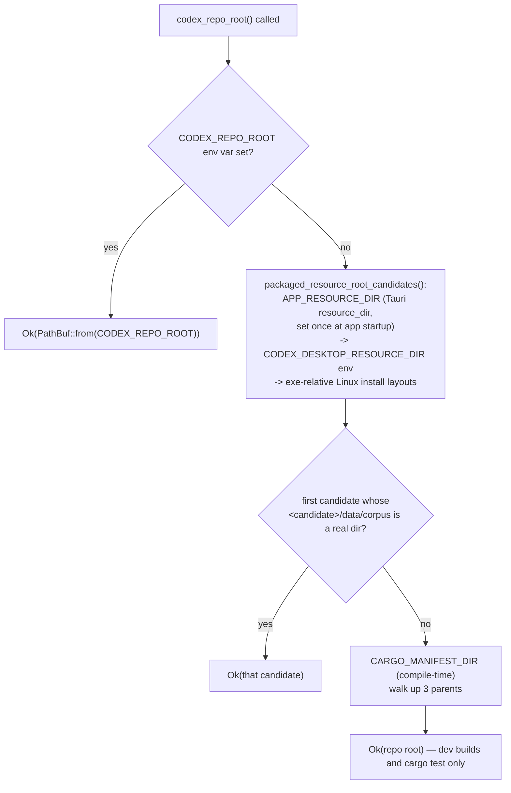
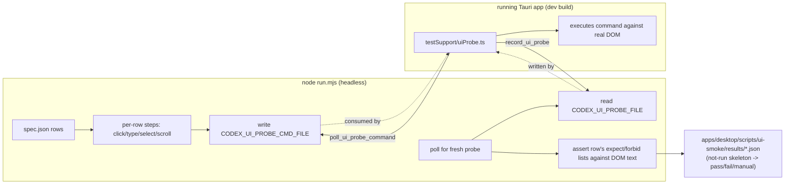

# Desktop App

> Scope: How the Tauri desktop shell is built, how it talks to the Rust backend, and how its frontend surfaces are organized.
> Last verified: **2026-09-20 against `tranche/16`, HEAD `b22ea9e113`** (SD-36 consolidation, architecture-docs truth-up). Full re-derivation of the command inventory (**75** registered commands, re-counted directly from `generate_handler![...]`), the `CharacterHubPage` Mode machine, the boundary layer, the corpus-root resolution chain, the ui-smoke harness, and the character-mutation surfaces added since the 2026-09-15 pass (equipment purchase/attach, feat/trait selection, skill allocation, bio/money/HP sidecars, DM Toolkit). Several claims in the prior pass were stale and are corrected here (see "Corrections since the last pass" below) rather than annotated as deprecated.
> Maintenance: updated at SD closure — see [README.md](./README.md) §Maintenance contract

## Corrections since the last pass

The prior version of this doc (2026-09-15) contained claims that no longer hold. They are removed
below, not kept as deprecated notes, per this doc set's own rule — recorded here once so nobody
re-derives the same corrections independently:

- **The DM Toolkit is real, not a stub.** `LandingScreen`'s "DM Toolkit" banner now routes to
  `apps/desktop/src/dmToolkit/DmToolkitScreen.tsx`, a real encounter-builder and DM-console-export
  surface (`EncounterBuilderScreen.tsx`, `dmConsoleExport.ts`, `dmRecordModel.ts`, `dmHistoryModel.ts`,
  `dmLinksModel.ts`), backed by two real Tauri commands (`rate_encounter`, `export_dm_console`). It no
  longer renders `StubScreen.tsx`.
- **Skill allocation and level-up acceptance are now real, persisted mutations**, not in-memory
  no-ops. `SkillAllocationDialog`'s `onAccept` now calls `boundary/setSkillAllocations.ts` →
  `set_skill_allocations`, which loads, replaces the allocation wholesale, recomputes, and re-saves.
  `LevelUpDialog`'s `onAccept` now drives `level_up_character` through a real preview
  (`preview_level_up`) and grant lookup.
- **The sheet's `☰ Menu` has no bare no-ops left.** `Open`, `Recompute`, `Clone`, `Export`, and
  `Print` are all wired to real handlers (`CharacterSheet.tsx`'s `menuItems`).
- **`StubScreen.tsx` still exists as a component but nothing imports it** (confirmed by grep across
  `apps/desktop/src`) — it is dead code today, not a live placeholder for any screen.
- **The command count is 75, not 53 or 69** — re-derived by parsing `generate_handler![...]`
  programmatically (`python3` script counting comma-separated entries after stripping comments); see
  the inventory below.
- **`apps/desktop/src/boundary/` holds 52 non-test files today**, not 27 — `ls apps/desktop/src/boundary/*.ts | grep -v '\.test\.ts$' | wc -l`.

## Build shape

The desktop app lives at `apps/desktop/` and is a React 18 + Tauri 2 application. The frontend is Vite-built; the backend is a thin Tauri (Rust) shell over the root headless `codex` crate (and, since SD-36 Epic A, over `crates/codex-ingest` for corpus-ingest tooling only — the desktop shell itself does not depend on it; see [corpus-ingest.md](./corpus-ingest.md)).

- **Entry chain**: `apps/desktop/index.html` loads `/src/main.tsx` as a module script. `apps/desktop/src/main.tsx` mounts `<App />` (from `apps/desktop/src/App.tsx`) into `#root` inside `<React.StrictMode>`, after importing `./theme.css`.
- **Vite config** (`apps/desktop/vite.config.ts`): uses `@vitejs/plugin-react`; both the dev server and the preview server are pinned to port `1420` with `strictPort: true` (the port Tauri's `devUrl` points at), so a port conflict fails loudly instead of silently picking a different port.
- **Tauri shell config** (`apps/desktop/src-tauri/tauri.conf.json`): `build.beforeDevCommand` is `npm run dev`, `build.beforeBuildCommand` is `npm run build`, `build.frontendDist` is `../dist`, `build.devUrl` is `http://localhost:1420`. The app window (`app.windows[0]`) is titled "Codex", `1920x1200`, resizable. Bundle targets are `deb`, `appimage`, `msi`, `nsis`, `app`, `dmg`. Bundled `resources`: `resources/authoring_workbench/guard-stance-package/`, `resources/corpus_fixtures/` (and its `spell/`/`equipment/`/`_settled/` subdirectories), and `resources/corpus_bundle/` mapped to `data/corpus/` inside the package — see "The corpus-bundle build step" below.
- **src-tauri is a thin IPC shell over the root crate**: `apps/desktop/src-tauri/Cargo.toml` declares `codex = { path = "../../.." }` by relative path, not a published version. Other dependencies: `serde`, `serde_json`, `sha2`, `base64`, `tauri`, `tauri-plugin-opener`, `tauri-plugin-dialog`. There is no HTTP client crate (no `reqwest`/`ureq`/etc.) — the concrete reason `perform_install` cannot download an update artifact (see [update-and-feedback.md](./update-and-feedback.md)).
- **npm scripts** (`apps/desktop/package.json`): `dev` → `vite`; `typecheck` → `tsc --noEmit`; `test` → `node scripts/run-tests.mjs`; `build` → `node ../../scripts/gen-corpus-bundle.mjs && vite build` (the corpus bundle is regenerated on every frontend build, not hand-maintained); `tauri:check` → `cargo check --manifest-path src-tauri/Cargo.toml`. Frontend dependencies: `@tauri-apps/api`, `@tauri-apps/plugin-dialog`, `ajv`, `react`, `react-dom`; dev dependencies include `@tauri-apps/cli`, `vite`, `typescript`, `tsx`.
- **`tsconfig.json`** targets ES2020, `moduleResolution: "Bundler"`, `resolveJsonModule`. Its `include` list additively pulls in `../../schemas/update/*.json` and `../../tests/fixtures/update/**/*.json` from the repo root, which is how `update/loadSchemas.ts` imports the canonical JSON Schema documents as typed modules.
- **Git-sha embedding**: `apps/desktop/src-tauri/build.rs` runs `git rev-parse --short=12 HEAD` at compile time into `CODEX_GIT_SHA`, falling back to `"unknown"` outside a git checkout, and emits `cargo:rerun-if-changed=../../../.git/HEAD` so any commit in the repo invalidates the cached build. `load_backend_health` reads this via `env!("CODEX_GIT_SHA")` alongside `env!("CARGO_PKG_VERSION")`.

## The `CharacterHubPage` Mode machine

`apps/desktop/src/characterHub/CharacterHubPage.tsx` is the app's actual home screen: a plain
`useState<Mode>` switchboard, no router library. Verified directly against the file's own `type Mode`
union:

```mermaid
stateDiagram-v2
    [*] --> landing
    landing --> create: New Character
    landing --> load: Load Character
    landing --> equipmentCatalog: Browse Equipment
    landing --> spellCatalog: Browse Spells
    landing --> classCatalog: Browse Classes
    landing --> raceCatalog: Browse Races
    landing --> monsterCatalog: Browse Monsters
    landing --> companionCatalog: Browse Companions
    landing --> intelligentItemCatalog: Browse Intelligent Items
    landing --> corpusIngestDiagnostic: Corpus diagnostic
    landing --> dm_toolkit: DM Toolkit
    landing --> campaign_list: Campaign Manager (gated)
    create --> sheet: create_character succeeds
    create --> landing: Back
    load --> sheet: character selected
    load --> landing: Back
    sheet --> landing: Back / delete
    campaign_list --> campaign_create: New Campaign
    campaign_list --> campaign_edit: Edit
    campaign_list --> campaign_sheet: Open
    campaign_create --> campaign_list
    campaign_edit --> campaign_list
    campaign_sheet --> campaign_list
    dm_toolkit --> landing: Back
    equipmentCatalog --> landing: Close
    spellCatalog --> landing: Close
    classCatalog --> landing: Close
    raceCatalog --> landing: Close
    monsterCatalog --> landing: Close
    companionCatalog --> landing: Close
    intelligentItemCatalog --> landing: Close
    corpusIngestDiagnostic --> landing: Close
```


*The Character Hub's own mode machine — every top-level screen the app can show, and how it returns to `landing`.*

The Campaign Manager entry point is gated by `campaignManagerAccessGate.ts`'s
`computeCampaignManagerAccessGate` (requires a locally-configured "Drive folder" — see
[persistence.md](./persistence.md)); `dm-toolkit` and the seven catalog modes have no such gate.

## The boundary layer

**Rule: components never call `invoke()` inline.** IPC calls go through a dedicated wrapper under
`apps/desktop/src/boundary/`, each following the same shape: check `hasTauriRuntime()`, and either
`invoke()` the real Tauri command or — outside a real Tauri runtime (the Vite browser preview, or a
`vitest`/`tsx` test host) — let the caller's runtime layer fall back to browser-preview sample data.

`apps/desktop/src/boundary/runtime.ts` is the shared seam every wrapper (and the direct-invoke
exceptions below) depends on:

```ts
export function hasTauriRuntime(): boolean {
  return typeof window !== 'undefined' && ('__TAURI_INTERNALS__' in window || '__TAURI__' in window);
}
export function formatError(cause: unknown): string {
  return cause instanceof Error ? cause.message : String(cause);
}
```

**52 non-test files** live under `apps/desktop/src/boundary/` today (`ls apps/desktop/src/boundary/*.ts | grep -v '\.test\.ts$' | wc -l`), one per Tauri command family plus the shared `runtime.ts`. The full mapping from command to wrapper file is the "Boundary wrapper" column of the command inventory table below — not re-enumerated as a flat list here, since the inventory table is the single source that can't drift out of sync with it.

**Verified exceptions to the "boundary/*.ts only" rule**: files that call `invoke()` directly rather than through a dedicated wrapper, though each still imports `hasTauriRuntime`/`formatError` from `boundary/runtime.ts` and keeps its own testability seam:

- `apps/desktop/src/update/controllerAdapter.ts` — `callInvoke<T>` wraps `invoke()` for `is_install_eligible`, `verify_relaunch_artifact`, and `perform_restore_previous`; accepts an injectable `invokeImpl`.
- `apps/desktop/src/update/installAction.ts` — `performInstall()` calls `invoke("perform_install", …)` directly; returns a no-runtime sentinel and keeps its DOM output pure as its testability seam.
- `apps/desktop/src/feedback/browserHandoff.ts` — `runBrowserHandoff()` calls `invokeImpl('handoff_defect_report_to_browser', …)` directly (default `invokeImpl` is the real `invoke`).
- `apps/desktop/src/characterHub/CorpusIngestDiagnosticPanel.tsx` — guards on `hasTauriRuntime()` and calls `invoke('corpus_ingest_diagnostic')` directly; no browser-preview fallback (the diagnostic reports real compiled-in table state, which has no meaningful sample stand-in).

## The complete Tauri command inventory

**75 commands are registered** (reachable via `invoke()`), re-derived by parsing every entry of
`tauri::generate_handler![...]` in `apps/desktop/src-tauri/src/main.rs` with comments stripped
(`python3` one-liner splitting on `,` after a regex-stripped comment pass — a plain `grep -c ','`
overcounts because several list entries carry inline `//` explanatory comments of their own with
commas in their prose). One further `#[tauri::command]`-attributed function exists in the source but
is **not** registered: `perform_retention_sweep` (`update/transaction.rs` — real, tested body, but
omitted from both the `use` import list and `generate_handler!`; see
[update-and-feedback.md](./update-and-feedback.md)). `dm_console_export.rs` also defines
`export_dm_console_to_path`, `#[tauri::command]`-attributed but likewise not in `generate_handler!`.

Grouped by the Rust file that defines each command:

| Module | Commands | What the group does | Main consuming surface |
|---|---|---|---|
| `main.rs` (inline) | `load_pilot_shell_snapshot`, `load_authoring_workbench_snapshot`, `load_backend_health` | Legacy scaffold snapshot; GE-08 authoring-workbench preview; crate-version + git-SHA IPC-liveness probe | superseded scaffold path; tester workbench "Backend" card |
| `browser_handoff.rs` | `handoff_defect_report_to_browser` | Builds + validates a prefilled GitHub "new issue" URL and opens it via `tauri-plugin-opener` | feedback composers ([update-and-feedback.md](./update-and-feedback.md)) |
| `update/transaction.rs` | `is_install_eligible`, `perform_install`, `perform_restore_previous`, `verify_relaunch_artifact` | Self-update eligibility/install/rollback/verify — `perform_install` is a governed stub | `App.tsx`'s `UpdateSection` ([update-and-feedback.md](./update-and-feedback.md)) |
| `character_hub.rs` | `create_character`, `clone_character`, `list_saved_characters`, `load_saved_character`, `level_up_character`, `preview_level_up`, `add_equipment_selection`, `attach_equipment_modifier`, `purchase_equipment`, `add_spell_selection`, `record_and_prepare_spell_selection`, `add_feat_selection`, `list_feats_for_character`, `remove_feat_selection`, `set_equipment_active_state`, `add_trait_selection`, `remove_trait_selection`, `remove_spell_selection`, `remove_equipment_selection`, `set_skill_allocations`, `save_character_portrait`, `load_character_portrait`, `delete_character_portrait`, `export_character_json`, `update_character_bio`, `load_character_bio`, `load_character_money`, `adjust_character_money`, `load_character_durability`, `adjust_character_hp`, `delete_character`, `export_character`, `import_character`, `list_race_creation_roster` | The Character Hub's create/load/mutate/persist surface — by far the largest file in the crate (10,838 lines, `wc -l`); see "Character flow" below | `apps/desktop/src/characterHub/` |
| `characterHub/appendToCharacter.rs` | `append_to_character` | Batch, corpus-validated equipment append, via `RuleSystemAdapter` | none — no frontend caller (see "Rule-system adapter seam" below) |
| `characterHub/recomputeCharacter.rs` | `recompute_character` | Load + recompute without mutating, via `RuleSystemAdapter` | `CharacterSheet.tsx`'s `☰ Menu` "Recompute" |
| `characterHub/reSaveCharacter.rs` | `re_save_character` | Re-saves under a freshly minted `{id}.rev.N`, via `RuleSystemAdapter` | none — no frontend caller |
| `campaign_drive.rs` | `write_campaign_drive_artifacts`, `drive_list_campaigns`, `drive_load_campaign`, `drive_save_campaign`, `drive_delete_campaign` | `CampaignStore` wrapper over a local "Drive folder" path | only `write_campaign_drive_artifacts` is called, as a one-way mirror (see [persistence.md](./persistence.md)) |
| `equipment_catalog.rs` | `list_equipment_catalog`, `list_equipment` | Full CRB equipment table; additive filtered query | `EquipmentCatalogScreen.tsx`; `CharacterSheet.tsx`'s item pickers |
| `spell_catalog.rs` | `list_spell_catalog`, `list_spells` | Full CRB spell list; additive filtered query | `SpellCatalogScreen.tsx`; `CharacterSheet.tsx`'s spell picker |
| `feat_catalog.rs` | `list_feat_catalog`, `list_feats`, `list_weapon_targets` | Full feat catalog; filtered query; the weapon-name options a "Weapon Focus"-shaped feat's target picker offers | `FeatsTab`/`buildItemPickerConfig` |
| `class_catalog.rs` | `list_class_catalog` | Full CRB class progression table | `ClassCatalogScreen.tsx` |
| `class_spell_levels.rs` | `list_class_spell_levels` | Per-class spell levels (corrects the record's own MIN-across-classes `level`) | `SpellsTab`/`spellsTabModel.ts` |
| `race_catalog.rs` | `list_race_catalog` | Full CRB race trait table | `RaceCatalogScreen.tsx` |
| `race_trait_picker.rs` | `list_alternate_racial_traits`, `resolve_race_alternate_selection` | Alternate-racial-trait swap menu and resolution | `CreateCharacterForm.tsx` racial-trait picker |
| `trait_picker.rs` | `list_available_character_traits` | Pathfinder "character trait" (background trait) catalog | `TraitsTab` |
| `monster_catalog.rs` | `list_monster_catalog` | Bestiary 1's 46 hand-modelled `beastiary1::MonsterStatBlock` rows plus the book's 280-row `monster_chassis` complement, 326 of the book's 330 monster units reaching the wire under one `BOOK_B1` code (4 excluded `.MOD` overlay rows) — see [rules-data-tables.md](./rules-data-tables.md) §"One book is served by two tables, deliberately" | `MonsterCatalogScreen.tsx` |
| `companion_catalog.rs` | `list_companion_catalog` | Animal companion / familiar records | `CompanionCatalogScreen.tsx` |
| `class_feature_descriptions.rs` | `list_class_feature_descriptions` | Real corpus description text joined to sheet explanation ids | `ClassFeaturesTab` |
| `class_feature_feat_bridge.rs` | `list_class_feature_feat_bridge_descriptions` | Serves the matched feat's text for a class feature that is purely a feat grant | `ClassFeaturesTab` (disjoint population from the row above) |
| `class_feature_pool_picker.rs` | `list_class_feature_pool_options` | Browsable option-pool reference catalog (e.g. Rogue Talents) | `ClassFeaturesTab` pool picker |
| `reference_library_catalog.rs` | `list_reference_library_catalog` | Twelve generic corpus content-kind directories as one browsable reference library | reference-library screen |
| `intelligent_item_catalog.rs` | `list_intelligent_item_catalog` | 152 intelligent/legendary-item build components | `IntelligentItemCatalogScreen.tsx` |
| `encounter_rating.rs` | `rate_encounter` | Real `Encounter`/party-CR compute | `dmToolkit/EncounterBuilderScreen.tsx` |
| `dm_console_export.rs` | `export_dm_console` | Writes the DM console's session record/links/history to a caller-chosen path | `dmToolkit/DmToolkitScreen.tsx` |
| `corpus_ingest_diagnostic.rs` | `corpus_ingest_diagnostic` | Per-book ingested-record-kind counts, read from the compiled tables | `CorpusIngestDiagnosticPanel.tsx` |
| `ui_probe.rs` | `record_ui_probe`, `poll_ui_probe_command` | Dev-only ui-smoke DOM-snapshot sink and command channel — see below | `testSupport/uiProbe.ts` (dev builds only) |

## Sequence — `create_character` end to end


*Every hop through the surface/runtime/boundary/command/engine chain for the app's central write path.*

`compose_character_input` starts every new character with an empty `chosen.spells_selected` and no
equipment/feats beyond a fixed starting loadout; real spells/equipment/feats are added afterward
through the mutation commands in the table above (`add_spell_selection`,
`record_and_prepare_spell_selection`, `purchase_equipment`, `add_equipment_selection`,
`add_feat_selection`, `add_trait_selection`).

## Corpus root resolution

Every catalog loader, `character_hub.rs`, and `authoring_workbench.rs` need to find `data/corpus/`
(or a packaged mirror of it) at runtime. `codex_repo_root()` (`authoring_workbench.rs`) is the shared
resolver:


*Resolution order for finding the repo/resource root a corpus-relative path anchors against.*

`main.rs`'s `.setup()` hook calls `authoring_workbench::set_app_resource_dir(app.path().resource_dir())`
once at process start, which is what makes step D's `APP_RESOURCE_DIR` candidate available at all in a
packaged build — without it, a packaged install falls through to the exe-relative guesses and, failing
those, to the compile-time `CARGO_MANIFEST_DIR` path, which does not exist on a tester's machine. This
setup call is the fix SD-36 Epic B landed for the previously-empty race roster in off-checkout builds.
`resolve_package_path` (same file) is the entry point every caller actually uses: an absolute path
passes through unchanged, a `packaged://`-prefixed path resolves against the Tauri resource
directory (falling back to a source-tree path for tests), and everything else anchors at
`codex_repo_root()`.

## The corpus-bundle build step

Bundling the raw, git-tracked `data/corpus/` tree wholesale into the installer would ship PCGen
ingest-time residue (`raw_tokens`, `raw_bonus_chains`, undropped trailing token clauses) to a user's
disk — forbidden outright by the PCGen residue gate (`decisions.md` §11). `scripts/gen-corpus-bundle.mjs`
(repo-root `scripts/`, not `apps/desktop/`, precisely because its own source text has to name the
token vocabulary it strips, and `apps/desktop/**` is a zero-carve-out live root for
`scripts/pcgen_residue_gate.py`) instead mirrors only the `data/corpus/<book>/<kind>/` directories the
live loaders actually read (`corpus_loader.rs`, `race_resolver.rs`, `trait_pool.rs`), trims each
record to the fields that loader reads, and strips the residue gate's own pattern vocabulary from
every surviving string as defense in depth. `apps/desktop/package.json`'s `build` script runs it before
`vite build`; `scripts/verify.sh`'s `corpus-bundle` stage re-runs it and checks the result. The output
lands at `apps/desktop/src-tauri/resources/corpus_bundle/` (**64 MiB**, **14,029** JSON files as of this
verification — `du -sh` / `find … -name '*.json' | wc -l`) and `tauri.conf.json` maps that directory to
`data/corpus/` inside the packaged app. `corpus_bundle_parity_test.rs` regenerates the bundle for real
(not from a stale copy) and asserts the same production loaders see the same race/equipment/spell
population and zero diagnostics reading the bundle as reading raw `data/corpus/` — presence on disk is
not the proof; the same loaders reading the same population out of it is.

## DEV-only `ui_probe` commands and the ui-smoke harness

`apps/desktop/src-tauri/src/ui_probe.rs` is the Rust-side half of a headless UI test harness that
drives the real app (via Xvfb + WebKitGTK, see the `run-desktop` skill) and asserts against live DOM
state rather than screenshots or fixed pixel coordinates. Both commands are compiled to real no-ops
under `#[cfg(not(debug_assertions))]` — a release build keeps the same names/signatures (so
`generate_handler!` compiles either way) but never writes to an arbitrary env-provided path.

- **`record_ui_probe(payload)`** — the frontend probe (`apps/desktop/src/testSupport/uiProbe.ts`)
  posts a debounced JSON snapshot of the rendered DOM (headings, body text, every interactive
  element's name and rect) on every mutation; this command writes it, write-temp-then-rename, to the
  path named by `CODEX_UI_PROBE_FILE`. No harness watching → silent no-op.
- **`poll_ui_probe_command()`** — hands the frontend probe one queued DOM command
  (click/type/select/key/scroll) at a time, read from `CODEX_UI_PROBE_CMD_FILE` and claimed atomically
  via a rename to a `.taken` sibling, so a racing poller can never execute the same command twice. The
  frontend executes it against the real DOM (a genuine `el.click()` / native-setter `input` event)
  rather than a synthetic OS-level event — deterministic where `xdotool` under Xvfb+WebKitGTK is not.


*The ui-smoke harness closes the loop entirely through files, never through its own IPC — one JSON
probe file and one JSON command file, both write-temp-then-rename for atomicity.*

`apps/desktop/scripts/ui-smoke/spec.json` (**64,683 bytes**, `wc -c`) declares one row per scenario:
`{id, screen, setup?: [rowIds], steps: [{op, target?, text?, key?, ticks?, ms?}], marker, expect:
[string], forbid?: [string], allowGlobalForbid?: [string], selectsNonEmpty?: [selectName], manual?:
reason, notes}`. `setup` is flat (a row's `setup` list runs only those rows' own `steps`, never their
own `setup` transitively) — a row reused as another's setup must list every ancestor it needs
explicitly, in order. `run.mjs` (**41,723 bytes**) applies a `GLOBAL_FORBID` list to every row on top
of its own `forbid` (`'could be read from the corpus'`, `'failure'`, `'Failed to load'`, `'requires the
desktop runtime'`, `'undefined'`, `'NaN'`, `'[object Object]'`), calls `resetToLanding()` before every
row's own setup/steps (clicking `RESET_CLICK_NAMES` in order against whatever is on screen), and
writes results through `lib/resultsSkeleton.mjs`'s not-run → pass/fail/manual state machine so a
truncated run reports exactly which rows never ran, rather than silently omitting them.

## Rule-system adapter seam (hub-of-hubs)

The three iterative-mutation commands `append_to_character`, `recompute_character`, and
`re_save_character` dispatch through a rule-system-agnostic trait rather than calling PF1-specific
free functions by name, so a future rule system can be added by writing one adapter.

- **`apps/desktop/src-tauri/src/rule_system_adapter.rs`** — `trait RuleSystemAdapter` (object-safe;
  callers hold `Box<dyn RuleSystemAdapter>`). Methods: `rule_system_id`, `chassis_resolve`,
  `level_up` (takes `&[ClassLevelDelta]`, so a multiclass level-up is expressible), `save_character`,
  `append_to_character`, `recompute`, `list_saved_characters`, `load_saved_character`.
- **`apps/desktop/src-tauri/src/pf1_adapter.rs`** — `Pf1Adapter`, the one real implementation, wrapping
  the PF1 compute/persistence free functions extracted out of `character_hub.rs`.
- **`apps/desktop/src-tauri/src/stub_adapter.rs`** — `StubAdapter`, the governed placeholder
  (registered exception 0002, `docs/governance/wired-integration-stubs-registry.md`) for a
  `rule_system_id` this codebase has no real adapter for yet: every method reports `"Would render for
  system {id}; not yet implemented"` through its own diagnostic/`Err` channel, never fabricated data.

Each of `characterHub/appendToCharacter.rs`, `characterHub/recomputeCharacter.rs`, and
`characterHub/reSaveCharacter.rs` holds a `resolve_rule_system_adapter(rule_system_id)` mapping
`"pf1"` → `Pf1Adapter`, anything else → `StubAdapter`; their own tests assert the literal stub message
to prove the routing is real. On the frontend, `characterHubRuntime.ts`'s `resolveRuleSystemId` maps
the UI's `RuleSetId` to that dispatch key. **All other character-mutation commands in the inventory
table above** (equipment purchase/attach, feat/trait selection, skill allocation, bio/money/HP) call
PF1-specific free functions in `character_hub.rs` directly and do **not** go through this adapter
seam — only the three commands named here do.

## Frontend directory map

All paths below are under `apps/desktop/src/`.

**`characterHub/`** — the mode machine above, plus the character-creation and character-sheet
machinery: `composeCreateCharacterRequest.ts` (pure request builder), `characterHubRuntime.ts` (DI
runtime layer), `buildCharacterHubListSurface.ts` / `buildCreateCharacterOutcomeSurface.ts` (pure
surface builders), `characterHubModel.ts` (race/class catalogues, PF1 math helpers),
`characterProgression.ts` / `skillsModel.ts` (level/skill-point math), `previewData.ts`
(browser-preview fallback), the item-picker machinery (`ItemPickerModal.tsx`, `itemPickerFilter.ts`,
`buildItemPickerConfig` in `CharacterSheet.tsx`), and per-tab model files (`spellsTabModel.ts`,
`featsTabModel.ts`, `traitsTabModel.ts`, `weaponsTabModel.ts`, `defenseSavesModel.ts`,
`encumbranceTabModel.ts`, `petsTabModel.ts`, `classFeaturesModel.ts`, and others — one model file per
sheet tab, each with its own `*.test.ts`), plus the screen/dialog components (`LandingScreen.tsx`,
`CreateCharacterForm.tsx`, `LoadCharacterScreen.tsx`, `CharacterSheet.tsx`, `LevelUpDialog.tsx`,
`SkillAllocationDialog.tsx`, `PortraitUpload.tsx`, `CharacterListRow.tsx`, `CorpusIngestDiagnosticPanel.tsx`,
`StubScreen.tsx` — unreferenced today, see "Corrections" above).

**`dmToolkit/`** — real DM-facing surface: `DmToolkitScreen.tsx`, `EncounterBuilderScreen.tsx`, plus
model files for encounter building, DM console export, session history, and DM-to-player links
(`encounterBuilderModel.ts`, `dmConsoleExport.ts`, `dmConsoleModel.ts`, `dmHistoryModel.ts`,
`dmLinksModel.ts`, `dmRecordModel.ts`). Backed by `rate_encounter` and `export_dm_console`.

**`campaign/`** — campaign management screens (`CampaignManagerScreen.tsx`, `CreateCampaignScreen.tsx`,
`EditCampaignScreen.tsx`, `CampaignSheet.tsx`) plus `campaignModel.ts` (localStorage-backed — see
[persistence.md](./persistence.md)) and `campaignManagerAccessGate.ts`.

**`classCatalog/`, `raceCatalog/`, `spellCatalog/`, `equipmentCatalog/`, `intelligentItemCatalog/`,
`monsterCatalog/`, `companionCatalog/`** — near-identical catalog browsers, each a `*Screen.tsx` +
`*Runtime.ts` pair (see the DI pattern below).

**`testerWorkbench/`** — the tester workbench and its feedback composers: `loadTesterWorkbenchSurface.ts`
/ `loadTesterWorkbenchSurfaceRuntime.ts` assemble the `TesterWorkbenchSurface` driving `App.tsx`'s
"Developer" tab. Subdirectories: `diagnostics/`, `status/`, `update/`, `feedback/` (bug/enhancement
composers — detailed in [update-and-feedback.md](./update-and-feedback.md)). **SD-36 Epic B removed**
the support-debt and breadth-claim-audit panels that used to live here (`SupportDebtPanel`,
`BreadthClaimAuditPanel`) along with the retired `v06_work_inventory`/`reach_gate` instruments they
read from — confirmed absent by grep across `apps/desktop/src`.

**`operatorTriage/`** — `buildOperatorTriageDraft.ts`, a single pure draft-builder module; no UI
component.

**`feedback/`, `update/`** — the real self-update chain and the browser-handoff half of feedback
submission, both covered in [update-and-feedback.md](./update-and-feedback.md).

**`release/`, `releaseChecks/`** — tests-only directories (only `*.test.ts` files, no implementation
module): `release/` holds `buildVersionTriple.test.ts` and `releaseClosureChecklistDoc.test.ts`;
`releaseChecks/` holds re-anchored copies of both plus `buildLabelFixtureFreshness.test.ts`. See
[release-pipeline.md](./release-pipeline.md).

**`settings/`** — the settings modal and its panels. `SettingsModal.tsx` defines `SettingsTab =
'appearance' | 'google-drive' | 'update' | 'bug' | 'enhancement' | 'developer'`. `AppearancePanel.tsx`
/ `themeMode.ts` / `communityTheme.ts` / `ThemeBrowserModal.tsx` / `obsidianThemeCatalog.ts` handle
theme selection, localStorage-backed. `GoogleDrivePanel.tsx` / `googleDrive.ts` manage a
locally-stored path config — there is no real Google OAuth or Drive API integration; "Drive folder"
means a plain local path. `FriendsSection.tsx` / `friends.ts` is a localStorage-backed friends list.

**`testSupport/`** — shared test fixtures and the ui-smoke frontend probe: `makeSurface.ts`,
`makeCharacterSummary.ts`, `asserts.ts`, `uiProbe.ts` (the DOM-snapshot/command-channel client
described above).

**`boundary/`** — the Tauri IPC wrapper layer described above.

## The surface/runtime DI pattern

Nearly every screen follows the same dependency-injection shape: a pure `build*Surface` (or
`compose*`) function with no I/O, paired with a `*Runtime.ts` module supplying the real boundary
loader under Tauri and a hardcoded browser-preview fallback otherwise. Screens call only the
`*Runtime` function; they never import `invoke()` or a boundary file directly. See the sequence
diagram above for the worked `create_character` example, and [conventions.md](./conventions.md)
§"`build*Surface`/`*Runtime` DI + browser-preview fallback" for the cross-cutting statement of the
rule.

The catalog screens follow the identical shape but with a fallback: `loadClassCatalogRuntime()`
returns a small hardcoded `buildPreviewCatalog()` array when `!hasTauriRuntime()`, letting the screen
render in the Vite browser preview without touching Tauri. Character creation has **no** such
fallback — `boundary/loadCreateCharacter.ts` throws outside a Tauri runtime, since a fabricated
"created" outcome would misrepresent persistence.

## Character flow

**Landing** (`LandingScreen.tsx`) offers action banners: New Character, Load Character, Campaign
Manager (gated), DM Toolkit (real, see above), and the seven catalog browsers.

**Create** (`CreateCharacterForm.tsx`) drives the DI chain in the sequence diagram above.
`characterHubModel.ts`'s `CLASS_OPTIONS` records each class's `supportLevel`
(`'full' | 'partial-human-only' | 'none'`), verified against `character_hub.rs`'s own tests: **only
single-class Fighter at levels 1-3 reaches `Computed` for any race**; every other class/level
combination returns real claim-blocking diagnostics, verbatim. See [status.md](./status.md) for the
current-state summary of this ceiling.

**Sheet** (`CharacterSheet.tsx`) renders a Pathbuilder-style three-column layout, consuming
`LoadSavedCharacterResponse`'s `PilotSnapshotDto` (ability modifiers, BAB, saves, baseline AC, skill
modifiers) and `CorpusDerivedDto` (spell-school/equipment reachability). Per-tab model files
(`spellsTabModel.ts`, `featsTabModel.ts`, `traitsTabModel.ts`, `weaponsTabModel.ts`, `petsTabModel.ts`,
`encumbranceTabModel.ts`, `classFeaturesModel.ts`) each pair with a real mutation command:

| Tab / action | Mutation command | Persists? |
|---|---|---|
| Add/remove equipment (manual) | `add_equipment_selection` / `remove_equipment_selection` | yes |
| Buy equipment (deducts gold) | `purchase_equipment` | yes |
| Attach an equipment modifier (deducts gold) | `attach_equipment_modifier` | yes |
| Toggle equipped/carried | `set_equipment_active_state` | yes |
| Add/remove a spell | `add_spell_selection` / `remove_spell_selection` | yes |
| First spell bootstrap (Known + Prepared together) | `record_and_prepare_spell_selection` | yes |
| Add/remove a feat | `add_feat_selection` / `remove_feat_selection` | yes |
| Add/remove a character trait | `add_trait_selection` / `remove_trait_selection` | yes |
| Skill allocation dialog accept | `set_skill_allocations` (wholesale replace) | yes |
| Level-up dialog accept | `level_up_character` (previewed first via `preview_level_up`) | yes |
| Bio panel (alignment, deity, sex, age, height, weight, hair, eyes) | `update_character_bio` / `load_character_bio` | yes — `bio.json` sidecar (see [persistence.md](./persistence.md)) |
| Money adjustments | `load_character_money` / `adjust_character_money` | yes — `money.json` sidecar |
| HP / nonlethal damage tracking | `load_character_durability` / `adjust_character_hp` | yes — `hp.json` sidecar |
| Portrait upload/view/delete | `save_character_portrait` / `load_character_portrait` / `delete_character_portrait` | yes — `portrait.png` |
| `☰ Menu` → Open / Recompute / Clone / Export / Print | real handlers, no bare no-ops | Recompute/Clone/Export persist or read; Print calls `window.print()` |

`record_and_prepare_spell_selection` exists specifically to break a bootstrap deadlock: a Wizard's
`Computed` gate requires a non-empty recorded **and** a non-empty prepared spell set simultaneously,
but `add_spell_selection` only ever appends one spell in one mode per call, and an intermediate state
that doesn't independently reach `Computed` is never persisted — so the character's *first* spell must
be recorded and prepared in one atomic call. Every subsequent spell uses the plain
`add_spell_selection`.

`abilityScoreMethods.ts` defines the ability-score generation methods the Create form can offer
(`manual`, `pool`, `straight`, `pointBuy`, plus dice-roll variants); its own doc comment states
`manual` is "today's only behavior, kept as the default." `portraitImageProcessing.ts` does
client-side portrait prep (canvas-based center-crop + resize to `256`px, animated GIFs flattened to
their first frame) before any bytes cross the Tauri boundary — there is no image-processing crate on
the Rust side.

## State approach

There is no state-management library (no Redux/Zustand/etc.). Screen-level state is local `useState`
mode unions. **localStorage usage** (grepped exhaustively across `apps/desktop/src`):

- `campaign/campaignModel.ts` — campaigns (`codex.campaigns`) and per-campaign markdown assets
  (`codex.campaign.assets.<id>`) are the actual source of truth; `write_campaign_drive_artifacts` is a
  fire-and-forget write-through mirror to a local "Drive folder" path (see [persistence.md](./persistence.md)).
- `settings/friends.ts` — a friends list, same pattern.
- `settings/communityTheme.ts` — installed community theme CSS and the active-theme id.
- `settings/googleDrive.ts` — the locally-configured Drive-folder-path config (no OAuth token).
- `settings/themeMode.ts` — light/dark/system theme mode.

Everything else that looks persistent (bio, money, HP, equipment/spell/feat/trait selections, skill
allocation, level-up) is real disk state reached through the mutation commands table above, not
localStorage — see [persistence.md](./persistence.md).

## Testing hooks

`apps/desktop/src/testSupport/makeSurface.ts` is the canonical fixture-building convention: a single
exported factory returning a complete, valid object with shallow-spreadable `overrides`. See
[testing.md](./testing.md) for `npm test` → `apps/desktop/scripts/run-tests.mjs` and the wider fixture
convention.

## How to extend

**Add a new screen** (worked example: any `*Catalog/` browser):
1. Add the Rust command (`#[tauri::command]` function + one line in `main.rs`'s `generate_handler!`).
2. Add `boundary/load<Thing>.ts` following `boundary/loadClassCatalog.ts`'s shape.
3. Add `<thing>/<Thing>Runtime.ts` with a real-boundary branch and a `buildPreviewCatalog()` fallback.
4. Add `<thing>/<Thing>Screen.tsx` calling only the `*Runtime` function.
5. Add a `Mode` variant to `CharacterHubPage.tsx`'s union, a `setMode('<thing>')` call site in
   `LandingScreen.tsx`, and a render branch in `CharacterHubPage.tsx`.
6. Add a ui-smoke row to `apps/desktop/scripts/ui-smoke/spec.json` (`{id, screen, steps, marker,
   expect}`), reusing an existing row's `setup` list to reach the new screen if it isn't reachable from
   a fresh landing state alone.

**Add a new Tauri command**: write the `#[tauri::command]` function (delegate to a private, unit-tested
`_at_root`/`_impl` core per [conventions.md](./conventions.md)'s command/pure-fn split), add it to
`generate_handler!`, add a `boundary/*.ts` wrapper (or document why not, per the boundary-rule
exceptions above), and add it to the command inventory table in this doc.

**Add a ui-smoke row**: read `spec.json`'s own `$comment` header first (row shape, `setup` semantics,
`op: 'select'`/`op: 'scroll'` details); reuse an existing row's `setup` chain to reach a nested screen
rather than duplicating the click path; every row must clear the `GLOBAL_FORBID` list on top of its
own `forbid`.

## Pitfalls

- **A stale doc claim is worse than no claim.** This doc's own 2026-09-15 pass asserted the DM Toolkit
  was a stub, the sheet menu had bare no-ops, and skill-allocation acceptance was in-memory-only — all
  three had already graduated to real, persisted behavior by this pass. Re-verify a "stub"/"no-op"
  claim against the actual current file before repeating it forward.
- **The corpus bundle must be regenerated, not hand-copied.** `gen-corpus-bundle.mjs` strips
  ingest-time PCGen residue; copying `data/corpus/` directly into `resources/corpus_bundle/` re-ships
  the exact PI/token leak the residue gate exists to catch. Always go through `npm run build` or
  `scripts/verify.sh`'s `corpus-bundle` stage.
- **`APP_RESOURCE_DIR` must be set before any corpus loader runs.** It is set once, in `main.rs`'s
  `.setup()` hook, before `seed_default_character_if_needed`. A refactor that reorders `.setup()`'s
  body, or a test harness that constructs commands without going through `main.rs`, will silently fall
  back to the exe-relative/`CARGO_MANIFEST_DIR` candidates — which do not exist on a tester's real
  install (this was the actual pre-SD-36 defect: an empty race roster in packaged builds).
  `first_candidate_root_carrying_corpus` is unit-tested as a pure function specifically so this can be
  covered without mutating the process-global `APP_RESOURCE_DIR`/`CODEX_DESKTOP_RESOURCE_DIR` state a
  concurrently-running test could also read.
- **`RUN_DESKTOP_AGENT` must be unique per concurrently-dispatched ui-smoke run** — it names the probe
  and command-channel files; two agents sharing a value will race each other's DOM commands.
  `resetToLanding()` runs before every row's own setup/steps and can leave the page mid-scroll if a
  row's own content pushed its own "Back"/"Cancel" affordance below the fold — the `op: 'scroll',
  direction: 'up'` step exists for exactly this recovery case.
- **`character_hub.rs` is 10,838 lines and growing** — every new mutation command (bio/money/HP,
  equipment purchase/attach, feat/trait selection) has landed in this one file rather than a
  `characterHub/` submodule sibling. Follow the module's own precedent of splitting out a submodule
  (as `appendToCharacter.rs`/`recomputeCharacter.rs`/`reSaveCharacter.rs` already did) before adding
  substantially more surface to it, rather than growing it further by default.
- **Not every mutation command goes through the rule-system adapter.** Only `append_to_character`,
  `recompute_character`, and `re_save_character` dispatch through `RuleSystemAdapter`. A new PF1
  mutation command added by copying `add_equipment_selection`'s shape will call PF1 free functions
  directly, same as its siblings — that is consistent with today's code, not a gap to "fix" by
  routing everything through the adapter.

## See also

- [update-and-feedback.md](./update-and-feedback.md) — the self-update chain and the feedback/defect-report submission chain in full detail.
- [release-pipeline.md](./release-pipeline.md) — how the channel index and update manifest this app fetches are published, and how the desktop installer itself is built.
- [rules-engine.md](./rules-engine.md) — the root `codex` crate's compute engine this app's `character_hub.rs` calls into.
- [persistence.md](./persistence.md) — `SavedCharacterStore` / `CampaignStore` on-disk formats, including the sidecar files this doc's mutation-command table references.
- [testing.md](./testing.md) — the desktop app's test runner and fixture conventions.
- [conventions.md](./conventions.md) — cross-cutting idioms (DI seams, honest-degradation wording, command/pure-fn split).
- [status.md](./status.md) — current capability/stub status across the whole repo.
