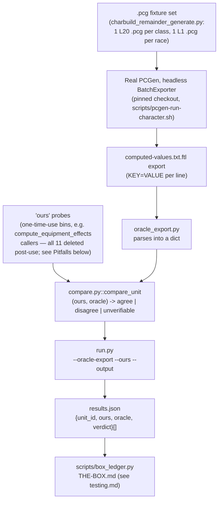

# Homebrew authoring and oracle validation

> Scope: the headless GE-08 package-authoring surface (`src/homebrew_authoring/`, root `codex` crate), the GE-05 pilot oracle-parity surface (`crates/codex-ingest/src/oracle_validation/`), and the SD-33 corpus-wide oracle harness (`scripts/oracle_harness/`), as they exist today.
> Last verified: **2026-09-20 against `tranche/16` (`424e93e93c`)** — SD-36 docs-truth capability pass:
> re-checked this document's "one proof package" framing for `homebrew_authoring` against the code
> (`grep -rn "pub fn.*_proof\b" src/homebrew_authoring/` still returns exactly one hit,
> `guard_stance_proof()` — the claim holds unchanged) and confirmed no other capability/scope claim in
> this document is stale; no other correction was needed this pass. Prior pass **2026-09-20 against
> `b22ea9e113`** covered the SD-36 Epic A crate move: the old src/oracle_validation/ directory does not
> exist any more — it moved whole to `crates/codex-ingest/src/oracle_validation/` (operator ruling D1,
> see [corpus-ingest.md](./corpus-ingest.md) §"The crate wall"), and grew two submodules since the pass
> before that (`class_feature_scaling_bar_check.rs`, `race_trait_formula_bar_check.rs` — 8 total, not
> 6). `src/homebrew_authoring/` is unaffected: it reads and computes no PCGen token, so it stayed in
> the root `codex` crate. That pass also added the oracle-harness flow diagram and the "How to extend"/
> "Pitfalls" sections. Prior pass **2026-08-25 against `tranche/13`** (SD-33 closure epilogue)
> verified §"The SD-33 corpus-wide oracle harness"; the rest of this document's substance is
> otherwise unchanged since 2026-07-23 (SD-26 Epic 6 closure).
> Maintenance: updated at SD closure — see [README.md](./README.md) §Maintenance contract

Both modules covered here are deliberately narrow, bounded proof slices, not
general subsystems. Each module's own doc comment states its non-goals
explicitly — this file repeats those non-goals verbatim because they are load
-bearing for anyone tempted to widen either surface without reading the code
first.

`homebrew_authoring` computes nothing from PCGen data — its one proof package is entirely
hand-authored — so it lives in the root `codex` crate and ships in the desktop binary.
`oracle_validation` exists to compare against PCGen's own output, so it lives in `codex-ingest`
alongside the converter and never ships; see [corpus-ingest.md](./corpus-ingest.md) §"The crate
wall" for the mechanical enforcement (`crate-wall` verify stage, `cargo tree` proof) and which crate
may depend on which.

## `homebrew_authoring/`: headless package-authoring surface

`src/homebrew_authoring/mod.rs`'s module doc comment: "This slice deliberately
stays small: one authored package, one feat, one effect, one optional
prerequisite, provenance, diagnostics, and deterministic file persistence. No
UI, plugin runtime, or broad rules-authoring breadth is claimed here."

### Types and validation (`mod.rs`)

`SourcePackage` bundles a `PackageManifest` (from `package_manifest.rs`) with
optional `feat: Option<FeatRecord>`, `effect: Option<EffectRecord>`,
`prerequisite: Option<PrerequisiteRecord>`, a `Vec<ProvenanceEntry>`, and a
`Vec<PackageDiagnostic>`. The only shipped content is the "Guard Stance" proof
package (`SourcePackage::guard_stance_shell()` for an empty Draft package,
`SourcePackage::guard_stance_proof()` for the fully authored one) —
constants like `GUARD_STANCE_PACKAGE_ID` and `GUARD_STANCE_FEAT_ID` are
proof-case identifiers, not a general package-authoring vocabulary.

`SourcePackage::recompute_validation` is the validation engine: it checks
manifest completeness (non-empty `package_id`/`package_title`/
`game_system_id`/`package_version`, and a `depends_on` entry for
`"pf1.crb"`), then structural coherence between the feat/effect/prerequisite
records (ids matching, `effect.target_family == "armor_class"`,
`effect.modifier_value == 1`), then that every authored record has a
matching `ProvenanceEntry` pointing at the expected authored path. Every
failure becomes a `PackageDiagnostic { class, severity, message, subject_ref,
claim_blocking }`; `finalize_diagnostics` sorts/dedups them and derives the
resulting `PackageValidationState` (`Valid` only if there are zero
diagnostics; `Invalid` if any diagnostic is `claim_blocking`; otherwise
`Deferred`).

### Deterministic file persistence (`package_store.rs`)

`PackageStore` (a concrete unit struct, same shape as the persistence stores
described in [persistence.md](./persistence.md)) has `save`, `load`, `diff`,
`diff_roots`, and `export`. The on-disk layout that `save()` produces
(directories created by `ensure_layout`, files written from `file_map`):

```text
<root>/
  manifest.yaml
  objects/feats/<stable_id>.yaml        (at most one file)
  rules/effects/<stable_id>.yaml        (at most one file)
  rules/prerequisites/<stable_id>.yaml  (at most one file)
  metadata/provenance.yaml
  metadata/diagnostics.yaml
```

Every file is rendered through a hand-rolled `key: value` / `- item` YAML-like
grammar (`render_manifest`, `render_feat_record`, etc.) and parsed back with a
matching line-oriented parser (`parse_manifest`, `parse_feat_record`, ...) —
this is a distinct grammar from the `key=value` fixture format `saved_character`
and `oracle_validation` use (no `=`, indentation-sensitive list sections via
`ManifestSection`/`RecordListSection`). `PackageStore::save` calls
`package.normalized_for_persistence()` (which recomputes validation and
diagnostics before writing) and `validate_persistable`, which rejects any
field that is empty or contains a newline — the doc comment above
`validate_persistable` states why: `save()` deliberately persists Draft/
Invalid packages, so an unloadable field would otherwise leave a corrupt
bundle on disk with no warning at write time. `PackageStore::export` refuses
to write anything unless `validation_state == PackageValidationState::Valid`.

### `preview_bridge.rs`: validated package + proof binding → headless envelope

`PreviewBridge::preview` (and `preview_from_root`, which loads via
`PackageStore::load` first) takes a `SourcePackage` and produces a
`PreviewEnvelope` whose `preview_status: PreviewStatus` is exactly one of
`Success`, `Blocked`, or `Unsupported` — the module doc comment is explicit
that this three-way split exists so the bridge "never" returns "a counterfeit
success." `classify_posture` decides which: `Blocked` if the manifest's
`ProofBinding` doesn't match the one fixed GE08-E1 binding
(`HOMEBREW_PROOF_CASE_ID`/`SLOT`/`REMOVE`/`ADD` constants), or the feat/effect
records are missing, or (checked after the widening test below) the package
still carries any other claim-blocking diagnostic from `recompute_validation`;
`Unsupported` if a structurally valid effect targets a recognized
derived-value family (`RECOGNIZED_DERIVED_FAMILIES`) other than
the one this slice supports, `"armor_class"`; `Supported` otherwise.

On `Supported`, the bounded AC computation is:
`BASE_ARMOR_CLASS_WITHOUT_BONUS_FEAT_SLOT (16) + effect.modifier_value`.
The doc comment on that constant and the module-level doc comment both explain
why 16, not a re-run of the real combat path: GE-06's deterministic AC
baseline of 17 is grounded with Dodge already selected into the bonus-feat
slot, and that combat path (`src/rules_core/pilot_compute/mod.rs`) is "locked to
the exact Dodge posture" (it requires `feat:dodge` and hard-codes the Dodge AC
bonus) — so 16 is that same baseline with Dodge's contribution subtracted out,
not an independent guess. Every outcome (including `Blocked`/`Unsupported`)
still returns populated `diagnostics`, `provenance_refs`, `explanation_refs`,
and `oracle_dimension_status` — an explanation graph is never blank, even when
the preview itself is refused.

### What this module deliberately does not include

No UI beyond the one headless workbench-snapshot command described below; no
plugin runtime; no widened package-authoring surface beyond the one proof
package's feat/effect/prerequisite shape. The desktop reaches this substrate
through exactly one command: `load_authoring_workbench_snapshot` in
`apps/desktop/src-tauri/src/main.rs`, a thin wrapper around
`authoring_workbench::build_ge08_workbench_snapshot` (in
`apps/desktop/src-tauri/src/authoring_workbench.rs`), which itself calls
`PreviewBridge::preview_from_root` and `PackageStore::load` and maps the
result into desktop DTOs, deriving only two UI lifecycle-gate booleans
(`preview_allowed`, `export_allowed`) directly from the headless validation
state and preview status — no independent authoring logic (validation rules,
effect computation, provenance checks) lives in the desktop crate.

## `oracle_validation/`: the oracle-parity surface, today

`crates/codex-ingest/src/oracle_validation/mod.rs`'s module doc comment: "Oracle-validation and
parity-harness surface (GE-05 / SD-26 Epic 2). Exposes the GE05-E2-F1
golden-case fixture schema, the GE06-E3-F1 selected parity-dimension adapter,
the Oracle-Harness comparator, the normalization-rule engine, the parity
report writer, and the Rust-side PCGen runner wrapper." Eight submodules exist today (six as of
SD-26; SD-35 added the two bar-check modules below): `golden_fixture`, `selected_parity_dimensions`,
`comparator`, `normalization`, `parity_report`, `pcgen_runner`, `class_feature_scaling_bar_check`,
and `race_trait_formula_bar_check`. The first two carry the fixture/dimension schema; the middle four
are the in-crate parity harness — a normalized PCGen output can now be compared, dimension by
dimension, against Codex's computed output and rendered into a real `PASS`/`FAIL` parity report; the
last two are oracle-side halves of `derived_evaluator_fixture_check::run_bar_check`'s aggregate
report (see below).

### `class_feature_scaling_bar_check.rs` / `race_trait_formula_bar_check.rs`: the oracle-side bar-check halves

SD-35 `AT-35-E6-001`/`AT-35-E6-003-RULED` cycle 17 moved two checks out of
`src/rules_core/derived_evaluator_fixture_check.rs` into this crate, because both read the ingest
format directly and `decisions.md` §11/§19 forbid that on the live side:

- **`class_feature_scaling_bar_check.rs`** walks `data/corpus/<book>/class_feature/` and reads each
  record's raw `BONUS:VAR|<name>|<formula>` tokens through the converter's own ingest-row accessor —
  the `kind=class_feature` level-scaling check.
- **`race_trait_formula_bar_check.rs`** drives the PCGen formula interpreter
  (`crate::pcgen_import::formula_interpreter::PcgenFormulaEvaluator`) over a committed fixture roster
  to prove the shipped `UNDINE_RACE_TRAIT_FORMULAS` table (imported from
  `codex::rules_core::pilot_compute::UNDINE_RACE_TRAIT_FORMULAS`) transcribes each formula correctly —
  the `kind=race_trait` FORMULA-shape check.

**The check logic itself is unchanged from where it used to live** — same functions, same control
flow, same failure strings, same mutation-proof tests; only the address moved. The aggregator that
stitches these two together with `derived_evaluator_fixture_check.rs`'s other `run_*_bar_check`
helpers also moved, to `crates/codex-ingest/src/bar_check.rs::run_bar_check` — this was "the ONE live
read the old crate had of the tool side" per that file's own doc comment, so moving the aggregator
(rather than moving the oracle calls into `codex`) is what let the oracle harness live entirely on
the `codex-ingest` side of the wall. The per-kind helpers that don't name the oracle
(`run_equipment_bar_check`, `run_monster_bar_check`, and the rest) stayed in
`src/rules_core/derived_evaluator_fixture_check.rs`, made `pub` so `bar_check.rs` can call them
across the crate boundary.

### `golden_fixture.rs`: typed golden-case fixture

`GoldenCaseFixture` binds old-system (PCGen) *runtime* evidence
(`LegacyOracleEvidence`, with `evidence_kind: OracleEvidenceKind` —
`StaticSourceTruth` / `RuntimeBehaviorEvidence` / `GuiDerivedEvidence` /
`Unknown` — the doc comment notes the pilot requires
`RuntimeBehaviorEvidence`, and static source files alone must not satisfy
parity) to an as-yet-unresolved `CodexOutputEvidence` (`state:
CodexOutputState` is only `Unresolved` or `Absent` — there is deliberately no
"resolved/passed" variant in this slice). `dimensions: Vec<ComparisonDimension>`
carries a `DimensionStatus` that is only `Candidate`, `Blocked`, or
`NotYetGrounded` — no `Passed` variant, because passing belongs to the
GE05-E4 comparator, explicitly out of scope. `claim_target` /
`current_claim_status: ClaimTier` (`NotYetGrounded` / `Computed` /
`OracleChecked`) let a fixture honestly target `OracleChecked` while
its current status stays `NotYetGrounded`; `parity_claimed()` only returns
`true` when `current_claim_status == ClaimTier::OracleChecked`.

`load_golden_case_fixture` parses a `key=value` text format (repeatable keys
for `dimension`, `provisional`, `normalization_ref`, `known_gap_ref`) —
the doc comment states this "mirrors the GE04 `rules_core::character_input`
loader conventions." Every required field missing or malformed produces a
`FixtureDiagnostic { claim_blocking: true, ... }`; the fixture is only
constructed (`FixtureLoadResult.fixture: Some(..)`) when there are zero
diagnostics.

### `selected_parity_dimensions.rs`: receipt → selected-dimension surface

`SelectedParityDimensions::from_receipt` adapts a
`crate::rules_core::pilot_compute::PilotHeadlessReceipt` into a bounded
`Vec<SelectedDimension>` covering exactly nine mandatory pilot dimensions
(`character.identity` plus eight numeric ones: baseline melee attack bonus,
baseline armor class, the three total saves, and three selected skill
modifiers). Every emitted carrier is stamped with `claim_tier_floor:
ClaimTierFloor::Computed` — the module doc comment states this "maintains a
`Computed` claim-tier floor without implying oracle-checked parity." There is
only one `ClaimTierFloor` variant today (`Computed`); nothing in this module
can produce an `OracleChecked` claim.

### `comparator.rs`: the Oracle-Harness comparator

`compare(canon_pcg: &NormalizedOutput, codex: &SelectedParityDimensions) ->
ComparisonResult` aligns a normalized old-system (PCGen) output against Codex's
selected parity dimensions **by dimension ID** and reports, per dimension,
whether the two agree. `NormalizedDimensionValue` and `SelectedDimension` share
the same `(value_string, value_i16)` shape, so alignment needs no
schema-translation step. Each dimension lands in either `matches:
Vec<DimensionMatch>` or `mismatches: Vec<DimensionMismatch>`; a `DimensionMismatch`
carries a typed `MismatchReason` (`ValueMismatch`, `MissingFromCodex`,
`MissingFromPcgen`) so a one-sided dimension set is a real, reported outcome
rather than a silent drop. `ComparisonResult::all_matched()` is true only when
`mismatches` is empty. This slice applies **exact value equality only**
(`value_i16 == value_i16 && value_string == value_string`) — refining what
"matches" means is `normalization.rs`'s job, a pre-comparison step on the PCGen
side that does not change `compare`'s signature.

### `normalization.rs`: the normalization-rule engine

`normalize(raw: &RawPcgenOutput, rules: &[NormalizationRule]) ->
NormalizedOutput` reduces a raw PCGen text capture (`RawDimensionValue`, a
stable dimension `id` plus an unmodified `raw_value: String`) into the
`NormalizedOutput` shape `comparator::compare` consumes. `default_normalization_rules()`
returns the two-rule set, applied in order per `technical-design.md §2.2`:
`trailing-whitespace-strip` (`NormalizationRuleKind::TrimWhitespace`) then
`integer-coercion` (`NormalizationRuleKind::IntegerCoercion`, which parses the
already-trimmed string as `i16` and, on success, promotes the value to numeric
and clears the string). Rules thread a working `(value_string, value_i16)` pair,
so later rules see earlier rules' output. This engine remains available for
raw, not-yet-typed text captures; the `pcgen_runner.rs` script pair below
produces already-typed values that skip it.

### `parity_report.rs`: the parity-report writer

`render_parity_report(case_id, comparison: &ComparisonResult,
normalization_rules_used: &[NormalizationRule]) -> String` is a **pure renderer**
over a `ComparisonResult` — it runs neither the comparator nor the
normalization engine. It emits the Summary / Per-Dimension Comparison /
Normalization Rules Used / Discovered Deltas Markdown shape from
`technical-design.md §2.3`, with a top-line `Result: PASS`/`FAIL` derived from
`comparison.all_matched()`. `write_parity_report(output_dir, case_id, ...)`
writes it to the real per-case path `artifacts/oracle_validation/parity_report_<case-id>.md`
(`default_parity_report_dir()` resolves the codex repo root via
`CODEX_REPO_ROOT` env override or the compile-time `CARGO_MANIFEST_DIR`).

### `pcgen_runner.rs`: Rust-side PCGen runner wrapper

`run_pcgen_character(character_pcg: &Path, options: &PcgenRunOptions) ->
Result<PcgenRunOutput, PcgenRunnerError>` wraps the two real scripts SD-25's
PCGen-runner scaffolding ships (`scripts/pcgen-run-character.sh`, which drives
the real PCGen Gradle wrapper in headless batch-export against a real `.pcg`
file, then `scripts/pcgen-normalize-output.py`, which normalizes the raw XML
into typed dimension JSON) into one Rust call. It shells out to both real
scripts in sequence and parses their composed output — **no PCGen output is
mocked, stubbed, or fabricated**; every real failure (missing script or
character file, non-zero exit, spawn failure, unreadable/unparseable output)
surfaces as a typed `PcgenRunnerError` variant carrying the underlying exit
status and stderr. Because the normalizer already emits the typed
`(value_string` XOR `value_i16)` shape, `PcgenRunOutput::to_normalized_output()`
is a direct field-for-field carry into `comparator::compare`'s input, not a
second normalization pass. `parse_normalized_output(json_text)` is factored out
as pure and process-free so the parse/error-mapping contract is unit-testable
without a live PCGen invocation.

### The pilot-case verification (Criterion 2.5)

`crates/codex-ingest/tests/sd26_pilot_case_verification.rs` drives the whole harness end to end
against a real `.pcg` build:
`full_pipeline_runs_end_to_end_and_finds_two_genuine_skill_mismatches` runs the
PCGen runner, normalizes, and compares — and the two skill mismatches it finds
are **real, not a test defect**: `pilot_compute::compute_ability_modifiers`
does not yet apply the chosen Human `+2 Strength` racial bonus before deriving
`AbilityModifiers`, so the `skill.selected_modifier.{climb,swim}` dimensions
genuinely disagree (the open CG-03 blocker, tracked in the SD-26 bundle's
`## Open blockers`). The harness reporting a true mismatch rather than papering
over it is the fail-honest discipline working as designed.

## The SD-33 corpus-wide oracle harness (`scripts/oracle_harness/`)

Distinct from the `oracle_validation/` Rust module above (the narrow
GE-05 pilot-case proof slice, part of the `codex-ingest` crate): `scripts/oracle_harness/` is a
standalone Python harness built to compare **thousands** of engine-computed magnitudes against real
PCGen BatchExporter output in one run, for `docs/work-inventory.json`'s `fixture-verified` and
`literal-verified` populations. It does not replace `oracle_validation/`; it is a second,
larger-scale comparison surface that reads the same kind of real PCGen export text.



*The pilot-case proof slice (`oracle_validation/`, above) runs one `.pcg` end to end through Rust;
this harness runs the same real-PCGen/real-export shape at corpus scale, in Python, because the
population it grades (thousands of units) makes a per-case Rust integration test impractical.
`verdict` is always one of exactly three values — `unverifiable` is data, never an exception and
never silently folded into `agree`.*

- **`compare.py`**: `compare_unit` answers, for one unit, `(ours, oracle,
  verdict)` where `verdict` is exactly one of `"agree"`, `"disagree"`, or
  `"unverifiable"` — `unverifiable` is returned as data, never raised as an
  exception and never folded into `"agree"`. `run_comparison` is the batch
  entry point over an `ours` mapping and a parsed oracle export.
- **`oracle_export.py`**: parses PCGen's `KEY=VALUE`-per-line BatchExporter
  text (the shape emitted by the `computed-values.txt.ftl` export template)
  into a dict; a key the export never emitted is distinguished from a key
  present with an empty value, though `compare_unit` treats both as
  `unverifiable`.
- **`run.py`**: the CLI entry point (`--oracle-export`, `--ours`, `--output`).
  Writes `{"results": [{"unit_id", "ours", "oracle", "verdict"}, ...]}` — the
  exact shape `scripts/box_ledger.py::load_oracle_results` reads (see
  [testing.md](./testing.md) for `box_ledger.py`/`THE-BOX.md`).
- **`campaign_key.py`**: PCGen's own campaign lookup
  (`Globals.getCampaignKeyed`) matches a `.pcg`'s `CAMPAIGN:<name>` line
  against each loaded campaign's `.pcc` `KEY:` token, **not** its
  `CAMPAIGN:` display name — a campaign whose `.pcc` carries a separate
  internal `KEY:` (e.g. `ultimate_psionics.pcc`'s `KEY:DSP - Ultimate
  Psionics` vs. its display `CAMPAIGN:Ultimate Psionics`) fails to load if a
  fixture names the display string. This module resolves the real key so
  generated `.pcg` fixtures load every campaign correctly.
- **`derive_spell_casting_ability_mapping.py`**: derives the PF1 class →
  governing spellcasting-ability mapping directly from the pinned PCGen
  oracle checkout's own `CLASS:<Name> ... SPELLSTAT:<ABBREV>` declarations
  (official Paizo `roleplaying_game` class files only, matching this repo's
  corpus-ingestion scope) — never hand-transcribed. Writes
  `spell_casting_ability_mapping.json` alongside the script, with each entry
  citing the source `.lst` line it was derived from.
- **`charbuild_remainder_generate.py`**: generates the `.pcg` fixture set for
  the full-character-build unit population — one L20 `.pcg` per source class
  (amortizing many `class_feature` units per JVM start) and one L1 `.pcg`
  per race. Every ability score is fixed at 14 (modifier +2) uniformly
  across every build, so every ability-modifier-dependent formula uses the
  same, easily re-derived modifier on both the engine side and the oracle
  side — no per-class ability tuning. This is the corrected `.pcg` fixture
  template: earlier fixtures pinned `STAT:WIS|SCORE:10` for spell-DC
  probes when the intended build called for 18, silently understating every
  computed DC by 4 (103 units affected, fixed).

### The per-type AC isolator (**all `AT-33-E5-*` "ours" probe bins, including `e5_ac_isolator`, were deleted 2026-08-27/28, `84760e4326`**)

The original AC-shape harness computed `oracle = item AC.TOTAL - baseline
AC.TOTAL` — a whole-character diff that conflates the item's own
`armor_class_bonus` (what the engine computes and what is graded) with
second-order effects the diff cannot separate: a `MAXDEX` cap reducing the
baseline's own Dex bonus when the item is worn, or a co-located
ability-score-enhancement chain on the same record raising `AC.Total` via
the normal Dex-to-AC path. The isolator replaced that diff with
PCGen's own per-type isolator, reading
`BONUS.COMBAT.AC.TOTAL.!BASE.!Ability.!Size` directly off the same
unmodified `.pcg` fixtures — emitting, per item, the exact set of PCGen
bonus-`TYPE` strings the engine's own `armor_class_bonus` is built from (the
base record's first non-Circumstance `COMBAT|AC` chain's type, plus each
EQMOD-referenced modifier's own chain's type), using the identical
match/skip-Circumstance/first-match predicate
`arms_armor::armor_class_bonus_from_bonus_chains` /
`arms_armor::apply_eqmod_armor_class_bonus` use, read-only. It never decides
`armor_class_bonus` itself — it calls `compute_equipment_effects` for that,
like every other `AT-33-E5-*` "ours" probe did (each paired one population shape with the field(s)
of the engine's real compute path it read to produce the `ours` half of a `run.py` comparison).
**All 11 of these probe bins, including `e5_ac_isolator`, are deleted** (`84760e4326`, "delete 11
dead SD-33 remediation probe bins") — they were one-time-use, their `results.json` evidence is
already committed under `docs/release/SD-33-computed-value-verification/artifacts/`, and stale
compiled copies of some may still sit in an untracked `target/debug/` from before the deletion (not
a sign the source still exists — `git log --diff-filter=D -- '*_ours.rs'` is the re-derive command).
A future corpus-wide comparison run writes new, purpose-built probes rather than resurrecting these.

## Relationship to the fail-honest pattern and test locations

Both modules follow the same fail-honest discipline documented in
[rules-engine.md](./rules-engine.md): diagnostics are structured and
`claim_blocking`-typed rather than stringly-typed, and no function silently
substitutes a fabricated value when it cannot ground a claim (`preview_bridge.rs`'s
three-way `PreviewStatus` split and `golden_fixture.rs`'s `ClaimTier` gating
are both direct applications of it).

Tests are split by crate, not inline in these modules — and the split follows the crate wall
exactly, which is a useful sanity check that nothing crossed it by accident. `oracle_validation/`'s
tests moved with the module to `crates/codex-ingest/tests/` (SD-36 Epic A): `golden_case_fixture_schema.rs`
covers `golden_fixture.rs`; `ge06_selected_parity_dimensions.rs` covers `selected_parity_dimensions.rs`;
`sd26_comparator.rs` covers `comparator.rs`; `sd26_normalization.rs` covers `normalization.rs`;
`sd26_parity_report.rs` covers `parity_report.rs`; `sd26_pcgen_runner.rs` covers `pcgen_runner.rs`
(including a real end-to-end PCGen-engine invocation); `sd26_pilot_case_verification.rs` drives the
full comparator harness against a real `.pcg` build. `homebrew_authoring/`, unaffected by the crate
move, keeps its tests at the repo-root `tests/` directory: `tests/ge08_preview_bridge.rs`,
`tests/ge08_package_file_lifecycle.rs`, and `tests/ge08_validation_and_diagnostics.rs`, with fixture
data under `tests/fixtures/authoring_workbench/`. See [testing.md](./testing.md) for the repo's
test-layout conventions generally.

## How to extend

- **A new homebrew-authorable record kind** (beyond the one feat/effect/prerequisite proof shape):
  extend `src/homebrew_authoring/mod.rs`'s `SourcePackage`, its validation in
  `recompute_validation`, and `package_store.rs`'s render/parse pair together — the module's own doc
  comment states the one-package/one-feat/one-effect scope is deliberate, so widening it is a real
  scope decision, not a bug fix; get an explicit ruling before doing it (`AGENTS.md`'s "no stub
  MVP"/scope-expansion doctrine applies here as anywhere else).
- **A new oracle comparison dimension**: add it to `selected_parity_dimensions.rs`'s bounded set,
  stamped with the same `ClaimTierFloor::Computed` every existing dimension carries — never a claim
  the module cannot back. It lives in `crates/codex-ingest/`, so it can read PCGen normalized output
  freely; it must not be called from anything in the root `codex` crate.
- **A new corpus-wide oracle probe** (`scripts/oracle_harness/`-shaped, not the pilot-case Rust
  harness): follow `compare.py`'s three-way verdict contract (`agree`/`disagree`/`unverifiable`,
  never an exception, never folded into `agree`) and delete the probe binary once its `results.json`
  evidence is committed — see the Pitfalls entry below for why leaving it around causes confusion,
  not reuse value.
- **A new normalization rule**: add it to `normalization.rs`'s `default_normalization_rules()` list,
  in the position the new rule needs to run relative to the existing two (rules thread a working
  `(value_string, value_i16)` pair, so ordering is semantically significant, not just cosmetic).

## Pitfalls

- **The old src/oracle_validation/ directory no longer exists — it is `crates/codex-ingest/src/oracle_validation/`.**
  Any doc, comment, or dispatch prompt written before 2026-09-20 that cites the old path is stale;
  verify before trusting it.
- **A stale compiled binary in `target/debug/` is not evidence that its source still exists.** All 11
  `AT-33-E5-*` "ours" probe bins (including `e5_ac_isolator`) were deleted from source in
  `84760e4326` but can still show up as build artifacts from before that commit on a machine that
  hasn't cleaned its target directory. `git log --diff-filter=D -- '*_ours.rs'` (or `git ls-files` for
  the current state) is the re-derive command, not `ls target/debug/`.
- **The GE-05 pilot-case harness (`oracle_validation/`) and the SD-33 corpus-wide harness
  (`scripts/oracle_harness/`) are two different tools with two different scales, and neither replaces
  the other.** The pilot-case harness proves one `.pcg` end to end in Rust with typed comparison
  results; the corpus-wide harness grades thousands of units in Python against
  `docs/work-inventory.json` populations. A gap found by one does not imply the other is clean.
- **`homebrew_authoring`'s one shipped package (`SourcePackage::guard_stance_proof()`) is a proof
  case, not a template to copy verbatim for a real feature.** Its constants
  (`GUARD_STANCE_PACKAGE_ID`, `GUARD_STANCE_FEAT_ID`, ...) are identifiers for that one proof, and the
  module's own doc comment is explicit that no broad package-authoring vocabulary exists yet.
- **`PreviewBridge`'s bounded AC computation (`BASE_ARMOR_CLASS_WITHOUT_BONUS_FEAT_SLOT`, 16) is
  derived from one specific pinned baseline (GE-06's Dodge-selected 17), not re-derived from the live
  combat path.** If the GE-06 deterministic baseline ever changes, this constant's derivation comment
  is the thing to re-check — it will not update itself.
