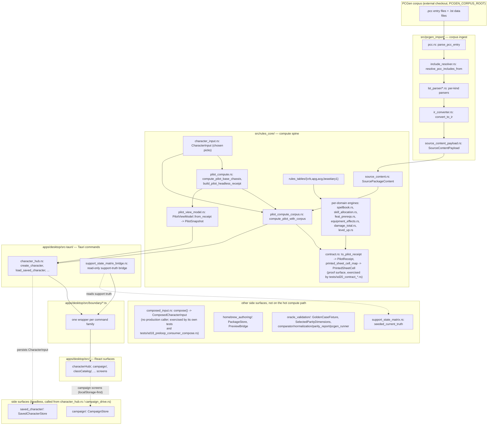

# Architecture overview

> Scope: what Codex is, its three top-level planes, and how a character's data flows from raw PCGen corpus text to a rendered sheet cell.
> Last verified: 2026-07-23 against tranche/5-4 (SD-26 Epic 6 closure). **Path correction
> 2026-08-22** (SD-32 closure epilogue, `workflow-instruction.md §13`): the source-tree map's
> `sd16/` row and `pilot_compute.rs` cites were renamed away (see README.md's provenance note and
> `docs/architecture/rules-engine.md`'s own path correction) — fixed below; no other content in
> this doc re-verified.
> Maintenance: updated at SD closure — see [README.md](./README.md) §Maintenance contract

## What Codex is

Codex is a desktop Pathfinder 1st Edition (PF1) character-management tool. It
pairs a headless Rust rules-computation crate with a React/Tauri desktop
shell, and it grounds its rule data in the real PCGen open-source corpus (a
separate, unvendored checkout of `.pcc`/`.lst` files) rather than
hand-invented tables. PCGen itself is treated as the parity oracle: an in-crate
comparator (`src/oracle_validation/`) checks Codex's computed output against
PCGen's own runtime behavior, dimension by dimension, and renders a `PASS`/`FAIL`
parity report — but no character yet reaches a *passing* parity verdict (the
pilot run currently reports a real mismatch; see [status.md](./status.md)).
Every number the app shows a user is either
computed for real, with a machine-checkable explanation record, or explicitly
withheld as "blocked"; the codebase never fabricates a value it cannot prove.
This fail-honest discipline, described in full in
[rules-engine.md](./rules-engine.md), is the single idea that most shapes how
the rest of the system is built.

## The three planes

**The core crate (`src/`).** A single, headless, non-workspace Rust crate
(`Cargo.toml`, package `codex`) that owns every PF1 rule computation, the
PCGen corpus-ingest pipeline, and local persistence. Nothing under `src/`
depends on Tauri or any GUI framework; it is tested entirely through
`cargo test` and the repo-root `tests/*.rs` integration suite. This is the
plane the desktop app and, eventually, any other frontend would sit on top
of. See [corpus-ingest.md](./corpus-ingest.md), [rules-engine.md](./rules-engine.md),
[rules-data-tables.md](./rules-data-tables.md), [support-state-matrix.md](./support-state-matrix.md),
[persistence.md](./persistence.md), and [homebrew-and-oracle.md](./homebrew-and-oracle.md).

**The desktop app (`apps/desktop/`).** A React 18 + Tauri 2 application: a
Vite-built TypeScript frontend and a thin Rust IPC shell
(`apps/desktop/src-tauri/`, crate `codex-desktop`) that depends on the root
`codex` crate by relative path. The frontend never computes PF1 rules itself
— every real number it renders came from a Tauri command that calls into
`codex::rules_core`. IPC calls are meant to flow through one dedicated
wrapper per command family under `apps/desktop/src/boundary/`. See
[desktop-app.md](./desktop-app.md) and [update-and-feedback.md](./update-and-feedback.md).

**Release tooling (`.github/workflows/`, `scripts/release/`, `tools/release/`,
`schemas/update/`).** The CI/CD surface that turns a commit on `develop` or
`main` into a schema-validated, multi-platform tester release, publishes a
channel index the desktop app's self-update chain fetches, and gates
promotion between `develop` → `test` → `main`. See
[release-pipeline.md](./release-pipeline.md).

Cutting across all three planes: [testing.md](./testing.md) (the full
verification command set) and [conventions.md](./conventions.md) (the
cross-cutting idioms every plane converges on independently).

## Data flow, end to end

`CharacterInput` (what the player chose) and `SourcePackageContent` (what the
loaded corpus contains) are two independent inputs that meet, on the
production path, inside `pilot_compute_corpus.rs::compute_pilot_with_corpus`
(called directly by `apps/desktop/src-tauri/src/character_hub.rs`).
`composed_input.rs::compose` joins the same two inputs into a
`ComposedCharacterInput`, but it has no production caller — it is exercised
only by its own tests and `tests/sd18_preloop_consumer_compose.rs`, which is
why it is drawn as a side surface. See [rules-engine.md](./rules-engine.md)
§"The compute spine, end to end" for the full layer breakdown this diagram
compresses. `homebrew_authoring/`, `oracle_validation/`, and
`support_state_matrix.rs` are also side surfaces deliberately: none of
them sits on the character-compute hot path above them, and
`support_state_matrix.rs` in particular computes no mechanics at all — it is
a documentary truth ledger the desktop bridge
(`apps/desktop/src-tauri/src/support_state_matrix_bridge.rs`) reads read-only
(see [support-state-matrix.md](./support-state-matrix.md)).

## Key invariants across all three planes

A handful of rules hold everywhere in this codebase, not just in one plane.
They are worth naming here because they explain *why* the diagram above is
shaped the way it is:

- **Nothing downstream re-derives what upstream already produced.** The
  compute layers (`character_input.rs` → `pilot_compute.rs` →
  `pilot_compute_corpus.rs` → `pilot_view_model.rs` on the production path,
  with `composed_input.rs` and `contract.rs` as test-exercised proof
  surfaces alongside) only ever add to what the previous layer built; none
  of them mutates or recomputes an earlier layer's output (see
  [rules-engine.md](./rules-engine.md)).
- **The GUI never computes rules.** Every computed value the desktop app
  renders comes from `apps/desktop/src-tauri/src/character_hub.rs`'s calls
  into `build_pilot_headless_receipt` (`src/rules_core/pilot_compute/mod.rs`)
  and `compute_pilot_with_corpus` (`src/rules_core/pilot_compute_corpus.rs`),
  surfaced as `src/rules_core/pilot_view_model.rs`'s `PilotSnapshot`. No
  frontend code, and no `apps/desktop/src-tauri/` command, calls a
  per-domain engine directly (the catalog commands — backed by
  `class_catalog.rs`, `race_catalog.rs`, `spell_catalog.rs`,
  `equipment_catalog.rs`, renamed off their originating `sd19_*` prefixes by
  SD-24 criterion 1.1 — expose static `rules_tables` rows read-only, without
  computing anything).
  `src/rules_core/contract.rs`'s `PilotReceipt`/`printed_sheet_cell_map` is
  the machine-checked boundary-contract proof surface, exercised by
  `tests/sd20_contract_*.rs` — the desktop bridge does not consume it.
- **A value is computed, blocked, or absent — never fabricated.** This is
  the fail-honest pattern; it appears in the compute spine, the persistence
  stores' validate-before-persist checks, the update chain's honest
  degradation to `'unknown'`, and the feedback-submission chain's refusal to
  claim `'submitted'` without a transport-confirmed result. See
  [conventions.md](./conventions.md) for the full catalog.
- **Static rule data is read, never inlined.** Every per-domain engine reads
  `src/rules_core/rules_tables/` rather than embedding rule numbers in
  compute code, via a direct fully-qualified `use` of the specific table
  item — see [rules-data-tables.md](./rules-data-tables.md).

## Where things live

| Top-level path | What it is | Covered by |
|---|---|---|
| `src/pcgen_import/` | PCGen `.pcc`/`.lst` parsing and canonical-IR projection | [corpus-ingest.md](./corpus-ingest.md) |
| `src/rules_core/` (compute spine + per-domain engines) | `character_input.rs`, `composed_input.rs`, `pilot_compute.rs`, `pilot_compute_corpus.rs`, `contract.rs`, `spellbook.rs`, `skill_allocation.rs`, `feat_prereqs.rs`, `equipment_effects.rs`, `damage_total.rs`, `level_up.rs`, `encounters.rs`, `party_cr.rs` | [rules-engine.md](./rules-engine.md) |
| `src/rules_core/rules_tables/` | Hand-transcribed per-book Paizo tables (`crb/`, `apg/`, `acg/`, `beastiary1/`) | [rules-data-tables.md](./rules-data-tables.md) |
| `src/rules_core/support_state_matrix.rs` | Typed support/evidence-tier control-plane ledger | [support-state-matrix.md](./support-state-matrix.md) |
| `src/saved_character/`, `src/campaign/` | Local on-disk persistence for one character / one campaign | [persistence.md](./persistence.md) |
| `src/homebrew_authoring/`, `src/oracle_validation/` | Bounded homebrew package-authoring slice; the oracle-parity harness (comparator, normalization, parity-report writer, PCGen-runner wrapper) | [homebrew-and-oracle.md](./homebrew-and-oracle.md) |
| `data/corpus/`, `data/stubs/` | Repo-resident JSON corpus cache — now six book directories (CRB, APG, ACG, Bestiary 1, Advanced Race Guide, Pathfinder Unchained; `ultimate_campaign` has no cache dir yet), written by eight distinct writers and stamped with `wiring_class` + PI-screened `license`/`pi_field`/`pi_marker`; `book_stub` future-state placeholders for the remaining out-of-scope books | [rules-data-tables.md](./rules-data-tables.md), [status.md](./status.md) |
| `apps/desktop/` (frontend + `src-tauri/`) | React/Tauri desktop shell, Tauri command inventory, boundary layer | [desktop-app.md](./desktop-app.md) |
| `apps/desktop/src/feedback/`, `apps/desktop/src/update/`, `apps/desktop/src-tauri/src/update/` | Self-update chain; `apps/desktop/src/testerWorkbench/feedback/`, `apps/desktop/src/testerWorkbench/update/` | [update-and-feedback.md](./update-and-feedback.md) |
| `.github/workflows/`, `scripts/release/`, `tools/release/`, `schemas/update/` | Publish pipeline, branch-promotion gates, manifest schemas | [release-pipeline.md](./release-pipeline.md) |
| `tests/`, `apps/desktop/scripts/run-tests.mjs`, `apps/desktop/src/**/*.test.ts` | Full verification command set and fixture conventions | [testing.md](./testing.md) |
| (cross-cutting) | Idiom catalog: fail-honest, DI seams, store shape, boundary rule, etc. | [conventions.md](./conventions.md) |
| (cross-cutting) | Current real/stubbed status across the whole repo | [status.md](./status.md) |
| `docs/release/` | Per-tranche/SD release-bundle narratives and doctrine artifacts (not architecture) | outside this doc set |

## See also

- [rules-engine.md](./rules-engine.md) — the fail-honest pattern this overview only summarizes.
- [desktop-app.md](./desktop-app.md) — the full Tauri command inventory and boundary wrapper rule.
- [conventions.md](./conventions.md) — the idiom catalog for "how do we do things here."
- [status.md](./status.md) — what is real vs. stubbed today.
- [README.md](./README.md) — the doc set's index and maintenance contract.
