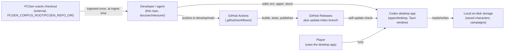
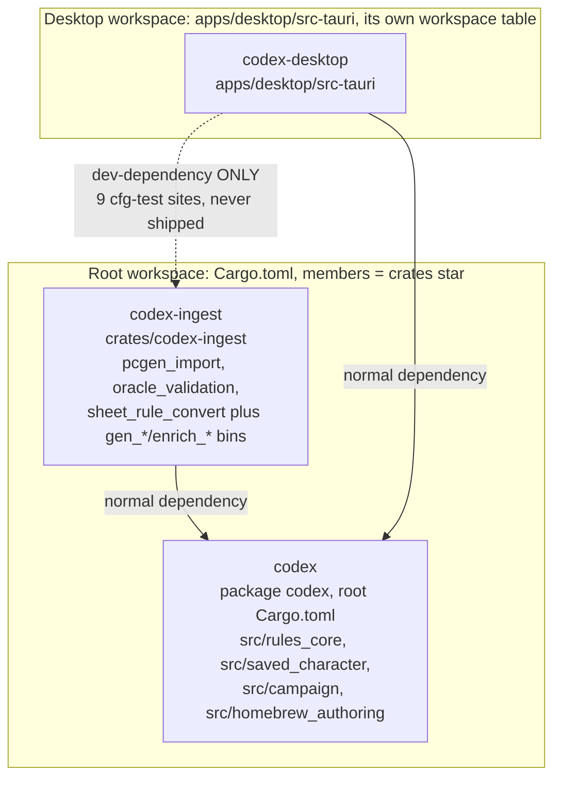
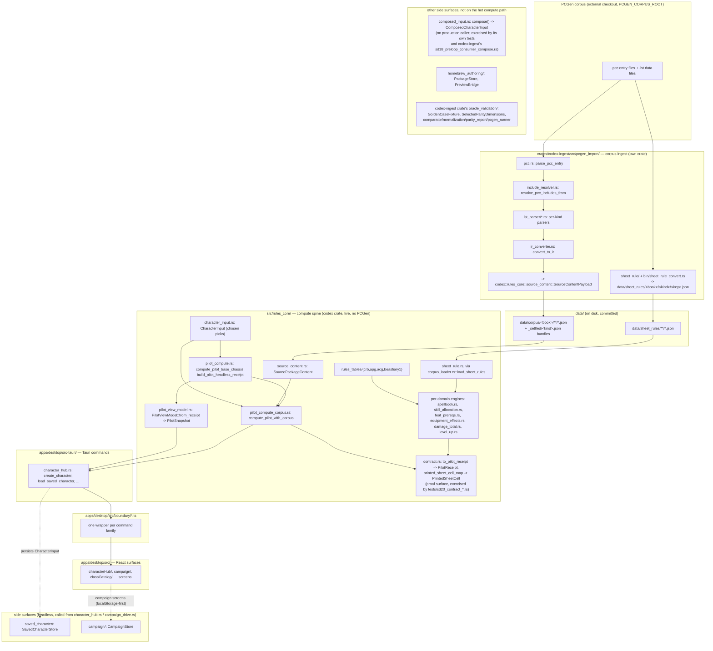

# Architecture overview

> Scope: what Codex is, its product doctrine, its workspace/crate structure, its four top-level
> planes, and how a character's data flows from raw PCGen corpus text to a rendered sheet cell.
> Last verified: **2026-09-20 against `tranche/16` (`b22ea9e113`, SD-36 Epic D)**. Re-derived from
> the live tree for SD-36 Epic A (the crate wall is now a real Cargo workspace boundary —
> `crates/codex-ingest`, not a path convention under `src/`) and Epic C1 (`pilot_compute` split
> into per-class submodules). §"The converter/live boundary", §"Workspace and crate dependency
> graph", §"Directory map", and §"The product doctrine" are new or substantially rewritten this
> pass; §"Data flow, end to end" is redrawn to put the converter inside its own crate. Verified via
> `cargo metadata --no-deps --format-version1 | python3 -c "import json,sys; print([p['name'] for p in json.load(sys.stdin)['packages']])"`
> (`["codex", "codex-ingest"]` at the workspace root) and `python3 scripts/pcgen_residue_gate.py --check --closure`.
> Prior pass 2026-09-15 (SD-35 closure) added §"The converter/live boundary" when the wall was
> still path-based; that path-based claim was superseded, not layered on, by this pass. **Path
> correction 2026-08-22** (SD-32 closure epilogue): the source-tree map's `sd16/` row and
> `pilot_compute.rs` cites were renamed away — carried forward below.
> Maintenance: updated at SD closure — see [README.md](./README.md) §Maintenance contract

## What Codex is

Codex is a desktop Pathfinder 1st Edition (PF1) character-management tool. It
pairs a headless Rust rules-computation crate with a React/Tauri desktop
shell, and it grounds its rule data in the real PCGen open-source corpus (a
separate, unvendored checkout of `.pcc`/`.lst` files) rather than
hand-invented tables. **That grounding happens once, at ingest, and
never at run time** — see §"The converter/live boundary" below. PCGen itself is
treated as the parity oracle: a comparator
(`crates/codex-ingest/src/oracle_validation/`) checks Codex's computed output against
PCGen's own runtime behavior, dimension by dimension, and renders a `PASS`/`FAIL`
parity report — but no character yet reaches a *passing* parity verdict (the
pilot run currently reports a real mismatch; see [status.md](./status.md)).
Every number the app shows a user is either
computed for real, with a machine-checkable explanation record, or explicitly
withheld as "blocked"; the codebase never fabricates a value it cannot prove.
This fail-honest discipline, described in full in
[rules-engine.md](./rules-engine.md), is the single idea that most shapes how
the rest of the system is built.

## The product doctrine, in one page

Three rules, each with a real citation, together define what Codex is and is not building:

1. **It is a paper sheet generator, not a rules engine or a video game.** The bar for shipping a
   record is: does it feed a number that lands on a printed character sheet, or is it prose a
   player reads? A number gets computed; a rule gets printed as text. When a follow-on slice was
   scoped to add per-spell dice tables, the plan explicitly declined it because "with caster level
   on the sheet, the already-rendered description text is a complete answer for a paper sheet"
   (`docs/release/v0.6/execution-engine-scoping.md`). There is no dice-rolling, no
   attack/save/damage resolution, no opponent modelling, and no turn clock anywhere in this
   codebase — those are video-game concerns, not sheet-generator concerns.
2. **Nothing fabricates a value it cannot prove (fail-honest).** Every computed field carries a
   real explanation record on the supported path, or a named claim-blocking diagnostic and a
   zeroed/absent value on the unsupported path. See
   [conventions.md](./conventions.md) §"Fail-honest computation" and
   [rules-engine.md](./rules-engine.md) for the full pattern. `PilotHeadlessReceipt`'s status is
   never `Computed` while a claim-blocking diagnostic exists.
3. **No stubs, no mock data, no fixture-only data in a path that ships.** The operator's recorded
   law, verbatim: *"No more stub work. No more mock data. I expect everything from this point
   forward to be fully wired."* (`docs/governance/no-stub-mvp-doctrine.md`, quoting the 2026-07-20
   directive). A stub that must exist anyway names the exact missing piece in its own return value
   (see [conventions.md](./conventions.md) §"Honest stubs"); an operator-approved exception is
   recorded in `docs/governance/wired-integration-stubs-registry.md`, never assumed silently.

These three rules explain the shape of everything below: why the compute spine is small and
explanation-carrying rather than a general rule interpreter, why the converter/live boundary
exists (a fabricated PCGen-shaped value at run time would violate rule 2), and why `status.md`
tracks real-vs-stubbed as its own living document rather than trusting a stage name.

## System context



*Caption: Codex the product only ever talks to the player and its own local disk; PCGen only ever
talks to the ingest tooling at ingest time, never to the running app. CI is the only path from a
developer's commit to a player's update.*

## The converter/live boundary

*Load-bearing structural fact about this codebase — read it before the four planes below, because
it cuts across the first of them. As of SD-36 Epic A this is a Cargo workspace boundary, not a
directory convention: see §"Workspace and crate dependency graph" for the build-graph proof.*

**PCGen is a converter input and a test oracle. It is not in live code.** The repository is split
by which crate a path lives in:

| Side | Crate / paths | May read PCGen? |
|---|---|---|
| **Converter / tools** — kept, intact, and reused for Starfinder | `crates/codex-ingest/src/pcgen_import/**` (incl. `cache_gen/`), `crates/codex-ingest/src/oracle_validation/**`, `crates/codex-ingest/src/bin/sheet_rule_convert.rs`, `crates/codex-ingest/src/bin/gen_*`, `crates/codex-ingest/src/bin/enrich_*`, `scripts/**`, `tests/**` (root `tests/*.rs`; `codex-ingest` also has its own `crates/codex-ingest/tests/`) | **yes** |
| **Live** — everything that ships in the desktop binary's rule path | `codex` root crate (`src/rules_core/**`, `src/saved_character/**`, `src/campaign/**`, `src/homebrew_authoring/**`), `apps/desktop/**` | **no** |

The live side therefore contains no PCGen token syntax (`BONUS:`, `DEFINE:`, `PRE*:`, `%CHOICE`,
`CL=`), no PCGen formula evaluator, no `raw_tokens` read, and no PCGen description renderer. Rule
conversion happens **once, at ingest**: `crates/codex-ingest/src/bin/sheet_rule_convert.rs` plus
`crates/codex-ingest/src/pcgen_import/sheet_rule/` read the pinned corpus
(`scripts/pcgen-oracle-pin.env`) and write our own schema to
`data/sheet_rules/<book>/<kind>/<key>.json`. The live evaluator
(`src/rules_core/sheet_rule.rs`) reads only those files, through
`src/rules_core/corpus_loader.rs::load_sheet_rules`.

The boundary is mechanical, not a convention, and it is now doubly enforced:

1. **Build graph.** `codex` (the crate that ships) has no dependency, dev or otherwise, on
   `codex-ingest`. `apps/desktop/src-tauri` (`codex-desktop`) takes `codex-ingest` as a
   **dev-dependency only** — `cargo tree -e normal,build --manifest-path apps/desktop/src-tauri/Cargo.toml`
   never lists it, so it cannot appear in a shipped binary's normal link graph. This is the
   `crate-wall` stage of `scripts/verify.sh`.
2. **Content grep.** `scripts/pcgen_residue_gate.py` greps the live paths for PCGen token surface
   and fails when the count rises above zero, closure-checked:

```
$ python3 scripts/pcgen_residue_gate.py --check --closure
live_files=0 live_hits=0 verdict=PASS
```

**The tool side is never deleted.** The converter, the `.lst` parser, the generators, and the
oracle harness are the reusable half — they are what a second game system (Starfinder) would be
ingested with. Removing PCGen from the live side is not removing PCGen from the repo.

## Workspace and crate dependency graph

There are **two independent Cargo workspaces** in this repo, and conflating them is the most
common orientation mistake a newcomer makes:



*Caption: `codex-ingest` depends on `codex` (never the reverse — a reverse edge would compile
`codex` twice and make `crate::rules_core::X` and `codex::rules_core::X` distinct types at the
type level); `codex-desktop` depends on `codex` normally and on `codex-ingest` only under
`[dev-dependencies]`, so the wall holds even though both crates are reachable from the same
checkout.*

The root `Cargo.toml` declares `members = ["crates/*"]` with **no `default-members`**, so a plain
`cargo build`/`cargo test` at the repo root builds only the `codex` package by default (operator
ruling D1) — you opt into building `codex-ingest` explicitly (`cargo build -p codex-ingest`, or
`--workspace`). `apps/desktop/src-tauri` declares its **own** empty `[workspace]` table specifically
so Cargo does not fold it into the root workspace just because it path-depends into it; it keeps
its own `Cargo.lock` and `target/` — see [desktop-app.md](./desktop-app.md).

## The four planes

**The core crate (`src/`, package `codex`).** A single, headless Rust crate
(root `Cargo.toml`) that owns every PF1 rule computation and local
persistence. Nothing under `src/`
depends on Tauri, any GUI framework, or PCGen's file format; it is tested entirely through
`cargo test` and the repo-root `tests/*.rs` integration suite. This is the
plane the desktop app and, eventually, any other frontend would sit on top
of. See [rules-engine.md](./rules-engine.md),
[rules-data-tables.md](./rules-data-tables.md),
[persistence.md](./persistence.md), and [homebrew-and-oracle.md](./homebrew-and-oracle.md).

**The ingest crate (`crates/codex-ingest/`, package `codex-ingest`).** The PCGen tool side: the
`.pcc`/`.lst` parser, the sheet-rule converter, the corpus-cache generators, and the oracle-parity
harness. It depends on `codex` (for the shared IR/record types it produces) but `codex` never
depends on it. Nothing here ships in the desktop binary. See
[corpus-ingest.md](./corpus-ingest.md) and [homebrew-and-oracle.md](./homebrew-and-oracle.md).

**The desktop app (`apps/desktop/`).** A React 18 + Tauri 2 application: a
Vite-built TypeScript frontend and a thin Rust IPC shell
(`apps/desktop/src-tauri/`, crate `codex-desktop`) that depends on the root
`codex` crate by relative path. The frontend never computes PF1 rules itself
— every real number it renders came from a Tauri command that calls into
`codex::rules_core`. IPC calls are meant to flow through one dedicated
wrapper per command family under `apps/desktop/src/boundary/`. See
[desktop-app.md](./desktop-app.md) and [update-and-feedback.md](./update-and-feedback.md).

**Release tooling (`.github/workflows/`, `scripts/release/`, `tools/release/`,
`schemas/update/`).** The CI/CD surface that turns a commit on `develop` or
`main` into a schema-validated, multi-platform tester release, publishes a
channel index the desktop app's self-update chain fetches, and gates
promotion between `develop` → `test` → `main`. See
[release-pipeline.md](./release-pipeline.md).

Cutting across all four planes: [testing.md](./testing.md) (the full
verification command set) and [conventions.md](./conventions.md) (the
cross-cutting idioms every plane converges on independently).

## Data flow, end to end



`CharacterInput` (what the player chose) and `SourcePackageContent` (what the
loaded corpus contains) are two independent inputs that meet, on the
production path, inside `pilot_compute_corpus.rs::compute_pilot_with_corpus`
(called directly by `apps/desktop/src-tauri/src/character_hub.rs`).
`composed_input.rs::compose` joins the same two inputs into a
`ComposedCharacterInput`, but it has no production caller — it is exercised
only by its own tests and `crates/codex-ingest/tests/sd18_preloop_consumer_compose.rs`,
which is why it is drawn as a side surface. See [rules-engine.md](./rules-engine.md)
§"The compute spine, end to end" for the full layer breakdown this diagram
compresses. `homebrew_authoring/` and `oracle_validation/` are also side
surfaces deliberately: neither sits on the character-compute hot path above
them. (The hand-seeded `support_state_matrix.rs` truth ledger and its
read-only desktop bridge that used to appear here were retired, SD-36 D3.)

## Key invariants across all four planes

A handful of rules hold everywhere in this codebase, not just in one plane.
They are worth naming here because they explain *why* the diagram above is
shaped the way it is:

- **Nothing downstream re-derives what upstream already produced.** The
  compute layers (`character_input.rs` → `pilot_compute.rs` →
  `pilot_compute_corpus.rs` → `pilot_view_model.rs` on the production path,
  with `composed_input.rs` and `contract.rs` as test-exercised proof
  surfaces alongside) only ever add to what the previous layer built; none
  of them mutates or recomputes an earlier layer's output (see
  [rules-engine.md](./rules-engine.md)).
- **The GUI never computes rules.** Every computed value the desktop app
  renders comes from `apps/desktop/src-tauri/src/character_hub.rs`'s calls
  into `build_pilot_headless_receipt` (`src/rules_core/pilot_compute/mod.rs`)
  and `compute_pilot_with_corpus` (`src/rules_core/pilot_compute_corpus.rs`),
  surfaced as `src/rules_core/pilot_view_model.rs`'s `PilotSnapshot`. No
  frontend code, and no `apps/desktop/src-tauri/` command, calls a
  per-domain engine directly (the catalog commands — backed by
  `class_catalog.rs`, `race_catalog.rs`, `spell_catalog.rs`,
  `equipment_catalog.rs`, renamed off their originating `sd19_*` prefixes by
  SD-24 criterion 1.1 — expose static `rules_tables` rows read-only, without
  computing anything).
  `src/rules_core/contract.rs`'s `PilotReceipt`/`printed_sheet_cell_map` is
  the machine-checked boundary-contract proof surface, exercised by
  `tests/sd20_contract_*.rs` — the desktop bridge does not consume it.
- **A value is computed, blocked, or absent — never fabricated.** This is
  the fail-honest pattern; it appears in the compute spine, the persistence
  stores' validate-before-persist checks, the update chain's honest
  degradation to `'unknown'`, and the feedback-submission chain's refusal to
  claim `'submitted'` without a transport-confirmed result. See
  [conventions.md](./conventions.md) for the full catalog.
- **Static rule data is read, never inlined.** Every per-domain engine reads
  `src/rules_core/rules_tables/` rather than embedding rule numbers in
  compute code, via a direct fully-qualified `use` of the specific table
  item — see [rules-data-tables.md](./rules-data-tables.md).

## Directory map

Every top-level directory that is real, tracked, and load-bearing (`ls -la` at the repo root;
`git ls-files -z | cut -d/ -f1 | sort -u` for the tracked-only view — `target/`, `.wrangler/`, and
a handful of untracked scratch directories like `d/` and `tmp_pool_dump/` are build/scratch cruft,
not structure, and are not listed below):

| Top-level path | What it is | Owning doc |
|---|---|---|
| `src/` | The `codex` root crate: `rules_core/` (compute spine + per-domain engines + `rules_tables/`), `saved_character/`, `campaign/`, `homebrew_authoring/`, `support/` (shared path helpers, SD-36 C1.3), `bin/` (a small number of live-side binaries — `pi_sweep_rules_tables`, the `v06_*_dump` reporting bins) | [rules-engine.md](./rules-engine.md), [rules-data-tables.md](./rules-data-tables.md), [persistence.md](./persistence.md), [homebrew-and-oracle.md](./homebrew-and-oracle.md) |
| `crates/codex-ingest/` | The `codex-ingest` crate: `crates/codex-ingest/src/pcgen_import/` (parser + `sheet_rule/` converter + `wiring_class.rs`), `crates/codex-ingest/src/oracle_validation/` (parity harness), `crates/codex-ingest/src/bin/` (`sheet_rule_convert`, every `gen_*`/`enrich_*` corpus-cache generator), its own `crates/codex-ingest/tests/` | [corpus-ingest.md](./corpus-ingest.md), [homebrew-and-oracle.md](./homebrew-and-oracle.md) |
| `apps/desktop/` | React 18 + Tauri 2 desktop shell: frontend under `src/` (screens, `boundary/*.ts` wrappers, `testSupport/`), Rust IPC shell under `src-tauri/` (`codex-desktop`, its own Cargo workspace) | [desktop-app.md](./desktop-app.md), [update-and-feedback.md](./update-and-feedback.md) |
| `data/` | Committed, generated (never hand-edited) data: `data/corpus/<book>/**/*.json` (the JSON corpus cache, one dir per book, each carrying a `_settled/<kind>.json` pre-resolved bundle where applicable), `data/sheet_rules/<book>/<kind>/<key>.json` (the SD-35 sheet-rule schema, plus `_vars/`, `_defects/`, `_report.json`), `data/stubs/<book>.json` (future-state placeholders for out-of-scope books), `data/class_feature_grants/`, `data/converted/` | [rules-data-tables.md](./rules-data-tables.md), [corpus-ingest.md](./corpus-ingest.md), [status.md](./status.md) |
| `tests/` | Root-crate integration suite: one behavior per file, named by originating slice (`sd*`, `ge*`, `pcc_*`, `golden_case_*`); `tests/fixtures/`, `tests/support/` | [testing.md](./testing.md) |
| `schemas/update/` | JSON Schemas for the update manifest and channel index the release pipeline validates against | [release-pipeline.md](./release-pipeline.md) |
| `scripts/` | Everything that is not a Cargo target or an npm script: `verify.sh` (the verification gate), `denominator_gate.py`/`pcgen_residue_gate.py`/`token_coverage.py` (the standing gates), `release/`, `tranche/`, `site/`, one-shot per-bundle census/ingest/classify scripts (most are named after the bundle that wrote them and are historical, not living infrastructure) | [testing.md](./testing.md), [release-pipeline.md](./release-pipeline.md) |
| `tools/` | `ci/` (branch-promotion guard + its test), `release/` (legacy manifest validators consumed by CI) | [release-pipeline.md](./release-pipeline.md) |
| `site/` | The public status/dashboard static site, deployed to Cloudflare Pages (see the `publish-site` skill) — a frozen snapshot per SD-36 D5, not a live-regenerated dashboard | [status.md](./status.md) |
| `.github/workflows/` | CI: publish, branch-promotion guards, promotion-evidence gate, release-manifest check | [release-pipeline.md](./release-pipeline.md) |
| `docs/architecture/` | This living-documentation set — current-state system truth | this doc set |
| `docs/release/<bundle>/` | Per-bundle planning/execution package (scope, decisions, epic breakdown, receipts, retro) — historical/in-flight narrative, not architecture | outside this doc set (see [README.md](./README.md)) |
| `docs/governance/` | Standing doctrine: no-stub-mvp, blocker-closure, licensing/PI rules | referenced throughout this doc set |
| `docs/retro/` | The append-only retrospective event log (`scripts/retro.py`) and per-bundle retrospective write-ups | [testing.md](./testing.md), [getting-started.md](./getting-started.md) |
| `artifacts/` | A small number of legacy oracle-parity reports and cost notes, kept for citation, not a living directory anything writes to routinely | [homebrew-and-oracle.md](./homebrew-and-oracle.md) |
| (cross-cutting) | Idiom catalog: fail-honest, DI seams, store shape, boundary rule, etc. | [conventions.md](./conventions.md) |
| (cross-cutting) | Current real/stubbed status across the whole repo | [status.md](./status.md) |
| (cross-cutting) | Toolchain setup, build/run/test commands, first-contribution walkthrough | [getting-started.md](./getting-started.md) |
| (cross-cutting) | Every project term defined once | [glossary.md](./glossary.md) |

## See also

- [getting-started.md](./getting-started.md) — toolchain, build/run/test commands, first-contribution walkthrough, branch model.
- [glossary.md](./glossary.md) — every project term this doc uses without re-defining.
- [rules-engine.md](./rules-engine.md) — the fail-honest pattern this overview only summarizes.
- [desktop-app.md](./desktop-app.md) — the full Tauri command inventory and boundary wrapper rule.
- [conventions.md](./conventions.md) — the idiom catalog for "how do we do things here."
- [status.md](./status.md) — what is real vs. stubbed today.
- [README.md](./README.md) — the doc set's index and maintenance contract.
