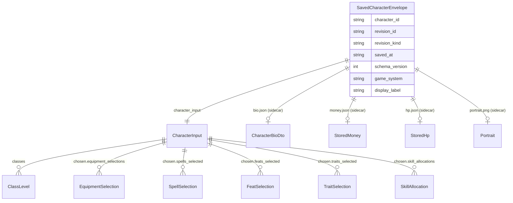
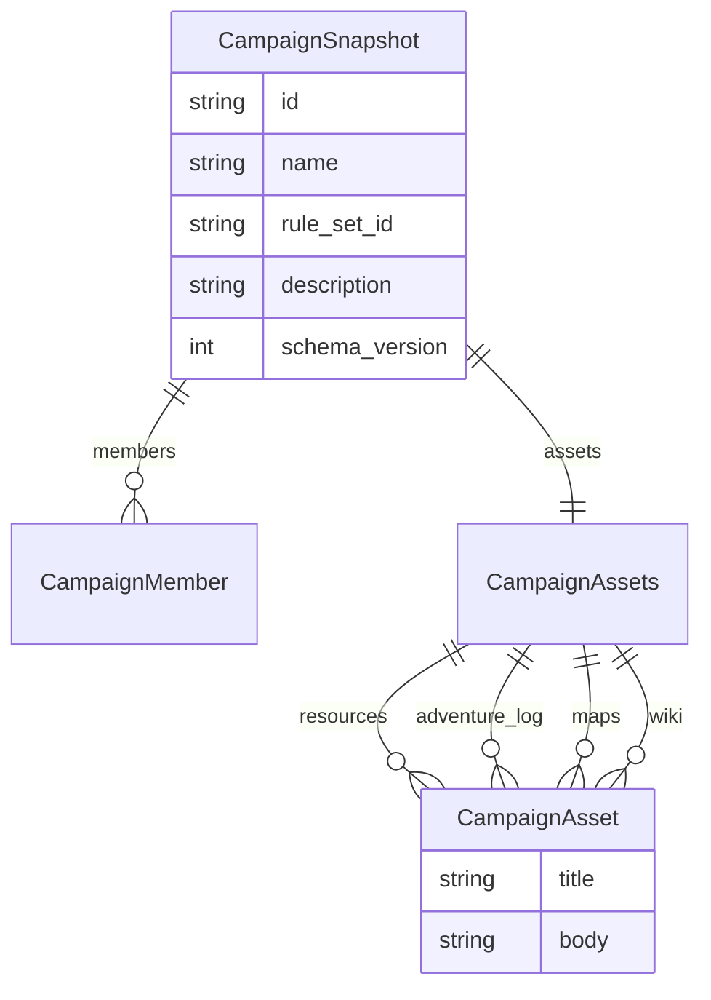
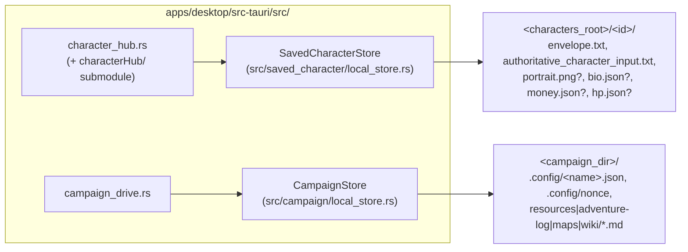

# Persistence

> Scope: how saved characters and campaigns are typed, stored on disk, and reached from the desktop shell.
> Last verified: **2026-09-20 against `tranche/16`, HEAD `b22ea9e113`** (SD-36 consolidation, architecture-docs truth-up). Re-derived the on-disk bundle layout — a saved character now writes up to **six** files, not two, since `character_hub.rs` grew four sidecar files (bio/money/HP, alongside the pre-existing portrait) whose writes never went through `SavedCharacterEnvelope`/`CharacterInput` at all. Prior pass: 2026-07-21 against `deeff110a104`.
> Maintenance: updated at SD closure — see [README.md](./README.md) §Maintenance contract

This covers the two local-store boundaries under `src/`: `src/saved_character/`
(one saved character) and `src/campaign/` (one campaign). Both are headless —
no Tauri, no serde-free-for-all — and both follow the same shape: a typed
in-memory record, a concrete zero-field `*Store` struct with associated
save/load/list functions, and a documented on-disk layout.

## `saved_character/`: the envelope over `CharacterInput`

`src/saved_character/mod.rs` defines `SavedCharacterEnvelope` — identity,
revision, provenance, and schema metadata wrapped around the single
authoritative payload: `character_input: CharacterInput` (from
`crate::rules_core::character_input`). The envelope is not a new
representation of a character; it is bookkeeping (`character_id`,
`revision_id`, `revision_kind: SavedCharacterRevisionKind`, `saved_at`,
`schema_version`, `app_or_runtime_version`, `content_or_rules_provenance`,
`game_system`, `latest_authoritative_revision_ref`, `display_label`) plus that
one `CharacterInput` field. `CURRENT_SAVED_CHARACTER_SCHEMA_VERSION` is `2`;
schema_version 1 envelopes (no `game_system` line) still load, via
`local_store::derive_legacy_game_system`, which derives a short id like
`"pf1"` from the `content_or_rules_provenance` lineage prefix.

`SavedCharacterRevisionKind` currently has exactly one variant,
`Authoritative` — there is no autosave/recovery revision kind implemented yet,
only the type headroom for one.

### The saved-character model


*The envelope wraps one `CharacterInput`; four further sidecar files hang off the same bundle directory but carry no `CharacterInput`/envelope relationship of their own — see "On-disk bundle layout" below.*

### On-disk bundle layout

`src/saved_character/local_store.rs` defines `SavedCharacterStore`, a
concrete unit struct (`pub struct SavedCharacterStore;`) with associated
functions `save`, `load`, and `list_all`. Its own module doc comment states
the layout precisely: one directory (the bundle root) containing two
authoritative files, named by the constants at the top of the file —

```rust
const ENVELOPE_FILE: &str = "envelope.txt";
const CHARACTER_INPUT_FILE: &str = "authoritative_character_input.txt";
```

- `envelope.txt` — `key = value` lines, one per envelope field (see
  `render_envelope`/`parse_envelope`).
- `authoritative_character_input.txt` — the `CharacterInput` rendered through
  the same hand-rolled `key=value` fixture grammar used elsewhere in
  `rules_core` (`render_character_input` writes it; `load_character_input_fixture`
  from `crate::rules_core::character_input` reads it back). The grammar itself
  — required-field diagnostics, repeatable keys, colon-segment choice
  encoding — is documented in [testing.md](./testing.md); this module only
  consumes it.

**Four further sidecar files can exist in the same bundle directory, written
directly by `apps/desktop/src-tauri/src/character_hub.rs` rather than through
`SavedCharacterStore::save`/the envelope grammar** — none of them are part of
`SavedCharacterEnvelope` or `CharacterInput`; each is its own independent
JSON file, present only once the corresponding feature has been used at least
once for that character:

| File | Constant | Written by | Absent means |
|---|---|---|---|
| `portrait.png` | `PORTRAIT_FILE_NAME` | `save_character_portrait` | no portrait uploaded yet — `load_character_portrait` returns `None`, not an error |
| `bio.json` | `BIO_FILE_NAME` | `update_character_bio` | no bio saved yet — `load_character_bio` returns `CharacterBioDto::default()` (all-empty), not an error |
| `money.json` | `MONEY_FILE_NAME` | `adjust_character_money` | zero balance — `load_character_money` returns a zero `CharacterMoneyDto`, not an error |
| `hp.json` | `HP_FILE_NAME` | `adjust_character_hp` | current HP defaults to computed max HP — `load_character_durability` derives a default rather than erroring |

All four share one design rationale, stated directly in `character_hub.rs`'s
own comments: each is data the rules engine does not need to compute a
character (money and HP tracking, narrative bio fields, a portrait image),
so none of it belongs in `CharacterInput` — putting it there would make it
rules-engine-visible and force every consumer of `CharacterInput` to handle
fields with no mechanical meaning. Each sidecar's write function requires the
character to already exist (checked via `SavedCharacterStore::load` for
bio, `root.exists()` for the portrait) — none of the four is ever the first
write to a character's directory. `money.json` persists only the canonical
`total_copper` integer; the platinum/gold/silver/copper breakdown in the wire
DTO is always derived fresh via `money::copper_to_denominations`, never
stored redundantly. `hp.json` persists current HP and accumulated nonlethal
damage; `adjust_character_hp_at_root` clamps healing at computed max HP and
floors nonlethal recovery at zero. Portraits are capped at
`MAX_PORTRAIT_BYTES = 3 * 1024 * 1024` bytes as a defensive backstop (the
frontend crops/resizes before sending bytes — see [desktop-app.md](./desktop-app.md)).

`SavedCharacterStore::save` refuses to write a record it cannot honestly read
back: `validate_character_input` rejects any field containing a newline (the
grammar is line-based) and enforces that `selected_choices` entries have the
exact colon-segment shape the loader expects (`choice_set_id` = exactly two
segments, `selection_id` = at least two) — see the doc comment directly above
`validate_character_input` in `local_store.rs`. `SavedCharacterStore::save`
also validates the envelope fields are single-line before writing
`envelope.txt`. The four sidecar writers above do not share this validation
path — each does its own narrow shape check (e.g. bio field values just need
to serialize as JSON; there is no line-based grammar to protect there).

`SavedCharacterStore::list_all(characters_root)` walks every subdirectory of
`characters_root`, sorted by file name, and calls `load` on each
independently — `load` reads only `envelope.txt` and
`authoritative_character_input.txt`; the sidecar files are not touched by
listing. A `NotFound` root returns an empty `SavedCharacterListing`
(not an error — no characters yet is not a failure). One unreadable
subdirectory is collected into `SavedCharacterListing::unreadable_entries`
(as a `SavedCharacterListingError { entry_name, message }`) without failing
the rest of the listing.

## `campaign/`: `CampaignSnapshot` and the campaign store

`src/campaign/mod.rs`'s own doc comment states the design intent directly:
campaigns are not rules-computation, so this module lives as a sibling of
`saved_character` rather than under `rules_core`. `CampaignSnapshot`'s fields
are documented as mirroring `apps/desktop/src/campaign/campaignModel.ts`'s
`Campaign` + `CampaignAssets` TypeScript types 1:1 (`id`, `name`,
`rule_set_id`, `rule_set_label`, `description`, `members: Vec<CampaignMember>`,
`party_character_ids: Vec<String>`, `created_at`, `updated_at`,
`assets: CampaignAssets`), plus a `schema_version` field added from day one
(`CURRENT_CAMPAIGN_SCHEMA_VERSION = 1`) — there is no legacy campaign format
to be back-compatible with, unlike `saved_character`. `CampaignAssets` holds
four `Vec<CampaignAsset>` lists — `resources`, `adventure_log`, `maps`,
`wiki` — each `CampaignAsset { title, body }`. This is the one deliberate
exception to the "1:1" framing: `campaignModel.ts`'s asset shape is
`MarkdownAsset { id, title, body, updatedAt }`, and `CampaignAsset` drops the
UI-local `id`/`updatedAt` bookkeeping fields, per `src/campaign/mod.rs`'s own
`CampaignAsset` doc comment. All types derive
`Serialize`/`Deserialize` with `#[serde(rename_all = "camelCase")]`, and a
unit test (`serializes_camel_case_field_names_matching_campaign_model_ts`)
asserts the exact camelCase wire shape (`ruleSetId`, `partyCharacterIds`,
etc.).

### On-disk layout and `CampaignStore`

`src/campaign/local_store.rs` defines `CampaignStore` (also a concrete unit
struct) with `save`, `load`, `list_all`, `delete`, `save_under_root`,
`load_with_nonce`, `save_with_conflict_detection`, and
`save_under_root_with_conflict_detection`. Its module doc comment gives the
layout under a campaign's own directory:

```text
<campaign_dir>/
  .config/<sanitized name>.json   # CampaignSnapshot minus `assets`
  .config/nonce                   # conflict-detection sidecar (see below)
  resources/<sanitized title>.md
  adventure-log/<sanitized title>.md
  maps/<sanitized title>.md
  wiki/<sanitized title>.md
```


*Empty asset groups never get a subdirectory of their own (`write_asset_group` early-returns on an empty slice).*

The JSON config carries every `CampaignSnapshot` field except `assets`
(`config_only.assets = CampaignAssets::default()` before serializing); each
markdown asset is written verbatim as its own `.md` file, named from
`sanitize_filename(&asset.title)`. `CampaignStore::load` re-reads the `.md`
files fresh on every call — an edit made outside the app (e.g. in Obsidian)
between save and load is honored, per the module doc comment and the
`load_honors_an_external_obsidian_style_edit_to_an_asset_markdown_file` test.

`CampaignStore::list_all(campaigns_root)` mirrors
`SavedCharacterStore::list_all` exactly: a missing root returns an empty
`CampaignListing` rather than an error, and each subdirectory load failure is
isolated into `CampaignListing::unreadable_entries` without failing the rest
of the listing.

### Conflict detection lives in `campaign/local_store.rs`, not `campaign_drive.rs`

Nonce-based conflict detection is implemented in this module, not in the
desktop-side `campaign_drive.rs`. A revision nonce is written to a sidecar
file, `NONCE_FILE = "nonce"` under `.config/`, deliberately kept out of the
JSON config and out of `CampaignSnapshot`'s own fields (it has no
`campaignModel.ts` counterpart). `save_with_conflict_detection(snapshot,
campaign_dir, expected_nonce)` compares `expected_nonce` against the nonce
currently on disk; on a mismatch it calls
`move_existing_state_to_conflicts`, which moves the existing `.config` +
four asset directories into `<campaign_dir>/conflicts/<unix-nanos
timestamp>/` before the new snapshot is written as the active state. Local
always wins; both copies are preserved for manual review (the doc comment
above `save_with_conflict_detection` cites `decisions.md` §7 for this
policy). `expected_nonce: None` (a brand-new campaign) never triggers a
conflict.

## Reaching these stores from the desktop


*Two independent Tauri-command surfaces, two independent headless stores, two independent on-disk layouts.*

`apps/desktop/src-tauri/src/character_hub.rs` (and its `characterHub/`
submodule) wraps `SavedCharacterStore` behind the character mutation
commands catalogued in full in [desktop-app.md](./desktop-app.md)'s command
inventory table: `create_character`, `clone_character`, `list_saved_characters`,
`load_saved_character`, `level_up_character`, `preview_level_up`, the
equipment/spell/feat/trait/skill mutation commands, the four sidecar
commands (bio/money/HP/portrait), `delete_character`, `export_character(_json)`,
`import_character`, plus `append_to_character` / `recompute_character` /
`re_save_character` over the `RuleSystemAdapter` seam. `campaign_drive.rs`
wraps `CampaignStore` behind `write_campaign_drive_artifacts`,
`drive_list_campaigns`, `drive_load_campaign`, `drive_save_campaign`, and
`drive_delete_campaign`.

**Revision-id advancement is inconsistent by design today.** Most mutation
commands route through the shared `mutate_saved_character_at_root` load →
mutate → recompute → re-save tail and never advance `revision_id` — every
mutation keeps whatever `revision_id` was already on disk. Only
`re_save_character` computes a fresh `{id}.rev.N` (`N` derived from the
on-disk revision); every other write path that persists a
`SavedCharacterEnvelope` (`create_character`, `clone_character`,
`seed_default_character_if_needed`, `import_character`) still hardcodes
`revision_id: "{id}.rev.1"` at construction time. `campaign_drive.rs`'s own
module doc comment describes itself as "the thin Tauri-command adapter over
the headless `codex::campaign` crate ... it deserializes the frontend's
already-JSON campaign payloads into a typed `CampaignSnapshot` and delegates
all real file I/O to `codex::campaign::local_store::CampaignStore`". The full
command inventory and request/response DTO shapes are catalogued in
[desktop-app.md](./desktop-app.md); this file only names the entry points and
the on-disk shape they write.

Characters root on disk: `character_hub.rs`'s
`characters_root_from_app_data_dir` joins the OS app-data directory with a
fixed `CHARACTERS_ROOT_DIR_NAME = "characters"` subdirectory
(`resolve_characters_root` resolves the real `tauri::AppHandle` app-data
path; `resolve_character_root` joins one more path segment, `character_id`).
Campaigns root: there is no fixed app-data subdirectory — every
`campaign_drive.rs` command takes a `drive_folder_path` (a user-configured
local directory; the name reflects a not-yet-implemented Google Drive sync
feature — see the module doc comment's note that "Google OAuth / Drive
API integration does not exist ... the 'Drive folder' is really just a local
path", and [desktop-app.md](./desktop-app.md)'s State-approach section for
why campaigns actually live in `localStorage` today, with the Drive folder
as a one-way write-through mirror).

## Versioning and migration rules

- **`SavedCharacterEnvelope`**: `CURRENT_SAVED_CHARACTER_SCHEMA_VERSION = 2`.
  A schema_version 1 envelope (no `game_system` line) still loads — the
  gap is filled by `local_store::derive_legacy_game_system`, which derives a
  short id like `"pf1"` from the `content_or_rules_provenance` lineage
  prefix rather than requiring a migration pass over old files on disk. There
  is no write-side upgrade: an old file is read compatibly, but the next save
  of that character writes schema_version 2 going forward (no migration
  script rewrites old files in place).
- **`CampaignSnapshot`**: `CURRENT_CAMPAIGN_SCHEMA_VERSION = 1` since the
  type's introduction — there is no legacy format to migrate from, and no
  version-2 shape exists yet.
- **Sidecar files** (`bio.json`, `money.json`, `hp.json`, `portrait.png`) carry
  no schema-version field of their own. Each loader treats "file absent" as
  the only backward-compatibility case it needs to handle (see the table
  above); a genuinely incompatible future shape change to one of these would
  need its own versioning scheme, which does not exist today.

### Portrait storage

`character_hub.rs` stores a character's portrait as `portrait.png`
written directly into that character's own bundle directory via
`save_character_portrait`, `load_character_portrait`, and
`delete_character_portrait`. `load_character_portrait` returns the bytes
re-encoded as a `data:image/png;base64,...` URL, or `None` if no portrait
file exists.

## Design rule: no `*Backend` trait, no trait-object indirection

Both stores are concrete zero-field structs with associated functions, not
trait objects behind a `dyn *Backend` interface — the standing rule for any
persistence backend in this codebase. Full statement of the rule, its source
citation, and the "when to introduce a trait seam" guidance: see
[conventions.md](./conventions.md) §"Concrete zero-field `*Store` structs,
no `*Backend` trait."

## How to extend

**Add a new sidecar file to a saved character** (worked example: `bio.json`):
1. Pick a file name constant (`const FOO_FILE_NAME: &str = "foo.json"`) in
   `character_hub.rs`, next to the four existing ones.
2. Write a `save_foo_at_root(root: &Path, foo: &FooDto) -> Result<(), String>`
   that first checks the character already exists (`SavedCharacterStore::load`
   or `root.exists()`) and a `load_foo_at_root(root: &Path) -> Result<FooDto,
   String>` that returns an honest default (never an error) when the file is
   absent.
3. Wrap both in thin `#[tauri::command]` functions taking `tauri::AppHandle` +
   a request DTO, resolving the root via `resolve_character_root`.
4. Register both in `main.rs`'s `generate_handler!`, add `boundary/*.ts`
   wrappers, and add the file to this doc's sidecar table and
   [desktop-app.md](./desktop-app.md)'s mutation-command table.

**Add a new persistence backend** (e.g. a cloud sync target): do not add a
`dyn *Backend` trait seam preemptively — per the design rule above, this
codebase waits for a second concrete implementation to actually exist before
introducing trait-object indirection.

## Pitfalls

- **A sidecar file is not part of `CharacterInput` or the envelope, and will
  not appear in an exported character JSON** unless `export_character`'s
  payload builder is explicitly extended to read it — `export_character`
  builds its payload from the real on-disk envelope, and the four sidecar
  files sit outside that envelope by design. Adding a fifth sidecar file
  without checking whether export/import needs to carry it is an easy way to
  ship a feature that silently disappears on export/import round-trip.
- **`SavedCharacterStore::list_all` never reads the sidecar files** — a
  listing surface that wants to show, say, a character's current HP without
  a full `load_saved_character` round trip cannot get it from `list_all`
  alone; it would need to open `hp.json` itself, per-character, which is a
  different (and today unimplemented) code path.
- **Revision-id advancement is inconsistent on purpose, not a bug to "fix"
  uniformly** — see "Reaching these stores from the desktop" above. A new
  mutation command copied from `add_equipment_selection`'s shape will
  correctly *not* advance `revision_id`, matching every other mutation
  command except `re_save_character`.
- **The campaign nonce file has no `CampaignSnapshot` field of its own** — a
  refactor that tries to fold `CampaignSnapshot` and its on-disk shape into
  one 1:1 mapping will find the nonce is deliberately outside that mapping;
  see "Conflict detection" above for why.
- **A missing characters/campaigns root is not an error** — both `list_all`
  implementations return an empty listing for a `NotFound` root. A caller
  that treats an empty listing as "something went wrong" rather than "no
  records yet" will misreport a fresh install.
