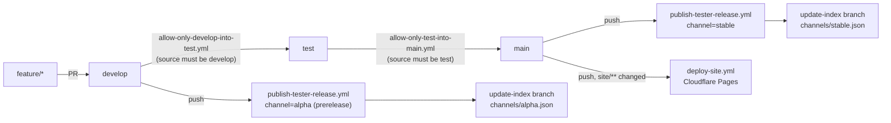
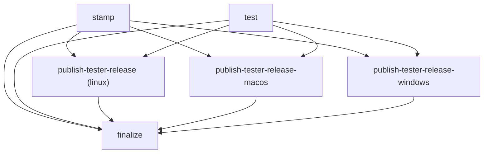

# Release pipeline

> Scope: how a commit on `develop` or `main` becomes a tagged, schema-validated tester release, how branches get promoted between channels, and how the public `campaign-codex.org` status site is deployed.
> Last verified: **2026-09-20 against `tranche/16`, HEAD `424e93e93c`** — SD-36 docs-truth capability
> pass: checked this document's claims against the fact sheet and found no capability/scope claim in
> it that needed correction (it describes CI/release mechanics, not product-wide coverage or "N books"/
> "pilot"/"proof harness" framing); no substantive change this pass beyond this header refresh. Prior
> pass **2026-09-20 against `b22ea9e113`** re-derived the version stamp (`0.16.0`, tranche/16), the job
> graph (`stamp`/`test`/three platform publishes/`finalize`, unchanged in shape), the
> `tools/ci/test_branch_promotion_guard.sh` path (moved from `tests/sd16-e5-f1/` — SD-36 Epic C2,
> already reflected in the working tree at the time of that pass), and added the `deploy-site.yml`
> workflow (new since the pass before that, publishes the public status site, not the desktop app).
> Line-number citations from earlier passes are dropped in favor of step/job names, which drift less
> between passes on a 1,000+ line workflow file.
> Maintenance: updated at SD closure — see [README.md](./README.md) §Maintenance contract

## Overview

Three independent systems live under `.github/workflows/`:

1. **Publish** (`publish-tester-release.yml`): turns a push to `develop` or `main` into a multi-platform GitHub Release with a schema-validated update manifest, and (conditionally) advances the `update-index` branch's channel pointer.
2. **Promotion**: a chain of branch-source guards and an evidence gate control which branch may open a PR into which downstream branch (`develop` → `test` → `main`), independent of the publish workflow.
3. **Site deploy** (`deploy-site.yml`): pushes `site/**` to Cloudflare Pages on a push to `main` — a separate concern from the desktop app release, sharing only the same repo and the same `main` branch.

Systems 1 and 2 share doctrine constants (tranche id, release-notes path, required sections) but are enforced by separate code paths kept in sync by hand — see [The pinned-SD-16 quirk](#the-pinned-sd-16-quirk) below.


*The three independent flows a commit on `develop`/`main` can trigger — branch promotion, a tester release, and (main only) a site deploy.*

## The publish pipeline (`publish-tester-release.yml`)

Trigger: `push` to `develop` or `main`. `develop` publishes to the `alpha` channel (prerelease); `main` publishes to `stable`; `beta` is reserved — no workflow trigger publishes it today.

Job graph (job names verified against the file's own `needs:` declarations):


*`stamp` and `test` declare no `needs:` of their own and run in parallel; every downstream job fans in from both.*

- **`stamp`**: checks out, derives `VERSION="0.16.${GITHUB_RUN_NUMBER}"`, and rewrites `apps/desktop/package.json` and `apps/desktop/src-tauri/tauri.conf.json` in place. The stamped files are uploaded as the `stamped-sources` artifact so every downstream job reads the exact same version.
- **`test`**: `cargo test --locked` at repo root, `cargo test --locked` in `apps/desktop/src-tauri`, `npm run typecheck` and `npm test` in `apps/desktop`. All three platform-publish jobs `needs: [test, stamp]`, so a red test run blocks every artifact build.
- **`publish-tester-release`** (linux): downloads the stamped sources, runs `npx tauri build --bundles deb,appimage --ci` (which itself runs `apps/desktop`'s `build` npm script — and therefore `scripts/gen-corpus-bundle.mjs` — before `vite build`; see [desktop-app.md](./desktop-app.md)), stages the `.deb`/`.AppImage` into `release-staging/`, writes a `provenance.json` receipt, generates and validates `update-manifest.json`, computes checksums, and uploads everything as the `platform-linux` artifact. It does **not** call `gh release create` itself.
- **`publish-tester-release-macos`** and **`publish-tester-release-windows`** mirror this on `macos-latest` / `windows-latest`, building `.app`/`.dmg` and `.msi`/`.exe` respectively, uploading `platform-macos` / `platform-windows` artifacts. Neither is code-signed (macOS DMG ships unsigned; Windows testers click through SmartScreen).
- **`finalize`** is the single writer of the GitHub release, the unified `update-manifest.json`, and the `update-index` branch push. It downloads whichever platform artifacts succeeded (`continue-on-error: true` per download — a missing platform does not fail the run), rebuilds a unified manifest with whichever optional platform blocks are present, validates it twice, creates the GitHub release with `gh release create`, then emits and pushes the channel index.

### Version stamp

`VERSION="0.16.${GITHUB_RUN_NUMBER}"` is the sole place the build number is minted; every other consumer reads `needs.stamp.outputs.version`. The three files that must carry a matching `<major>.<tranche-base>.<build>` triple are `apps/desktop/package.json`, `apps/desktop/src-tauri/tauri.conf.json`, and `apps/desktop/src-tauri/Cargo.toml` — as of this verification all three are committed at **`0.16.0`** (`node -p "require('./apps/desktop/package.json').version"`, `node -p "require('./apps/desktop/src-tauri/tauri.conf.json').version"`, `grep '^version' apps/desktop/src-tauri/Cargo.toml`). The three files are kept at the tranche's `.0` placeholder and the stamp step overwrites `package.json` / `tauri.conf.json` at publish time with the real build number (it does not touch `Cargo.toml`).

Versioning semantics (`docs/release/SD-22/decisions.md:52`, `apps/desktop/src/release/buildVersionTriple.test.ts`):
- **major**: stays `0` until the first publish to `main`.
- **tranche-base** (the `16` in `0.16.x`): bumped only when a new `tranche/N` branch is cut for the next bundle — explicitly *not* at a bundle's own closure while still on the same tranche branch. Advances to date, most recent first: `0.9` (tranche/9, SD-29) → … → `0.15` (tranche/15, SD-35) → `0.16` (tranche/16, SD-36).
- **build**: the monotonic `GITHUB_RUN_NUMBER`.

The build label surfaced in the desktop UI is `Codex <version>` — `formatWorkbenchBuildLabel` in `apps/desktop/src/testerWorkbench/status/createWorkbenchStatus.ts` (`BUILD_PREFIX = 'Codex'`).

Guard tests that keep the three files and the fixtures honest:
- `apps/desktop/src/release/buildVersionTriple.test.ts` — asserts `package.json`, `tauri.conf.json`, and `Cargo.toml` versions are identical and match `^\d+\.\d+\.\d+$`, that the triple starts with `0.16.` on tranche/16, **and** that the workflow's stamp reuses the repo files' own `major.tranche` while taking its build position from `GITHUB_RUN_NUMBER` (a relationship check, not two independent literals).
- `apps/desktop/src/releaseChecks/buildVersionTriple.test.ts` — a partial duplicate (file-agreement + tranche-anchor half only). Both anchors move together at each tranche cut.
- `apps/desktop/src/releaseChecks/buildLabelFixtureFreshness.test.ts` — asserts named fixture files carry the *current* `Codex <version>-test` label literal. Re-derive the exact file/occurrence count at each tranche cut with `git grep -l '0\.16\.0-test' -- apps/desktop/src` — this is the sweep a version bump is easy to miss (per [conventions.md](./conventions.md)'s `AGENTS.md` §Concurrency and Measurement guidance: `grep -o` is not trustworthy for occurrence counts here; use `awk '{n+=gsub(/PATTERN/,"")} END{print n}'`).

### Manifest generation + dual validation

`scripts/release/write_release_manifest.py` builds `update-manifest.json` against `schemas/update/update-manifest.schema.json`. It hard-codes `TRANCHE_ID = "STC-CODEX-SD-16"` and `SCHEMA_VERSION = "1.1.0"`, computes the AppImage's sha256/size from the file on disk (`_appimage_identity`), and accepts complete-triple-or-nothing `--windows-msi-*` / `--macos-dmg-*` flag sets (`_optional_platform_block`) so a partial platform block can never be emitted.

Each publish job's manifest is checked twice, by two different scripts:
1. `scripts/release/validate_manifest.py --manifest update-manifest.json --schema schemas/update/update-manifest.schema.json` — pure `jsonschema.Draft202012Validator` check against the wire schema.
2. `tools/release/check_release_manifest_against_dev_schema.py update-manifest.json` — re-validates against the same schema, then re-runs `tools/release/check_release_manifest.py`'s `_coherence_check` (tranche_id / release_notes_path binding) against the manifest (`tools/release/check_release_manifest.py` normally validates the *legacy* `tools/release/release-manifest.schema.json` shape, not the dev `schemas/update/` shape — the dev-schema shim exists because those two schemas disagree, see below).

The `finalize` job repeats both validations against the unified manifest.

### Tag forms

Two tag strings coexist by design:

| Form | Shape | Used by |
|---|---|---|
| `MANIFEST_TAG` | `${channel}/v${VERSION}-${SHORT_SHA}` (e.g. `alpha/v0.16.96-a1b2c3d4`) | Satisfies `schemas/update/update-manifest.schema.json`'s `tag` pattern `^(alpha\|beta\|stable)/.+$`; stored as the manifest's `tag` field and as the mirror path under `manifests/<MANIFEST_TAG>/` on `update-index`. |
| `RELEASE_TAG` | `${channel}-v${VERSION}-${SHORT_SHA}` (e.g. `alpha-v0.16.96-a1b2c3d4`) | The actual `gh release create` tag and the URL path segment (GitHub tags cannot contain `/` without becoming a nested ref, so the slash is replaced with a hyphen). |

Both are computed twice, identically: once in the linux publish job, once in `finalize`'s own `resolve` step — `finalize`'s computation is the one the actual `gh release create` uses.

### Channel-index emit + push

After `gh release create` succeeds, `finalize` prepares and pushes a channel-index pointer to the **protected `update-index` branch**:

- `tools/release/emit_channel_index.py` reads a schema-valid `update-manifest.json`, validates it, cross-checks `manifest.channel == args.channel`, and emits `channels/<channel>.json` validated against `schemas/update/channel-index.schema.json`.
- The `Update channel index on update-index branch` step does a hard reset + fetch/checkout (or orphan-create if the branch doesn't exist yet), writes the channel-index JSON and a full manifest mirror under `manifests/<MANIFEST_TAG>/update-manifest.json`, commits as `github-actions[bot]`, and pushes `HEAD:update-index`.

### The fail-loud gate

Both the emit and push steps are gated by `hashFiles('docs/release/SD-16/tranche-*/manifest.yaml') != ''`. If no file matches that glob, a dedicated step (`Assert channel-index gate preconditions`) fails the whole job loudly instead of letting the channel-index steps silently no-op — the step's own `::error::` message names exactly this failure mode.

## Branch promotion chain


*`feature/* → develop (alpha) → test (beta) → main (stable)`.*

Enforcement is layered:

1. **GitHub-side branch protection** (not visible in-repo except as documented intent in `.github/branch-protection-rulesets/`) blocks direct pushes to the protected branches.
2. **`allow-only-*` workflows** run on `pull_request_target`:
   - `.github/workflows/allow-only-develop-into-test.yml` — PRs into `test` must come from this repo's `develop` branch (not a same-named fork branch). Its `restore-develop-branch` job fires on `delete` of the `develop` ref and re-creates `develop` from `test` — a self-healing guard against `develop` ever being deleted.
   - `.github/workflows/allow-only-test-into-main.yml` — PRs into `main` must come from `test`; symmetric `restore-test-branch` job, which is why `test` is a durable, self-healing release gate and should never be deleted by hand even when it looks stale — deleting it triggers the very restore job that recreates it from `main`.
   - Both delegate the actual check to `bash tools/ci/branch-promotion-guard.sh` via `EXPECTED_SOURCE`/`SOURCE_BRANCH`/`HEAD_REPO`/`BASE_REPO` env vars.
3. **`tools/ci/branch-promotion-guard.sh`** defines `verify_promotion_source()`: rejects when `head_repo != base_repo` (forks) or `source_branch != expected`. It is sourceable (for unit tests) or directly runnable (as the Action step body). Unit tests live at `tools/ci/test_branch_promotion_guard.sh` (moved here from *tests/sd16-e5-f1/test_branch_promotion_guard.sh*, a path that no longer exists, by SD-36 Epic C2's test-side rewrite); the guard script's own header states: "Both the GitHub Actions workflows and the unit tests MUST exercise the same `verify_promotion_source` function. Drift between this file and the workflows fails the test suite."
4. **`.github/workflows/promotion-gates.yml`** — runs on `pull_request_target` into `test` or `main`, and is the evidence-rich self-blocking gate:
   - Determines the lane (`test` → `beta`, `main` → `stable`).
   - Runs `python3 scripts/release/check_promotion_evidence.py --self-test` first — the CI job fails immediately if the checker's own built-in test suite is red, before it ever evaluates a real PR.
   - Fetches the PR body via REST (because `pull_request_target`'s event payload can truncate long bodies), resolves the most recent alpha/beta release via REST, and (stable lane only) downloads `provenance.json` from the most recent beta release's assets.
   - Runs `python3 scripts/release/check_promotion_evidence.py --lane <beta|stable> ...` and captures `gate_report.txt`.
   - Posts/updates a single PR comment (marker `<!-- promotion-gate-evidence -->`) and sets a commit status with context `sd16-e5-f3a/promotion-gate` — this is what branch protection is expected to require.
   - Fails the job (`exit 1`) when the gate is blocked.
5. **`.github/workflows/check-release-manifest.yml`** — a PR-time gate, scoped by `paths:` filters: `tools/release/**`, `apps/desktop/src/testerWorkbench/update/**`, `apps/desktop/src/operatorTriage/**`, `apps/desktop/src/sd16/**`, `apps/desktop/src/sd17/**`, `release-manifest.json`, `docs/release/**/release-notes.md`, and the two workflow files themselves. If a `release-manifest.json`-shaped file changed, it runs `tools/release/check_release_manifest.py` against every changed manifest and posts a failure-summary comment on failure. **Two of the six globs are still stale**: `apps/desktop/src/sd16/**` and `apps/desktop/src/sd17/**` resolve to nothing in this checkout (`sd16/`'s subdirectories moved to `apps/desktop/src/feedback/` and `apps/desktop/src/update/` in 2026-08-10's `06d926e90`; `sd17/` never existed here) — the `testerWorkbench/update` and `operatorTriage` globs were fixed since the last pass (they used to read `sd11/update/**`/`sd15/**`), but the `sd16`/`sd17` globs were not; this workflow's own YAML is out of `docs/architecture/`'s write scope, so this is recorded here as a known, narrower gap rather than corrected in place.
6. **`.github/workflows/tranche-3-ci.yml`** — **tranche/3-specific**, not a generic template. Guards that slice PRs target `tranche/3` (never `develop`, per the header comment's "devops/tranche-branch-governance refusal"), runs the same test+typecheck+test lane as the publish workflow's `test` job on every push/PR to `tranche/3`, and validates any touched `docs/release/**/manifest.yaml` or `release-notes.md` via `check_release_manifest.py`. No later tranche (including `tranche/16`, the current one) has its own parallel `<tranche>-ci.yml` — `ls .github/workflows/ | grep tranche` shows only `tranche-3-ci.yml`.

### `scripts/release/promote-alpha-to-beta.sh` / `promote-beta-to-stable.sh`

Local, human-run helpers (not invoked by any workflow) that evaluate the same doctrine gates as `check_promotion_evidence.py` but against real `gh` calls, and print (or write to `--body-out`) a ready-to-paste PR body carrying the `tranche_id:` / `release_notes_path:` / evidence keys the CI gate expects. Both source `scripts/release/_lib-gates.sh` for shared helpers. Neither script ever calls `gh pr create` — `scripts/release/test-promotion-gates.test.sh`'s final assertion greps a full log of every `gh` invocation across the suite for the literal `pr create` and fails if found.

## The release-notes CI contract

`release_notes_path` is regex-locked in two independent schemas, kept in agreement by hand:

- `schemas/update/update-manifest.schema.json` — `"pattern": "^docs/release/[^/]+/release-notes\\.md$"`
- `tools/release/release-manifest.schema.json` — `"pattern": "^docs/release/.+/release-notes\\.md$"` (looser: allows nested subdirectories, where the update-manifest schema requires exactly one path segment).

The seven required release-notes section headers are asserted in `tools/release/check_release_manifest.py`'s `REQUIRED_NOTES_SECTIONS`:

```python
REQUIRED_NOTES_SECTIONS = [
    "Summary",
    "User-Visible Changes",
    "Defects Fixed",
    "Operational Notes",
    "Verification Evidence",
    "Known Issues",
    "Update Eligibility",
]
```

The same seven headers (as literal `## `-prefixed strings, order-checked) are independently re-declared in `scripts/release/check_promotion_evidence.py`'s `REQUIRED_NOTE_SECTIONS` and `scripts/release/_lib-gates.sh`'s `REQUIRED_NOTE_SECTIONS` bash array — three separate lists kept in sync by convention, not shared import (the Python promotion-gate checker is deliberately stdlib-only).

## The pinned-SD-16 quirk

Several pipeline surfaces are still pinned to frozen SD-16-era identifiers even though eight further bundles (SD-17 through SD-36) have shipped since. This is the manifest contract's frozen identity — intentional, not an oversight to "fix":

1. **`docs/release/SD-16/release-notes.md` hardcoded as the publish workflow's notes source.** `publish-tester-release.yml` reads/writes this exact path at multiple steps (release-notes validation, manifest generation's `--release-notes-path`, staging the notes into the release, the `finalize` job's manifest rebuild, and the release-notes fallback when creating the GitHub release). Every tester release published today ships the SD-16 release-notes file regardless of which SD's code actually changed.
2. **`tranche_id` is a JSON Schema `const` locked to `"STC-CODEX-SD-16"`.** `schemas/update/update-manifest.schema.json` and `schemas/update/channel-index.schema.json` both enforce this; `scripts/release/write_release_manifest.py`'s `TRANCHE_ID` emits exactly that constant.
3. **`codex-tranche-2-5` is a separate pinned constant inside the promotion-gate surface** (distinct from the manifest's `STC-CODEX-SD-16`): `scripts/release/check_promotion_evidence.py`'s `TRANCHE_ID` and `scripts/release/_lib-gates.sh`'s `TRANCHE_ID` both gate the promotion-evidence PR-body and manifest checks against this literal string, independent of the update-manifest schema's pin.

These three pins are consistent with each other only in the sense that they all point at old identifiers; they are not the *same* identifier, and nothing in the codebase currently derives one from another. A future contract bump that changes any of the three needs to touch every file listed above plus its corresponding test fixtures (`scripts/release/test-promotion-gates.test.sh`, `scripts/release/__tests__/fixtures/`, `scripts/release/check_promotion_evidence.py`'s embedded `_t_*` self-tests).

## The site-deploy workflow (`deploy-site.yml`)

A separate, smaller lane, unrelated to the desktop-app release above except for sharing `main`:

- **Trigger**: `push` to `main` with `paths: ['site/**', '.github/workflows/deploy-site.yml']`, plus manual `workflow_dispatch`.
- **What it deploys**: the static `site/` tree (the `campaign-codex.org` public status page — see [status.md](./status.md) for what that page reports) to the Cloudflare Pages project `codex` (default URL `https://codex-3cc.pages.dev/`, custom domain `https://campaign-codex.org/`).
- **Concurrency**: `group: deploy-site`, `cancel-in-progress: false` — deploys are serialized rather than raced, unlike `publish-tester-release.yml` (see below).
- **Permissions**: `contents: read` only; the Cloudflare side is authenticated via the `CLOUDFLARE_API_TOKEN` repository secret.
- **Not gated by any test job** — a push to `main` touching only `site/**` deploys directly, without running `cargo test`/`npm test` first (those only run for a real app-code push via `publish-tester-release.yml`'s own `test` job).

## Installer contents and size

Bundle targets, per `tauri.conf.json`: `deb`, `appimage` (Linux), `msi`, `nsis` (Windows), `app`, `dmg` (macOS). Bundled resources: `resources/authoring_workbench/guard-stance-package/`, `resources/corpus_fixtures/` (small hand-authored fixtures), and `resources/corpus_bundle/` mapped to `data/corpus/` inside the package — the sanitized runtime corpus mirror described in [desktop-app.md](./desktop-app.md)'s "The corpus-bundle build step". That bundle alone is **64 MiB** across **14,029** JSON files (`du -sh apps/desktop/src-tauri/resources/corpus_bundle/`; `find … -name '*.json' | wc -l`) — the dominant contributor to installed size alongside the Tauri/WebView2/webkit runtime itself. No installer artifact from a real `tauri build` run was inspected for this pass (that would mean running a build, out of this doc-only pass's scope) — the 64 MiB corpus-bundle figure is the one concretely re-derivable number; total installer size per platform is not independently re-verified here.

## Scripts and tools inventory

| File | What it does | Invoked by |
|---|---|---|
| `scripts/release/_lib-gates.sh` | Shared bash helpers (`validate_release_notes`, `known_issues_has_marker`, `release_url_for_tag`, `is_valid_evidence`, `emit_pr_body`, `report_gate_outcome`, `deliver_body`) for the two promote-*.sh scripts. | Sourced by `promote-alpha-to-beta.sh`, `promote-beta-to-stable.sh`. |
| `scripts/release/check_promotion_evidence.py` | CI-side evidence validator for the beta/stable promotion gates; emits JSON report + `GATE=ready\|blocked`. Has a built-in `--self-test` harness. | `.github/workflows/promotion-gates.yml`. |
| `scripts/release/promote-alpha-to-beta.sh` | Local helper: evaluates the 5 alpha→beta gates against real `gh` state and prints/writes the AV-BR-6 PR body. Never calls `gh pr create`. | Run manually by an operator. |
| `scripts/release/promote-beta-to-stable.sh` | Local helper: evaluates the 6 beta→stable gates (including provenance.json download) and prints/writes the PR body. | Run manually by an operator. |
| `scripts/release/validate_manifest.py` | Validates an `update-manifest.json` against `schemas/update/update-manifest.schema.json` via `jsonschema`. | `publish-tester-release.yml` (linux publish job and `finalize`). |
| `scripts/release/write_release_manifest.py` | Builds and writes a schema-conformant `update-manifest.json`, computing AppImage/MSI/DMG sha256+size from disk. | `publish-tester-release.yml` (linux publish job and `finalize`). |
| `scripts/release/test-promotion-gates.test.sh` | Bash self-test for `promote-alpha-to-beta.sh` / `promote-beta-to-stable.sh` against a stubbed `gh`. | Run manually; not wired into any workflow. |
| `scripts/release/__tests__/test-write-release-manifest.test.sh` | Bash self-test for `write_release_manifest.py` / `validate_manifest.py` round-trip, including a malformed-sha256 negative case. | Run manually. |
| `scripts/tranche/validate-tranche-notes.py` | Validates a tranche manifest YAML + its bound release-notes.md (required sections, order, non-empty). | `publish-tester-release.yml`'s `Validate tranche release notes` step. |
| `scripts/tranche/tests/test_validate_tranche_notes.py` | `unittest`-based test suite for `validate-tranche-notes.py`. | Run manually. |
| `tools/ci/branch-promotion-guard.sh` | Defines `verify_promotion_source()`; sourceable for tests or directly runnable as the Action step body. | `allow-only-develop-into-test.yml`, `allow-only-test-into-main.yml`; unit-tested by `tools/ci/test_branch_promotion_guard.sh`. |
| `tools/ci/test_branch_promotion_guard.sh` | Unit tests for `verify_promotion_source()` — moved here from `tests/sd16-e5-f1/` by SD-36 Epic C2. | Run manually; the same function it tests is exercised live by the `allow-only-*` workflows. |
| `tools/release/check_release_manifest.py` | Validates release-manifest.json files against the legacy `tools/release/release-manifest.schema.json` shape plus tranche_id/release_notes_path coherence against the working tree. | `check-release-manifest.yml`, `tranche-3-ci.yml`. |
| `tools/release/check_release_manifest_against_dev_schema.py` | Validates a manifest against the dev `schemas/update/update-manifest.schema.json` shape, then re-runs `check_release_manifest.py`'s `_coherence_check`. | `publish-tester-release.yml` (both the linux job's "Validate release manifest (gate)" step and `finalize`). |
| `tools/release/emit_channel_index.py` | Emits and validates a `channels/<channel>.json` pointer from a schema-valid manifest. | `publish-tester-release.yml`'s `finalize` job. |
| `tools/release/release-manifest.schema.json` | The legacy release-manifest schema (`schema_version: "v1"`, `platform_artifacts` array, linux-only). | Consumed by `check_release_manifest.py`. |
| `tools/release/test_check_release_manifest.py` | `unittest` suite for `check_release_manifest.py`. | Run manually. |
| `tools/release/test_check_release_manifest_against_dev_schema.py` | `unittest` suite for the dev-schema shim. | Run manually. |
| `tools/release/test_emit_channel_index.py` | `unittest` suite for `emit_channel_index.py`. | Run manually. |

All Python validators that call `jsonschema.validate`/`Draft202012Validator` need the `jsonschema` pip package (pinned to `4.21.1` in CI). It is already importable in this workspace (`python3 -c "import jsonschema"` exits 0).

## Workflow trigger and permissions summary

| Workflow | Trigger | Top-level `permissions:` | Concurrency group |
|---|---|---|---|
| `publish-tester-release.yml` | `push` to `develop`, `main` | `contents: write` | none declared |
| `promotion-gates.yml` | `pull_request_target` → `test`, `main` | `{}` (job grants its own: `contents: read`, `pull-requests: write`, `issues: write`, `statuses: write`) | none declared |
| `allow-only-develop-into-test.yml` | `pull_request_target` → `test`, `delete` | `{}` (the `restore-develop-branch` job grants `contents: write`) | none declared |
| `allow-only-test-into-main.yml` | `pull_request_target` → `main`, `delete` | `{}` (the `restore-test-branch` job grants `contents: write`) | none declared |
| `check-release-manifest.yml` | `pull_request` → `develop`, `test`, `main` (path-filtered) | `contents: read`, `pull-requests: read` | none declared |
| `tranche-3-ci.yml` | `pull_request` → `tranche/3`, `push` → `tranche/3` | `contents: read`, `pull-requests: read` | `tranche-3-${{ github.ref }}`, `cancel-in-progress: true` |
| `deploy-site.yml` | `push` to `main` (path-filtered: `site/**`), `workflow_dispatch` | `contents: read` | `deploy-site`, `cancel-in-progress: false` |

`publish-tester-release.yml` remains the only workflow that runs on every commit to `develop`/`main` with no `concurrency:` block — two pushes to `develop` in quick succession can run two full `finalize` jobs concurrently, each pushing to the shared `update-index` branch (mitigated only by each push being a fast-forward-or-fail `git push origin HEAD:update-index`, not by the workflow itself serializing runs). `deploy-site.yml` and `tranche-3-ci.yml` are the only two workflows with an explicit `concurrency:` group.

## How to extend

**Add a new tranche-specific CI workflow** (worked example: what a hypothetical `tranche-16-ci.yml` would need, following `tranche-3-ci.yml`'s precedent — none exists yet for any tranche after 3):
1. Copy `tranche-3-ci.yml`'s trigger shape (`pull_request`/`push` scoped to the one branch, never `develop`).
2. Reuse the same `test`+`typecheck`+`test` lane `publish-tester-release.yml`'s `test` job runs, so the two never silently diverge.
3. Add the `docs/release/**/manifest.yaml`/`release-notes.md` validation step via `check_release_manifest.py`, matching `tranche-3-ci.yml`'s own step.
4. Give it its own `concurrency:` group (`tranche-N-${{ github.ref }}`, `cancel-in-progress: true`) so it doesn't inherit `publish-tester-release.yml`'s lack of one.

**Bump the tranche-base version at a new tranche cut**: update `apps/desktop/package.json`, `apps/desktop/src-tauri/tauri.conf.json`, and `apps/desktop/src-tauri/Cargo.toml` (and `Cargo.lock`'s `codex-desktop` entry) to the new `0.<N>.0` together, in the same commit; re-run `git grep -l '0\.<old>\.0-test' -- apps/desktop/src` and move every hit, then confirm `buildLabelFixtureFreshness.test.ts` still names a file that actually carries the new literal.

**Add a required release-notes section**: it must be added to all three lists at once — `tools/release/check_release_manifest.py`'s `REQUIRED_NOTES_SECTIONS`, `scripts/release/check_promotion_evidence.py`'s `REQUIRED_NOTE_SECTIONS`, and `scripts/release/_lib-gates.sh`'s bash array — plus every fixture release-notes.md the promotion-gate test suite reads.

## Pitfalls

- **The SD-16 pins are not stale references to fix** — see "The pinned-SD-16 quirk" above. Three separate literal identifiers (`STC-CODEX-SD-16`, the release-notes path, `codex-tranche-2-5`) are all deliberately frozen contract values; changing one without the others and their fixtures breaks the pipeline.
- **A `paths:` filter that names a moved directory silently stops firing** — `check-release-manifest.yml`'s `sd16/**`/`sd17/**` globs are the live example: they resolve to nothing today, so a change under the app's real `feedback/`/`update/` directories that should trigger this gate does not, unless it also happens to touch one of the filter's still-live globs. Whenever a directory this filter names gets renamed, update the filter in the same commit.
- **Line-number citations in this doc rot fast.** `publish-tester-release.yml` is 1,000+ lines and grows every bundle; this pass deliberately cites step/job names instead of line ranges for exactly that reason. Do not reintroduce line-number citations without expecting them to be wrong again within a tranche or two.
- **`GITHUB_RUN_NUMBER` is monotonic repo-wide, not per-branch** — a build number is never reused across channels, but it also never resets, so "build 42" on its own says nothing about which tranche it came from; always read it alongside the `major.tranche` prefix.
- **`deploy-site.yml` shares no gate with the app release** — a broken `cargo test`/`npm test` on `main` does not block a `site/**`-only push from deploying. Do not assume a green site deploy says anything about app-code health, or vice versa.

## Related docs

- [testing.md](./testing.md) — the full verification command set, including the standalone scripts referenced in the inventory table above.
- [overview.md](./overview.md) — system-level architecture context.
- [conventions.md](./conventions.md) — repo-wide coding and doc conventions.
- [status.md](./status.md) — current SD/tranche state, and what the deployed public status site (`site/`) actually reports.
- [desktop-app.md](./desktop-app.md) — the corpus-bundle build step this pipeline's `tauri build` step depends on.
