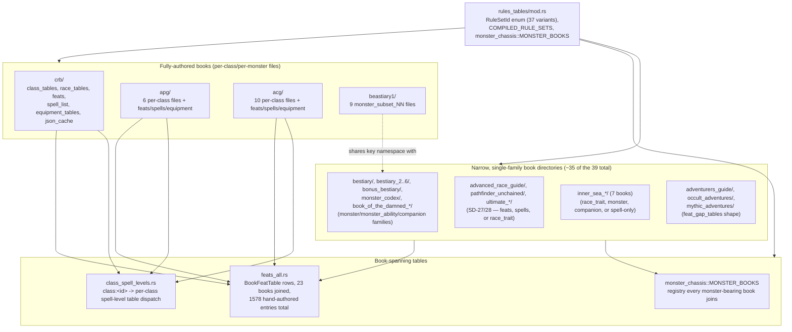

# Rules Data Tables

> Scope: the hand-transcribed, per-book Paizo table store rules-core queries for class chassis, race traits, feats, spells, equipment, and monster stat blocks.
> Last verified: **2026-09-20 against `tranche/16` (`424e93e93c`)** for the `RuleSetId` enum, now
> **37** populated variants, not the prior pass's 30 — four Inner Sea setting books (`InnerSeaFaiths`,
> `InnerSeaMagic`, `InnerSeaTaverns`, `InnerSeaTemples`) were added since, re-derived directly with
> `python3 -c "import re; src=open('src/rules_core/rules_tables/mod.rs').read(); src=re.sub(r'//.*','',src); body=re.search(r'pub enum RuleSetId \{(.*?)\n\}', src, re.S).group(1); print(len(re.findall(r'^\s*([A-Za-z0-9_]+)\s*,', body, re.M)))"`
> — the `re.S`/`.group(1)` scopes the match to the enum body (`{` to the closing `}`) and `re.M`
> makes `^` match per-line rather than only at the start of the file; a version dropping either
> flag silently returns 0. See the corrected block below. This pass also added the module-map
> diagram, the "How to extend" and "Pitfalls" sections, and confirmed no other content in this doc
> changed shape since the prior pass. Prior pass **2026-09-15 against `tranche/15`** (SD-35 closure
> epilogue) for §"Two data stores, and which one a new rule goes in", verified against
> `src/rules_core/rules_tables/mod.rs`, `data/sheet_rules/_report.json`, and
> `src/rules_core/corpus_loader.rs`. **The §"Chassis fields carry the TOKEN, never a computed
> number" convention below is scoped to this store only**: the sheet-rule package carries no
> token at all (`grep -rlE 'BONUS:|DEFINE:|PRE[A-Z]+:|%CHOICE|CL=' data/sheet_rules/ | wc -l` → `0`).
> **This pass** (capability-claims audit, same day) corrected §"Engine state dumps"'s stale claim that
> `v06_class_state_dump` sweeps 27 classes — it sweeps 31 (CRB/APG/ACG/Pathfinder Unchained) — and
> added the scope caveat for `v06_content_state_dump`'s 13-book coverage so it is never cited as a
> corpus-coverage instrument.
> Maintenance: updated at SD closure — see [README.md](./README.md) §Maintenance contract

## Purpose

`src/rules_core/rules_tables/` (`src/rules_core/rules_tables/mod.rs`:
"Canonical Paizo-table store") is a book-partitioned store of
hand-transcribed rule data: class chassis tables, race trait tables,
feats, spell lists, equipment, and monster stat blocks. Each book gets
its own sibling directory and its own `RuleSetId` variant. This is a
separate surface from [corpus-ingest.md](./corpus-ingest.md)'s
`SourcePackageContent` projection pipeline: table data here is
authored by transcribing values out of the real PCGen `.lst` corpus by
hand (or, in one documented case, generated programmatically from it),
not produced by running the ingest pipeline's parsers at build time.

## Module map

`src/rules_core/rules_tables/mod.rs` declares 45 `pub mod` items today
(`grep -cE "^pub mod " src/rules_core/rules_tables/mod.rs`) — far more than
the four this doc describes in per-book structural detail below. Of those
45 declarations, 37 are book/support **directories**
(`find src/rules_core/rules_tables -mindepth 1 -maxdepth 1 -type d | wc -l`)
and 8 are single **files** with no sibling directory (`archetype_swap`,
`class_spell_levels`, `companion_chassis`, `equipment_gap_tables`,
`feat_gap_tables`, `simple_kind_tables`, `feats_all`, `monster_chassis`).
The four (`crb`, `apg`, `acg`, `beastiary1`) are the fully-authored books
with a rich per-class/per-monster file layout; the remaining 41 `pub mod`
items (45 minus the four — 33 directories plus all 8 files) are narrower —
often a single record family (feats-only, spells-only, companion-only)
registered under their own `RuleSetId` per the table below, following
`monster_chassis`/`feats_all`'s shared cross-book table shape (both are
among the 8 files, not directories) rather than a bespoke per-book
directory layout.



*A book's presence in this tree states which record families the engine has ingested from it, not
that the book is "done" — several narrow directories compile exactly one family (see
§"`RuleSetId` and per-book resolution" below for the full per-book accounting).*

## Two data stores, and which one a new rule goes in

*New 2026-09-15 (SD-35 closure).* Since SD-35 the engine reads rule data from **two** stores, and
the choice between them is not a matter of taste:

| | `src/rules_core/rules_tables/` (this doc) | `data/sheet_rules/` ([corpus-ingest.md](./corpus-ingest.md)) |
|---|---|---|
| **What it holds** | the class/race/feat/spell/equipment **chassis** — the tables the PF1 core math needs | every corpus rules record, all 49,450 of them, as a renderable sheet line |
| **How it is authored** | hand-transcribed from the books, in Rust, per book directory | generated whole by `cargo run --locked -p codex-ingest --bin sheet_rule_convert` from the pinned PCGen tree |
| **Format** | Rust `const`/`fn` tables, per-book module, gated by `RuleSetId` | JSON in the `SheetRule` schema, `<book>/<kind>/<key>.json` |
| **Carries source tokens?** | yes — a chassis field carries the TOKEN, never a computed number (see below) | **no**, never — the converter is the only thing that reads a token |
| **Edited by hand?** | yes, that is the point | **never** — regenerated whole; `data/sheet_rules/GENERATED` says so |
| **Loaded by** | direct Rust calls into `rules_tables::<book>::*` | `corpus_loader::load_sheet_rules` / `live_sheet_rules()` |

**Which one to add to.** A number the PF1 core math *computes with* — BAB progression, save
progression, skill ranks per level, a spell-slot table — is chassis, and belongs here, transcribed
by hand and reviewable line by line. Anything that is a **rule a player writes on a sheet** — a
feat's effect, a class feature's text, a racial trait, a monster ability — is not transcribed at
all: it comes out of the converter, and the way to change it is to change the converter's mapping
and regenerate.

The two stores do not overlap and neither supersedes the other: the chassis is 31 computed
classes' worth of core math, the sheet-rule package is the corpus.

## Per-book directory pattern

Four book directories carry the rich, per-class/per-monster file layout this section documents in
full — the rest of the 45 declared `pub mod` items (37 directories, 8 shared-table files; see the
module map above) are narrower, single-family books following the pattern in "Adding a new book"
below, not this one:

```
pub mod acg;
pub mod apg;
pub mod beastiary1;
pub mod crb;
```

- **`crb/`** (Core Rulebook) — the fully-populated book:
  `class_tables.rs` (per-class BAB/save chassis, `ClassId` enum,
  `good_saves_for` — the good-Fortitude/Reflex/Will classification SD-24
  Epic 5's multiclass dispatch reads directly, see [rules-engine.md](./rules-engine.md)),
  `race_tables.rs` (per-race trait dimensions, `RaceId` enum),
  `feats.rs` + `feat_data/{general,combat,item_creation,metamagic}.rs`
  (185-feat catalog split by `FeatCategory`; also home to the
  `FeatCategory` / `FeatTableEntry` / `FeatEffectBonus` types the APG and
  ACG feat catalogs reuse), `spell_list.rs`,
  `equipment_tables.rs` + `equipment_data/{arms_armor,general,magic_items,equipmods}.rs`,
  and `json_cache.rs` (the Shape-B JSON corpus-cache record types — see
  "JSON corpus cache" below).
- **`apg/`** (Advanced Player's Guide) — `mod.rs` plus one file per
  class (`class_alchemist.rs`, `class_cavalier.rs`, `class_inquisitor.rs`,
  `class_oracle.rs`, `class_summoner.rs`, `class_witch.rs` — all six
  real APG classes; `mod.rs`'s doc comment notes Gunslinger and Magus
  are deliberately excluded because they are not real APG corpus
  content), plus a shared `spell_list.rs`, `equipment_tables.rs`, a
  single `equipment_data.rs` (SD-24 Epic 6; one flat file rather than
  CRB/ACG's `equipment_data/` directory split), and
  `feats.rs` + `feat_data/{general,combat,metamagic,teamwork}.rs`
  (172-feat catalog).
- **`acg/`** (Advanced Class Guide) — the same class-file shape: `mod.rs`
  plus ten per-class files (`class_arcanist.rs`, `class_bloodrager.rs`,
  `class_brawler.rs`, `class_hunter.rs`, `class_investigator.rs`,
  `class_shaman.rs`, `class_skald.rs`, `class_slayer.rs`,
  `class_swashbuckler.rs`, `class_warpriest.rs` — the full, corrected
  10-class roster per `mod.rs`'s roster-correction note), plus
  `spell_list.rs`, `equipment_tables.rs`, and — mirroring CRB's own split
  (SD-24 Epic 6) — `equipment_data/{arms_armor,general,magic_items,equipmods}.rs`,
  the last of which ingests `acg_equipmods.lst` into a new
  `EquipmentCategory::Equipmods` variant that criterion 6.1's original
  scope had not counted at all; plus
  `feats.rs` + `feat_data/{general,combat,teamwork,panache}.rs`
  (129-feat catalog).
- **`feats_all.rs`** (book-spanning) — the one place EVERY book's feat
  catalog is joined, as `BookFeatTable { rule_set, entries }` rows: 23 books
  (`hand_authored_feat_tables().len()`, `feats_all.rs`'s own
  `spans_every_ingested_book_with_their_real_counts` test), summing to
  **1578** hand-authored entries total across all 23 (185 CRB + 172 APG +
  129 ACG + 187 ARG + 17 PU + 23 UCA + 104 UI + 135 UW + 261 UC + 144 UM +
  221 UPsi, the remaining 12 books each contributing 0 hand-authored rows
  because their feats come in only via the corpus-gap lane below —
  re-derive by summing `hand_authored_feat_tables()[i].entries.len()` for
  every `i`, the same test's own final `assert_eq!(total, 1578, ...)`).
  Provenance lives on the table, not on each record. `all_feat_tables()`
  additionally joins in the per-book corpus-gap rows (real `*_feats.lst`
  rows not hand-transcribed into a table), so the picker a player actually
  sees is larger than 1578 and covers every ingested book, not just the
  three richest ones. This is what the desktop `list_feats` command and
  `description_completion::feat_description_completion` both read, so the
  Feat picker offers every ingested book's feats and the
  description-reachability audit resolves them.
- **`beastiary1/`** (Bestiary 1) — `mod.rs` plus nine
  `monster_subset_01.rs` .. `monster_subset_09.rs` files, five (or six,
  for subset 06) monsters each, 46 monsters total as of this
  verification (re-derive: each monster function has both a `->
  MonsterStatBlock` return-type line and a `MonsterStatBlock {` literal, so
  `grep -c 'MonsterStatBlock {' <file>` must be halved per file — 5,5,5,5,5,
  6,5,5,5 across subsets 01..09). Subsets are appended in CR-band order as
  ingest cycles land; `mod.rs`'s doc comment documents each subset's exact
  roster and any correction against an earlier planning-doc sample list.
  SD-25 Epic 7 added `equipment_data.rs` + `equipment_tables.rs` (mirroring
  the CRB/APG equipment split) — the book's small 4-record equipment table,
  its first non-monster content. **Naming hazard:** `monster_chassis.rs`
  (the narrow-book lane below) defines its own, separate
  `struct MonsterStatBlock` — the two types share a name but are not the
  same type; `grep -rn 'struct MonsterStatBlock'` finds both
  (`beastiary1/mod.rs` and `monster_chassis.rs`), and importing the wrong
  one is a real, silent type-mismatch hazard.

Every book directory follows the same two-tier shape: a `mod.rs`
defining the book's `RuleSetId`-scoped resolver function(s) plus a
shared row/record struct, and per-unit files (one per class, or one per
monster subset) supplying the literal data.

## Spell level is per class, not per record

Each book's `spell_list.rs` carries one record per spell with a single
`level` field. **That field is the MINIMUM spell level across every class
named in the record's corpus `CLASSES:` tag — it is nobody's level in
particular.** `Hideous Laughter` is `CLASSES:Bard=1|Sorcerer,Wizard=2`,
so its record level is 1, the Bard's.

The real per-class answers live in thirteen sibling tables, one per class
that names itself in the corpus: `crb/{bard,cleric,druid,paladin,ranger,
sorcerer,wizard}_spell_list.rs`, `apg/{alchemist,inquisitor,witch}_spell_list.rs`,
and `acg/{bloodrager,shaman,hunter}_spell_list.rs`. Each is generated by
splitting the `CLASSES:` token on `|`, `rpartition`-ing each group on `=`,
stripping any trailing `[...]` optional-rule gate, and membership-testing
the comma-separated name list — never a `<Class>=` substring grep, which
misses every record where the class sits mid-group. Two are derived
rather than parsed, each from a corpus-*stated* `SPELLLIST:` token:
`hunter_spell_list` unions Druid and Ranger (`SPELLLIST:2|Druid|Ranger`).
`wizard_spell_list` is deliberately NOT derived from Sorcerer despite
overlapping it in 578 of 580 entries at identical levels — no corpus token
states that relationship, so it is generated independently and the overlap
is pinned as a regression test instead.

`rules_tables/class_spell_levels.rs` is the single dispatch from the hub's
`class:<id>` vocabulary to those tables. It answers for 17 class ids: the
13 above, plus four corpus-stated `SPELLLIST:` redirects from
`acg_classes.lst` (Arcanist→Wizard, Investigator→Alchemist, Skald→Bard,
Warpriest→Cleric). **Everything else answers unknown rather than falling
back to the record level.** Magus, Summoner and Oracle name themselves in
real `CLASSES:` tags, so their levels are knowable — they are simply not
ingested, and `class_has_spell_list` reports that as a gap. Substituting
the record's minimum would reintroduce exactly the wrong number this seam
removes; see [no-stub-mvp-doctrine](../governance/no-stub-mvp-doctrine.md).

Scale of the difference, re-derived from the shipped tables: 67 of the 580
spells on the Wizard list have a record level that is simply wrong for a
Wizard, every one biased low. Druid 52 of 271, Cleric 46 of 301, Bard 13
of 264.

Not every per-class key has an ingested spell record, by a documented
ruling rather than an oversight: 73 of Bloodrager's 200 entries and 21 of
Shaman's 304 are `.MOD` grafts whose base records live in Ultimate Magic,
Ultimate Combat and the Advanced Race Guide, none of which this repo
ingests. Both figures are pinned in `class_spell_levels.rs`'s tests.

## `RuleSetId` and per-book resolution

`RuleSetId` (`src/rules_core/rules_tables/mod.rs`) currently has **37**
populated variants (re-derived 2026-09-20, same command as the doc header above,
scoped to the enum body with `re.S`/`.group(1)` and `re.M` — a naive line-count undercounts,
because several variant names like `B2`/`B5` contain digits a simpler regex misses). Four rows —
`InnerSeaFaiths`, `InnerSeaMagic`, `InnerSeaTaverns`, `InnerSeaTemples` — were added after the prior
30-variant count, all as SD-32 Gate 0 book-onboarding preconditions (see below). Every arm's own doc
comment in the source file is the authority on what it compiles,
and several compile only ONE record family:

```rust
pub enum RuleSetId {
    Crb,            // Core Rulebook
    Apg,            // Advanced Player's Guide
    Acg,            // Advanced Class Guide
    Bestiary1,      // Bestiary 1
    Arg,            // Advanced Race Guide          (SD-27)
    Pu,             // Pathfinder Unchained         (SD-27)
    Uca,            // Ultimate Campaign            (SD-28)
    Ui,             // Ultimate Intrigue            (SD-28)
    Ue,             // Ultimate Equipment           (SD-28)
    Uw,             // Ultimate Wilderness          (SD-28)
    Uc,             // Ultimate Combat              (SD-28)
    Um,             // Ultimate Magic               (SD-28)
    Upsi,           // Ultimate Psionics (Dreamscarred Press, not Paizo)
    BonusBestiary,  // Bonus Bestiary               (SD-29 E5 pilot: monster + monster_ability)
    MonsterCodex,   // Monster Codex                (SD-29 E6 pilot; monster + disk-served race_trait)
    Isr,            // Inner Sea Races              (SD-29 E6 r2; race_trait only)
    Ha,             // Horror Adventures            (SD-29 E6 r3; race_trait + E5 r11 monster_ability)
    Botd1,          // Book of the Damned, Vol. 1   (SD-29 E5 r2)
    Botd2,          // Book of the Damned, Vol. 2   (SD-29 E5 r2)
    Iswg,           // Inner Sea World Guide        (SD-29 E5 r3)
    Ce,             // NOT A BOOK (decisions.md §9)  — a PCGen packaging bundle. Retained
                    // ONLY as the feat-gap host for `ce_feats.lst`'s 15 rows
                    // (`feat_gap_tables::CORE_ESSENTIALS_FEAT_GAP_ROWS`, `feats_all`
                    // books[11], an EMPTY `BookFeatTable`). Its companion module and
                    // `CompanionBook` registration were DELETED by SD31-CE-COMPANION-001
                    // (2026-08-18) and those 102 rows re-filed under the books their own
                    // `.lst` `SOURCELONG:` headers name; `race_catalog::RACE_CORPUS_BOOKS`
                    // no longer lists it either. It must end at zero units.
    Isc,            // Inner Sea Combat             (SD-29 E7 pilot; companion ONLY)
    Isi,            // Inner Sea Intrigue           (SD-29 E7 pilot extend; familiars)
    B5,             // Bestiary 5                   (SD-29 E7 r2; companion ONLY — zero monsters)
    B6,             // Bestiary 6                   (SD-29 E7 r2; companion ONLY — zero monsters)
    B2,             // Bestiary 2                   (SD-29 E7 r2; companion family only)
    B3,             // Bestiary 3                   (SD-29 E5 r5; monster + monster_ability)
    B4,             // Bestiary 4                   (SD-29 E5 r6; monster + monster_ability)
    Isb,            // Inner Sea Bestiary           (SD-29 E5 r7)
    Isg,            // Inner Sea Gods               (SD-29 E5 r9)
    Oa,             // Occult Adventures            (SD31-E6-F2-003; spells)
    Mythic,         // Mythic Adventures            (SD31-E6-F2-007; feats)
    AdventurersGuide, // Adventurer's Guide         (SD-31 wave 29; spells only — feat/equipment/class_feature-chassis families still not compiled)
    InnerSeaFaiths,   // Inner Sea Faiths           (SD-32 Gate 0; spells only)
    InnerSeaMagic,    // Inner Sea Magic            (SD-32 Gate 0; spells — 218 class_feature units already
                      // ingested corpus-wide but unreachable through this gate before this variant)
    InnerSeaTaverns,  // Inner Sea Taverns          (SD-32 Gate 0; feats only — no *_spells.lst in this book,
                      // so it has no dedicated rules_tables::<book> module, mirroring Mythic's feat_gap_tables shape)
    InnerSeaTemples,  // Inner Sea Temples          (SD-32 Gate 0; spells only)
}
```

All four SD-32 Gate 0 additions share one purpose, stated on each of their own doc comments: without
the variant, `v06_work_inventory::classify`'s book-level gate (`engine_book_for` → `rule_set_for` →
`None`) short-circuits *every* unit of that book to `not-started`/`no_compiled_rule_set_for_book`
regardless of what any per-kind table ships — registering the rule set, even for one record family,
is what makes the book's other already-ingested content (e.g. Inner Sea Magic's 218 `class_feature`
units) reachable through the gate at all. See `crates/codex-ingest/src/bin/ingest_spells.rs` for the
shared ingest path the three spell-bearing rows above use (the codebase's own doc comments on these
`RuleSetId` arms still cite a since-collapsed `ingest_inner_sea_setting_spells.rs`, folded into
`ingest_spells.rs`'s generic, config-driven pass by SD-32 `decisions.md §17` — a pre-existing
comment/reality drift in the source, not introduced by this doc).

**Registering a rule set is not the same as compiling a whole book**, and
seven of the arms above prove it: `Isc`, `Isi`, `B5`, `B6` and `B2` compile a
`companion` family and nothing else; `Isr` and `Ce` compile a disk-served
`race_trait` family and nothing else. A book's presence in this enum states
which families the engine has ingested from it, not that the book is done.
Two of them — `B5` and `B6` — carry **zero** monsters at all, which is why
their "bestiary" names are misleading and why a subtree check that assumes
otherwise reports a false absence.

`BonusBestiary` was the first arm to carry the merged `monster` +
`monster_ability` chassis (`corpus-work-channels.md §9.2`); it is SD-29's Epic 5
pilot book, and every monster-bearing book since has inherited that chassis
rather than rebuilding it. The registry is
`rules_tables::monster_chassis::MONSTER_BOOKS`, and it is iterated by every
consumer — the work inventory, the corpus cache generator, the monster catalog,
the reach gate — so registering a book there is the whole of the wiring cost.

**One book is served by two tables, deliberately.** Bestiary 1's records live in
`rules_tables::beastiary1` (SD-22: 46 hand-modelled stat blocks with
natural-attack provenance, keyed `beastiary1:monster:<slug>`) *and* in
`rules_tables::bestiary` (SD-29 Epic 5 round 8: the book's other 280 rows in the
ordinary chassis shape, keyed `beastiary:monster:<slug>`) — 326 total,
`apps/desktop/src-tauri/src/monster_catalog.rs`'s own
`the_catalog_serves_every_ingested_bestiary_1_monster` test pins both halves
(46 and 280) and their sum. The book's full monster-unit count is 330; the
remaining 4 are `.MOD` overlay rows that do not reach the wire as their own
entries. **Naming hazard, second occurrence:** that same file's module-level
doc comment (not its test) instead states "284" for the chassis half and
"330" for the total — an internal drift inside that one source file between
its own prose and its own proof; trust the test (280/326), the same way
`beastiary1`'s and `monster_chassis`'s two `MonsterStatBlock` types share a
name above without being the same type. The two monster tables are disjoint
and both reach the player under one wire code, `B1`. `decisions.md §58.3` records
why the chassis sits alongside rather than absorbing: absorbing means retiring a
shipped, grounded, player-visible key space across bundles. Three consequences
are load-bearing for anyone touching this area:

* `data/corpus/beastiary/monster/` holds **both** tables' records. They are told
  apart by field — SD-22's carry `data.id`, chassis records carry `data.key` —
  and `gen_book_cache` sweeps only the records whose key is in its own namespace
  rather than clearing the directory.
* `v06_work_inventory::EngineFacts::holds_key` (the generator is retired,
  SD-36 D3; `docs/work-inventory.json` is now a frozen snapshot) grounded
  `bestiary_1` monsters from the **union** of the two tables. Either half
  alone silently reports the other half's records as `not-ingested`.
* Assertions written about "Bestiary 1" before round 8 mean "the SD-22 table";
  the wire code no longer separates them, so those tests filter on the key
  namespace.

The counts in this section's Bestiary 1 paragraph above (46 monsters, subsets
01-09) are current as of this pass — an earlier version of this doc quoted a
stale 41-monster/8-subset figure that predated SD28-E16 subset 09 and this
round; that figure has been corrected in place rather than left flagged.
`beastiary1::mod.rs`'s own roster doc comments remain the per-monster source
of truth.

Each book's resolver function takes a book-scoped ID enum plus a
`RuleSetId` and returns `None` immediately if the `RuleSetId` does not
match that book — e.g. `apg::class_chassis_resolve(class_id: ApgClassId,
level: u8, rule_set: RuleSetId) -> Option<ClassTableRow>` (`src/rules_core/rules_tables/apg/mod.rs`)
starts with `if rule_set != RuleSetId::Apg { return None; }` before
dispatching on `class_id`. `acg::class_chassis_resolve` and
`beastiary1::monster_resolve` follow the identical guard-then-dispatch
shape. This means an `ApgClassId::Witch` query against `RuleSetId::Crb`
is a defined, tested `None` — not a panic or a silent wrong answer.

The cross-book invariant is asserted directly in the per-class/monster
acceptance tests. `tests/sd22_apg_class_witch_resolves.rs` resolves
`ApgClassId::Witch` at level 1 under `RuleSetId::Apg` and asserts
`Some` (`class_chassis_resolve(ApgClassId::Witch, 1, RuleSetId::Apg).expect(...)`,
line 29), then resolves the same `ApgClassId::Witch` at level 1 under
`RuleSetId::Crb` and asserts it is `None` (line 62: `assert_eq!(class_chassis_resolve(ApgClassId::Witch, 1, RuleSetId::Crb), None, "APG-only class chassis must not resolve under RuleSetId::Crb");`).
Every per-class and per-monster test file in the `tests/sd22_*_resolves.rs`
family follows this same "resolves under its own book, `None` under
every other book" pattern.

## The hand-transcription convention

Table data is transcribed from the real PCGen `.lst` corpus by hand,
with a source citation in the transcribing function's doc comment that
names the exact corpus file, and usually the exact line number and
token(s), the value came from. Two representative examples, quoted
verbatim:

`src/rules_core/rules_tables/apg/class_witch.rs` (module-level doc
comment):

> Source: PCGen `apg_classes.lst`, `CLASS:Witch` record (line 172 of
> the SD-22 Epic 3 corpus checkout), parsed via
> `pcgen_import::lst_parser::spellcasting_class` ... The real record's
> chassis-bearing tokens:
> - `BONUS:COMBAT|BASEAB|classlevel("APPLIEDAS=NONEPIC")/2` — half BAB, poor (the first poor-BAB class in this roster).
> - `BONUS:SAVE|BASE.Will|classlevel("APPLIEDAS=NONEPIC")/2+2` — good Will save.

`src/rules_core/rules_tables/beastiary1/monster_subset_01.rs`, on the
per-monster function itself:

> Source: `b1_races.lst:200`, `CR:1`. Real row tokens: `SIZE:M`,
> `MOVE:Walk,30`, `NATURALATTACKS:Claw,...,*2,1d6`,
> `NATURALATTACKS:Bite,...,*1,1d6`, `RACETYPE:Undead`, `CR:1`,
> `SOURCEPAGE:p.146`.

Both examples cite the exact corpus file and either a line number or
the literal token text, so a reviewer can re-open the corpus and verify
the transcription independently. `beastiary1/mod.rs`'s module doc
comment additionally documents every roster correction made against an
earlier (wrong) planning-document sample list — e.g. subset 01's real
roster (Ghoul, Gnoll, Goblin Dog, Lizardfolk, Wolf) replaces an
illustrative list that named creatures with no real standalone CR-1
stat block in the corpus. Scope is bounded the same way across every
per-unit file: only fields literally present as tokens on the source
row are transcribed (e.g. `MonsterStatBlock` excludes AC/HP/saves,
which PCGen computes at runtime rather than publishing as row tokens;
`class_witch.rs` transcribes only the BAB/save chassis, not named
per-level features).

### Chassis fields carry the TOKEN, never a computed number (extended 2026-08-19, SD-31 wave 15)

The "only fields literally present as tokens" rule above has a second half that wave 15 made
load-bearing across three chassis at once: where a field exists to feed a DERIVED magnitude, it
stores the corpus token **verbatim** and the arithmetic lives in an evaluator that a fixture can
be run against — never a number baked into the table.

* `monster_chassis::MonsterStatBlock.spell_like_abilities` — each grant carries a
  `save_dc_token` (`"16+CHA"`), not a DC. The creature's ability MODIFIER is not a corpus-stated
  fact in this repo (`stat_adjustments` carries ADJUSTMENTS, never scores), so resolving the DC to
  a number would be fabrication. `MonsterCatalogScreen` ships the formula to the player for the
  same reason, and a test pins that it does.
* `companion_chassis::NaturalAttackDamageBonus` on `CompanionRecord` — carries
  `BONUS:WEAPONPROF=Bite|DAMAGE|max(0,(STR/2))` as written. `parse_/evaluate_/format_companion_
  strength_damage` interpret it; an unclamped `STR/2`, a `-(STR/2)` and every `PRE`-gated bonus
  are REFUSED rather than guessed at, and reach the screen verbatim labelled
  `(formula not interpreted)`.
* `race_creation::RaceCreationChassis.ability_adjustments_source_trait_key` — not a magnitude at
  all, but the same discipline applied to PROVENANCE: the consumer records the KEY of the record
  whose magnitude it read, so a probe can credit that record and nothing else. This is the
  record-level pattern replacing coarse "some record of this race has a seam" credits.

**The corollary a transcriber must not miss:** the count-pinning tests, `corpus_literal_sweep`
and the derived-evaluator fixtures all read these fields, so adding one to a chassis means
re-running the book's transcriber for EVERY registered book, not only the one that motivated it.
Wave 15's companion field touched all 16.

The feat catalogs deviate from pure hand-transcription: `crb/feats.rs`,
`apg/feats.rs` and `acg/feats.rs` all state their catalogs are
"generated programmatically from the live corpus" rather than
hand-transcribed line-by-line, specifically to avoid transcription error
at that scale. Each documents the same category derivation rule (the
`TYPE:` facet) and its own excluded-record list — 10 for CRB, 12 for
APG, 5 for ACG — in its own doc comment.

Every feat record carries its `BONUS:` tokens (`effect`) and its
top-level `PRE`-family tokens (`prerequisites`) verbatim and unparsed,
for the same reason: they are PCGen formula expressions over runtime
character state, not constants, so collapsing either into a resolved
number would fabricate a value the corpus does not give. Carrying the
`PRE` tokens lifts the blocker `feat_prereqs/general.rs` documented, but
does not by itself evaluate them — `feat_prereqs` still checks catalog
membership only.

## Equipment/spell content completeness (SD-24 Epic 6; ceilings raised by SD-25 Epic 7)

`EquipmentTableEntry` (defined once per book, in each book's own
`equipment_tables.rs`) carries the same core shape across CRB/APG/ACG/Bestiary 1 —
`key`, `category`, `name`, `cost_gp: Option<f64>`, a per-record weight field
(`weight_lbs` for CRB and ACG, `weight` for APG — the field name itself was
not reconciled across books), and `description: Option<&'static str>`
— but the fields' *population* ceiling differs by book because it is bounded
by what the real PCGen corpus actually carries, not by transcription effort.
SD-25 Epic 7 raised the CRB and APG `description` ceilings and the APG spell
full-text ceiling via **cited web second-source passes** (values the corpus
files themselves don't carry are identity-matched and sourced from
`legacy.aonprd.com`/`aonprd.com`/`d20pfsrd.com`, per each cycle's receipt —
never fabricated). Exact per-book counts are asserted by
`tests/sd24_equipment_coverage_audit.rs` / `tests/sd24_equipment_field_completion.rs`:

| Book | Equipment records | Weight populated | Description populated | Description source |
|---|---|---|---|---|
| CRB | 2977/2977 (100%) | 2011/2977 (67.5%, honest "where applicable" ceiling) | 2021/2977 (67.9%, raised from 61.2% by SD-25 Epic 7's `crb-description` pass) | corpus `DESC:` token + cited web second-source |
| APG | 338/338 (100%) | 319/338 (94.4%, 19 real corpus gaps) | 331/338 (raised from 0% by SD-25 Epic 7's `apg-description` pass — the APG corpus itself carries no `DESC:` token, every value web-sourced; 7 honest undispatched gaps remain) | cited web second-source (`aonprd.com`/`d20pfsrd.com`) |
| ACG | 269/269 (100%; 221 `acg_equip.lst` + 48 `acg_equipmods.lst`) | 135/269 (50.2%; Equipmods genuinely 0/48) | 264/269 (98.1%) | corpus `SPROP:` token (ACG also has zero `DESC:` tokens, but its `SPROP:` — "Special Property" — token is a near-universal convention here; a trailing `\|<conditional-tag>` qualifier is stripped) |
| Bestiary 1 | 4/4 (100%; 1 general + 2 arms_armor + 1 magic_items — newly ingested by SD-25 Epic 7) | 4/4 | 4/4 (3 from `SPROP:`, 1 web-sourced) | corpus `SPROP:` token + one cited web second-source |

Spell records carry an equivalent `description`/full-text field. CRB reaches full text on
652 of 652 records (sourced from the fullest available corpus text — a matching
`.MOD` record's text where one exists, 623/652, else the base record's own
text); ACG reaches full text on 144 of 144 records (its base record already carries full text
natively — the reverse of CRB's `.MOD`-record convention); APG reaches
297/297 record ingestion with `description` 285/297 and full SRD/PRD text
284 of 297 (both raised by SD-25 Epic 7's `apg-spell-text` pass, from 281 and 261
respectively — the remainder are real corpus gaps below full coverage).

Record-count coverage (the count of rows ingested at all, independent of
which fields are populated) reaches its full denominator — every equipment and spell record — across CRB,
APG, ACG, and — as of SD-25 Epic 7 — Bestiary 1's own small equipment
corpus. See [status.md](./status.md) for the full stub/gap ledger.

## JSON corpus cache (`data/corpus/`)

`data/corpus/` holds **39** book directories (`ls data/corpus | wc -l`) — one
per ingested book, spanning CRB through the SD-32 Inner Sea setting-book
wave. This has grown steadily since the four-book start (SD-26 Epic 3): every
new book onboarded since (SD-27 through SD-32, per
[corpus-ingest.md](./corpus-ingest.md) §"Book onboarding") gets its own
directory the first time any ingest binary writes a record for its
`RuleSetId`. Per-book file counts vary widely by book size and how much of it
is ingested — for example (`find data/corpus/<book> -name '*.json' | wc -l`,
run per book):

| Book directory | JSON files |
| --- | --- |
| `advanced_race_guide/` | 2212 |
| `pathfinder_unchained/` | 1270 |
| `bonus_bestiary/` | 35 |
| `ultimate_campaign/` | 419 |

`ultimate_campaign` **does** have a corpus cache directory (contrary to an
earlier pass of this doc, which is why the number above matters): its feat
records are cached under `data/corpus/ultimate_campaign/` like any other
onboarded book, not served only from `rules_tables::ultimate_campaign`. Do
not trust a stale per-book count carried forward in prose — re-run the `find`
command above for the book you're touching.

This is populated by a broad and still-growing set of generator, enrichment
and repair binaries under `crates/codex-ingest/src/bin/` and
`crates/codex-ingest/src/pcgen_import/cache_gen/` (`grep -rl 'data/corpus'
crates/codex-ingest/src/bin/*.rs | wc -l` currently matches dozens of files,
though most of those are enrichment/repair passes over already-written
records rather than first writers of a book directory). The three
oldest, still-present per-book dump generators are enumerated below for
their historical shape; treat the full current set as "whatever's under
`crates/codex-ingest/src/bin/` and `crates/codex-ingest/src/pcgen_import/cache_gen/`
that constructs a `CorpusRecordV1`/`CorpusRecord`/`CacheRecord`" rather than a
fixed number — `grep -rln 'CorpusRecordV1 {\|CorpusRecord {\|CacheRecord {'
crates/codex-ingest/src/ src/` finds every current construction site.

- `crates/codex-ingest/src/pcgen_import/cache_gen/acg.rs`, `apg.rs`, `beastiary1.rs` — the three
  original per-book dump generators (SD-26 Epic 3 shape). **Moved twice since**: the whole
  `cache_gen/` tree started under `src/rules_core/`, moved to a (since also relocated) src/pcgen_import/ in SD-35
  `AT-35-E6-002` (it reads PCGen tokens, so it is converter-side code — see
  [overview.md](./overview.md) §"The converter/live boundary"), then moved again, with the rest of
  `pcgen_import`, to `crates/codex-ingest/src/pcgen_import/` in SD-36 Epic A (operator ruling D1 —
  see [corpus-ingest.md](./corpus-ingest.md) §"The crate wall"). The code itself is unchanged both
  times; only its address is.
- `crates/codex-ingest/src/bin/gen_core_rulebook_cache.rs` — CRB.
- `crates/codex-ingest/src/bin/gen_book_cache.rs` — Pathfinder Unchained + Advanced Race
  Guide (both books share one binary).
- `crates/codex-ingest/src/bin/ingest_races.rs`, `crates/codex-ingest/src/bin/ingest_pu_classes.rs`,
  `crates/codex-ingest/src/bin/ingest_apg_race_traits.rs` (renamed from `ingest_race_traits_arg.rs` by the
  function-based naming sweep, `8b6dd7511`) — the three later single-purpose
  ingest binaries added as ARG/PU widened.

(`crates/codex-ingest/src/bin/gen_cache_apg.rs`, `gen_cache_acg.rs`, `gen_cache_beastiary.rs` are
older, still-present binaries retained for historical/manual regeneration;
`gen_core_rulebook_cache.rs` is the one wired into the current
regeneration path for CRB. All of these binaries moved from `src/bin/` to
`crates/codex-ingest/src/bin/` in the same SD-36 Epic A crate move.)

This is a **dump of the already-landed `rules_tables` module state, not a
second data source.** Each generator walks the compiled Rust table module
and writes each record out in the Shape-B on-disk form defined by
`src/rules_core/rules_tables/crb/json_cache.rs`
(`Population`/`Completeness`/`source` discriminated unions, per the bundle's
`decisions.md §7`/`§11`). The generators never re-parse raw PCGen `.lst` to
*compute* a value — the value is already known to be correct from the compiled
module; the only reason any generator touches the LST corpus at all is to
recover a real, checkable line-number citation for a value it already has.
Every book's cache is round-trip-tested by
`tests/sd26_cache_core_rulebook.rs` (root crate) and
`crates/codex-ingest/tests/sd26_cache_apg.rs`,
`crates/codex-ingest/tests/sd26_cache_acg.rs`, and
`crates/codex-ingest/tests/sd26_cache_beastiary.rs` (moved with the converter in SD-36 Epic A).
Out-of-scope books
carry no corpus cache; they are registered instead as `book_stub` future-state
placeholders under `data/stubs/` (see [status.md](./status.md)).

### PI screening (converged into the corpus writers)

Every corpus-writing binary calls
`rules_core::pi_screening::classify_field`/`classify_optional_field`
(`src/rules_core/pi_screening.rs`), a single shared blacklist
(`PI_BLACKLIST_TERMS`, asserted at exactly 61 by its own unit test,
`src/rules_core/pi_screening.rs`'s
`term_list_matches_the_reference_copy_plus_the_documented_acg_addition` —
re-derive with `python3 -c "import re; src=open('src/rules_core/pi_screening.rs').read(); src=re.sub(r'//.*','',src); body=re.search(r'PI_BLACKLIST_TERMS: &\[&str\] = &\[(.*?)\n\];', src, re.S).group(1); print(len(re.findall(r'\"([^\"]*)\"', body)))"`
— comments must be stripped first, since several of them quote a term name
inline and a naive `"` count over-counts). The array grows by per-book
amendment, so re-run the command above rather than trusting this number.
Before this convergence (SD-27, at which point there were eight
corpus-writing binaries total), the `license`/`pi_field`/`pi_marker` fields
existed on disk **only** because a one-off post-hoc script
(`scripts/apg_license_retrofit.py`) had stamped them after the fact —
any full regeneration silently destroyed that stamping, including
un-redacting a record that had been marked `PI-REDACTED`. Five of those
eight writers lacked the screening call before this cycle (`fix(ge): screen
license/pi_field/pi_marker inline in the 5 unscreened writers`,
commit `f7c709a9`); a differential regeneration round-trip test now guards
against the same class of loss:
`tests/pi_screening_regeneration_round_trip.rs`. Every corpus-writing binary
added since (`grep -rln 'pi_screening::classify_field\|classify_optional_field'
crates/codex-ingest/src/ | wc -l` — currently 25, since the same call is also
used by later audit/repair binaries, not just corpus writers) has picked up
the call from the start rather than needing a retrofit.

### `wiring_class` (GE-01 taxonomy)

Every corpus record now carries a `wiring_class` — one of `Display`,
`Static`, `Derived`, `Computed` (a strict lattice, highest-bar-wins) or
`Ambiguous` — determined by `crates/codex-ingest/src/pcgen_import/wiring_class.rs` (moved out of
`src/rules_core/` by SD-35 `AT-35-E6-002`, then out of the (since also relocated) src/pcgen_import/ entirely by SD-36 Epic
A's crate move), the single
production port of the GE-01 reference determinator
(`docs/release/GE-01-legacy-corpus-and-conversion-matrix/artifacts/wiring-class-determination.md`).
Determination reads a unit's full **token closure**: its base `.lst` row
plus every `.MOD` row that targets it, not the base row alone. Both the
now-retired `v06_work_inventory`'s classifier (SD-36 D3) and every
`cache_gen`/ingest generator called this one module, so the two surfaces
could not drift against each other. The result was emitted per-unit into
`docs/work-inventory.json` (now a frozen snapshot), stamped onto
every `data/corpus/**/*.json` record, and surfaced live on the operator
dashboard as `by_wiring_class`. `Trap::WiringClassMismatch`
(`crates/codex-ingest/src/pcgen_import/corpus_traps.rs`) fails when a record's stored flag
disagrees with what the determinator recomputes from source, so a stale
stamp cannot silently survive a partial regeneration.

### `raw_tokens`/`raw_bonus_chains`: a deliberate asymmetry

Unlike every other field above, equipment's `raw_tokens`/`raw_bonus_chains`
are **not** produced by any of the eight typed writers — they are populated
by a dedicated post-hoc tool, `crates/codex-ingest/src/bin/enrich_equipment_raw_tokens.rs`, run
as a separate step after regeneration. This is intentional, not an
oversight: an earlier attempt to converge these fields into the typed
writers dropped data (`weight` vs `weight_lbs`, `equip_type`, `plus`) because
the typed struct shape couldn't losslessly round-trip the raw token stream.
`docs/governance/book-ingestion-playbook.md` DoD item 9 makes re-running the
enricher mandatory after any equipment regeneration — skipping it silently
reverts `raw_tokens`/`raw_bonus_chains` to stale or empty values on disk
even though every other field looks freshly regenerated.

## Engine state dumps (`src/bin/v06_*_state_dump.rs`)

Two operator/ops binaries report the tables' real state as JSON on stdout.
Neither is an app runtime surface — nothing in the shipped app calls them —
and both exist for the same reason: the operator's status dashboard used to
derive its numbers by regex-scraping hand-written English prose, and prose
goes stale the moment somebody forgets to edit it.

- **`v06_class_state_dump`** — sweeps all **31** CRB/APG/ACG/Pathfinder Unchained classes (11 + 6 + 10
  + 4 — the binary imports `ClassId`, `ApgClassId`, `AcgClassId`, and `PuClassId`,
  `src/bin/v06_class_state_dump.rs:61-65`) across levels 1-20 through the real
  `build_pilot_headless_receipt` pipeline, reporting per class whether every level reaches
  `HeadlessReceiptStatus::Computed` and, when it does not, the claim-blocking diagnostics that name
  the remaining gap. Run fresh (2026-09-20): `class_count=31`, `computed_count=31`,
  `blocked_count=0` — every swept class reaches `Computed` at every level 1-20, zero blocked levels.
  **It does not sweep** Ultimate Combat's 3 classes, the 27 "untabled" exotic/NPC base classes, or any
  prestige class — those are covered by inline tests in `combat.rs` and
  `untabled_base_class_features.rs` instead (see [rules-engine.md](./rules-engine.md) §"Entry points"
  and §"Multiclass base-chassis dispatch" for that coverage and for multiclass's own real scope).
- **`v06_content_state_dump`** — reports per-book ingested record counts
  (counted from `ClassId::ALL`, `SPELL_LIST`, `equipment_tables()`,
  `MonsterId::ALL`, `all_feat_tables()` — see `feats_all.rs` above for that
  function, not a separate `feat_tables()`), the full Bestiary 1 monster
  roster resolved through the real `beastiary1::monster_resolve` entry point
  with each monster's JSON-cache presence, every CRB race's real computed
  state, and a behavioural probe of which of the feats in `all_feat_tables()`
  (the deduplicated key set across all 23 books' hand-authored entries plus
  their corpus-gap rows — run the binary for the live count, since it
  changes as gap rows are onboarded) genuinely
  change a computed number when added to a character. The feat probe is an
  explicit lower bound: a feat whose effect needs a context this engine does
  not model (an opponent, an ally, a combat action) cannot show up as a delta
  and is reported unwired.

  **Scope caveat, stated plainly so this binary is never mistaken for a corpus-coverage instrument:**
  its own `use` block only ever imported `ClassId`/`SPELL_LIST`/`equipment_tables()`/`MonsterId::ALL`/
  `all_feat_tables()` (`src/bin/v06_content_state_dump.rs:14-27,36-58`), a fixed set that covers 13 of
  the corpus's 38 tracked books (`core_rulebook`, `advanced_players_guide`, `advanced_class_guide`,
  `bestiary_1`, `advanced_race_guide`, `pathfinder_unchained`, `ultimate_campaign`,
  `ultimate_intrigue`, `ultimate_equipment`, `ultimate_wilderness`, `ultimate_combat`,
  `ultimate_magic`, `ultimate_psionics`) and never grew past it. Its only historical caller
  (`scripts/observer/pf1e_dashboard_producer.py`) is itself retired, and nothing in
  `scripts/verify.sh` runs this binary (`grep -n content_state_dump scripts/verify.sh` → no hits) — it
  is retired ops tooling kept in the tree, not a measure of the engine's real content breadth. The
  desktop catalogs' own test-pinned counts (equipment 8,119, spells 2,481, feats 2,227 across 23
  books, race traits across 6 books — see [desktop-app.md](./desktop-app.md)'s command inventory) are
  the wider, current, correct source for "how much content does the engine actually serve."

The counting discipline is shared with
`apps/desktop/src-tauri/src/corpus_ingest_diagnostic.rs`, which reports the
same per-book counts to the app itself; the binary exists separately because
that module sits behind a `#[tauri::command]` in a different cargo workspace.

## Adding a new book

Following the existing four books' pattern, adding book `<xyz>` means:

1. Create `src/rules_core/rules_tables/<xyz>/mod.rs` as a new sibling
   directory, declared via `pub mod <xyz>;` in
   `src/rules_core/rules_tables/mod.rs`.
2. Add a `RuleSetId::<Xyz>` variant in
   `src/rules_core/rules_tables/mod.rs`.
3. In `<xyz>/mod.rs`, define the book-local row/record struct(s) (e.g.
   a `ClassTableRow` or `MonsterStatBlock` shape — books do not share
   these structs across directories even when the shape is identical;
   `acg/mod.rs`'s `ClassTableRow` doc comment notes it deliberately
   mirrors `apg::ClassTableRow` rather than importing it), the
   book-scoped ID enum (`<Xyz>ClassId` or equivalent), and the
   `RuleSetId`-guarded resolver function(s) following the
   guard-then-dispatch shape shown above.
4. Add one per-unit file per class/monster/table family (e.g.
   `class_<name>.rs`), each with a module or function-level doc comment
   citing the exact corpus file (and line number or literal tokens) the
   transcription came from, plus an explicit note of any fields
   deliberately excluded as out of scope.
5. Add a `tests/sd<NN>_<xyz>_<unit>_resolves.rs` acceptance test per
   unit, asserting `Some` under the new `RuleSetId` and `None` under
   every existing `RuleSetId`, following
   `tests/sd22_apg_class_witch_resolves.rs`'s pattern. Where the
   transcription's source claim is checkable against the real corpus,
   gate an additional real-corpus test on `PCGEN_CORPUS_ROOT` using the
   graceful-skip pattern described in
   [corpus-ingest.md](./corpus-ingest.md).

See [corpus-ingest.md](./corpus-ingest.md) for how corpus text is
parsed upstream of this hand-transcription step, and
[rules-engine.md](./rules-engine.md) for how `rules_tables` resolvers
are consumed by rules-core compute.

## How to extend

- **Registering a narrow, single-family book** (feats-only, spells-only, monster-only, or
  companion-only — the ~40-book common case, not the four rich books): follow "Adding a new book"
  above, but skip steps that don't apply to the one family you're ingesting — e.g. a feats-only book
  needs no `ClassTableRow`/monster shape at all, only `feat_gap_tables`'s shape (see `Mythic`'s and
  `InnerSeaTaverns`'s doc comments above for a worked feats-only example with no dedicated module
  directory).
- **Widening a monster-bearing book onto the shared chassis**: register it in
  `rules_tables::monster_chassis::MONSTER_BOOKS` rather than rebuilding the chassis — every consumer
  (work inventory, corpus cache generator, monster catalog, the reach gate) iterates that one
  registry, so joining it is the whole of the wiring cost (see `BonusBestiary`'s doc comment, the
  first book to carry the merged `monster` + `monster_ability` chassis).
- **Widening a spell-bearing class**: add the class to `class_spell_levels.rs`'s dispatch and its own
  `<book>::<class>_spell_list.rs` table, never by trusting a spell record's own `level` field for a
  specific class — see §"Spell level is per class, not per record" above; that field is the minimum
  across every class the record names, not any one class's real answer.
- **Adding a feat catalog entry**: CRB/APG/ACG's feat catalogs are "generated programmatically from
  the live corpus," not hand-transcribed row by row — extend the category derivation rule (the
  `TYPE:` facet) and the book's own excluded-record list in `<book>/feats.rs`'s doc comment, then
  regenerate, rather than hand-adding a row.
- **A field that needs a DERIVED magnitude** (not a value literally printed on the corpus row): store
  the corpus token verbatim (mirroring `MonsterStatBlock.spell_like_abilities`'s `save_dc_token` or
  `NaturalAttackDamageBonus`'s raw `BONUS:WEAPONPROF=...` string) and evaluate it in a fixture-checked
  function — never bake a computed number into the table. Remember the corollary: adding such a field
  to a shared chassis shape means re-running the transcriber for **every** registered book that shape
  covers, not just the one that motivated the change (wave 15's companion field touched all 16
  companion-bearing books).

## Pitfalls

- **A book's presence in `RuleSetId` does not mean the book is "done."** Several arms compile exactly
  one record family and nothing else — `Isc`/`Isi`/`B5`/`B6`/`B2` compile `companion` only, `Isr`/`Ce`
  compile a disk-served `race_trait` only. A subtree check or count that assumes a registered book is
  fully ingested will report a false completeness. `B5` and `B6` are the sharpest case: both are named
  "Bestiary" and both carry **zero** monsters.
- **Chassis fields carry the corpus token, never a computed number, and that rule is easy to violate
  by accident** the first time a new engineer transcribes a formula-shaped field: it feels natural to
  "just compute it," but doing so fabricates a value nothing in the corpus states as a constant, and
  breaks the fixture-checkable evaluator downstream consumers rely on. Grep the sibling chassis fields
  in the same book before writing a new one.
- **`Ce` (Core Essentials) is not a book** — it is a PCGen packaging bundle, retained only as a
  feat-gap host for 15 rows. Do not add new content under it on the assumption it names a real
  sourcebook; its own doc comment states it "must end at zero units" for anything else.
- **Bestiary 1's records live in two disjoint tables under one wire code** (`rules_tables::beastiary1`
  and `rules_tables::bestiary`, both keyed under book id `B1`). Forgetting the union when grounding a
  "how many Bestiary 1 monsters does the engine hold" claim silently reports half the population as
  `not-ingested` — see §"One book is served by two tables, deliberately" above.
- **A feat's `PRE`-family prerequisite tokens are carried, not evaluated**, by the mere act of
  ingesting them into a catalog. Carrying a feat's `PRE` tokens lifts `feat_prereqs/general.rs`'s
  blocker (the tokens now exist to check against) but does not itself perform the check — conflating
  "the token is in the table" with "the prerequisite is enforced" is a common false-completeness
  claim in this area.
