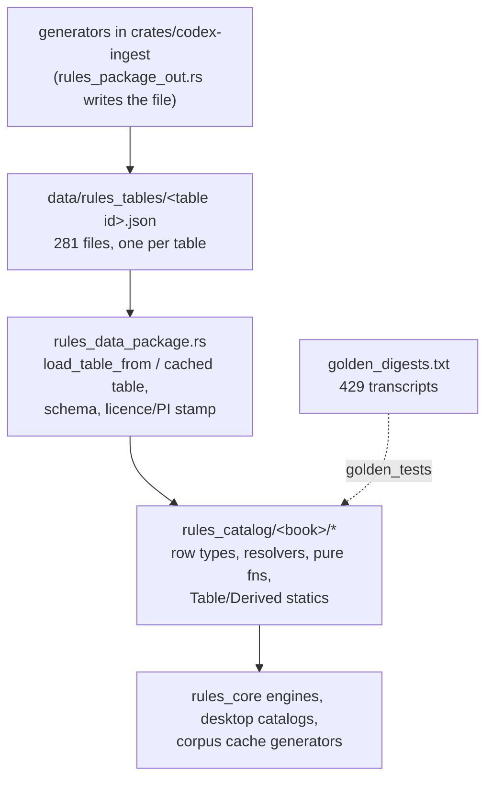

# Rules Data Tables

> Scope: the per-book Pathfinder 1e rule-data tables (class chassis, race traits, feats, spells, equipment, monster stat blocks) as a bundled JSON **data package** (`data/rules_tables/`), and the package-backed Rust catalog (`src/rules_core/rules_catalog/`) every importer reads them through.
> Last verified: **2026-10-07 against `tranche/17` (`b99c3d4b02`)**. The compiled `rules_tables` Rust module no longer exists: its rows live only in the package and its row types, resolvers and pure functions live in the catalog. Figures below carry the command that re-derives them.
> Maintenance: updated at SD closure — see [README.md](./README.md) §Maintenance contract

## Purpose

The Pathfinder 1e chassis tables, the data the PF1 core math computes with, are **data files**, not
compiled Rust. `data/rules_tables/<table id>.json` holds one file per table
(`find data/rules_tables -name '*.json' | wc -l` → `281`; rows summed by Python over every file's
`rows` array → `24583`; `du -sb data/rules_tables` → `13291625` bytes). The catalog
(`src/rules_core/rules_catalog/mod.rs`) loads a table from its file on first read, caches it for
the life of the process, and hands the caller the same `&'static [Row]` shape the compiled tables gave. A
table that cannot be loaded stops the caller with the package error; there is no compiled copy to fall
back to.

This is a separate surface from [corpus-ingest.md](./corpus-ingest.md)'s `data/sheet_rules/` package
(every corpus rules record as a renderable sheet line, generated by the converter) and from
`data/corpus/` (the Shape-B JSON corpus cache, below). The package here is the **chassis**: the tables
the engine's compute functions read by key.

## The package: format, loader, schema, licence stamp

`src/rules_core/rules_data_package.rs` owns all four.

- **Format.** One file per table at `data/rules_tables/<table id>.json`; the id is a `/`-joined path
  (`crb/class_tables/...`, `acg/archetype_tables/archetype_swap_tables`). Each file is
  `{ "format": "codex.rules_tables/1", "table": <id>, "licence": {...}, "rows": [...] }`, rows
  serialised by the row type's own serde derives.
- **Loader.** `load_table_from::<T>` reads one file; `table::<T>` is the process-wide cached form.
  A launcher binds the root with `use_repo_root` (the desktop does so at startup from its resolved
  repo or packaged resource root); otherwise `CODEX_REPO_ROOT`, otherwise the compile-time checkout.
- **Schema.** `schemas/rules/rules_tables.schema.json`, generated from `package_schema` and checked by
  the `rules-schema-check` stage of `scripts/verify.sh`.
- **Licence / PI stamp.** Every string of every row goes through `pi_screening::classify_field`. A file is
  stamped `PI` (a hit that is not redacted), `PI-REDACTED` (carries the redaction marker) or `OGL`:
  Python over every file's `licence.license` → `OGL 251`, `PI-REDACTED 21`, `PI 9` (of 281). The
  `pi-sweep` stage (`src/bin/pi_sweep_rules_tables.rs`) re-screens every file, fails on a stale stamp
  and reconciles hits against `docs/governance/pi-sweep-baseline.tsv`.
- **Citation text.** A row that cites its corpus source names the file stem and line and carries no
  list-file extension; `tests/rules_tables_citation_burn_down.rs` fails a package row that carries one.
- **Normalising.** `cargo run --locked -p codex --bin rules_tables_package -- --check` exits 1 when a file
  is missing, does not load as its row type, is not in canonical form (layout or stale stamp) or is not
  owned by a table; `--write` rewrites every file and deletes unowned ones. `scripts/verify.sh` does not
  run this binary (`grep -c rules_tables_package scripts/verify.sh` → `0`); the same checks run in its
  `root-lib` stage as `rules_data_package::tests::every_table_round_trips_through_the_loader` (loads as its
  row type, canonical form, stamp) and `table_ids_are_unique_and_the_package_holds_exactly_them` (missing or
  unowned file). The table list
  (`TABLE_IDS`) is closed by two source-scanning tests in `rules_data_package.rs`
  (`every_file_level_table_is_a_package_table_and_no_array_is_compiled`,
  `every_collection_function_is_a_table_or_a_named_view`): a new table that is not registered fails.
- **Bundling.** `apps/desktop/src-tauri/tauri.conf.json` maps `data/rules_tables/` into the app's
  resources; the `tauri-resources-tracked` stage fails when a bundled root is not tracked.

## The catalog (`src/rules_core/rules_catalog/`)

The catalog mirrors the layout the compiled module had, so a call site names the same
`<book>::<item>` path under `rules_catalog`. What a module holds:

- **Row and id types** (`FeatTableEntry`, `ClassId`, `MonsterStatBlock`, ...) and **pure functions**
  (formulas over their arguments). A type is code, not data, so it stays in Rust.
- **Tables**: a `Table` / `Derived` static or a function over the package's rows. No table row is compiled
  into the catalog.
- **Lookups and views** over tables (`class_chassis_resolve`, `spell_resolve`, `feat_tables`,
  `monster_resolve`, ...), reading the tables above.
- **Golden digests.** `golden_tests.rs` re-derives a transcript of every table, view and lookup and requires
  the sha256 recorded in `golden_digests.txt` (`awk 'END{print NR}'` over that file → `429`). The digests
  were written from the compiled module on the last tree that had it, so a hand-edited package row or a
  moved type that serialises differently fails naming its id. `control_tests.rs` holds the structure
  controls.

The citation that explanation text prints for these tables (Elowen's base attack bonus line reads "...then
the crb class table's Wizard row") is the string `COMPILED_MODULE_CITATION` (`"rules_tables"`) in
`rules_catalog/mod.rs`. It is a pinned part of the Pathfinder render, not a path.


```mermaid
flowchart TD
    pkg["data/rules_tables/&lt;table id&gt;.json\n281 files, one per table"]
    loader["rules_data_package.rs\nload_table_from / cached table,\nschema, licence/PI stamp"]
    cat["rules_catalog/&lt;book&gt;/*\nrow types, resolvers, pure fns,\nTable/Derived statics"]
    users["rules_core engines, desktop catalogs,\ncorpus cache generators"]
    gen["generators in crates/codex-ingest\n(rules_package_out.rs writes the file)"]
    gold["golden_digests.txt\n429 transcripts"]

    gen --> pkg
    pkg --> loader --> cat --> users
    gold -.->|golden_tests| cat
```

### Who writes the package

Four Rust binaries in `crates/codex-ingest/src/bin/` write package tables through
`crates/codex-ingest/src/rules_package_out.rs` (`gen_feat_gap_tables`, `gen_equipment_gap_tables`,
`ingest_class_spell_levels_arg --emit`, `ingest_spells`); two Python transcribers
(`scripts/transcribe_monster_tables.py`, `scripts/transcribe_companion_tables.py`) write through
`scripts/rules_tables_package_out.py`. Both writers render the file in the package's own canonical form and stamp
(`rules_data_package::render_table`), and every generator screens all of its tables for PI before it writes any.
Re-running a generator against the pinned oracle leaves `git status --porcelain data/rules_tables` empty; that
is the control that a generator and the shipped package agree.
`crates/codex-ingest/tests/table_generators_write_the_data_package.rs` fails if a generator
writes under the removed compiled directory. Other tables (class chassis, Bestiary 1 stat blocks, spell lists
beyond `ingest_spells`' books) have no generator: the package file is their source, edited by hand and checked
by `rules_tables_package --check` and the golden digests.

## Book layout inside the catalog and the package

`ls data/rules_tables | wc -l` → `43` entries: per-book directories plus the cross-book groups
`class_spell_levels`, `companion_chassis`, `equipment_gap_tables`, `feat_gap_tables`, `monster_chassis` and
`simple_kind_tables`. The catalog mirrors those directories as modules and adds the single-file
cross-book modules `archetype_swap.rs` and `feats_all.rs` (its `class_spell_levels.rs`, `companion_chassis.rs`, `equipment_gap_tables.rs`, `feat_gap_tables.rs`,
`monster_chassis.rs` and `simple_kind_tables.rs` are single files over the package directories of the same names).

- **`crb/`** (Core Rulebook): `class_tables` (per-class BAB/save chassis, `ClassId`, `good_saves_for`),
  `race_tables` (`RaceId`), `feats` + `feat_data/`, `spell_list` and per-class spell lists, `equipment_tables` +
  `equipment_data/`, `weapon_tables`, `class_skill_tables`, `companion_data`, and `json_cache` (the Shape-B
  corpus-cache record types, see "JSON corpus cache" below).
- **`apg/`, `acg/`**: one chassis file per class, spell lists, feats, equipment, with the book's own
  `class_chassis_resolve`.
- **`beastiary1/`**: the 46 hand-modelled Bestiary 1 stat blocks (`monster_resolve`).
- **`pathfinder_unchained/`**: class chassis, barbarian/monk/rogue features, feats, equipment, monster data.
- **The other books** (**32** directories; **10** of them hold exactly one record family, the rest two or
  more): spell lists, monster data, companions, feats, equipment and archetypes, under their own `RuleSetId`.
  Ultimate Combat also carries three class chassis (`class_gunslinger`, `class_ninja`, `class_samurai`) and
  Ultimate Psionics nine per-class feature tables. Re-derive (43 entries less the five books above and the six
  cross-book groups; families = first-level subdirectories):
  `for d in $(ls data/rules_tables | awk '!/^(crb|apg|acg|beastiary1|pathfinder_unchained|class_spell_levels|companion_chassis|equipment_gap_tables|feat_gap_tables|monster_chassis|simple_kind_tables)$/'); do find data/rules_tables/$d -mindepth 1 -maxdepth 1 -type d | awk 'END{print NR}'; done | awk '{n++; if($1==1) o++} END{print n, o}'`
  → `32 10` (a Python `os.listdir` twin gives the same).
- **Cross-book tables.** `feats_all.rs` joins every book's feat table (`BookFeatTable { rule_set, entries }`);
  `class_spell_levels.rs` dispatches the hub's `class:<id>` vocabulary to the per-class spell tables;
  `monster_chassis.rs` holds `MONSTER_BOOKS`, the registry every monster-bearing book joins.

A book's presence here states which record families the engine has ingested from it, not that the book is
done: several directories carry exactly one family.

## Spell level is per class, not per record

Each book's spell list carries one record per spell with a single `level` field. **That field is the
MINIMUM spell level across every class named in the record's corpus `CLASSES:` tag, so it is nobody's level
in particular.** `Hideous Laughter` is `CLASSES:Bard=1|Sorcerer,Wizard=2`, so its record level is 1, the
Bard's.

The per-class answers live in sibling tables, one per class that names itself in the corpus
(`crb/{bard,cleric,druid,paladin,ranger,sorcerer,wizard}_spell_list`, `apg/{alchemist,inquisitor,witch}_spell_list`,
`acg/{bloodrager,shaman,hunter}_spell_list`; each is a package table under the same id). They are generated by
splitting the `CLASSES:` token on `|`, `rpartition`-ing each group on `=`, stripping any trailing `[...]`
optional-rule gate and membership-testing the comma-separated name list, never a `<Class>=` substring grep,
which misses every record where the class sits mid-group.

`rules_catalog/class_spell_levels.rs` is the single dispatch from `class:<id>` to those tables. It answers for
17 class ids: the 13 above plus four corpus-stated `SPELLLIST:` redirects (Arcanist to Wizard, Investigator to
Alchemist, Skald to Bard, Warpriest to Cleric). **Every other class answers unknown rather than falling back
to the record level**; `class_has_spell_list` reports the gap. Substituting the record's minimum would
reintroduce exactly the wrong number this seam removes (see
[no-stub-mvp-doctrine](../governance/no-stub-mvp-doctrine.md)).

## `RuleSetId` and per-book resolution

`RuleSetId` (`src/rules_core/rules_catalog/mod.rs`) has **37** variants. Re-derive:

```bash
python3 -c "import re; src=open('src/rules_core/rules_catalog/mod.rs').read(); src=re.sub(r'//.*','',src); body=re.search(r'pub enum RuleSetId \{(.*?)\n\}', src, re.S).group(1); print(len(re.findall(r'^\s*([A-Za-z0-9_]+)\s*,', body, re.M)))"
```

(`re.S` and `.group(1)` scope the match to the enum body and `re.M` makes `^` match per line; dropping either
flag returns 0.) Every arm's own doc comment is the authority on what that book compiles. Registering a
rule set is not the same as ingesting a whole book:

- `Isc`, `Isi`, `B5`, `B6` and `B2` carry a `companion` family and nothing else; `B5` and `B6` carry **zero**
  monsters whatever their "bestiary" names say.
- `Isr` carries a disk-served `race_trait` family and nothing else.
- `Ce` is **not a book**: it is a PCGen packaging bundle, retained only as the feat-gap host for
  `ce_feats.lst`'s 15 rows, and must end at zero units.
- `BonusBestiary` was the first arm to carry the merged `monster` + `monster_ability` chassis; every
  monster-bearing book since joins `monster_chassis::MONSTER_BOOKS`, which the work inventory, the corpus
  cache generator, the monster catalog and the reach gate all iterate, so registering a book there is the whole
  wiring cost.

**Bestiary 1 is served by two tables, deliberately.** Its records live in `rules_catalog::beastiary1` (46
hand-modelled stat blocks with natural-attack provenance, keyed `beastiary1:monster:<slug>`) and in
`rules_catalog::bestiary` (the other rows in the ordinary chassis shape, keyed `beastiary:monster:<slug>`);
the two are disjoint and reach the player under one wire code, `B1`. The catalog test
`the_catalog_serves_every_ingested_bestiary_1_monster` in `apps/desktop/src-tauri/src/monster_catalog.rs`
pins both halves and their sum; trust it over any prose count. `data/corpus/beastiary/monster/` holds both
tables' records, told apart by field (the first table's carry `data.id`, the chassis records `data.key`), and
`gen_book_cache` sweeps only the records whose key is in its own namespace. Grounding "how many Bestiary 1
monsters does the engine hold" from either table alone reports the other half as `not-ingested`. Both tables
also carry a `MonsterStatBlock` row type of their own name (`beastiary1/mod.rs` and `monster_chassis.rs`); the
two are different types, and importing the wrong one is a silent type mismatch.

Each book's resolver takes a book-scoped ID enum plus a `RuleSetId` and returns `None` immediately when the
`RuleSetId` is not that book's: `apg::class_chassis_resolve(class_id, level, rule_set)`
(`src/rules_core/rules_catalog/apg/mod.rs`) starts with `if rule_set != RuleSetId::Apg { return None; }`.
`acg::class_chassis_resolve` and `beastiary1::monster_resolve` follow the same guard-then-dispatch shape, so
an `ApgClassId::Witch` query under `RuleSetId::Crb` is a defined, tested `None`.
`tests/sd22_apg_class_witch_resolves.rs` pins both directions, and the `tests/sd22_*_resolves.rs` family
repeats the pattern per class and monster.

## Rows carry the corpus token, never a computed number

Table rows hold what the corpus row states. Each transcribed value cites its corpus file (and line or token) in
the generator's or row's provenance, so a reviewer can re-open the corpus and check it. Where a field exists to
feed a DERIVED magnitude, it stores the corpus token **verbatim** and the arithmetic lives in an evaluator a
fixture can be run against:

- `monster_chassis::MonsterStatBlock.spell_like_abilities` carries a `save_dc_token` (`"16+CHA"`), not a DC; a
  creature's ability modifier is not a corpus-stated fact here, so resolving the DC would be fabrication.
- `companion_chassis::NaturalAttackDamageBonus` carries `BONUS:WEAPONPROF=Bite|DAMAGE|max(0,(STR/2))` as
  written; an unclamped `STR/2`, a `-(STR/2)` and every `PRE`-gated bonus are refused rather than guessed at.
- `race_creation::RaceCreationChassis.ability_adjustments_source_trait_key` applies the same discipline to
  provenance: the consumer records the KEY of the record whose magnitude it read.
- A feat record carries its `BONUS:` tokens (`effect`) and top-level `PRE` tokens (`prerequisites`) verbatim.
  Carrying a `PRE` token does not evaluate it: conflating "the token is in the table" with "the prerequisite
  is enforced" is a false-completeness claim.

Corollary: adding such a field to a shared chassis shape means re-running its generator for **every** registered
book that shape covers, because the count-pinning tests, `corpus_literal_sweep` and the derived-evaluator
fixtures all read it.

The CRB, APG and ACG feat catalogs are generated from the live corpus rather than hand-transcribed; each
generator states its category derivation rule (the `TYPE:` facet) and its excluded-record list.

## Equipment and spell content completeness

Equipment and spell field population is bounded by what the real PCGen corpus carries (weight, description,
full spell text), not by effort. The per-book counts are asserted by `tests/sd24_equipment_coverage_audit.rs`
and `tests/sd24_equipment_field_completion.rs`; read those tests rather than a count copied into prose.
Record-count coverage (rows ingested at all, independent of field population) reaches its denominator for
CRB, APG, ACG and Bestiary 1's equipment. See [status.md](./status.md) for the stub and gap ledger.

## JSON corpus cache (`data/corpus/`)

`data/corpus/` holds **39** book directories (`ls data/corpus | wc -l`) — one
per ingested book, spanning CRB through the SD-32 Inner Sea setting-book
wave. This has grown steadily since the four-book start (SD-26 Epic 3): every
new book onboarded since (SD-27 through SD-32, per
[corpus-ingest.md](./corpus-ingest.md) §"Book onboarding") gets its own
directory the first time any ingest binary writes a record for its
`RuleSetId`. Per-book file counts vary widely by book size and how much of it
is ingested — for example (`find data/corpus/<book> -name '*.json' | wc -l`,
run per book):

| Book directory | JSON files |
| --- | --- |
| `advanced_race_guide/` | 2212 |
| `pathfinder_unchained/` | 1270 |
| `bonus_bestiary/` | 35 |
| `ultimate_campaign/` | 419 |

`ultimate_campaign` **does** have a corpus cache directory (contrary to an
earlier pass of this doc, which is why the number above matters): its feat
records are cached under `data/corpus/ultimate_campaign/` like any other
onboarded book, not served only from the package's `ultimate_campaign` tables. Do
not trust a stale per-book count carried forward in prose — re-run the `find`
command above for the book you're touching.

This is populated by a broad and still-growing set of generator, enrichment
and repair binaries under `crates/codex-ingest/src/bin/` and
`crates/codex-ingest/src/pcgen_import/cache_gen/` (`grep -rl 'data/corpus'
crates/codex-ingest/src/bin/*.rs | wc -l` currently matches dozens of files,
though most of those are enrichment/repair passes over already-written
records rather than first writers of a book directory). The three
oldest, still-present per-book dump generators are enumerated below for
their historical shape; treat the full current set as "whatever's under
`crates/codex-ingest/src/bin/` and `crates/codex-ingest/src/pcgen_import/cache_gen/`
that constructs a `CorpusRecordV1`/`CorpusRecord`/`CacheRecord`" rather than a
fixed number — `grep -rln 'CorpusRecordV1 {\|CorpusRecord {\|CacheRecord {'
crates/codex-ingest/src/ src/` finds every current construction site.

- `crates/codex-ingest/src/pcgen_import/cache_gen/acg.rs`, `apg.rs`, `beastiary1.rs` — the three
  original per-book dump generators (SD-26 Epic 3 shape). **Moved twice since**: the whole
  `cache_gen/` tree started under `src/rules_core/`, moved to a (since also relocated) src/pcgen_import/ in SD-35
  `AT-35-E6-002` (it reads PCGen tokens, so it is converter-side code — see
  [overview.md](./overview.md) §"The converter/live boundary"), then moved again, with the rest of
  `pcgen_import`, to `crates/codex-ingest/src/pcgen_import/` in SD-36 Epic A (operator ruling D1 —
  see [corpus-ingest.md](./corpus-ingest.md) §"The crate wall"). The code itself is unchanged both
  times; only its address is.
- `crates/codex-ingest/src/bin/gen_core_rulebook_cache.rs` — CRB.
- `crates/codex-ingest/src/bin/gen_book_cache.rs` — Pathfinder Unchained + Advanced Race
  Guide (both books share one binary).
- `crates/codex-ingest/src/bin/ingest_races.rs`, `crates/codex-ingest/src/bin/ingest_pu_classes.rs`,
  `crates/codex-ingest/src/bin/ingest_apg_race_traits.rs` (renamed from `ingest_race_traits_arg.rs` by the
  function-based naming sweep, `8b6dd7511`) — the three later single-purpose
  ingest binaries added as ARG/PU widened.

(`crates/codex-ingest/src/bin/gen_cache_apg.rs`, `gen_cache_acg.rs`, `gen_cache_beastiary.rs` are
older, still-present binaries retained for historical/manual regeneration;
`gen_core_rulebook_cache.rs` is the one wired into the current
regeneration path for CRB. All of these binaries moved from `src/bin/` to
`crates/codex-ingest/src/bin/` in the same SD-36 Epic A crate move.)

This is a **dump of the already-landed table state (the package, read through `rules_catalog`), not a
second data source.** Each generator walks the catalog's tables
and writes each record out in the Shape-B on-disk form defined by
`src/rules_core/rules_catalog/crb/json_cache.rs`
(`Population`/`Completeness`/`source` discriminated unions, per the bundle's
`decisions.md §7`/`§11`). The generators never re-parse raw PCGen `.lst` to
*compute* a value — the value is already known to be correct from the package; the only reason any generator touches the LST corpus at all is to
recover a real, checkable line-number citation for a value it already has.
Every book's cache is round-trip-tested by
`tests/sd26_cache_core_rulebook.rs` (root crate) and
`crates/codex-ingest/tests/sd26_cache_apg.rs`,
`crates/codex-ingest/tests/sd26_cache_acg.rs`, and
`crates/codex-ingest/tests/sd26_cache_beastiary.rs` (moved with the converter in SD-36 Epic A).
Out-of-scope books
carry no corpus cache; they are registered instead as `book_stub` future-state
placeholders under `data/stubs/` (see [status.md](./status.md)).

### PI screening (converged into the corpus writers)

Every corpus-writing binary calls
`rules_core::pi_screening::classify_field`/`classify_optional_field`
(`src/rules_core/pi_screening.rs`), a single shared blacklist
(`PI_BLACKLIST_TERMS`, asserted at exactly 61 by its own unit test,
`src/rules_core/pi_screening.rs`'s
`term_list_matches_the_reference_copy_plus_the_documented_acg_addition` —
re-derive with `python3 -c "import re; src=open('src/rules_core/pi_screening.rs').read(); src=re.sub(r'//.*','',src); body=re.search(r'PI_BLACKLIST_TERMS: &\[&str\] = &\[(.*?)\n\];', src, re.S).group(1); print(len(re.findall(r'\"([^\"]*)\"', body)))"`
— comments must be stripped first, since several of them quote a term name
inline and a naive `"` count over-counts). The array grows by per-book
amendment, so re-run the command above rather than trusting this number.
Before this convergence (SD-27, at which point there were eight
corpus-writing binaries total), the `license`/`pi_field`/`pi_marker` fields
existed on disk **only** because a one-off post-hoc script
(`scripts/apg_license_retrofit.py`) had stamped them after the fact —
any full regeneration silently destroyed that stamping, including
un-redacting a record that had been marked `PI-REDACTED`. Five of those
eight writers lacked the screening call before this cycle (`fix(ge): screen
license/pi_field/pi_marker inline in the 5 unscreened writers`,
commit `f7c709a9`); a differential regeneration round-trip test now guards
against the same class of loss:
`tests/pi_screening_regeneration_round_trip.rs`. Every corpus-writing binary
added since (`grep -rln 'pi_screening::classify_field\|classify_optional_field'
crates/codex-ingest/src/ | awk 'END{print NR}'` — 27 on 2026-10-07 at `tranche/17`, a Python
`os.walk` substring twin agreeing; it was 25 at the prior pass — since the same call is also
used by later audit/repair binaries, not just corpus writers) has picked up
the call from the start rather than needing a retrofit.

### `wiring_class` (GE-01 taxonomy)

Every corpus record now carries a `wiring_class` — one of `Display`,
`Static`, `Derived`, `Computed` (a strict lattice, highest-bar-wins) or
`Ambiguous` — determined by `crates/codex-ingest/src/pcgen_import/wiring_class.rs` (moved out of
`src/rules_core/` by SD-35 `AT-35-E6-002`, then out of the (since also relocated) src/pcgen_import/ entirely by SD-36 Epic
A's crate move), the single
production port of the GE-01 reference determinator
(`docs/release/GE-01-legacy-corpus-and-conversion-matrix/artifacts/wiring-class-determination.md`).
Determination reads a unit's full **token closure**: its base `.lst` row
plus every `.MOD` row that targets it, not the base row alone. Both the
now-retired `v06_work_inventory`'s classifier (SD-36 D3) and every
`cache_gen`/ingest generator called this one module, so the two surfaces
could not drift against each other. The result was emitted per-unit into
`docs/work-inventory.json` (now a frozen snapshot), stamped onto
every `data/corpus/**/*.json` record, and surfaced live on the operator
dashboard as `by_wiring_class`. `Trap::WiringClassMismatch`
(`crates/codex-ingest/src/pcgen_import/corpus_traps.rs`) fails when a record's stored flag
disagrees with what the determinator recomputes from source, so a stale
stamp cannot silently survive a partial regeneration.

### `raw_tokens`/`raw_bonus_chains`: a deliberate asymmetry

Unlike every other field above, equipment's `raw_tokens`/`raw_bonus_chains`
are **not** produced by any of the eight typed writers — they are populated
by a dedicated post-hoc tool, `crates/codex-ingest/src/bin/enrich_equipment_raw_tokens.rs`, run
as a separate step after regeneration. This is intentional, not an
oversight: an earlier attempt to converge these fields into the typed
writers dropped data (`weight` vs `weight_lbs`, `equip_type`, `plus`) because
the typed struct shape couldn't losslessly round-trip the raw token stream.
`docs/governance/book-ingestion-playbook.md` DoD item 9 makes re-running the
enricher mandatory after any equipment regeneration — skipping it silently
reverts `raw_tokens`/`raw_bonus_chains` to stale or empty values on disk
even though every other field looks freshly regenerated.

## Engine state dumps (`src/bin/v06_*_state_dump.rs`)

Two operator/ops binaries report the tables' real state as JSON on stdout.
Neither is an app runtime surface — nothing in the shipped app calls them —
and both exist for the same reason: the operator's status dashboard used to
derive its numbers by regex-scraping hand-written English prose, and prose
goes stale the moment somebody forgets to edit it.

- **`v06_class_state_dump`** — sweeps all **31** CRB/APG/ACG/Pathfinder Unchained classes (11 + 6 + 10
  + 4 — the binary imports `ClassId`, `ApgClassId`, `AcgClassId`, and `PuClassId`,
  `src/bin/v06_class_state_dump.rs:61-65`) across levels 1-20 through the real
  `build_pilot_headless_receipt` pipeline, reporting per class whether every level reaches
  `HeadlessReceiptStatus::Computed` and, when it does not, the claim-blocking diagnostics that name
  the remaining gap. Run fresh (2026-09-20): `class_count=31`, `computed_count=31`,
  `blocked_count=0` — every swept class reaches `Computed` at every level 1-20, zero blocked levels.
  **It does not sweep** Ultimate Combat's 3 classes, the 27 "untabled" exotic/NPC base classes, or any
  prestige class — those are covered by inline tests in `combat.rs` and
  `untabled_base_class_features.rs` instead (see [rules-engine.md](./rules-engine.md) §"Entry points"
  and §"Multiclass base-chassis dispatch" for that coverage and for multiclass's own real scope).
  The corpus-wide instrument is the class census (`cargo run --locked -j 8 --bin class_census --
  --json <path>`, SD-36 Epic F0): 137 ids, 63 of 63 non-prestige `Computed` at every level, 68 of 74
  prestige ids `Computed` in a carrier mix (2026-09-26; [status.md](./status.md) carries the table).
  This dump's 31 is its own scope, not a class total.
- **`v06_content_state_dump`** — reports per-book ingested record counts
  (counted from `ClassId::ALL`, `SPELL_LIST`, `equipment_tables()`,
  `MonsterId::ALL`, `all_feat_tables()` — see `feats_all.rs` above for that
  function, not a separate `feat_tables()`), the full Bestiary 1 monster
  roster resolved through the real `beastiary1::monster_resolve` entry point
  with each monster's JSON-cache presence, every CRB race's real computed
  state, and a behavioural probe of which of the feats in `all_feat_tables()`
  (the deduplicated key set across all 23 books' hand-authored entries plus
  their corpus-gap rows — run the binary for the live count, since it
  changes as gap rows are onboarded) genuinely
  change a computed number when added to a character. The feat probe is an
  explicit lower bound: a feat whose effect needs a context this engine does
  not model (an opponent, an ally, a combat action) cannot show up as a delta
  and is reported unwired.

  **Scope caveat, stated plainly so this binary is never mistaken for a corpus-coverage instrument:**
  its own `use` block only ever imported `ClassId`/`SPELL_LIST`/`equipment_tables()`/`MonsterId::ALL`/
  `all_feat_tables()` (`src/bin/v06_content_state_dump.rs:14-27,36-58`), a fixed set that covers 13 of
  the corpus's 38 tracked books (`core_rulebook`, `advanced_players_guide`, `advanced_class_guide`,
  `bestiary_1`, `advanced_race_guide`, `pathfinder_unchained`, `ultimate_campaign`,
  `ultimate_intrigue`, `ultimate_equipment`, `ultimate_wilderness`, `ultimate_combat`,
  `ultimate_magic`, `ultimate_psionics`) and never grew past it. Its only historical caller
  (`scripts/observer/pf1e_dashboard_producer.py`) is itself retired, and nothing in
  `scripts/verify.sh` runs this binary (`grep -n content_state_dump scripts/verify.sh` → no hits) — it
  is retired ops tooling kept in the tree, not a measure of the engine's real content breadth. The
  desktop catalogs' own test-pinned counts (equipment 8,119, spells 2,481, feats 2,227 across 23
  books, race traits across 6 books — see [desktop-app.md](./desktop-app.md)'s command inventory) are
  the wider, current, correct source for "how much content does the engine actually serve."

The counting discipline is shared with
`apps/desktop/src-tauri/src/corpus_ingest_diagnostic.rs`, which reports the
same per-book counts to the app itself; the binary exists separately because
that module sits behind a `#[tauri::command]` in a different cargo workspace.

## Adding a new book

Adding book `<xyz>` to the package-backed catalog means:

1. Add a `RuleSetId::<Xyz>` variant in `src/rules_core/rules_catalog/mod.rs` and declare
   `pub mod <xyz>;` there, with `src/rules_core/rules_catalog/<xyz>/mod.rs` holding the book-local row types,
   the book-scoped ID enum (`<Xyz>ClassId` or equivalent) and the `RuleSetId`-guarded resolver functions
   (guard-then-dispatch, as in `apg/mod.rs`). Books do not share row structs across directories even when the
   shape is identical.
2. Give each table a `Table` / `Derived` static (or a function over `rows::<T>(id)`) naming its package id,
   and register the id in `TABLE_IDS` in `src/rules_core/rules_data_package.rs`; the two source-scanning tests
   there fail for an unregistered table.
3. Produce the rows with a generator that writes through `rules_package_out` (or the package's `render_table`),
   citing the exact corpus file and line or token for each value, then run
   `cargo run --locked -p codex --bin rules_tables_package -- --write` and `-- --check`. The new file carries its
   licence/PI stamp and lands under `data/rules_tables/<xyz>/`.
4. Add a `tests/sd<NN>_<xyz>_<unit>_resolves.rs` acceptance test per unit, asserting `Some` under the new
   `RuleSetId` and `None` under every existing one (the pattern of `tests/sd22_apg_class_witch_resolves.rs`),
   and regenerate the golden digests for any new table or lookup. Where the source claim is checkable against the
   real corpus, gate an extra test on `PCGEN_CORPUS_ROOT` with the graceful-skip pattern in
   [corpus-ingest.md](./corpus-ingest.md).

See [corpus-ingest.md](./corpus-ingest.md) for how corpus text is parsed upstream of the generators, and
[rules-engine.md](./rules-engine.md) for how the catalog's resolvers are consumed by rules-core compute.

## How to extend

- **Registering a narrow, single-family book** (feats-only, spells-only, monster-only or companion-only, the
  common case): follow "Adding a new book" above, skipping the steps that do not apply; a feats-only book needs
  only `feat_gap_tables`' shape (see the `Mythic` and `InnerSeaTaverns` arms for examples with no dedicated
  directory).
- **Widening a monster-bearing book onto the shared chassis**: register it in
  `rules_catalog::monster_chassis::MONSTER_BOOKS` rather than rebuilding the chassis; every consumer iterates
  that one registry.
- **Widening a spell-bearing class**: add the class to `class_spell_levels.rs`'s dispatch and its own
  `<book>/<class>_spell_list` table, never by trusting a spell record's own `level` field (the minimum across
  every class the record names).
- **Adding a feat catalog entry**: the CRB, APG and ACG feat catalogs are generated from the live corpus;
  extend the category derivation rule and the book's excluded-record list in the generator, then regenerate
  and re-run `rules_tables_package --check`, rather than hand-adding a row.
- **A field that needs a DERIVED magnitude**: store the corpus token verbatim and evaluate it in a
  fixture-checked function (see "Rows carry the corpus token" above), and re-run the generator for every
  registered book the shape covers.
- **A table edit** is a package-file edit followed by `rules_tables_package --check`; a changed row that is not
  a deliberate re-baseline fails the golden digest of its table.

## Pitfalls

- **A book's presence in `RuleSetId` does not mean the book is "done."** Several arms compile exactly
  one record family and nothing else — `Isc`/`Isi`/`B5`/`B6`/`B2` compile `companion` only, `Isr`/`Ce`
  compile a disk-served `race_trait` only. A subtree check or count that assumes a registered book is
  fully ingested will report a false completeness. `B5` and `B6` are the sharpest case: both are named
  "Bestiary" and both carry **zero** monsters.
- **Chassis fields carry the corpus token, never a computed number, and that rule is easy to violate
  by accident** the first time a new engineer transcribes a formula-shaped field: it feels natural to
  "just compute it," but doing so fabricates a value nothing in the corpus states as a constant, and
  breaks the fixture-checkable evaluator downstream consumers rely on. Grep the sibling chassis fields
  in the same book before writing a new one.
- **`Ce` (Core Essentials) is not a book** — it is a PCGen packaging bundle, retained only as a
  feat-gap host for 15 rows. Do not add new content under it on the assumption it names a real
  sourcebook; its own doc comment states it "must end at zero units" for anything else.
- **Bestiary 1's records live in two disjoint tables under one wire code** (`rules_catalog::beastiary1`
  and `rules_catalog::bestiary`, both keyed under book id `B1`). Forgetting the union when grounding a
  "how many Bestiary 1 monsters does the engine hold" claim silently reports half the population as
  `not-ingested` — see "Bestiary 1 is served by two tables, deliberately" above.
- **A feat's `PRE`-family prerequisite tokens are carried, not evaluated**, by the mere act of
  ingesting them into a catalog. Carrying a feat's `PRE` tokens lifts `feat_prereqs/general.rs`'s
  blocker (the tokens now exist to check against) but does not itself perform the check — conflating
  "the token is in the table" with "the prerequisite is enforced" is a common false-completeness
  claim in this area.
