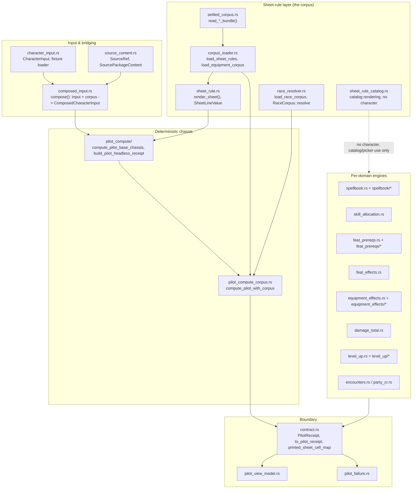
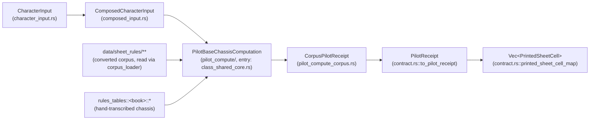
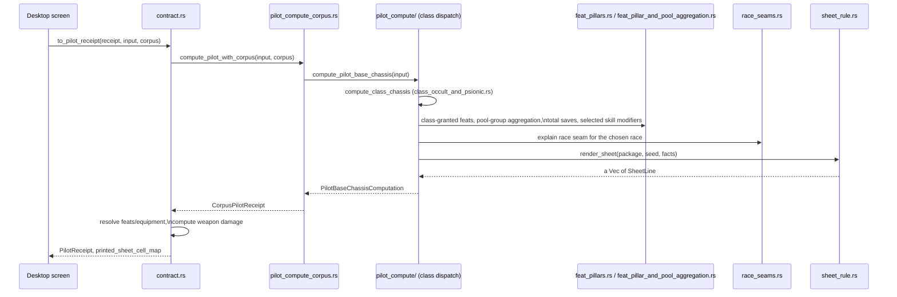
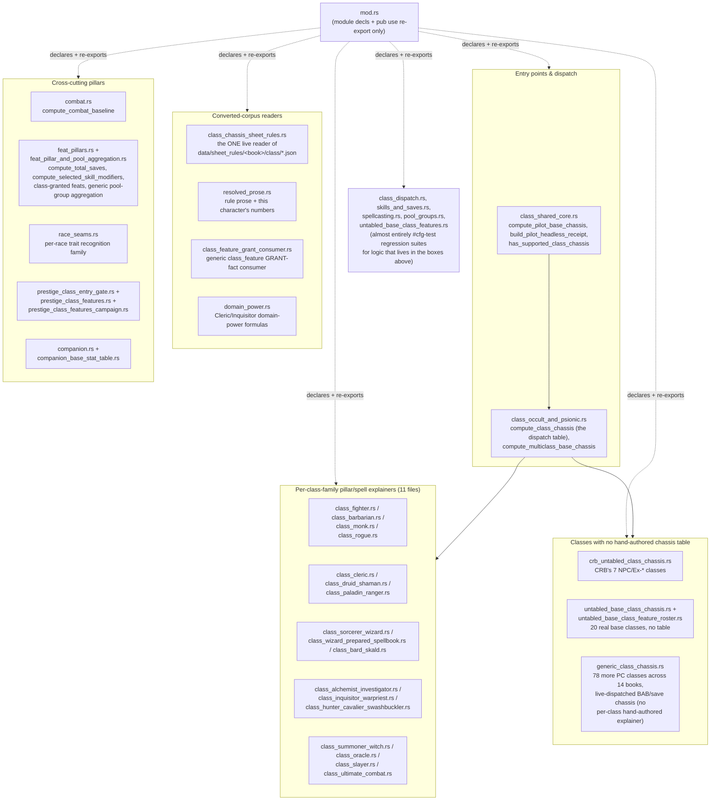

# Rules engine

> Scope: The headless PF1 rules-computation spine — from chosen character input through the deterministic chassis engine to the boundary contract the GUI consumes.
> Last verified: **2026-09-20 against `tranche/16` (`424e93e93c`)** for the SD-36 Epic C1 split of the
> old, single `pilot_compute.rs` file into `src/rules_core/pilot_compute/` (41 submodules; `mod.rs`
> itself is now a 297-line module-declaration/re-export shim, not the compute body), for
> `src/support/paths.rs` (Epic C1.3's shared path-helper module), and for the module map, compute
> pipeline, and sequence diagrams below. Also verified: no module under `src/rules_core/` reads a
> PCGen token (`python3 scripts/pcgen_residue_gate.py --check --closure` → `live_files=0
> live_hits=0`), and the old `oracle_validation` and `pcgen_import` trees under `src/` have both
> moved to `crates/codex-ingest/` (SD-36 Epic A / operator ruling D1) — nothing under
> `src/rules_core/` names either any more; see [corpus-ingest.md](./corpus-ingest.md) §"The crate
> wall." Prior pass 2026-09-15 against tranche/15 (SD-35 closure) verified the sheet-rule layer
> (§"The sheet rule" below) and the fail-honest/per-domain-engine catalog sections, which are
> otherwise unchanged by the C1 split — it moved code, not behavior. **This pass** (capability-claims
> audit, same day) re-checked every class/level/multiclass capability and limitation claim in this
> file against a fresh `v06_class_state_dump` run and the dispatch code, and corrected the multiclass
> section's stale "Fighter+Wizard only" claim — `table_class_id` recognizes all 11 CRB classes today
> (see §"Multiclass base-chassis dispatch" below).
> Maintenance: updated at SD closure — see [README.md](./README.md) §Maintenance contract

This document orients a contributor entering `src/rules_core/` cold. It describes the compute spine
end-to-end, the fail-honest convention every engine in this tree follows, and a catalog of the
per-domain engines with their entry points. It does not restate per-line rules content — read the
cited modules for that.

## Module map

`src/rules_core/` has no subdirectories of its own besides `pilot_compute/`, `equipment_effects/`,
`feat_prereqs/`, `level_up/`, `spellbook/` and `rules_tables/` (the last is
[rules-data-tables.md](./rules-data-tables.md)'s territory). Every other file listed here is a flat
sibling module. Grouped by role, not alphabetically — this is what
`ls src/rules_core/*.rs src/rules_core/*/` groups into by reading each module's own doc comment:



*This module never simulates a rule it cannot settle to a number, dice, or the rule's own words —
see §"The sheet rule" below; the diagram's `sheetrule` box is what carries that discipline into the
spine.*

`src/support/paths.rs` (new, Epic C1.3) is the shared filesystem-path helper module every one of the
boxes above that touches `data/corpus/` calls into: `repo_root()`, `corpus_root()` (`data/corpus`
joined onto `repo_root()`), and `find_json_files()` (a sorted, deterministic recursive `*.json`
walk that skips `_parity/` directories and `LICENSE.json` files — sorted specifically because
`corpus_loader`/`race_resolver` push records into a `Vec` in walk order, and a resolver breaks a
key collision by position, so filesystem read-order non-determinism would make record precedence
non-deterministic across checkouts). Before this module existed, `repo_root()` was defined
byte-identically in six places and `find_json_files()` in three more; this is a pure move (no
behavior change), consolidating them into one file every caller now imports from.

## The compute spine, end to end

The engine has six layers (five hand-transcribed chassis layers, plus the sheet-rule layer added by
SD-35 — see §"The sheet rule" below). Data flows strictly downward; nothing later in the list
mutates or re-derives what an earlier layer already produced.



*One character request, six inputs converge on `compute_pilot_base_chassis`, one receipt exits
through `printed_sheet_cell_map` — nothing downstream of `contract.rs` reaches into any earlier
layer directly.*



*The class dispatch call fans out into the per-domain pillar/seam functions cataloged below before
the sheet-rule layer renders the corpus's own words; every arrow is a real function call, not an
illustrative simplification — see the cited modules for the exact call sites.*

### 1. `src/rules_core/character_input.rs` — chosen picks only

`crate::rules_core::character_input::CharacterInput` is the wire shape for what a player chose:
race, class levels, ability scores, selected feats, skill-rank allocations, equipment selections,
spell selections, and free-form selected choices (feat/trait/domain-style picks keyed by
`choice_set_id`/`selection_id`). The module's own header comment states the boundary precisely: it
"deliberately does not compute derived values, evaluate effects, or interpret formulas."
`ChosenCharacterState` (the payload of `CharacterInput.chosen`) is a pure data record — no method on
it computes anything.

The module also owns a plain-text fixture grammar and its loader, `load_character_input_fixture`,
which parses `key=value` lines (`race_id=`, `class_level=`, `ability=`, `feat=`, `skill=`,
`equipment=`, `choice=`, `spell=`, `provenance=`) into a `CharacterInput`. Every malformed or
missing-required-field line produces a `CharacterInputDiagnostic` with `claim_blocking: true` (see
`diagnostic()` at the bottom of the file); the loader either returns a fully valid `CharacterInput`
with zero diagnostics, or `None` with the diagnostics that explain why. This is the first appearance
of the fail-honest pattern described below — it starts at the input boundary, not just inside the
compute engine.

`EquipmentSelection.active_state: ActiveState` (`EquippedActive` / `Absent` / `SelectedInactive`) is
the field every downstream equipment-aware computation filters on; a selection that is merely
recorded but not active contributes nothing (see `src/rules_core/contract.rs`'s `to_pilot_receipt`, which filters
on exactly this field before computing equipment effects).

### 2. `src/rules_core/composed_input.rs` — bridging chosen input with corpus content

`compose(character_input: CharacterInput, corpus: SourcePackageContent) -> ComposedInputLoadResult`
in `src/rules_core/composed_input.rs` is the consumer-side bridge between what the player chose
(`CharacterInput`) and what the loaded PCGen corpus actually contains (`SourcePackageContent`,
defined in `src/rules_core/source_content.rs`). It performs exactly three checks, no rule evaluation:

1. `character_input.source_package_id` must equal `corpus.package_id` — a mismatch is an `Error`-severity `ComposedInputDiagnostic` and `compose` returns `composed: None`.
2. An empty corpus is not fatal — it produces a `Warning`-severity `EmptyCorpus` diagnostic, but `composed` is still populated (the deterministic-pilot path can still evaluate with seeded defaults).
3. Otherwise composition succeeds with zero diagnostics.

The module's doc comment explains why this lives in `rules_core` rather than `pcgen_import`: it is a
"transport-and-shape carrier" — no parsing, no include resolution, no IR conversion. Those live
upstream in `pcgen_import` (`include_resolver`, `ir_converter`, `lst_parser::*`), which
`src/rules_core/composed_input.rs` calls only through its convenience loader `load_composed_core_rulebook` (PCC
entry file → resolved include graph → per-kind LST parse → owned parser containers) and
`project_corpus_from_owned` (owned containers → a borrowed `SourcePackageContent`). The borrow
discipline is deliberate: the corpus's records borrow from the owned parser containers, so the
caller must keep `owned_inputs` alive as long as it uses the corpus — the module comment states this
was chosen over `unsafe` lifetime transmutes to keep the borrow auditable.

`ComposedCharacterInput<'a>` (the `Some` case of `composed`) is the actual input the rest of the
spine consumes: it owns the `CharacterInput` and holds the borrowed `SourcePackageContent`.

### 3. `src/rules_core/pilot_compute/` — the deterministic chassis engine

**A naming note, once, for a newcomer:** "pilot" here is a historical module name (`pilot_compute`,
`PilotReceipt`, `build_pilot_headless_receipt`, …) inherited from this engine's original prototype
phase, well before all 31 fully-tabled classes reached `Computed`. It is not a scope statement and
does not mean this subsystem is a limited trial today — it is the live compute spine for every
class/level combination named in the [class/level coverage catalog](#3-src_rules_corepilot_compute---the-deterministic-chassis-engine)
below.

*Restructured 2026-09-20, SD-36 Epic C1.* Before Epic C1, `pilot_compute.rs` was one ~88,800-line
file (test code included) — by far the largest in `rules_core`. Epic C1 split it into a directory of
41 submodules plus a 297-line `mod.rs`, **as a pure code-move**: every submodule opens with `use
super::*;` (a child module sees a parent's private items in Rust, so nothing needed to be made more
visible than it already was) and `mod.rs` blanket-`pub use`s each submodule back into its own
namespace, so every pre-existing `pilot_compute::<name>` call site outside this directory — the
desktop crate, `crates/codex-ingest`, this file's own inline tests — keeps resolving unqualified,
name for name, with zero call sites edited and zero behavior changed. `mod.rs` itself is now just
module declarations and re-exports (no compute logic); read `class_shared_core.rs` first instead —
it holds the actual entry points.

**The split is by rough file-position windows from the original monolith, not by rewritten
semantics** — several submodule names describe what was locally *around* the code better than what
the code *is*. `compute_class_chassis` and `compute_multiclass_base_chassis` (the class dispatch
table itself) both landed in `class_occult_and_psionic.rs`, not `class_dispatch.rs`; `compute_total_saves`
and `compute_selected_skill_modifiers` both landed in `feat_pillar_and_pool_aggregation.rs`, not
`skills_and_saves.rs`. `class_dispatch.rs`, `skills_and_saves.rs`, `spellcasting.rs`, and
`pool_groups.rs` are, today, almost entirely `#[cfg(test)]` regression suites for logic implemented
in a *different* submodule — a residue of the monolith's own test placement, preserved as-is by the
move. **Treat a submodule's name as a hint, not ground truth; `grep -rn 'pub(super) fn <name>'
src/rules_core/pilot_compute/` is.**

**Entry points** (`src/rules_core/pilot_compute/class_shared_core.rs`, `mod.rs`'s re-export makes
both reachable as `pilot_compute::<name>` from outside this directory exactly as before the split):

- `compute_pilot_base_chassis(input: &CharacterInput) -> PilotBaseChassisComputation` — the core computation. Produces ability modifiers, base attack bonus, base saves, the deterministic combat baseline (melee attack bonus / armor class for a fixed Longsword + Chain Shirt + Dodge posture), total saves, selected skill modifiers, and a long tail of per-race and per-class explanation/diagnostic records, all accumulated into one `PilotBaseChassisComputation`.
- `build_pilot_headless_receipt(input: &CharacterInput) -> PilotHeadlessReceipt` — a thin wrapper that runs `compute_pilot_base_chassis` and derives one `HeadlessReceiptStatus` (`Computed` or `Blocked`) from whether any diagnostic in the result is claim-blocking. This is the receipt shape `src/rules_core/pilot_view_model.rs` and `src/rules_core/pilot_failure.rs` consume (see below); it predates and is narrower than the SD-20 boundary contract's `PilotReceipt` (§5).
- `has_supported_class_chassis(input: &CharacterInput) -> bool` (`class_shared_core.rs`) — the single shared gate every other per-domain pillar (`compute_total_saves`, `compute_combat_baseline`, `compute_selected_skill_modifiers`) checks independently of `compute_class_chassis`. It is a long `||` chain of per-class-family `is_supported_<x>_single_class`/`supported_<x>_level` predicates — the module's own comments record more than one wave where a class's chassis dispatched correctly through `compute_class_chassis` but its receipt still never reached `Computed`, because this shared gate had no matching arm. **Adding chassis dispatch for a class and not adding it here is the single most common way a "done" class stays claim-blocked.**

**The pilot_compute/ submodule map** (grouped by role; `pub`/`pub(crate)` visibility per `mod.rs`'s
own declarations — everything else is a private submodule reachable only via the blanket re-export):



**Internal organization**, in the order `compute_pilot_base_chassis` calls its helpers (unchanged by
the split — this is the orchestrator's own call sequence, not a file boundary):

| Stage | Representative functions (real location) | What it grounds |
|---|---|---|
| Ability modifiers | `compute_ability_modifiers` (`class_shared_core.rs`) | `floor(score/2) - 5` per ability |
| Class chassis dispatch | `compute_class_chassis`, `compute_multiclass_base_chassis`, `is_supported_multiclass_mix` (`class_occult_and_psionic.rs`); `has_supported_class_chassis` (`class_shared_core.rs`) | Base attack bonus + base saves for the classes/levels the dispatch table recognizes; unsupported input pushes `class_chassis.unsupported` |
| Combat baseline | `compute_combat_baseline`, `unmet_combat_posture_conditions` (`combat.rs`) | Baseline melee attack bonus / armor class for the exact deterministic Longsword/Chain Shirt/Dodge/no-shield posture |
| Total saves | `compute_total_saves` (`feat_pillar_and_pool_aggregation.rs`) | Base save + relevant ability modifier, gated on `has_supported_class_chassis` |
| Selected skill modifiers | `compute_selected_skill_modifiers` (`feat_pillar_and_pool_aggregation.rs`), `unmet_selected_skill_posture_conditions` | Climb/Intimidate/Swim only, gated on an exact rank-1 + Chain Shirt posture |
| Per-class feature/spell explainers | `explain_fighter_class_features` (`class_fighter.rs`), `explain_hybrid_level1_chassis`/`explain_paladin_level1_chassis_and_spell_burden_separation`/`explain_ranger_level1_chassis_and_class_feature_separation` (`class_paladin_ranger.rs`), `explain_barbarian_level1_chassis` (`class_barbarian.rs`), `explain_monk_level1_chassis` (`class_monk.rs`), `explain_rogue_level1_chassis` (`class_rogue.rs`), `explain_sorcerer_level1_spell_baseline` (`class_sorcerer_wizard.rs`), `explain_wizard_level1_prepared_spell_baseline` (`class_wizard_prepared_spellbook.rs`), `explain_cleric_level1_spell_baseline` (`class_cleric.rs`), `explain_druid_level1_spell_baseline` (`class_druid_shaman.rs`), `explain_bard_level1_spell_baseline` (`class_bard_skald.rs`) | Per-class, per-level named feature and spell-baseline explanation/diagnostic records — one function family per one of the 11 core classes, now spread across the per-class-family submodules above |
| Per-race seams | `explain_human_pilot_race_seam`, `explain_human_trait_bundle`, `explain_dwarf_race_seam`, `explain_elf_race_seam`, `explain_gnome_race_seam`, `explain_half_elf_race_seam`, `explain_half_orc_race_seam`, `explain_halfling_race_seam` (all `race_seams.rs`) | Per-race trait recognition and (where grounded) numeric contribution — one function family per one of the 7 core races (Human's is split across two functions) |
| Cross-cutting validation | `validate_fighter_feat_choice_legality` | Input-legality checks that produce diagnostics without computing a value |

Each per-class/per-race function follows the same internal shape: a `supported_<class>_level(input)
-> Option<u8>` gate function decides whether the input's class/level combination is inside the
function's proven range, and the `explain_*`/`compute_*` function either produces real explanation
records or pushes a named claim-blocking diagnostic and stops. This gate-then-explain pairing recurs
at every level band; the functions' own doc comments record which named sub-features are grounded
versus still claim-blocked as of the current level ceiling for that class.

**Multiclass base-chassis dispatch (SD-24 Epic 5; widened v0.6 alpha swarm task 4).**
`compute_multiclass_base_chassis` (`class_occult_and_psionic.rs`) fires whenever
`input.chosen.class_levels.len() >= 2`; `is_supported_multiclass_mix` gates it to combinations where
every class level is individually supported. **This is no longer Fighter+Wizard-only**: the gate's
own doc comment records the widening — `multiclass_class_level_supported` bottoms out in
`table_class_id` (`class_shared_core.rs`), which today recognizes all **11 Core Rulebook classes**
(Fighter, Wizard, Rogue, Ranger, Paladin, Sorcerer, Cleric, Druid, Barbarian, Bard, Monk — Monk was
the last one added, closing a gap where its chassis table existed but no string mapping reached it).
So: any length-2+ mix of these 11 classes, at any per-class level within each class's own 20-level
ceiling, gets real base-chassis (BAB/save) stacking. Base attack bonus and saves stack per PF1's
canonical additive multiclass rule: each class's own fractional BAB/save progression is summed
*before* flooring once for the total, reading the fractional classification from `class_tables.rs`'s
own `good_saves_for(ClassId) -> Option<(bool, bool, bool)>` (`multiclass_good_saves`) rather than a
second, independently-maintained copy. `fighter_level_in_mix`/`wizard_level_in_mix`-shaped helpers
resolve each class's own sub-level from the mix so that class's per-level named-feature/spell-baseline
explainers (e.g. `explain_wizard_level1_prepared_spell_baseline`) keep firing once a second class
joins, instead of silently going quiet the moment the build stops being single-class.
`tests/sd21_multiclass_fighter_wizard_chassis_computes.rs` and the `sd24_multiclass_*` deterministic
suite prove the mechanism concretely for Fighter+Wizard (originally to total level 10; the gate itself
carries no total-level cap beyond each class's own 20-level ceiling) — no test file exercises every
other pair of the 11 individually, so treat "the gate accepts them" (proven directly from
`table_class_id`'s own source, not a test) and "a given untested pair reaches `Computed` end-to-end"
as two different claims. This grounds the base-chassis/explanation layer only — it does not by itself
get any multiclass build to `HeadlessReceiptStatus::Computed` end-to-end (spellbook and other
per-domain diagnostics can still block). A multiclass mix containing an APG/ACG/Unchained/Ultimate
Combat/exotic-untabled class is a real, separate limitation: `table_class_id` never registers those
classes, so `compute_class_chassis`'s own APG/ACG/Unchained/UC dispatch arms each carry a comment
stating that class-containing multiclass mix "cannot reach this path at all" — see
`class_occult_and_psionic.rs`'s dispatch arms for each family's own comment.

**Core output types** (`PilotBaseChassisComputation`, `ComputationExplanation`, `ComputationDiagnostic`,
`HeadlessReceiptStatus` and `PilotHeadlessReceipt` are all defined in `class_shared_core.rs` beside
the two entry points that build them):

- `PilotBaseChassisComputation` — the aggregate struct `compute_pilot_base_chassis` returns: `ability_modifiers`, `base_attack_bonus`, `base_saves`, `baseline_melee_attack_bonus`, `baseline_armor_class`, `total_saves`, `selected_skill_modifiers`, `explanations`, `diagnostics`.
- `ComputationExplanation { id, value, detail }` — one machine-checkable record per computed value.
- `ComputationDiagnostic { id, message, claim_blocking }` — see the fail-honest pattern below.
- `HeadlessReceiptStatus` (`Computed` | `Blocked`) and `PilotHeadlessReceipt { case_id, source_package_id, status, computation }` — the receipt `build_pilot_headless_receipt` returns.

`mod.rs`'s own module doc comment is explicit about what the engine as a whole is not: "not a full
rules engine" — it names the specific PF1 mechanics still out of scope (feat/item/condition-based
save modifiers, weapon damage, active Power Attack math, initiative, general skill modifiers beyond
the three selected skills, armor-check penalties beyond the deterministic posture, feat
prerequisites, oracle parity). Several of those gaps are exactly what the later per-domain engines in
the [per-domain engine catalog](#per-domain-engine-catalog) below exist to fill, without editing this
directory.

### 3a. `crates/codex-ingest/src/pcgen_import/formula_interpreter.rs` and `pilot_compute/domain_power.rs` — the formula
interpreter (SD-31 wave 25/25b, a real architecture change, not an extension of the pattern above)

**Superseded as a live-runtime path by the sheet rule (§ below), current as history.** This
subsection and 3b/3c describe SD-31's wave 25-27 formula-interpreter work as it happened, when the
interpreter was still a candidate for a *runtime* consumer inside `pilot_compute`. SD-35's sheet-rule
converter (§"The sheet rule" below) closed that path instead: the interpreter now runs once, at
ingest time, inside the converter, and the live side reads only its already-resolved JSON output.
`formula_interpreter.rs`/`formula_reproduction_harness.rs`/`formula_interpreter_corpus_wide.rs` also
physically moved off the live side in SD-36 Epic A — they live at
`crates/codex-ingest/src/pcgen_import/` today, not under `src/` at all (see
[corpus-ingest.md](./corpus-ingest.md) §"The crate wall"). `pilot_compute/domain_power.rs` is the one
exception that stayed live: it is a narrow, hand-written arithmetic evaluator over a fixed catalog of
five domain-power formulas, not a general PCGen-formula reader, so it carries no live PCGen token
outside its own `#[cfg(test)]` module (which the residue gate's `cfg_test_ranges`/`code_only` masking
does not count — see [Pitfalls](#pitfalls) below).

**Every function cataloged in the table above is a hand-written, bespoke Rust closed-form
expression, independently derived and verified against the corpus per feature.** That was a pinned
rule (`SD-27 decisions.md §24.1`, "No formula interpreter") until `OPERATOR-RULINGS-2026-08-21.md`
§20 overturned it for this package (folded into `docs/release/SD-31-corpus-closure-grind/decisions.md`
as Decision 20): PCGen's own `BONUS:`/`DEFINE:` LST tokens already encode this arithmetic, and
hand-transcribing it into a bespoke Rust function per feature was the direct cause of this program's
per-unit throughput cost. Two new submodules, both under `src/rules_core/pilot_compute/`, exist as of
wave 25b:

- **`formula_reproduction_harness.rs`** — mechanically enumerates the existing hand-modelled
  functions from source (>=166, a re-derivable floor, not a hand-maintained list) and defines the
  `FormulaEvaluator` trait every interpreter implementation must satisfy. A small set of its
  enumerated cases (21 as of wave 25b) exercise a real evaluator against them for agreement.
- **`formula_interpreter.rs`** (`PcgenFormulaEvaluator`) — a real recursive-descent parser/evaluator
  for the arithmetic grammar PCGen's own `BONUS:`/`DEFINE:` formula segments carry (integer/ability-
  modifier variables, `+ - * /`, `floor`/`ceil`/`abs`/`min`/`max`/`if`/`classlevel`), semantics
  re-derived from the pinned oracle's REAL resolution chain (`BonusObj.java` → `FormulaFactory.java`
  → `JEPFormula.java` → `VariableProcessor.java` → `pcgen/util/PJEP.java extends org.nfunk.jep.JEP`,
  function library `plugin/jepcommands/*Command.java` — see the module's own doc for the full chain
  and wave 25b integration's correction of an earlier version that cited the wrong PCGen subsystem).
- **`domain_power.rs`** — a narrower, independent arithmetic evaluator applied specifically to
  Cleric/Inquisitor domain-power formulas, extending `ground_or_block_cleric_domain_power`/
  `ground_or_block_inquisitor_domain_power`'s prior Good+Healing allowlist to War and Strength (wave
  25 salvage, merged wave 25b).

**What has NOT changed:** the ruling's own condition. *"Every interpreted value must clear
`derived_evaluator_fixture_check` ... An interpreted value with no fixture is not done."* Neither
`formula_interpreter.rs` nor `formula_reproduction_harness.rs` has a production consumer wired as of
wave 25b — both are `pub` infrastructure with zero non-test callers, banking zero corpus units. The
hand-written pattern the table above describes remains the shipping mechanism for every unit
currently `done`; the interpreter is additive capability, not (yet) a replacement for what already
ships. `domain_power.rs` IS wired (Cleric/Inquisitor War/Strength), because its own fixture gate
(`mod fixture_check_tests`, in-module, corpus-byte-transcription-checked) satisfies the ruling's
condition directly.

**Known, disclosed gaps as of wave 25b** (see `OPEN-ISSUES.md` rows 354-357 and the wave 25b receipt
for the full account): `classlevel("X")` does not verify its class-name argument against a bound
class context (silently wrong, not merely incomplete, for a genuinely cross-class formula — a
confirmed real corpus shape, `bestiary_3`'s `classlevel ("Magical Beast")/2-1`); comparisons do not
yet produce a reusable numeric value outside `if()`'s own condition slot, so boolean-to-int coercion
(`"1+(KineticistLVL>=15)"`) and `&&` (Sorcerer bloodline gates) both refuse rather than evaluate; the
`BONUS:<TAG>|<target>|` envelope, PRE-token gating, and `PREVARGTEQ`-embedded repeated-conditional
clauses are a different PCGen subsystem (`BonusObj`/`MultiTagBonusObj`) entirely out of scope.

**Also new in `pilot_compute/mod.rs` as of wave 25b**: a flat-override `race_trait` compute seam
(`explain_rougarou_flat_override_race_trait`, `explain_gillman_flat_override_race_trait`,
`explain_vanara_flat_override_race_trait`) — the first `race_trait` movement in six waves, grounding
a race's flat Speed/Vision/Natural-Weapon override (and, for Gillman/Vanara, the alternate-trait
`PREFACT`-gated replacement of that override) without a new subsystem, following the same
gate-then-explain shape the per-race seam table above already uses.

### 3b. Wave 26 — the interpreter gets its first production consumers, plus grammar widening

Wave 25b built `formula_interpreter.rs` and proved it against 22 hand-modelled functions but wired
zero consumers. Wave 26 plugged it in:

- **`class_feature_grant_consumer.rs`** now resolves a `class_feature` corpus record's `DESC:` `%N`
  placeholder through the interpreter (`resolve_pcgen_var_chain`, a fixed-point pass over the
  record's own same-record `BONUS:VAR` chain, seeded with the character's real class level) where
  the static, book-agnostic `class_feature_descriptions.rs` catalog (desktop app) has no character
  context to resolve it — that catalog was also fixed this wave to refuse serving a description whose
  `%N` it cannot fill, rather than silently dropping the number (a real, disclosed ~2,389-description
  reduction in raw served count, trading a subtly-wrong sentence for none). 12 class_feature records
  fixture-verified this wave; 1 (`core_rulebook:class_feature:rogue_trapfinding`) newly crosses the
  `derived`+`fixture-verified` → `done` bar. **Reachability caveat** (`OPEN-ISSUES.md` row 366): the
  new consumer row this module emits for Trapfinding is itself suppressed by the pre-existing
  `already_computed_slugs` guard (a hand-modelled `class_chassis.rogue.trapfinding` already occupies
  that slug) — the banked unit's `done` status rests on the `derived` wiring class's own bar
  (evaluator-fixture correctness), not on this new row reaching a live sheet. The value shown to the
  player was, and remains, correct via the pre-existing hand-modelled path.
- **`domain_power.rs`** (its own, separate, `i32`-typed evaluator — NOT `formula_interpreter`'s `f64`
  one; unification is an open question, `OPEN-ISSUES.md` row 368) widened Cleric's own domain
  dispatch to read the shared `DOMAIN_POWER_CATALOG` generically (previously Good/Healing-only even
  though War/Strength already existed and were already served to Inquisitor), and added two new
  catalog entries: Destruction ~ Destructive Smite (`max(DomainDestructionLVL/2,1)`) and Glory ~ Touch
  of Glory (bare `DomainGloryLVL`, no `max()` wrap). 0 board units bank from this — confirmed this
  cycle and pre-existing per `OPEN-ISSUES.md` row 360 — because `v06_work_inventory.rs`'s
  `class_feature_owner` cannot attribute ANY `Domain Power ~ X` corpus row to Cleric or Inquisitor at
  all, not even the already-shipped, already-computed Good/Healing powers.
- **`formula_interpreter.rs` grammar widened**: bare/parenthesised comparisons as first-class
  boolean-as-numeric values (`Expr::Cmp`), `&&`-chains of comparisons (`Expr::And`), and
  `skillinfo("TOTALRANK", ...)` (`Expr::SkillInfoTotalRank`) — all three derived from decompiling the
  pinned `org.scijava:jep:2.4.2` dependency jar's bytecode (`Comparative`/`Logical`/
  `SkillInfoCommand`), not guessed. `corpus_shape_coverage`'s refusal count fell from 431/2,671
  (16.1%) to 118/2,671 (4.4%).
- **`bonus_stack_reader.rs`** (new module) reads the real multi-token `PREVARGTEQ`-gated additive-
  stack shape (`witch_ward_bonus` and ~210–222 similar records/target-variable groups) — several
  `BONUS:VAR` tokens sharing one target, each individually gated, summed only over currently-
  qualifying addends per `PlayerCharacter.getTotalBonusTo`/`BonusManager.sumActiveBonusMap`. Zero
  consumers wired yet (out of this wave's scope). The wave-25-dispatch-named
  "`PREVARGTEQ`-embedded-inside-raw-formula-text" shape does not exist in the real corpus — a
  dispatch-premise correction (`OPEN-ISSUES.md` row 364); this module reads the shape that IS real.
- **`race_trait`**: a formula-shaped seam for Undine's 3 alternate racial traits was built this wave
  and its arithmetic/fixtures were independently verified sound by two separate reviews, but the
  accompanying board-credit change (adding `"undine"` to a coarse race-level allowlist) was found, on
  mutation, to award `done` credit to 11 sibling records with no consumer of any kind — marked GAMED
  and **NOT merged** to `tranche/11`. See `OPEN-ISSUES.md` row 365 for the full finding and two
  remediation paths a future wave can take to land the sound parts (the seam and its fixtures)
  without the gaming vector.

**Known interpreter gaps as of wave 26** (supersedes the wave-25b list above where noted):
`classlevel("X")` still does not verify its class-name argument (unchanged — still a hard
precondition on banking anything through it); `classlevel("X","APPLIEDAS=NONEPIC")`'s 2-arg form is a
real corpus shape, unverified, refuses cleanly; `var`/`count`/`mastervar`/`charbonusto`/`cl` (57
refusals) remain unimplemented; comparisons/`&&`/`skillinfo(TOTALRANK)` are no longer gaps (closed
this wave).

### 3c. Wave 27 — the interpreter's second consumer (ability modifiers), and the class-chassis census

Wave 27's dispatch reframed the program's remaining wall as "features for characters that cannot
exist" and asked how many of the 157 not-done `class` units are Monk-shaped — a chassis table
present, only the `table_class_id` dispatch mapping missing. **The census answer, as of wave 27, was
zero**: every class with a real chassis table anywhere in the codebase *at that time* (34 total,
across CRB/APG/ACG/Pathfinder Unchained/Ultimate Combat) was already dispatched. **This count is now
stale and current work has widened it far past 34, corpus-wide, not just within CRB/APG/ACG/Unchained/
UC**: `untabled_base_class_chassis::resolve` and `crb_untabled_class_chassis::resolve`
(`src/rules_core/pilot_compute/untabled_base_class_chassis.rs`, `class_shared_core.rs:3411-3413`) since
gave all 27 "untabled" base classes (20 exotic + 7 CRB NPC/Ex) a real BAB/save chassis, and
`generic_class_chassis::resolve` — dispatched from `compute_class_chassis`
(`class_occult_and_psionic.rs:997`) — independently gives a further 78 conventional PC classes across
its 14 `CLASS_FAMILY_BOOKS` a real chassis too, test-asserted by
`generic_class_records().len() == 78` (`generic_class_chassis.rs`, then named `all_seventy_eight_conventional_classes_resolve`, now `every_conventional_class_in_class_family_books_resolves` at 122 since SD-36 Epic F2a appended CRB/APG,
7/7 passing). **This "31 + 3 + 27 + 78 = 139" arithmetic is wave 27's own count, historical, and is
now known to be wrong as a distinct-class total** — it double-counts classes that appear in more than
one registry (19 of the 78 also appear in the untabled-exotic registry, 3 more in the Ultimate Combat
registry). Do not cite 139, 78, or any other total from this subsection as current — the real,
overlap-corrected corpus-wide count and the full per-family breakdown live in
[status.md](./status.md)'s "Class/level compute coverage — corpus-wide" table, the one place this
repo's class head-counts are maintained; not restated here. The wave-by-wave narrative that used to live in status.md
(including its own former "wave 27" section) was deleted outright by SD-36 Epic B — see `docs/retro/`
for the retired history.

- **`class_feature_grant_consumer.rs`'s `resolve_pcgen_var_chain` now seeds the six ability-modifier
  abbreviations** (STR/DEX/CON/INT/WIS/CHA) before its fixed-point `BONUS:VAR` pass, so a
  `class_feature` `DESC:` formula referencing a bare ability modifier (not just the character's class
  level) can resolve. Two units newly clear the `derived`+`fixture-verified` bar: Ranger ~ Master
  Hunter, Rogue ~ Master Strike — both riding on pre-existing CRB chassis dispatch, not new class
  support. **Reachability caveat, same shape as wave 26's row 366**: `already_computed_slugs`
  suppresses both new rows in production (a pre-existing hand-modelled `value:0` explanation already
  occupies each slug), so neither value newly reaches a live character sheet this wave — confirmed by
  driving `compute_pilot_base_chassis` across 165 synthetic characters and finding zero
  interpreter-resolved lines. `OPEN-ISSUES.md` row 375 names the concrete unblock
  (`pathfinder_unchained::rogue_features::master_strike_dc` already proves the pattern for the
  Unchained Rogue in the same file).
- **The flat-override `race_trait` seam grew to 5 races** (Rougarou, Gillman, Vanara, **Samsaran,
  Nagaji**), each requiring full per-record coverage of the race's reachable `computed` population
  before being added to `FLAT_OVERRIDE_RACE_TRAIT_RACES` — a direct, disclosed response to wave 26's
  Undine GAMED finding (row 365's partial-coverage shape). One real bug was caught and fixed during
  integration: Nagaji's Hypnotic Gaze is an alternate trait that replaces Serpent's Sense
  (`Nagaji_ReplaceSerpentsSense`, already registered in `race_resolver.rs`'s
  `ALTERNATE_TRAIT_REPLACE_FLAGS`), but the merged seam emitted both unconditionally — fixed by
  gating on `replaced_by_alternate_trait`, mirroring `explain_gillman_flat_override_race_trait`/
  `explain_vanara_flat_override_race_trait`. The credit mechanism itself (`is_seamed`, race-level not
  record-level) still banks all 10 Samsaran+Nagaji units regardless of this fix — see `OPEN-ISSUES.md`
  row 365/378/380 for why that coarseness was left as-is rather than patched piecemeal for one race.
- **No change to `formula_interpreter.rs`, `class_tables.rs`, or any `ClassId`-family enum this
  wave.** Both class-scoped lanes (a corpus-wide census, and a CRB-prestige-class architecture
  investigation) were comment-only diffs; zero classes were made buildable.

### 3c. SD-33 — `formula_interpreter_corpus_wide.rs` regenerates its own population census fresh, never from a frozen file

`crates/codex-ingest/src/pcgen_import/formula_interpreter_corpus_wide.rs` is the corpus-wide *coverage*
harness for `formula_interpreter.rs` above (SD-32 Gate 2, `AT-32-G2-004`) — it runs every
formula-bearing F1..F9 corpus unit through the interpreter and reports agreement/refusal, distinct
from `formula_reproduction_harness.rs`'s narrower 22-function proof set. Before SD-33 it sourced its
population from SD-32's own frozen, committed `docs/release/SD-32-compute-library-and-cause-closure/artifacts/gate-1-shape-closure/ledger.json`
— a snapshot dated 2026-08-14 that had gone stale two ways: the module's own scan logic, unchanged,
produced a different population (11,338 rows) when re-run against that same frozen file than the
file's own committed figure (4,798) recorded, because the code that could walk the full census
landed after the artifact was frozen; and the frozen ledger itself no longer matched the live corpus
(11,652 real F1..F9 units exist today per `scripts/shape_ledger.py --inventory docs/work-inventory.json`).
`fresh_census_rows` fixes both: it regenerates the Gate 1 census **at scan time**, invoking the same
`scripts/shape_ledger.py` Python classifier SD-32 used (never re-implemented in Rust — the PF1e
family-vocabulary regex rules stay single-sourced in Python) via a scratch output path, then reads
the rows back. `AT-33-E3-004` runs the corpus-wide scan with `--corpus-wide --output` pointed at
`docs/release/SD-33-computed-value-verification/artifacts/epic-3-engine-coverage/formula_interpreter.corpus-wide.json`
— the binary's own default output path is SD-32's closed `gate-2-engines/` evidence file and is
never overwritten; `--output` is always passed explicitly.

### 4. `src/rules_core/pilot_compute_corpus.rs` — the corpus-aware wrapping seam

`compute_pilot_with_corpus(input: &CharacterInput, corpus: &SourcePackageContent) ->
CorpusPilotReceipt` in `src/rules_core/pilot_compute_corpus.rs` wraps `compute_pilot_base_chassis`
with corpus-derived contributions **without modifying `src/rules_core/pilot_compute/mod.rs` itself** — the module doc
comment states this explicitly as a design constraint, so that every caller of the unwrapped chassis
function keeps working unchanged. `CorpusPilotReceipt { base: PilotBaseChassisComputation,
corpus_derived: CorpusDerivedSection }` is the result: `base` is the unchanged chassis computation,
`corpus_derived` adds two things the chassis alone cannot prove:

- `school_coverage: BTreeMap<Pf1SchoolId, SchoolCoverage>` — every entry in `input.chosen.spells_selected` that resolves against the corpus (via `spell_resolver::spell_id_resolve`) grouped by PF1 spell school, each carrying a `TableCellRef` when the corpus record can be pinned to a canonical Paizo table cell.
- `equipped_items: Vec<ResolvedEquipment>` — every equipment selection that resolves against the corpus (via `equipment_resolver::equipment_id_resolve`), carrying the resolved record's name/key and an (as of this module) `DerivedEquipmentStats::default()` placeholder — populating real per-item stats is explicitly out of scope here and is what `src/rules_core/equipment_effects.rs` (see the [per-domain engine catalog](#per-domain-engine-catalog) below) exists to do instead.

Resolution here is deliberately generic: it reads a resolved corpus record's own `school`/category
field rather than dispatching through per-school or per-category code, per the module's doc comment.
`TableCellRef { rule_set, table, row_key, column_key }` is the shared "this claim is anchored to a
specific Paizo source-book table cell, not just a corpus record's existence" proof type — it recurs
across `src/rules_core/pilot_compute_corpus.rs` and `src/rules_core/equipment_effects.rs`. (The
retired support-state matrix's `grounding_ref` field used the same pattern, SD-36 D3.)

### 5. `src/rules_core/contract.rs` — the boundary contract and the only sanctioned exit surface

`src/rules_core/contract.rs` is the GUI-facing boundary: everything the desktop app is allowed to
render comes through this module's types, never by reaching into `src/rules_core/pilot_compute/mod.rs` or any
per-domain engine directly. Its own header doc comment names it the contract's "code-level home."

- `CharacterInputPermutation` (`BrandNew` | `MidBuild` | `Multiclass`) and `classify_character_input(input: &CharacterInput) -> CharacterInputPermutation` classify an input into one of three canonical shapes the contract documents: multiclass takes precedence over mid-build, mid-build over brand-new (see the function body for the exact precedence and thresholds).
- `PilotReceipt` is the full GUI-facing receipt. It does not duplicate `PilotBaseChassisComputation`/`CorpusPilotReceipt` — it composes with them: `chassis` is the unchanged chassis computation, `corpus_derived` is the unchanged corpus-derived section, and `diagnostics` hoists the chassis's diagnostics to the receipt's top level. On top of that it adds the real per-domain engine outputs: `skills: SkillTotals`, `spellbook: SpellbookCoverage`, `feats: Vec<ResolvedFeat>`, `equipment_effects: EquipmentEffects`, `weapon_damage: Vec<WeaponDamageBreakdown>`.
- `to_pilot_receipt(receipt: &CorpusPilotReceipt, input: &CharacterInput, corpus: &SourcePackageContent) -> PilotReceipt` is the function that actually builds a `PilotReceipt`: it resolves `input.chosen.selected_feats` against `rules_tables::crb::feats::feat_tables()` (an unmatched feat string is silently skipped, never fabricated into a category), filters `equipment_selections` to `ActiveState::EquippedActive` before computing equipment effects, and reuses that same filtered `equipped` slice and its `EquipmentEffects` result when calling `damage_total::resolve_weapon_damage_breakdown` rather than recomputing either.
- `compute_level_up_preview(character: &CharacterInput, from_level: u8, to_level: u8) -> LevelUpPlan` is a thin pass-through to `level_up::compute_level_up_grants`. It is deliberately **not** a `PilotReceipt` field — the doc comment explains that Level-Up models a level *transition* (needs two extra parameters no other `PilotReceipt` consumer has), not a current-state snapshot, so it stays a standalone function alongside `PilotReceipt` instead of contaminating it.
- `PrintedSheetCell { cell_id, source_field, value: PrintedSheetCellValue }` and `printed_sheet_cell_map(receipt: &PilotReceipt) -> Vec<PrintedSheetCell>` are the literal cells a printed PF1 character sheet renders. `PrintedSheetCellValue` is either `Number(i16)` or `Blocked` — never a third "unknown" state, and never a fabricated number standing in for a blocked one. Every cell's `source_field` names the exact `PilotReceipt` field path it renders, for auditability. Not every `PilotReceipt` field becomes a cell: `printed_sheet_cell_map`'s own doc comment records, field by field, why `spells_prepared`/`spells_known`/`school_specialization` and `EquipmentEffects.spell_failure_chance` stay reachable only via `receipt.*` directly rather than being flattened into cells that don't fit `Number(i16) | Blocked` cleanly; `PilotReceipt.weapon_damage`'s own field doc comment records the same reasoning for why the full `WeaponDamageBreakdown` structures are never flattened into cells either.

## The sheet rule — the sixth layer, and the one the corpus now enters through

*New 2026-09-15 (SD-35 closure).* The five layers above are the hand-transcribed chassis spine.
Alongside them sits the surface that carries the **whole** corpus — all 49,450 units — into the
engine: `src/rules_core/sheet_rule.rs` (`pub mod sheet_rule;`, `src/rules_core/mod.rs:49`).

**The rule it implements.** Codex is a paper character-sheet generator. A rule is *done* when it
renders as a line a player could write on a sheet: **one final number**, **dice in final form**,
or **the rule's own words**. There is no third state, and there is no simulation: a term the
character does not settle stays as words. That is the shape of `SheetLineValue`, verbatim from
the code:

```rust
pub enum SheetLineValue {
    /// One final number.
    Resolved(i32),
    /// Dice in final form: `"1d8+2"`.
    Dice(String),
    /// The rule's words; nothing to compute, or a term the character does not settle yet.
    Words,
}
```

**The data it reads.** `data/sheet_rules/` — our own schema, written once at ingest by
`crates/codex-ingest/src/bin/sheet_rule_convert.rs` (see [corpus-ingest.md](./corpus-ingest.md) and
[overview.md](./overview.md) §"The converter/live boundary"). **Nothing in `src/rules_core/`
reads a PCGen token**; the engine's input is JSON in our shape. `corpus_loader::load_sheet_rules`
builds a `SheetRulePackage` from `<book>/<kind>/**/*.json` plus the per-variable contribution
tables under `_vars/`; `corpus_loader::live_sheet_rules()` is the process-wide `OnceLock` handle
the live paths use.

**The types.** `SheetRule` is one record in our schema — `value: SheetValue`, `also:
Vec<(ValueRole, SheetValue)>` for the second and third numbers on one line (uses, CL, DC),
`prose: Vec<ProseSegment>` (the rule's words with typed slots), `applies: Applies` (may *this*
character hold it: class+level, race, feat, choice, facts), `target: Option<BonusTarget>` (which
sheet total the value feeds), and `bonus_type: Option<BonusType>` with a `StackMode` for the
cross-rule fold. `Rat` is the exact rational used so a fractional progression never rounds twice.

**The entry point.** `sheet_rule::render_sheet(package, seed, facts) -> Vec<SheetLine>`
(`src/rules_core/sheet_rule.rs:1957`) resolves the held set to a fixpoint and renders each held
rule. A `SheetLine` carries `printed: String` — the value **as the player writes it** (`"+2"`,
`"15"`, `"1d8+2"`, `""` for words) — so no consumer re-derives a number to display it.

**Where it meets the spine.** `PilotReceipt`-side computation carries the result:
`sheet_lines: Vec<sheet_rule::SheetLine>` on the computation result, a field of
`PilotBaseChassisComputation` (`src/rules_core/pilot_compute/class_shared_core.rs:33`, moved there
by the Epic C1 split — the field and the `render_sheet` call that fills it both used to sit directly
in `pilot_compute/mod.rs`), filled by `render_sheet` inside `class_shared_core.rs`'s own
`compute_pilot_base_chassis` body (`class_shared_core.rs:46-50`). The desktop shell maps it to
`SheetLineDto` (`apps/desktop/src-tauri/src/character_hub.rs:634`) with `form` ∈ `number | dice |
words` — see [desktop-app.md](./desktop-app.md).

**Catalog rendering without a character.** `src/rules_core/sheet_rule_catalog.rs` renders the
same records for pickers and reference lists, where no character exists to settle a slot:
`catalog_prose`, `catalog_description`, `catalog_field_summary`, and
`prose_has_a_slot_no_character_settles` — the last is the explicit test for "this line cannot be
a number here", which is why a catalog entry shows words rather than a fabricated value.

## The corpus loaders: `source_content`, `settled_corpus`, `corpus_loader`, `race_resolver`

These four modules are `rules_core`'s own side of the converter/live boundary
([overview.md](./overview.md) §"The converter/live boundary"): they read data the converter already
produced, never a PCGen token, and every one of them treats a whole book directory going missing as
a **named, loud** fact rather than a silent empty result.

### `src/rules_core/source_content.rs` — the canonical envelope and `SourceRef`

This is the type home the ingest pipeline (now `crates/codex-ingest/src/pcgen_import/`) builds into
and every book-agnostic resolver reads back out of. Full stage-by-stage derivation lives in
[corpus-ingest.md](./corpus-ingest.md) §"Stage 6"; the two facts a `rules_core` contributor needs
directly:

- **`SourceRef { source_path: String, line: u32 }`** — the provenance anchor every record and
  diagnostic carries. `source_path` is a `String`, not a `PathBuf`, deliberately: records built by
  `rules_core`'s own live loaders (`corpus_loader`, `race_resolver`) cite a JSON file's repo-relative
  path, not an LST line, so the field is a general "where this came from" string rather than a
  filesystem-typed value. `line == 0` is the canonical placeholder for a container-level diagnostic
  with no specific line (see `IRDiagnostic::to_canonical`'s doc comment, cited in
  [corpus-ingest.md](./corpus-ingest.md)).
- **`SourcePackageContent<'a> { package_id, source_ref, records, diagnostics }`** — the corpus-rooted
  aggregate every resolver (`equipment_id_resolve`, `spell_id_resolve`, `load_sheet_rules`) is handed.
  `records_by_kind` returns a deterministically ordered (sorted by `(lst_file, line)`, ties broken by
  insertion order) filtered `Vec` — this ordering, not filesystem read order, is what makes a
  duplicate-key resolution deterministic across two checkouts of the same corpus.

### `src/rules_core/settled_corpus.rs` — the per-book settled bundle

The live loaders below do not re-derive a corpus record's meaning from its raw JSON `data` object at
run time any more (SD-35 `AT-35-E6-003-RULED` cycles 13-15, `decisions.md` §11/§19 — "no PCGen in
live code"). Instead, `crates/codex-ingest/src/bin/gen_settled_corpus.rs` converts each record **once, at authoring
time**, into a typed settled record (`CorpusEquipmentRecord`, `CorpusRaceRecord`,
`CorpusRaceTraitRecord`) and writes the whole book's bundle to
`data/corpus/<book>/_settled/<kind>.json` — a file sitting *beside* the kind directories
(`equipment/`, `race/`, `race_trait/`), not inside one, so no existing corpus walk needed a new skip
rule to avoid it. `settled_bundle_path(book_dir, kind)` and `bundle_key(kind_dir, record_path)` (the
`/`-joined, platform-independent key every bundle indexes by) are the two functions
`corpus_loader.rs`/`race_resolver.rs` call to read a bundle back with serde.

**Staleness is loud, not silent.** `gen_settled_corpus --check` regenerates every bundle in memory
and byte-compares, the same contract `sheet_rule_convert --check` uses; a corpus record present on
disk with no matching bundle entry is a named loader diagnostic, not a record that quietly vanishes.

### `src/rules_core/corpus_loader.rs` and `src/rules_core/race_resolver.rs` — the loud missing-book diagnostics

Both modules load every given book's corpus directory (`BookCorpusRoot { book_id, dir }`, a shared
input type `race_resolver` reuses rather than re-declaring) and both distinguish **two different
kinds of absence**, because conflating them once shipped a real defect: a packaged build whose
resolved corpus root had no bundled `data/corpus` at all produced "No race could be read from the
corpus" with nothing in the diagnostics naming why.

| Case | What it means | What happens |
|---|---|---|
| A whole book directory (`root.dir`) does not exist | A packaged build's resolved root has no bundled `data/corpus`, or a book was removed/renamed | **Loud**: a diagnostic naming the exact missing path is pushed (`"book directory not found: {}"`), and the loop `continue`s to the next book — one missing book never aborts the others |
| A present book simply has no `equipment/`/`race/`/`race_trait/` subdirectory | Legitimate — books are wired in incrementally, and not every book carries every content family (APG and Inner Sea Races, for example, legitimately have only one of `race`/`race_trait`) | **Silent**: `continue`s with no diagnostic — this is not an error |

`corpus_loader::load_equipment_corpus` and `race_resolver::load_race_corpus` both implement this
same two-way split (`corpus_loader.rs`'s comment cites `race_resolver`'s identical guard as its own
precedent, and vice versa — the two modules were built to mirror each other's shape exactly, per
`race_resolver.rs`'s own module doc comment). A settled-bundle read failure gets the same loud
treatment: `settled_corpus::read_equipment_bundle` returning `Err` pushes a diagnostic naming the
bundle path and the error, and that book contributes nothing rather than degrading to a
partially-populated result.

`race_resolver.rs` additionally resolves PF1's alternate-racial-trait swap rule declaratively (a
standard trait applies **iff** no selected alternate trait has set its `suppressed_by_flag` —
`decisions.md §26`), classifying every corpus trait into one of four roles
(`TraitRole::Default`/`Alternate`/`FlagGranted`/`Unclassified`, in strict precedence order) without
interpreting any `BONUS:` formula itself — it hands resolved traits' raw tokens/bonus chains back for
downstream hand-modelled functions to read, exactly as a raw-LST-parsed record would have been read
before the settled-bundle cutover. `ResolvedTraits.unmatched_selections` (a saved character's trait
selection that matched nothing) and `.inert_flags` (an alternate's swap target missing from the
loaded books) are two more named "this input is not what we expected" surfaces, distinct from a
missing book directory, that a caller can render as a real diagnostic instead of a silent drop.

## The fail-honest pattern

This is the single most important convention for anyone touching the engine, and it holds at every
layer described above, not just inside `src/rules_core/pilot_compute/mod.rs`.

**The rule**: every computed value carries an explanation record proving how it was derived; every
diagnostic carries a `claim_blocking: bool`; a computation is blocked if and only if at least one
claim-blocking diagnostic exists in its diagnostic list. The engine never fabricates a value it
cannot prove — it either computes the value for real (with an explanation record) or it withholds it
and returns an explicit blocked posture, never a zero or a guess presented as data.

**Where to see the mechanism directly**:

- `PilotBaseChassisComputation`'s numeric fields (`base_attack_bonus`, `base_saves`, `total_saves`, `baseline_melee_attack_bonus`, `baseline_armor_class`, `selected_skill_modifiers`) are computed to their real value on the supported path, or explicitly zeroed while a claim-blocking diagnostic is pushed on the unsupported path. `compute_total_saves` (`src/rules_core/pilot_compute/mod.rs`) is a clean, short example: if `!has_supported_class_chassis(input)`, it pushes `defense.total_save.unsupported` with `claim_blocking: true` and returns `BaseSaves::default()` — it does not attempt a partial computation.
- `build_pilot_headless_receipt` derives `HeadlessReceiptStatus` purely from whether `computation.diagnostics.iter().any(|d| d.claim_blocking)` — this is the status-derivation logic in one line, and it is the canonical place to see "blocked iff any claim-blocking diagnostic exists" implemented.
- `src/rules_core/contract.rs`'s `printed_sheet_cell_map` reads the same pattern one layer up: it checks specific diagnostic ids (`CLASS_CHASSIS_UNSUPPORTED_DIAGNOSTIC_ID`, `TOTAL_SAVE_UNSUPPORTED_DIAGNOSTIC_ID`, `COMBAT_BASELINE_UNSUPPORTED_DIAGNOSTIC_ID`, via the local `diagnostic_blocking` helper) to decide, cell by cell, whether to render `PrintedSheetCellValue::Blocked` instead of the chassis's zeroed number. The module doc comment is explicit that these diagnostic ids are additive/OR'd per cell, not a single blanket check — a fully-supported chassis can still have its combat-baseline cells blocked by a more specific posture failure, and vice versa.
- Not every diagnostic is claim-blocking. `src/rules_core/skill_allocation.rs`'s cross-class max-rank-cap diagnostic (`CROSS_CLASS_MAX_RANK_EXCEEDED_ID`) is always `claim_blocking: false`, because the corresponding `SkillTotal.ranks` already carries the real, legal, capped number — the diagnostic is informational, not a block. This is the pattern's other half: a diagnostic without `claim_blocking: true` is a note, not a withheld claim.
- Absence is a third, distinct state from both "computed" and "blocked": `printed_sheet_cell_map`'s doc comment spells out that a `sheet.skill.*` cell renders `Blocked` when `input.chosen.skill_allocations` never named that skill at all — `allocate_skill_ranks` only produces an entry for skills the player actually submitted, so `Blocked` there means "no computed value exists," not "a diagnostic gated this."

**Primary-failure-owner classification** (`src/rules_core/pilot_failure.rs`):
`FailureClassifier::primary_owner(&self) -> PrimaryOwner` maps a `PilotHeadlessReceipt`'s `status`
onto one of five required owners (`ModelFlaw`, `ImporterFlaw`, `EngineFlaw`, `OracleGap`, `UiGap`).
The module's own doc comment is candid about the current classifier's narrowness: `Computed` maps to
`OracleGap` (real outputs exist but no old-vs-new comparison evidence has been claimed yet) and
`Blocked` maps to `EngineFlaw` (the engine failed to compute the required outputs). The three other
owners exist in the vocabulary but are not yet reachable from the current receipt surface — the doc
comment states future work can classify them "as the receipt surface grows to carry importer, model,
and UI signals."

**View-model projection** (`src/rules_core/pilot_view_model.rs`): `PilotViewModel::from_receipt(receipt:
&PilotHeadlessReceipt) -> Self` is the adapter that turns a `PilotHeadlessReceipt` into a
UI-consumer surface. It preserves the same discipline one layer further out: `snapshot:
Option<PilotSnapshot>` is `Some` only when `status == HeadlessReceiptStatus::Computed`; on
`Blocked`, `snapshot` is `None` and the caller has only `explanations`, `diagnostics`, and the
classified `primary_owner` to work with — there is no code path that produces a `PilotSnapshot` from
a blocked receipt.

## Per-domain engine catalog

Each of the following operates independently of `src/rules_core/pilot_compute/mod.rs`'s internals; they are called
either directly by `contract.rs::to_pilot_receipt` or by each other, and none of them edits
`src/rules_core/pilot_compute/mod.rs`.

**`src/rules_core/spellbook.rs`** (Epic 2) — `compute_spellbook_coverage(input, corpus) -> SpellbookCoverage`.
Fills a gap `src/rules_core/pilot_compute_corpus.rs`'s own doc comment names explicitly: the corpus-aware seam
proves spell *reachability* only (a spell resolves against the corpus), never slot math,
prepared/known posture, or spell save DCs. `src/rules_core/spellbook.rs` computes those, dispatching per PF1 spell
school through nine submodules under `src/rules_core/spellbook/` — `src/rules_core/spellbook/abjuration.rs`,
`src/rules_core/spellbook/conjuration.rs`, `src/rules_core/spellbook/divination.rs`, `src/rules_core/spellbook/enchantment.rs`, `src/rules_core/spellbook/evocation.rs`, `src/rules_core/spellbook/illusion.rs`, `src/rules_core/spellbook/necromancy.rs`,
`src/rules_core/spellbook/transmutation.rs`, `src/rules_core/spellbook/universal.rs` — one per PF1 strict spell school, all nine landed.
`SpellbookCoverage` carries `slots_total`/`slots_used` (`BTreeMap<u8, u8>` keyed by spell level)
and `spell_save_dc` (`BTreeMap<String, u8>` keyed by class id) among other fields;
`contract.rs::printed_sheet_cell_map` emits one dynamic sheet cell per present key in each of those
three maps rather than a fixed cell set, so a non-caster naturally produces zero spellbook cells.

**`src/rules_core/skill_allocation.rs`** (Epic 4) — `allocate_skill_ranks(input: &CharacterInput) -> SkillTotals`.
Computes, for each skill the player actually allocated ranks to, whether it is a class skill,
applies the PF1 cross-class half-cap (`ceil((character level + 1) / 2)`) when it is not, and records
untrained-use modifiers (`SkillTotals.untrained_use`) for allocated-but-zero-rank skills. It
deliberately does not enumerate the full skill universe — a skill with no allocation entry at all
has no entry in `totals`, matching the fail-honest "absence, not fabrication" discipline above.

**`src/rules_core/feat_prereqs.rs`** (Epic 3) — `evaluate_feat_prerequisites(feat: &FeatKey) ->
PrerequisiteEvaluation` and `compute_feat_effects(feat: &FeatKey) -> FeatEffects`, dispatching by
`FeatCategory` across four submodules under `src/rules_core/feat_prereqs/`: `src/rules_core/feat_prereqs/general.rs`,
`src/rules_core/feat_prereqs/combat.rs`, `src/rules_core/feat_prereqs/item_creation.rs`, `src/rules_core/feat_prereqs/metamagic.rs` — one per category in
`rules_tables::crb::feats::feat_tables()` (185 CRB feat records: 50 General, 110 Combat, 8
ItemCreation, 17 Metamagic), all four categories landed. `FeatCategory` also carries `Teamwork`
and `Panache`, which only APG/ACG records use; those two dispatch arms have no landed
evaluation path (every submodule above evaluates against the CRB catalog, which by construction
holds no record of either) and say so rather than reporting a real APG/ACG feat as unrecognized.
The book-spanning catalog the desktop Feat picker serves is
`rules_tables::feats_all::all_feat_tables()` (23 books joined, 1578 hand-authored entries plus
per-book corpus-gap rows — not just CRB/APG/ACG) — see
[rules-data-tables.md](./rules-data-tables.md) §"Per-book directory pattern"'s `feats_all.rs` entry.
Ingesting those records does **not** ground their
mechanical effects: `src/rules_core/feat_effects.rs` still grounds computed effects for a small
subset of CRB feats only.

**`src/rules_core/equipment_effects.rs`** (Epic 5) + submodules + `src/rules_core/equipment_resolver.rs` + `src/rules_core/spell_resolver.rs` —
`compute_equipment_effects(equipped: &[EquipmentSelection], corpus) -> EquipmentEffects` dispatches
across category submodules under `src/rules_core/equipment_effects/`: `src/rules_core/equipment_effects/arms_armor.rs`
(AC/max-dex/spell-failure — the fields `EquipmentStatEffect` is shaped to carry),
`src/rules_core/equipment_effects/general.rs` (per-item skill-check circumstance bonuses, via
`ResolvedEquipmentEffect::skill_bonus`), `src/rules_core/equipment_effects/magic_items.rs` (per-item ability-score enhancement
bonuses, via `ResolvedEquipmentEffect::ability_bonus`), `src/rules_core/equipment_effects/equipmods.rs` (per-item weapon
to-hit/damage enhancement bonuses, via `ResolvedEquipmentEffect::weapon_enhancement_bonus`) — the original four Epic 5
categories — plus, added SD-31 wave 18 (operator ruling 2026-08-19, intelligent-item subsystem
in scope): `src/rules_core/equipment_effects/intelligent_item.rs` (a selection-scoped
Intelligence/Wisdom/Charisma/Ego/alignment contribution, via `ResolvedEquipmentEffect::intelligent_item`
— reads the CRB/Mythic Adventures `Intelligent Item ~ ...` `BONUS:VAR` chains directly; the Base
record's own `BaseCostTracker`-formula Ego contribution is honestly skipped, not fabricated; the
`Intelligent Item ~ Power/Purpose` families' own headline mechanics remain unresolved). A scoped
`WeaponEnhancementBonus::natural_attack_only` field (equipmods.rs) marks the Amulet of Mighty Fists
family's bonus as natural-attack-only; **both** live consumers — `damage_total::
resolve_weapon_enhancement_modifier` (the top-level-selection `weapon_enhancement_bonus` path) and
`equipment_effects::resolve_weapon_to_hit_bonus` (the `applied_modifiers`-attachment path the
shipped desktop app's `attach_equipment_modifier_at_root` actually uses) — check
`equipment_effects::is_natural_attack_weapon` on the specific weapon being resolved before applying
it (`OPEN-ISSUES.md` rows 309/318 — the first consumer was fixed in wave 17/18, the second leaked
until wave 18's own integration cycle closed it). Corpus identity resolution for both equipment and
spells is centralized, not duplicated per engine: `equipment_resolver::equipment_id_resolve` and
`spell_resolver::spell_id_resolve` are the sole lookup functions every corpus-aware engine
(`src/rules_core/pilot_compute_corpus.rs`, `src/rules_core/equipment_effects.rs`,
`src/rules_core/spellbook.rs`, `src/rules_core/damage_total.rs`) calls to turn a chosen
`item_id`/`spell_id` into a real corpus record plus an optional `TableCellRef`.

**SD-33 widened equipment bonus-shape coverage further, and fixed two real defects, both TDD
RED→GREEN and both re-derived against real corpus records rather than assumed:**

- **`equipmods.rs`'s `WeaponEnhancementBonus` was carrying only one `bonus: i16` field for both
  to-hit and damage**, sufficient while every observed record's chain applied the same magnitude to
  both — until `ultimate_equipment:equipment:heavy_hammer` surfaced a record with two *separately*
  scoped `BONUS:WEAPON` chains (one `TOHIT`-only, one `DAMAGE`-only, different magnitudes).
  `apply_eqmod_weapon_enhancement_bonus` (`compute_equipmods_effect`'s consumer) summed only the
  first chain it found. Fixed by splitting the struct into independent `tohit_bonus: Option<i16>` /
  `damage_bonus: Option<i16>` fields and summing each chain into its own field — a corpus-wide
  re-scan confirmed `heavy_hammer` is the only affected record.
- **`arms_armor.rs`'s `apply_eqmod_armor_class_bonus` and `general.rs`'s `apply_eqmod_var_bonus`**
  resolve a base equipment record's own `EQMOD:`-referenced modifier record's *separate* `BONUS:`
  chain and sum it into the base item's AC/VAR bonus — closing a gap where an item's `EQMOD:`
  reference (e.g. a material or enhancement modifier attached via `EQMOD:`, not `.MOD`) carried its
  own mechanical bonus that `compute_arms_armor_effect`/`compute_var_effect` never resolved at all.
- **`equipment_resolver::equipment_id_resolve` (via `corpus_loader.rs`'s `equipment_key_token`)**
  previously fell back to matching on a record's `.name` — not `.key` — whenever `raw_tokens`
  carried no literal `KEY:` entry (a keyless LST line whose identity is its own first-column name).
  `.name` diverges from the real identity whenever the record also carries an `OUTPUTNAME:` token,
  which ingestion substitutes into `name` for display (e.g. `Companion Stone (Diplomacy)`'s real key
  vs. its `[NAME]`-unsubstituted `name: "Companion Stone of [NAME]"`) — silently breaking resolution
  for every OUTPUTNAME-bearing, KEY-less record (12 of `ultimate_psionics`'s own equipment records,
  plus the templated-variant shape `Psychoactive Skin (Defender)`/`(Hero)`). Fixed: a synthetic
  `KEY` token is appended from the record's own resolved key when none exists among `raw_tokens`,
  so resolution never falls through to the display name.
- **Two previously-unresolved `BONUS:` qualifier shapes now have real resolvers**:
  `BONUS:EQMWEAPON|DAMAGESIZE|<n>` (`damage_total.rs`, ~line 226 — a weapon-die-size step carried by
  an `EQMOD:`-referenced modifier, e.g. Core Rulebook `cr_equipmods.lst`'s
  `BONUS:EQMWEAPON|DAMAGESIZE|1`) and `BONUS:EQM|WEIGHTDIV|<n>` (`equipment_effects.rs`, ~line 616 —
  a weight-divisor chain, e.g. Advanced Race Guide's Darkleaf Cloth,
  `arg_equipmods.lst`'s `BONUS:EQM|WEIGHTDIV|2`). Both were confirmed unhandled by grep
  (`grep -rn "DAMAGESIZE\|WEIGHTDIV" src/rules_core/`) before being wired.

Together with the pre-existing category set, the engine's equipment-bonus-shape coverage now spans
`VAR` / `COMBAT` (AC) / `WEAPON` / `WEAPONPROF` / `STAT` / `SAVE` / `SITUATION` / `SKILL` /
natural-attack-scoped / special-material / `EQM*`-qualified modifier chains.

The intelligent-item resolver's own DTO shape has a real desktop-facing surface —
`apps/desktop/src-tauri/src/intelligent_item_catalog.rs` (SD-31 wave 18) serves 152 intelligent-item
component records (98 core_rulebook + 71 mythic_adventures, minus 17 `VISIBLE:NO` trigger rows)
grouped by family, each mechanic transcribed with a friendly label/formula/translated prerequisite —
see [desktop-app.md](./desktop-app.md). The two surfaces are independent: the catalog reads raw
corpus equipmods directly (a static component reference), not `compute_equipment_effects`'s
resolved output (a specific character's equipped item); reconciling them into one
per-character "equipped intelligent item" view is a named, un-staffed follow-on
(`OPEN-ISSUES.md` row 318's `next_lever`, `progress.md` `SD31-W18-INTEGRATE-001`).

**`src/rules_core/damage_total.rs`** (Epic 6) — a single flat file (no per-category subdirectory), because per its
own doc comment the full damage-modifier picture is one sequential computation rather than a
per-category dispatch: `resolve_base_damage_dice`, `resolve_str_damage_modifier` (full STR mod
one-handed, 1.5x two-handed, 0.5x off-hand, read from the corpus's real `WIELD:` token),
`resolve_weapon_enhancement_modifier`, `resolve_feat_damage_effect` (bounded to feats whose `BONUS:`
token is a directly-usable constant, e.g. Weapon Specialization — explicitly excludes
PCGen-formula-over-BAB feats like Power Attack), `resolve_critical_threat_range`,
`resolve_critical_multiplier`, composed by the entry point `resolve_weapon_damage_breakdown(input,
corpus, equipment_effects, str_modifier) -> Vec<WeaponDamageBreakdown>`. One `WeaponDamageBreakdown`
per equipped item identified as a weapon; a non-weapon equipped item is silently absent from the
`Vec`, never represented with `None` fields.

**`src/rules_core/level_up.rs`** (Epic 7) + 11 per-class submodules — `compute_level_up_grants(character:
&CharacterInput, from_level: u8, to_level: u8) -> LevelUpPlan`, with one submodule per core class
under `src/rules_core/level_up/`: `src/rules_core/level_up/barbarian.rs`, `src/rules_core/level_up/bard.rs`, `src/rules_core/level_up/cleric.rs`, `src/rules_core/level_up/druid.rs`, `src/rules_core/level_up/fighter.rs`,
`src/rules_core/level_up/monk.rs`, `src/rules_core/level_up/paladin.rs`, `src/rules_core/level_up/ranger.rs`, `src/rules_core/level_up/rogue.rs`, `src/rules_core/level_up/sorcerer.rs`, `src/rules_core/level_up/wizard.rs` — all 11 landed,
closing Epic 7. `LevelUpPlan`'s `automatic_features` field composes read-only with two
already-grounded sources rather than re-deriving them:
`rules_tables::crb::class_tables::class_tables()` for class-generic BAB/save progression, and
`pilot_compute::compute_pilot_base_chassis`'s own per-class `explanations` for class-specific
pillars (e.g. Barbarian Rage, Uncanny Dodge). This is a read-only composition, not a second copy of
chassis logic. Note a live dispatch limitation surfaced by SD-25's adapter work: `compute_level_up_grants` reads a single implied class off `character.chosen.class_levels` and returns an honestly-empty `LevelUpPlan::default()` for any multiclass mix (it has no per-class-delta parameter). The desktop hub-of-hubs `RuleSystemAdapter::level_up` (see [desktop-app.md](./desktop-app.md) §"Rule-system adapter seam") deliberately takes an explicit `&[ClassLevelDelta]` slice so a multiclass level-up is *expressible* at that seam; widening the free function itself to honor that shape is still open.

**`src/rules_core/encounters.rs`** (SD-22 DM-toolkit) — `Encounter::new(party: &[CharacterSnapshot], monsters:
&[MonsterRef]) -> EncounterResult`, an associated function on the unit struct `Encounter` (named
`new` to match the criterion's literal signature, not because it constructs `Self`). Computes PF1
encounter difficulty (`Difficulty::Easy/Medium/Hard/Deadly`) from the Core Rulebook's Encounter
Design / CR Equivalencies / Experience Point Awards tables, grounded against the public PRD mirror
per the module's own doc comment; an empty `monsters` slice is a direct-rule `Easy`, not derived
from an undefined EL-vs-APL comparison.

**`src/rules_core/party_cr.rs`** (SD-22 DM-toolkit) — `party_challenge_rating(party: &[CharacterSnapshot]) -> f32`
computes Average Party Level per the Core Rulebook's "Step 1 — Determine APL" rule (sum levels /
party size, rounded, then ±1 for parties of 6+ or 3-or-fewer). Returns `f32` to match the
criterion's literal signature even though the rule always yields a whole number.

## Relationship to the data layer and tests

Most engines above read static rule tables rather than embedding rule data inline (`skill_allocation.rs`
is a documented exception — its own module doc comment explains that the table store carries no
class-skill-list table yet, so its bounded Fighter class-skill set is a cited inline constant instead);
the tables live under `src/rules_core/rules_tables/` (`crb/`, `apg/`, `acg/`, `beastiary1/` — one
directory per sourcebook), each exposing a table accessor engines reference directly — typically a
`pub fn <name>_tables() -> &'static [...]` (`rules_tables::crb::feats::feat_tables()`), but not
uniformly: `rules_tables::crb::class_tables::class_tables()` returns an owned `Vec`, and
`rules_tables::crb::spell_list::SPELL_LIST` is a plain `pub const` slice, not a function.
See [rules-data-tables.md](./rules-data-tables.md) for how those tables are structured and
sourced. The convention every per-domain engine's doc comment converges on independently — noted
explicitly in `src/rules_core/feat_prereqs.rs`, `src/rules_core/spellbook.rs`, and `src/rules_core/level_up.rs` — is a direct, fully-qualified
`use` of the specific table item, never a generic `RulesTables` indirection type (which does not
exist in this repo; several module doc comments note that the doctrine docs' illustrative signatures
assumed one and that this repo's real modules deliberately dropped it).

Tests for this spine live in the repo-root `tests/` directory (integration tests against the public
API, not `#[cfg(test)]` unit tests inside `rules_core`). Representative files actually opened for
this document:

- `tests/ge06_pilot_base_computation.rs` — proves `compute_pilot_base_chassis` against the deterministic GE-06 Human Fighter level-1 fixture (`tests/fixtures/rules_core/pf1_human_fighter_level1_ge06_deterministic_input.txt`), asserting ability modifiers and base chassis values only.
- `crates/codex-ingest/tests/sd20_tabletop_readiness_integration.rs` — the Epic 8 integration-closure test (lives in `codex-ingest`, not the root crate's `tests/`, because building its fixture corpus needs the real converter): runs the full boundary-contract pipeline (`classify_character_input` → `compute_pilot_with_corpus` → `to_pilot_receipt` → `printed_sheet_cell_map`) against a fixture and asserts every defined sheet cell is a real, non-`Blocked` number matching a golden `expected_output`.
- `tests/sd13_progression/barbarian_level6.rs` (representative of ~400 per-class/per-level widening tests; one module of the single `sd13_progression` binary since SD-35 `AT-35-E1-003` — run it with `cargo test --test sd13_progression barbarian_level6::`) — chassis assertions only; the matrix-row assertion this file used to pair them with was stripped when the support-state matrix was retired (SD-36 D3).

See [testing.md](./testing.md) for the full test-organization convention.

## Where to start if you're changing X

| If you're changing... | Start here |
|---|---|
| A new class's level-1 chassis or an existing class's level ceiling | The class's own submodule under `src/rules_core/pilot_compute/` (e.g. `class_fighter.rs`, `class_cleric.rs` — `grep -rn 'fn supported_<class>_level' src/rules_core/pilot_compute/` if unsure which file); find `supported_<class>_level` and `explain_<class>_level1_chassis` (or equivalent), add the gate condition and explanation records following the existing pattern, then check `has_supported_class_chassis` in `class_shared_core.rs` grew a matching arm too |
| A new race's trait recognition | `src/rules_core/pilot_compute/race_seams.rs`: the `explain_<race>_race_seam` function family |
| Spell slot/prepared/known math for a school | `src/rules_core/spellbook.rs` + the specific `spellbook/<school>.rs` submodule |
| Skill rank totals, cross-class penalties, untrained use | `src/rules_core/skill_allocation.rs` |
| Feat prerequisites or feat-granted effects | `src/rules_core/feat_prereqs.rs` + the category submodule under `feat_prereqs/` matching the feat's `FeatCategory`; a computed feat *effect* (not just prerequisites) goes in `src/rules_core/feat_effects.rs` |
| Equipment-derived AC/skill/ability/weapon bonuses | `src/rules_core/equipment_effects.rs` + the category submodule under `equipment_effects/` |
| Weapon damage rolls (base dice, STR, enhancement, feats, crits) | `src/rules_core/damage_total.rs` |
| What grants happen on level-up for a class | `src/rules_core/level_up.rs` + the per-class submodule under `level_up/` |
| Encounter difficulty or party CR | `src/rules_core/encounters.rs` / `src/rules_core/party_cr.rs` |
| What the GUI is allowed to render, or a new sheet cell | `src/rules_core/contract.rs`: `PilotReceipt`, `to_pilot_receipt`, `printed_sheet_cell_map` |
| Corpus resolution for a chosen item/spell id | `src/rules_core/equipment_resolver.rs` / `src/rules_core/spell_resolver.rs` |
| A whole book's worth of corpus content, or why a book reads empty | `src/rules_core/corpus_loader.rs` / `src/rules_core/race_resolver.rs` (§"The corpus loaders" above) — check the diagnostics before assuming a resolver bug |
| An animal companion's or familiar's computed stat block (AC, HP, saves, attacks — the PLAYER-side pet, ground live) | `src/rules_core/pilot_compute/companion.rs` (`ground_*_companion_stat_block`) + `src/rules_core/pilot_compute/companion_base_stat_table.rs`; natural armor is one of the bonuses these compute — `grep -rli 'natural.armor' src/rules_core/pilot_compute/*.rs` finds every contributor |
| A monster catalog stat block (Bestiary 1 and other book-side monsters, served READ-ONLY, never computed) | `src/rules_core/rules_tables/beastiary1/` (46 hand-modelled) and `src/rules_core/rules_tables/monster_chassis.rs` (the other 284 rows, `MONSTER_BOOKS` registry) via `apps/desktop/src-tauri/src/monster_catalog.rs` — see [rules-data-tables.md](./rules-data-tables.md) §"One book is served by two tables, deliberately." **AC, HP and saves are deliberately not served here**: they are not corpus tokens (PCGen computes them at runtime from `MONSTERCLASS:`/ability scores, not a literal row), and an empty AC column would be exactly the placeholder `docs/governance/no-stub-mvp-doctrine.md` forbids — see `monster_catalog.rs`'s own module doc for the full reasoning. Two same-named `struct MonsterStatBlock` types exist (`beastiary1/mod.rs` and `monster_chassis.rs`) — they are not the same type. |
| Whether something should count as claim-blocked | Re-read "The fail-honest pattern" above before writing a diagnostic |

## How to add X: three worked examples

### Add a class feature (gate-then-explain)

1. Find the class's submodule under `src/rules_core/pilot_compute/` — `grep -rln 'fn explain_<class>' src/rules_core/pilot_compute/` if the class already has any grounded content, otherwise pick the submodule the class's *family* lives in (barbarian-shaped classes are in `class_barbarian.rs`, spontaneous-caster-shaped classes near `class_sorcerer_wizard.rs`, etc. — see the [pilot_compute/ submodule map](#3-src_rules_corepilot_compute---the-deterministic-chassis-engine) above; when genuinely unsure, `class_shared_core.rs`'s `has_supported_class_chassis` names every class with any supported chassis today).
2. Write (or extend) `supported_<class>_level(input: &CharacterInput) -> Option<u8>` — the gate. It returns the class's own level from `input.chosen.class_levels` only when that class/level combination is inside the range this function proves, `None` otherwise.
3. Write `explain_<class>_level<N>_<feature>(input, out: &mut PilotBaseChassisComputation)` (or extend the class's existing per-level explainer) following an existing sibling's shape exactly: on the gated path, push a real `ComputationExplanation` with a stable `id` naming the feature (e.g. `"class_feature.rogue.trapfinding"`); on the ungated path, push a `ComputationDiagnostic { claim_blocking: true, .. }` naming exactly what is still unsupported — never a partial or fabricated value.
4. Wire the new function into `compute_pilot_base_chassis`'s call sequence (`class_shared_core.rs`) in the same relative position as its sibling per-class calls.
5. If this is the class's *first* grounded chassis content, add its predicate to `has_supported_class_chassis` (`class_shared_core.rs`) — skipping this step is the most common way a class's receipt stays `Blocked` despite real, correct explanation records (see §3's own note on this).
6. Write the test first (TDD is non-negotiable, `AGENTS.md` rule 1): a `tests/sd<NN>_<class>_<feature>.rs` integration test, or a widening row in the `sd13_progression` binary (`tests/sd13_progression/<class>_level<N>.rs`) if this is a per-level-ceiling widening — see [testing.md](./testing.md).

### Add a feat effect

1. `src/rules_core/feat_prereqs.rs` + its category submodule (`feat_prereqs/general.rs`, `combat.rs`, `item_creation.rs`, or `metamagic.rs`, matching the feat's `FeatCategory` in `rules_tables::crb::feats::feat_tables()`) is where *prerequisite evaluation* lives — start here only if the feat isn't reachable at all yet.
2. A feat's computed **mechanical effect** (not just whether it's legal to take) is a distinct, smaller surface: `src/rules_core/feat_effects.rs`, which grounds a bounded subset of CRB feats today. Add the feat's effect function there, following an existing entry's shape — it composes with `damage_total.rs`/`equipment_effects.rs` rather than duplicating either.
3. A feat a class grants *automatically* (never appears in `selected_feats` because the player never picks it) is a third, separate case: `src/rules_core/pilot_compute/feat_pillars.rs`'s `class_granted_feats`.
4. Prove it with a fixture-backed test under `tests/`, following the fail-honest pattern: an untriggered feat's absence is `None`/no explanation, never a zeroed placeholder.

### Add a race seam

1. `src/rules_core/pilot_compute/race_seams.rs` is the one file — every core race's `explain_<race>_race_seam` function, the flat-override race-trait seams (`explain_<race>_flat_override_race_trait`), and the formula-shaped ones (`explain_undine_formula_race_trait`) all live here.
2. Decide the shape first, because it determines which existing sibling to copy: a flat, level-independent numeric override (Speed/Vision/a natural weapon) is the flat-override shape; a value that depends on evaluating a real corpus formula is the formula shape (`domain_power.rs`-style narrow evaluator, not the general interpreter — see §3a); anything else is the plain `explain_<race>_race_seam` shape.
3. If the race trait is genuinely a corpus-wide, book-agnostic seam (not one of the 7 CRB races' hand-modelled functions), check `race_ids_with_a_magnitude_consumer` first — a race only belongs on that list once it has a *real* magnitude consumer, not just a registration (SD-31 wave 26's Undine finding, cited in §3b above, is the cautionary tale: a coarse race-level allowlist entry awarded credit to 11 records with no consumer at all).
4. Wire it through `race_resolver::load_race_corpus`/`RaceCorpus::resolve` if the seam needs to read the corpus's own alternate-trait swap graph (§"The corpus loaders" above) rather than a hand-authored constant.
5. Test both directions: the trait applies under its base race, and resolves to `None`/absent under every other race — mirroring `rules-data-tables.md`'s guard-then-dispatch acceptance-test convention.

## How to extend

- **A new per-domain engine** (a whole new mechanical surface, not a widening of an existing one): give it its own flat file under `src/rules_core/` (mirroring `damage_total.rs`'s "one sequential computation, no subdirectory" shape) or its own subdirectory with category submodules (mirroring `equipment_effects/`, `feat_prereqs/`, `level_up/`, `spellbook/`) if the domain naturally splits by category. Wire it into `contract.rs::to_pilot_receipt` as a new `PilotReceipt` field, following the fail-honest pattern from the first line of code. Add it to the [per-domain engine catalog](#per-domain-engine-catalog) and the "Where to start" table above in the same PR.
- **A new pilot_compute/ submodule**: only split `pilot_compute/` further when a submodule has grown large enough to be its own review unit — follow the Epic C1 shape exactly (`use super::*;` at the top, re-exported via `mod.rs`'s blanket `pub use`), and update this doc's submodule map and Pitfalls note if the split changes which file a commonly-searched function lives in.
- **A new claim-blocking diagnostic**: re-read "The fail-honest pattern" first. Every diagnostic needs a stable `id`, a human-readable `message` naming exactly what's missing, and an honest `claim_blocking` value — `true` only when no real value exists yet, `false` when a real (possibly capped/adjusted) value was already computed and the diagnostic is informational.
- **A new sheet-rule consumer**: never write a second formula evaluator against `data/sheet_rules/` — `sheet_rule::render_sheet` is the one entry point, and a new consumer reads its `Vec<SheetLine>` output, not the underlying `SheetRule` records directly, unless it's `sheet_rule_catalog.rs`'s catalog-rendering (no-character) case.

## Pitfalls

- **A `pilot_compute/` submodule's filename does not reliably predict its content.** The Epic C1
  split moved code by rough file-position windows from the original ~88,800-line monolith, not by
  rewritten semantics. `compute_class_chassis` lives in `class_occult_and_psionic.rs`;
  `compute_total_saves` lives in `feat_pillar_and_pool_aggregation.rs`; `class_dispatch.rs`,
  `skills_and_saves.rs`, `spellcasting.rs`, and `pool_groups.rs` are almost entirely `#[cfg(test)]`
  regression suites for logic that lives elsewhere. Grep for the function, don't guess from the
  filename.
- **Adding chassis dispatch for a class without adding it to `has_supported_class_chassis`
  (`class_shared_core.rs`) is a real, recurring defect class, not a hypothetical one.** SD-31 wave 20
  (Ultimate Combat's three classes) and SD-34 wave 33 (27 untabled classes) both shipped correct,
  dispatching chassis code whose receipts still never reached `Computed`, because `compute_total_saves`,
  `compute_combat_baseline`, and `compute_selected_skill_modifiers` each check this shared gate
  independently of `compute_class_chassis` itself.
- **A `#[cfg(test)]` region does not trip the PCGen residue gate, and new production code must not
  rely on that to justify a shortcut.** `scripts/pcgen_residue_gate.py`'s `cfg_test_ranges`/`code_only`
  masking excludes comments and test-only code from the live-hit count (operator rulings B14/B15) —
  this is why `pilot_compute/domain_power.rs` can carry a literal `"PREVARLT:..."` string in its own
  test module while the gate still reports `live_hits=0`. That masking exists to avoid false
  positives on legitimate test fixtures, not to create a loophole for a live formula reader; the
  correct home for anything that genuinely needs to parse a PCGen token is
  `crates/codex-ingest/src/pcgen_import/`, never `src/rules_core/`.
- **A missing book directory and a present book with no content subdirectory are different facts,
  and conflating them has shipped a real defect before** ("No race could be read from the corpus,"
  with nothing in the diagnostics naming why — the incident `corpus_loader.rs`/`race_resolver.rs`'s
  own comments cite directly). Always check for the loud, named `"book directory not found: {}"`
  diagnostic before assuming a resolver bug; a silent zero-record book is expected when the book
  legitimately doesn't carry that content family yet.
- **`compute_level_up_grants` (`level_up.rs`) silently returns an honestly-empty `LevelUpPlan::default()`
  for any multiclass mix** — it has no per-class-delta parameter. This is a documented, not a hidden,
  gap (the desktop's `RuleSystemAdapter::level_up` seam is built to eventually take
  `&[ClassLevelDelta]`), but a caller that doesn't know this will silently get "no grants" for a
  multiclass character rather than an error.
- **The formula-interpreter subsections (§3a-3c) describe SD-31 history, not the current live
  path.** The interpreter now runs once at ingest inside the converter
  (`crates/codex-ingest/src/pcgen_import/`); the live side reads only its resolved
  `data/sheet_rules/` output through `sheet_rule::render_sheet`. Do not add a new runtime call into
  `formula_interpreter.rs` from `src/rules_core/` — it would both violate the crate wall (`codex`
  cannot depend on `codex-ingest` in its normal dependency graph) and duplicate work the sheet-rule
  converter already does once, correctly, at authoring time.

