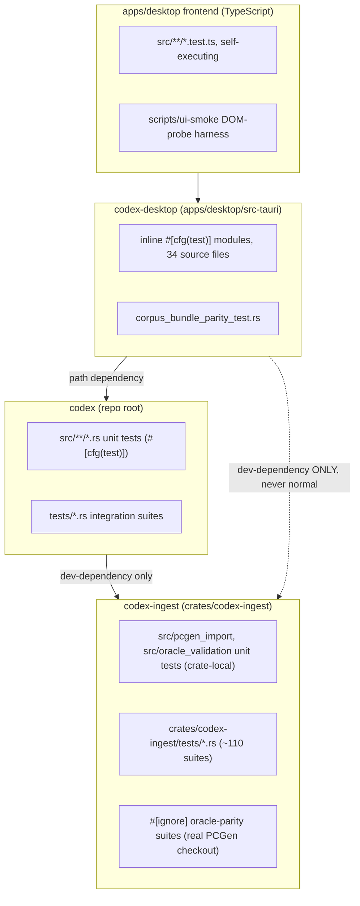
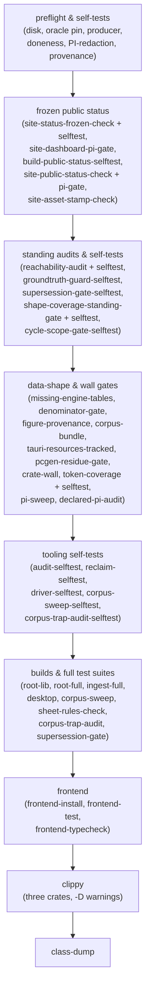

# Testing

> Scope: testing philosophy and the full verification command set for this repo — this file
> doubles as the "how do I verify my change" runbook and as the reference for how this repo
> writes a test.
> Last verified: **2026-09-20 against `tranche/16`** (SD-36 Epic D truth-up, HEAD `5ee77f8d85` +
> this cycle's Epic C2 working-tree state: the `crates/codex-ingest` split (Epic A) and the
> `pilot_compute` submodule split (Epic C1) are both committed and reflected below; the table-driven
> `tests/sd18_widening`/`tests/sd13_progression` rewrite (Epic C2.1/C2.2) **has now landed**,
> uncommitted as of this pass — both families' `rows.rs` exist and are documented in "Table-driven
> test families" and in their own section below).
> Prior verification history (SD-35, SD-33, SD-31 sections) is retained only where its content is
> still current; superseded figures were replaced, not appended to.
> Maintenance: updated at SD closure — see [README.md](./README.md) §Maintenance contract

## Testing philosophy

- **Red → green is the expected posture, on every plane.** `AGENTS.md`'s non-negotiable rule 1:
  write or update a failing test before changing production code, confirm it fails for the
  intended reason, then implement the smallest change to pass (`AGENTS.md:34-39`). This applies to
  Rust, TypeScript, and the standalone Python/bash release scripts alike — see
  `scripts/release/__tests__/test-write-release-manifest.test.sh:6-9` ("Writes the test FIRST,
  runs it RED, then implementation, then GREEN, then refactor") and
  `tools/release/test_emit_channel_index.py:106`'s local-import comment, which exists specifically
  so the RED phase (test written, `jsonschema` not yet installed) still collects.
- **A test name is a claim, not a label.** A `tests/*.rs` file name states the originating slice
  and the subject (`tests/sd35_class_feature_catalogs_read_converted_prose.rs`); a test function
  name states the claim itself as a full sentence
  (`every_record_the_class_feature_catalogs_serve_has_converted_prose`). A reader should learn
  what broke from the failing test's name alone, before opening the file. See
  [conventions.md](./conventions.md) §"Test file and function names" for the naming rule and
  §"Provenance naming" for what the `sdNN`/`geNN` prefix means (and doesn't).
- **Presence gates are not correctness gates.** A test that asserts a field exists, a file was
  written, or a command exited zero proves *presence*; it does not prove the *value* is right. The
  derived-evaluator fixture seam (below) exists precisely because a `wiring_class: derived` unit
  being wired and rendering a number is not the same claim as that number being correct — the seam
  re-derives the expected value from a byte INDEPENDENT of what the engine parsed, so a bug that
  produces a plausible-looking wrong number still fails. When you can, write the correctness gate;
  when you can only write a presence gate today, say so in the test's own doc comment.
- **Oracle parity is a tool-side check, never a live dependency.** `crates/codex-ingest`'s
  `#[ignore]`-gated suites diff this engine's converted output against a pinned real PCGen
  checkout (`scripts/pcgen-oracle-pin.env`). The oracle proves the converter got the source bytes
  right at ingest time; nothing under `src/` or `apps/desktop/` reads PCGen, ever, at runtime — see
  [conventions.md](./conventions.md)'s PCGen-wall doctrine row. Oracle tests are opt-in
  (`--ignored`/`--include-ignored`) because they need a local PCGen data checkout no CI runner
  provides by default.
- **A static source-audit test walks a directory, it never lists files by hand.** `no_foreign_home_paths.rs`,
  `pi_table_sweep.rs`, and `generator_name_key_screening_static_audit.rs` all recursively walk
  `tests/`, `src/`, or `scripts/` at test time and assert a property of every file found — an
  explicit file list would silently stop covering a file added after the test was written. **When
  writing a new static-audit test, walk the directory; never enumerate the files it should
  check.**
- **A baseline is a floor with a written reason, not a target.** Every `BASELINE_*` entry in
  `scripts/verify-baselines.env` only ever moves because a real, measured run changed the number —
  each entry's own comment states which commit, which log, and why (a real test added, a family
  folded into fewer binaries, a suite moved to another crate). Lowering a floor to make a stage
  pass, without that paper trail, is the one thing this file never sanctions.
- **One full verify pass per batch, not a repeated clean gate.** Once `scripts/verify.sh` is
  green for a batch of changes, the next full run is triggered by the *next* batch, not by
  re-running the same gate on an unchanged tree "to be sure."
- **Every figure in this file states its denominator and the command that reproduces it.** See
  [conventions.md](./conventions.md)'s doctrine table, enforced by
  `python3 scripts/denominator_gate.py --check` / `--check-provenance`.
- **A run that can be cut off pre-fills a not-run row.** A long-running sweep (the corpus-literal
  sweep, a per-book cycle) writes its full row set with a `not_run` disposition before starting,
  so a truncated run is visibly incomplete rather than silently reporting only the rows it reached
  — see `docs/retro/` for the incident (a 69-row suite truncated at 47 by a tool timeout was once
  reported complete) this practice exists to prevent.

## Quick reference: what to run for a given change

| You changed... | Run this |
|---|---|
| `src/**/*.rs` (rules-core) | `cargo test --locked` from repo root |
| `crates/codex-ingest/**/*.rs` (PCGen converter/oracle) | `cargo test --locked -p codex-ingest` from repo root |
| `apps/desktop/src-tauri/src/**/*.rs` | `cd apps/desktop/src-tauri && cargo test --locked` |
| `apps/desktop/src/**/*.ts(x)` | `cd apps/desktop && npm run typecheck && npm test` |
| any `.rs` you're about to commit | `cargo clippy --locked --tests -- -D warnings`, run in whichever of the three crates you touched (root, `apps/desktop/src-tauri`, `crates/codex-ingest`) |
| `scripts/release/*.py`, `scripts/release/*.sh` | the matching standalone script under [Standalone scripts](#standalone-scripts) |
| `tools/release/*.py` | the matching `tools/release/test_*.py` |
| a release-notes/manifest doctrine change | `scripts/tranche/tests/test_validate_tranche_notes.py` and `tools/ci/test_branch_promotion_guard.sh` |
| `data/sheet_rules/**` or the sheet-rule schema | `cargo run --locked -p codex-ingest --bin sheet_rule_convert -- --check` and the shape-rule grep in [The sheet-rule data gates](#the-sheet-rule-data-gates) |
| `scripts/gen-corpus-bundle.mjs` or what it mirrors | `bash scripts/verify.sh --only corpus-bundle` and `cargo test -p codex-desktop corpus_bundle_parity` |

None of the standalone scripts below are wired into `npm test` or `cargo test` — each is invoked
directly, and none of them appear in `apps/desktop/scripts/run-tests.mjs`'s glob (`*.test.ts`
only) or in a Cargo test target.

## The three crates, and where their tests live

SD-36 Epic A split what used to be one crate into three (see
[conventions.md](./conventions.md)'s crate table). Each has its own test surface:


*The three Cargo crates and the frontend, and which direction each test surface's dependency
points — `codex-desktop` never links `codex-ingest` in a normal build; the arrow is dashed to mark
that it is dev-only.*

- **`codex` (repo root)** — `cargo test --locked` runs unit tests inside `src/` plus every
  integration test file under `tests/*.rs`. There are **279** files matching `tests/*.rs`
  (`ls tests/*.rs | wc -l`, current). The last full-run floors recorded in
  `scripts/verify-baselines.env` (`grep -E '^[A-Z_]+=' scripts/verify-baselines.env | tail -n 20`,
  read with last-assignment-wins semantics — see below): `BASELINE_ROOT_LIB_TESTS=2581`,
  `BASELINE_ROOT_FULL_TESTS=6196`, `BASELINE_ROOT_TEST_BINARIES=285`. These are the **post-Epic-A**
  numbers — root's counts dropped sharply (from `3402`/`7876`/`414` pre-Epic-A) because ~821 unit
  tests and ~859 integration-test entries that used to live under root src/pcgen_import and
  src/oracle_validation (former paths, no longer valid — both are now
  `crates/codex-ingest/src/pcgen_import/` and `crates/codex-ingest/src/oracle_validation/`), and
  their `tests/*.rs` callers, moved wholesale into `codex-ingest` (see the baseline file's own
  comment block for the full reconciliation).
- **`codex-ingest` (`crates/codex-ingest`)** — `cargo test --locked -p codex-ingest` (from repo
  root; it's a workspace member) or `cd crates/codex-ingest && cargo test --locked`. Recorded
  floors: `BASELINE_INGEST_FULL_TESTS=1673`, `BASELINE_INGEST_TEST_BINARIES=157` (110
  `tests/*.rs` suites + 46 `src/bin/*.rs` unit-test targets + 1 lib target). Its `#[ignore]`-gated
  suites are the oracle-parity tier (see [Corpus-gated tests](#corpus-gated-tests)); they need a
  real, pinned local PCGen checkout and do not run in a plain `cargo test`.
- **`codex-desktop` (`apps/desktop/src-tauri`)** — `cd apps/desktop/src-tauri && cargo test --locked`.
  A separate crate (`apps/desktop/src-tauri/Cargo.toml`, name `codex-desktop`) that path-depends on
  `codex` and dev-depends **only** on `codex-ingest` (never a normal dependency — the `crate-wall`
  verify stage checks this structurally: `cargo tree --locked -e normal,build` must show zero
  `codex-ingest` lines). Its tests are **inline `#[cfg(test)]` modules**, not separate `tests/*.rs`
  files. As of this verification, **34** source files under `apps/desktop/src-tauri/src/` carry
  one (`grep -rl '#\[cfg(test)\]' apps/desktop/src-tauri/src/ | wc -l`), including
  `corpus_bundle_parity_test.rs` (added for the corpus-bundle work — see
  [The corpus bundle](#the-corpus-bundle-and-its-parity-test) below), `spell_catalog.rs`,
  `race_catalog.rs`, `equipment_catalog.rs`, `character_hub.rs`, `update/transaction.rs`,
  `characterHub/appendToCharacter.rs`, `rule_system_adapter.rs`, `pf1_adapter.rs`, and
  `corpus_ingest_diagnostic.rs`. Recorded floor: `BASELINE_DESKTOP_TESTS=597` (re-derive: the
  desktop test-count line `scripts/verify.sh`'s `desktop` stage prints).

```
cargo clippy --locked --tests -- -D warnings
```
Lints one crate, failing the build on any warning. `scripts/verify.sh`'s `clippy` stage now runs
this **three times** — root, `apps/desktop/src-tauri`, `crates/codex-ingest` — each against its
own `BASELINE_CLIPPY_WARNINGS_{ROOT,DESKTOP,INGEST}` ceiling, all three currently `0` (SD-36 Epic
C1.4: the `-D warnings` flag itself was added this cycle; see
[conventions.md](./conventions.md)'s doctrine table).

### Desktop frontend (TypeScript)

```
cd apps/desktop && npm run typecheck
```
Runs `tsc --noEmit` (`apps/desktop/package.json` `scripts.typecheck`) and passes cleanly on a
fresh `npm ci`.

```
cd apps/desktop && npm test
```
Runs `node scripts/run-tests.mjs` (`apps/desktop/package.json` `scripts.test`) — **not vitest**.
`apps/desktop/scripts/run-tests.mjs` recursively globs every `src/**/*.test.ts` file, then
`spawnSync`s each one individually through `tsx`. Each test file is a self-executing script (no
`describe`/`it` wrapper); it asserts directly and exits non-zero on the first failed assertion.
There are currently **125** matching files (`find apps/desktop/src -iname "*.test.ts" | wc -l`;
the last recorded floor, `BASELINE_FRONTEND_TEST_FILES`, is `121` — the four-file gap is new tests
added after that baseline was last measured, not a regression, since this is a floor). The runner
prints `PASS <file>` / `FAIL <file>` per file and a `<n>/<total> test files passed.` summary line.

### Standalone scripts

| Command | What it verifies |
|---|---|
| `python3 tools/release/test_check_release_manifest.py` | `tools/release/check_release_manifest.py` (legacy manifest schema + tranche coherence). `unittest`, 9 test methods. |
| `python3 tools/release/test_check_release_manifest_against_dev_schema.py` | The dev-schema shim. `unittest`, 2 test methods. |
| `python3 tools/release/test_emit_channel_index.py` | `tools/release/emit_channel_index.py`. `unittest`, 3 test methods; one does a local `import jsonschema` scoped inside the test function so the module collects without `jsonschema` installed during RED. |
| `bash scripts/release/test-promotion-gates.test.sh` | `promote-alpha-to-beta.sh`/`promote-beta-to-stable.sh` against a stubbed `gh`; asserts every gate fails/passes correctly and neither script ever calls `gh pr create`. |
| `bash scripts/release/__tests__/test-write-release-manifest.test.sh` | `write_release_manifest.py` + `validate_manifest.py` round-trip. |
| `python3 scripts/tranche/tests/test_validate_tranche_notes.py` | `scripts/tranche/validate-tranche-notes.py`. `unittest`, 9 test methods. |
| `bash tools/ci/test_branch_promotion_guard.sh` | `tools/ci/branch-promotion-guard.sh`'s `verify_promotion_source` — the exact function the `allow-only-*` GitHub Actions workflows execute at PR time. **Moved here from `tests/sd16-e5-f1/` by SD-36 Epic C2.4** — update any script or CI reference still pointing at the old path. |
| `python3 scripts/release/check_promotion_evidence.py --self-test` | The promotion-evidence gate's own built-in RED-GREEN harness; also the first step `promotion-gates.yml` runs on every PR. |

All `jsonschema`-based validators need the `jsonschema` pip package; CI pins `jsonschema==4.21.1`.

## `scripts/verify.sh`: stages, groups, and what each protects

`scripts/verify.sh` is the single verification command for this repo. `scripts/verify.sh --list`
(read-only — it only prints and exits, never runs a stage) is the authority on stage membership;
as of this verification it prints **50** stages in `ALL_STAGES`, **42** of which are also in
`QUICK_STAGES` (`--quick`). Both counts come straight from that command's own output, not from a
count maintained by hand in this doc.


*`scripts/verify.sh`'s 50 stages, grouped by what they protect, in execution order. `--quick`
(42 stages) drops the expensive builds group's `root-full`/`ingest-full`/`desktop`/`corpus-sweep`/
`sheet-rules-check`/`corpus-trap-audit`/`supersession-gate` rows and `clippy`, keeping every
Python-or-hash-only gate — see `scripts/verify.sh --list`'s own `full`/`quick` columns for the
authoritative per-stage membership.*

What each group actually protects:

1. **Preflight & self-tests** — cheap, build-free, no network. `preflight-oracle` fails RED with
   the exact `scripts/fetch-pcgen-oracle.sh` command when the pinned PCGen checkout
   (`scripts/pcgen-oracle-pin.env`) is absent or off-pin. The `*-selftest` stages prove their
   paired gate can actually fail (mutation-style: plant a defect, confirm RED, revert, confirm
   GREEN) before trusting its green as meaningful.
2. **Frozen public status** — `site-status-frozen-check` (SD-36 D3/D5) asserts the committed
   `site/status-data.json` snapshot still reads `overall.pct == 100.0`, `overall.denominator ==
   49450`, `partial == 0`, `not_started == 0`, and a constant `generated_at` — the page is
   regenerated once per bundle closure, never live, so this gate only catches silent drift in the
   committed file, not staleness against a live producer (there is no live producer any more).
3. **Standing audits & self-tests** — `reachability-audit`, `groundtruth-guard-selftest`,
   `supersession-gate-selftest`, `shape-coverage-standing-gate` and its selftest,
   `cycle-scope-gate-selftest` — cross-cutting standing invariants (e.g. a race/class record is
   reachable from a live consumer; a superseded printing doesn't silently re-appear as current)
   that don't belong to any one book or feature.
4. **Data-shape & wall gates** — `denominator-gate`/`figure-provenance` (see
   [conventions.md](./conventions.md)'s doctrine table); `corpus-bundle` and
   `tauri-resources-tracked` (see [The corpus bundle](#the-corpus-bundle-and-its-parity-test));
   `pcgen-residue-gate` and `crate-wall` (the PCGen-wall doctrine, structurally enforced — `cargo
   tree`, `cargo metadata` dependency-direction check, a manifest `awk` scan, and the residue
   gate itself, all in one stage); `token-coverage`, `pi-sweep`, `declared-pi-audit` (OGL Product
   Identity discipline — see `docs/governance/ogl-pi-blacklist.md`).
5. **Tooling self-tests** — prove the maintenance scripts themselves (`scripts/reclaim.sh`,
   the corpus-sweep driver, the corpus-trap audit) still fail on a planted defect before the real
   run below trusts their green.
6. **Builds & full test suites** — the expensive group: `root-lib`/`root-full` (`codex`),
   `ingest-full` (`codex-ingest`), `desktop` (`codex-desktop`), `corpus-sweep` (the corpus-literal
   byte-equality sweep — see [corpus-ingest.md](./corpus-ingest.md)), `sheet-rules-check` (see
   [The sheet-rule data gates](#the-sheet-rule-data-gates)), `corpus-trap-audit`,
   `supersession-gate`. Each build stage also runs a **per-suite non-execution check**: it derives
   the expected `tests/*.rs` (or equivalent) suite set from the filesystem and diffs it against the
   `Running tests/<name>.rs` lines the test runner's own log actually produced, failing by name if
   any suite present on disk never ran — a floor on the aggregate pass count cannot catch one
   suite silently dropping out while another appears in the same run.
7. **Frontend** — `frontend-install` (`npm ci`), `frontend-test` (`npm test`),
   `frontend-typecheck` (`npm run typecheck`).
8. **Clippy** — three crates, `-D warnings`, described above.
9. **`class-dump`** — a structural dump of every compiled class's chassis, used to eyeball a
   widening's shape without reading the full engine.

**No normalized red.** A gate stage that fails twice with the same attribution (e.g.
"environmental fixture") is treated as an incident, not an environment quirk — `root-full` was RED
on 29 of 33 SD-27-tranche runs, always attributed to the same cause, and that normalized red hid
two parity suites that never executed for the whole tranche (`docs/retro/events/tranche8-incident-retro.jsonl`).

## The four gates a cycle runs without a build

The expensive gate is the full `scripts/verify.sh` run. Four checks that used to surface only
there are per-cycle, because each is Python-or-hash only and runs in seconds:

```
python3 scripts/pcgen_residue_gate.py --check           # live PCGen surface; monotonic, only goes down
python3 scripts/token_coverage.py --check                # the remainder, named by token type, counts summing
python3 scripts/denominator_gate.py --check-provenance   # NOT the same flag as --check
python3 scripts/site/check_frozen_status.py              # the frozen PF1e public status snapshot, re-checked
```

`--check` and `--check-provenance` are **different checks** and neither substitutes for the other:
`--check` scans for a percentage with no denominator marker on its own line; `--check-provenance`
enforces that every figure in a "Figures + their re-derive commands" section carries its command
**on its own line**. **The gate checks that a command is present and resolvable, not that it
runs** — after adding a figure row, execute its command yourself and confirm it prints the value
you wrote.

## The sheet-rule data gates

```
cargo run --locked -p codex-ingest --bin sheet_rule_convert -- --check          # regeneration is a no-op
grep -rlE 'BONUS:|DEFINE:|PRE[A-Z]+:|%CHOICE|CL=' data/sheet_rules/ | wc -l   # must print 0
```

The `-p codex-ingest` is required: the root `Cargo.toml` deliberately has no
`default-members` (see [getting-started.md](./getting-started.md)), so a bare
`--bin sheet_rule_convert` run from the repo root cannot resolve — the binary
lives in the `codex-ingest` crate, not the root `codex` package.

The second is the shape rule: our sheet-rule data files carry none of the source PCGen token
syntax — see `src/rules_core/sheet_rule.rs`'s module doc and
[conventions.md](./conventions.md)'s "print the rule, not simulate" doctrine row. See
[corpus-ingest.md](./corpus-ingest.md) for the converter that produces this data.

## The corpus bundle and its parity test

SD-36 shipped a sanitized, PCGen-residue-free mirror of `data/corpus/` for the desktop app to
bundle (`decisions.md` §8) — `scripts/gen-corpus-bundle.mjs` writes it to
`apps/desktop/src-tauri/resources/corpus_bundle/`. Three checks, each proving a different thing:

- **`bash scripts/verify.sh --only corpus-bundle`** regenerates the bundle, asserts a positive
  `files_copied=` count, and cross-checks the generator's own `RESIDUE_PATTERNS` array against
  `scripts/pcgen_residue_gate.py`'s `DATA_PATTERNS` term-for-term (a Python script and a Node
  script can't share an import, so this stage re-derives one from the other on every run rather
  than letting them silently diverge) before running the full residue gate against the generated
  output.
- **`bash scripts/verify.sh --only tauri-resources-tracked`** asserts every `tauri.conf.json`
  `bundle.resources` key resolves to at least one git-tracked file on a clean checkout — the exact
  check that would have caught an earlier commit's untracked-bundle-resource defect.
- **`cargo test -p codex-desktop corpus_bundle_parity`** (source:
  `apps/desktop/src-tauri/src/corpus_bundle_parity_test.rs`) is the **correctness** proof, not
  just presence: it regenerates the bundle and runs the SAME production loaders
  (`corpus_loader.rs`, `race_resolver.rs`, `trait_pool.rs`) against the raw corpus and the bundle
  in turn, per book, asserting equal equipment/spell record counts, equal race rosters, and zero
  loader diagnostics on both sides. Mutation-tested: narrowing the generator's kind list to drop
  `race`/`race_trait` made this test fail and name the exact missing books; reverting made it pass
  again.

**Scope of the parity claim, stated precisely**: "equal to the raw corpus" holds for the six
`data/corpus/<book>/<kind>/` directories the three live loaders above actually read — it does not
extend to `apps/desktop/src-tauri/src/reference_library_catalog.rs`, a registered but
frontend-unused Tauri command that reads twelve kind directories, only one of which is mirrored;
that command now refuses (a named error) any unmirrored kind rather than returning an empty
catalog when its resolved root isn't a full source checkout.

## The derived-evaluator fixture seam (`tests/fixtures/rules_core/derived-evaluator-fixtures.json`)

A **separate** artifact from the `key=value` character-input fixtures below, and a different kind
of test entirely. It is the instrument that lets a `wiring_class: derived` unit reach `done` in
`docs/work-inventory.json` (now a frozen snapshot — see [status.md](./status.md); the generator
that used to write these stamps, `v06_work_inventory::apply_done_rung_stamps()`, is retired,
SD-36 D3, and the frozen file already carries every stamp it ever wrote).

**Why it exists.** The bar for a `derived` unit is: *the engine's evaluator, run over this repo's
own `data/corpus/` ingest, reproduces a value derived INDEPENDENTLY from the pinned PCGen oracle's
`.lst` bytes.* This is a correctness gate, not a presence gate (see
[Testing philosophy](#testing-philosophy) above) — a `derived` unit rendering *some* number is not
the claim; rendering the *right* number, checked against bytes the evaluator itself never reads,
is.

**Independence is the whole property, and it has two layers.**

1. *Different artifact.* Every `scripts/derive_*_fixtures.py` generator reads only pinned oracle
   bytes; it imports no engine module and opens no file under `data/corpus/`. The engine evaluates
   `data/corpus/`. `docs/work-inventory.json` is read for unit IDENTITY only.
2. *Different bytes, where a family can manage it.* The strongest families pin an expected value
   that comes from a **different row in a different file** than the one the evaluator parses —
   `monster_sla` reads the granted spell's own `CLASSES:` record, `monster_ability` reads the
   owner's `MONSTERCLASS:<type>:<HD>` row — so a fixture entry cannot be a restatement of what the
   evaluator computes. A family that can only pin a value read off the same row it parses is
   weaker, and says so in its own module doc.

**Eleven families** (`run_bar_check` in `src/rules_core/derived_evaluator_fixture_check.rs` runs
all eleven and unions their results): `entries` (equipment `BONUS:STAT`, 94 rows),
`monster_entries` (monster `BONUS:VAR|SLA_CL|` caster level, 77), `monster_sla_entries` (spell-like
save DC → granted spell's LEVEL, 314), `monster_ability_entries` (Universal Monster Rule save-DC
base, summed literal, 92), `monster_ability_formula_entries` (same, full formula
`10+(HD/2)+<STAT>`, 8), `companion_entries` (natural-attack Strength damage, 117),
`companion_skill_entries` (`BONUS:SKILL|Climb,Swim|DEX-STR` ability-diff, 134),
`companion_save_dc_entries` (DESC-embedded save-DC formula, 25), `spell_entries` (caster-level
DURATION, 898), `spell_range_entries` (`RANGE:` keyword → ft/level, 760), `class_feature_entries`
(per-level `BONUS:VAR` scaling, 12).

**Rows and units are not the same count, and the tool says so.** `monster_sla` emits one row per
GRANTED SPELL and clears a unit only when every one of its rows clears; `spell_entries` and
`spell_range_entries` overlap on 414 unit IDs. So `fixtures_total` (a sum of per-family row counts)
is strictly ≥ the number of covered units, and the binary reports `N unit(s) cleared over M
fixture row(s); F failed; N not ingested` rather than conflating them. **A unit that fails ANY
seam is removed from `cleared`** — `cleared` is a union and `failures` is keyed by `unit_id`,
so without that subtraction a unit covered by two seams could be stamped on the strength of the
seam it passed while the seam it failed only appeared in a report nothing reads.

### The generator idempotency contract

**Every `scripts/derive_*_fixtures.py` MUST select its target population on BOTH `grounded` and
`fixture-verified`, and this is load-bearing, not stylistic.** A generator that selects `grounded`
alone emits its rows on the first run and the EMPTY SET on every run after it — silently
withdrawing its own credit at the next regen, with no gate catching it (three of wave 15's four
new generators shipped this defect before their authors caught it). A stamp is never treated as
EVIDENCE: every row is still re-derived from the oracle on every run.

**The check that proves it:** run every generator twice on a stamped tree and `diff -q` the
fixture; all eight families currently re-derive byte-identically. There is no automated test for
this yet (`OPEN-ISSUES.md` row 286).

### Per-family provenance guarantees

Each family ships a `tests/derived_evaluator_fixture_check_<family>.rs` asserting four things
about its own rows: the pinned `upstream_lst` still hashes to the pinned `upstream_lst_sha256`;
the pinned `corpus_field` appears verbatim on the pinned `upstream_line`; the expected values
re-derive from that field by a reference implementation written IN THE TEST (a third
implementation, so no two of generator/evaluator/test can share a bug); and the array is
non-empty with one row per unit, so the file cannot become vacuous. These six files
(`tests/derived_evaluator_fixture_check_class_feature.rs`,
`..._class_feature_consumer_quantity.rs`, `..._companion.rs`, `..._companion_save_dc.rs`,
`..._monster.rs`, `..._monster_sla.rs`, `..._spell_range.rs`) each pull in the shared path helpers
via `#[path = "support/paths.rs"] mod paths;` (see [Path helpers](#path-helpers-for-tests) below).

## Test conventions

- **Integration tests live flat under `tests/*.rs`** (root `codex` crate) **or
  `crates/codex-ingest/tests/*.rs`** (the PCGen-conversion crate), one behavior per file, named by
  originating slice — e.g. `tests/ge06_pilot_base_computation.rs`,
  `crates/codex-ingest/tests/sd20_equipment_effects_parity.rs`,
  `crates/codex-ingest/tests/golden_case_fixture_schema.rs`. This provenance-naming pattern makes
  it possible to `cargo test --test <name>` (add `-p codex-ingest` for the ingest crate) a single
  slice's behavior in isolation, and to `grep` the test suite by originating SD/GE without any
  test-registry file.
- **Sibling preservation**: `tests/*.rs`'s one-file-per-slice naming is what makes "every prior
  slice still passes" mechanically checkable — running `cargo test --locked` after a change
  touches every prior slice's file, not just the one you're editing, so a regression in an older
  row surfaces immediately rather than only at the next full-suite run.
- **A large templated family is ONE binary with a per-row module, not one top-level file per
  row** (SD-35 `AT-35-E1-003`; see below and [conventions.md](./conventions.md)'s naming section).
  `cargo test --locked --no-run` is dominated by the library compile plus one link per binary, so
  folding 89 separate `tests/sd18_*_widening.rs` files into one `tests/sd18_widening/main.rs` with
  89 `mod`-declared row files bought a cold-build drop from **188.97 s to 145.89 s** — a 22.8% cut out of 188.97 s —
  measured paired, back-to-back
  (`docs/release/SD-35-corpus-sheet-completion/artifacts/epic-1-tax-cut/build-time.json`).
  **Write a new integration test into an existing family binary, not a new top-level file**,
  unless the family is genuinely new — one more `tests/<name>.rs` is one more link on every build
  anyone ever runs.

## The `tests/sd18_widening/` and `tests/sd13_progression/` families (Epic C2, done)

These are the two "roster + per-row module" families the tax cut above created, and the ones
SD-36 Epic C2.1/C2.2 further consolidated by moving their two near-universal shapes to table rows
(see [Table-driven test families](#table-driven-test-families) below for the general pattern):

- **`tests/sd18_widening/main.rs`** declares a `roster!` macro expanding to one `mod <class>_level<N>;`
  per row (e.g. `barbarian_level12`, `bard_level11_inspire`) — each still its own file. Run one row:
  `cargo test --test sd18_widening <class>_level<N>::`. Run one class: `cargo test --test
  sd18_widening <class>_level`.
- **`tests/sd13_progression/main.rs`** is the same shape for the SD-13 per-class per-level
  progression proofs (`barbarian_level2` .. `barbarian_level10`, etc.).
- **As of this verification, both families still have one file per (class, level) row** — the
  per-row `mod` structure itself was never the target of C2.1/C2.2; what moved was the BODY of the
  two near-universal negative-control shapes inside those files, onto `rows.rs` + a macro
  (`tests/sd18_widening/rows.rs`: 182 rows; `tests/sd13_progression/rows.rs`: 143 rows), while every
  bespoke test kept its own hand-written body in its own file. `cargo test --locked -- --list` is
  byte-identical before and after in both families (saved artifact:
  `docs/release/SD-36-consolidation/receipts.md`'s Epic C2.1/C2.2 evidence section) — the row COUNT
  the macro expands to matches the entry TEXT exactly, which is the actual proof obligation, not
  merely a matching total. The design doc's ~75,000→~26,000, all-tests-converted estimate did not
  fully land: only the two shapes with a clean, mechanically-verified 1:1 extraction were converted
  this pass (receipts.md's "What stayed bespoke" table has the per-shape reasons for the rest).
- Both families' shared `mod common;` (`tests/common/mod.rs`) provides `load()`/`explanation()`
  helpers hand-extracted from 300+ duplicate copies (SD-34 fable-review finding R10-F2); brought
  in via `#[path = "../common/mod.rs"] mod common;` from `main.rs`. `tests/sd18_widening/support.rs`
  additionally collapses the `load()` + `compute_pilot_base_chassis()` two-line preamble that opened
  816 of that family's 891 tests into one `support::compute(fixture)` call (assert lines untouched).

## Table-driven test families

The pattern `sd18_widening`/`sd13_progression` (Epic C2.1/C2.2) established for converting a
large, near-duplicated hand-written test family into table data, without ever rewriting an
assertion:

- **The shape.** A `rows.rs` (or, for a family whose macro can't hold a runtime `const` — see
  below — the per-row struct-literal syntax at each invocation site) defines a `struct Row { ... }`
  per convertible test shape, plus a `macro_rules!` that takes one or more row blocks and expands
  each into a full `#[test] fn <name>() { ... }` with the row's fields substituted into the exact
  assertion the hand-written body used. The macro invocation sits in the SAME file, under the SAME
  module, with the SAME fn name the hand-written test had, so `cargo test -- --list` output never
  changes shape — only where the test BODY's text lives changes. See
  `tests/sd13_progression/rows.rs`'s `recognition_negative_controls!` / `multiclass_negative_controls!`
  and their invocation in `tests/sd13_progression/barbarian_level2.rs`, or
  `tests/sd18_widening/rows.rs`'s `sd18_fighter_neg_control_test!` macro, for worked examples.
  (Design note: a `macro_rules!` cannot iterate a *runtime* `const ROWS: &[Row]` to emit top-level
  items — Rust macros are compile-time/syntactic — so "the rows table" is expressed as the macro's
  own invocation syntax at each call site, one struct-literal-shaped row per test, immediately
  followed by the macro call that turns it into a `#[test]`.)
- **The support.rs helper pattern.** Separately from row/macro conversion, a family-local
  `support.rs` (`tests/sd18_widening/support.rs`) collapses a setup preamble every test shares
  (here, `load(fixture)` + `compute_pilot_base_chassis(&_)`) into one helper fn, leaving every
  test's own assert lines completely untouched — this is a mechanical, scripted substitution
  (`collapse_setup.py`), never a hand-edit, and only ever touches the fixed preamble lines, verified
  first that no site referenced the intermediate variable again (which would have broken the
  collapse).
- **THE SAFETY RULE: assertions are moved, never rewritten.** Every `assert!`/`assert_eq!`/
  `.expect(` in a converted test's old body must survive in the new row/macro form with the exact
  same expected values and the exact same subject expression — as DATA in the row, not re-derived,
  re-typed, or "cleaned up" code. A body that doesn't match the shape's template exactly (a helper-fn
  call, an in-expression comment, a different assert count, a flipped assertion polarity) is left
  bespoke, not forced into the template and not guessed at — see either family's "what stayed
  bespoke" accounting (`docs/release/SD-36-consolidation/receipts.md`) for what this excluded and
  why. No test is ever deleted, merged, renamed, `#[ignore]`d, or made vacuous by this kind of pass;
  the emitted test list stays byte-identical.
- **Vacuity guards.** Every fixture-mutating macro asserts the substitution happened and the loaded
  character is what the row says — not only that the post-substitution computation's assertions
  still pass. A negative control that mutates a fixture via `.replace(old_sub, new_sub)` can pass
  for the wrong reason if the substitution silently no-ops or produces garbage (SD-36 Epic C2's own
  `MULTICLASS_NEG_ROWS` sabotage-4 finding: a literal backslash-n instead of a real newline meant
  `new_sub` never actually added the second `class_level=` line, so 64 rows passed vacuously). The
  guard: before the replace, assert the fixture contains `old_sub` the expected number of times;
  after, assert the fixture actually changed, and assert the LOADED character (not just the
  computation's explanations) carries the class id/level the row's `new_sub` claims — see
  `sd18_boundary_neg_control_test!`/`sd18_multiclass_neg_control_test!` in
  `tests/sd18_widening/rows.rs` and `multiclass_negative_controls!` in
  `tests/sd13_progression/rows.rs`.
- **How to add a row.** Extract the row's fields (fixture, prefixes/exact-ids, message text,
  `.replace()` strings, whatever the macro's row syntax takes) mechanically from the existing
  test's own source — never hand-type or re-derive a value — and confirm the extracted fields
  reconstruct the original predicate/assertion exactly before accepting the row (this repo's own
  conversion scripts, e.g. `c2sd13_extract.py`, do this as a regex match-or-reject: anything that
  doesn't reconstruct exactly is excluded and flagged, never silently approximated). Then invoke
  the macro at the exact call site the old test body occupied, with the same fn name. Re-run
  `--list` before/after and diff byte-identical; re-run the full family green.
- **Sabotage-parity: how to prove a test refactor is safe.** A `--list` diff and a green run prove
  the test still exists and still passes — neither proves the assertion still catches the thing it
  was written to catch. The way this repo proves that: apply a single-line, real defect into the
  `src/` code path the test exercises (never into `tests/`), run the suite, save the exact set of
  failing test NAMES, revert the defect (`git apply -R`), confirm `git status -- src` is clean, then
  repeat for a couple more independent single-line defects — each one should trip well over a
  double-digit number of tests, in more than one test family if the shape is shared. After the
  test-file rewrite, re-apply each same defect and diff the new failing-NAME set against the
  pre-rewrite one: an empty diff (same test NAMES, not just the same count) is the proof the
  safety rule actually held. Worked example, three sabotages against both families, run three times
  each to rule out flake, all producing an empty diff:
  ```
  # apply a single-line defect in src/, e.g.:
  #   src/rules_core/pilot_compute/class_barbarian.rs:2381
  #   let fortitude_save = level_value / 2 + 2;  ->  + 3;
  cargo test --locked -j 2 --no-fail-fast --test sd13_progression --test sd18_widening \
    2>&1 | grep '^test .* FAILED$' | sed 's/ \.\.\. FAILED$//' | sort > failed-before.txt
  git apply -R defect.patch   # revert, confirm `git status -- src` is clean
  # ... after the test-file rewrite lands ...
  # re-apply the SAME defect, re-run the same command into failed-after.txt
  diff failed-before.txt failed-after.txt   # must be empty
  ```
  Full results for this repo's own C2.1/C2.2 pass:
  `docs/release/SD-36-consolidation/receipts.md`'s Epic C2.1/C2.2 evidence section and this
  cycle's `baseline.md`. Note (sabotage 4, the vacuity-guard follow-up): the first three sabotages
  above all sit in per-class chassis magnitude formulas and never touch the multiclass gate, so
  none of them could ever trip a `multiclass_*_is_not_promoted_by_this_slice` test — a defect
  shaped like the multiclass gate itself (widening `supported_<class>_level` to wrongly recognize
  a class inside a multiclass mix) needs its own sabotage, run against both the current and
  pre-rewrite trees the same way, to prove that shape's sensitivity specifically.

## Path helpers for tests

Two parallel canonical-path modules exist, one per crate, because `tests/*.rs` binaries compile as
their own crate and cannot reach `codex`'s `pub(crate)` items:

- **`src/support/paths.rs`** — for code inside the `codex` crate itself (`src/**`). `repo_root`,
  `corpus_root`, `corpus_root_if_set`, `pcgen_corpus_root`, `find_json_files`. Replaced six
  independently-drifted copies across `src/rules_core/` (SD-36 Epic C1.3;
  `git grep -c 'fn repo_root' -- src` must show exactly 1 hit — see
  [conventions.md](./conventions.md)).
- **`tests/support/paths.rs`** — for `tests/*.rs` integration-test binaries. `repo_root`,
  `corpus_root`, `corpus_root_if_set`, `pcgen_data_root`, `fixture_root`. Brought into each
  consuming file with `#[path = "support/paths.rs"] mod paths;` (a real re-export is impossible
  across separate test-binary crates, so this is a parallel definition, not a shared one — but it
  is the ONE parallel definition, replacing 32 independently-drifted local copies across 26 files,
  SD-36 Epic C2.3). It carries `#![allow(dead_code)]` deliberately: the module is compiled
  separately into each consuming binary, and no single binary calls all five functions, so under
  the `-D warnings` clippy lock an unused function in one binary's copy would otherwise fail the
  build (SD-36 Epic C2.3). `git ls-files tests/support/paths.rs` must show the file — if it does
  not on a checkout you're working from, that checkout predates Epic C2.3's commit; stage it by
  name (`git add tests/support/paths.rs`) rather than treating its absence as a doc error.

**When you need a repo-root-relative or corpus-relative path in a new test file, add
`#[path = "support/paths.rs"] mod paths;` and `use paths::{...}` — do not write a new local
`repo_root()`.**

## The fixture grammar (`tests/fixtures/rules_core/`)

There are **262** files under `tests/fixtures/rules_core/`
(`ls tests/fixtures/rules_core/ | wc -l`), each a flat `key=value` deterministic-input file. The
loader is `load_character_input_fixture` in `src/rules_core/character_input.rs`:

```rust
pub fn load_character_input_fixture(input: &str) -> CharacterInputLoadResult {
    let mut parsed = ParsedFixture::default();

    for raw_line in input.lines() {
        let line = raw_line.trim();

        if line.is_empty() || line.starts_with('#') {
            continue;
        }

        let Some((key, value)) = line.split_once('=') else {
            parsed.diagnostics.push(diagnostic(
                "fixture_line",
                format!("invalid character input line missing '=': {raw_line}"),
            ));
            continue;
        };

        apply_fixture_field(key.trim(), value.trim(), &mut parsed);
    }
    ...
```

Grammar rules, read directly off the parser:

- **One `key=value` pair per line.** No nesting, no indentation-sensitivity, no sections.
- **Blank lines and `#`-prefixed lines are comments**, skipped entirely.
- **Lists are expressed by repeating the key**, not by a list syntax. Keys that model multi-valued
  state (`feat`, `skill`, `equipment`, `choice`, `spell`, `provenance`) each push onto a `Vec`
  rather than overwrite. (`ability` also repeats — six lines per fixture — but assigns each line
  to a named field of a fixed-shape `AbilityScores` struct rather than pushing onto a `Vec`.)
- **Unknown keys are a diagnostic, not a silent ignore** — see
  [conventions.md](./conventions.md)'s "Diagnostics and errors" section.
- **Naming convention**: `pf1_<race>_<class>_level<N>_<slice>_deterministic_input.txt`, e.g.
  `tests/fixtures/rules_core/pf1_dwarf_fighter_level1_sd13_deterministic_input.txt`.

### How to add a new deterministic-input fixture (worked example)

1. Copy the closest existing fixture for your race/class combination as a starting point rather
   than writing one from scratch — e.g. start from
   `tests/fixtures/rules_core/pf1_dwarf_fighter_level1_sd13_deterministic_input.txt` for a new
   Fighter-chassis fixture.
2. Set `case_id`, `source_package_id`, `race_id`, `class_level`, the six `ability=` lines, and a
   `provenance=` line pointing at the requirement doc that justifies the numbers.
3. Add a `#`-comment block stating explicitly which compute paths stay claim-blocked for this
   fixture — fixtures are as much a statement of what they do NOT cover as what they do.
4. Write the failing test in the relevant `tests/*.rs` file first (RED), confirm it fails for the
   right reason (missing fixture / unimplemented compute path), then implement.
5. Run just that file: `cargo test --locked --test <file-stem-without-.rs>`.

Fixtures never carry a derived/computed value — chosen input only.

## Corpus-gated tests

Some integration tests validate parsing against the real PCGen data corpus (a separate checkout,
not vendored into this repo) rather than the hand-written fixtures above. Most of these now live
in `crates/codex-ingest/tests/` (moved there by SD-36 Epic A); a handful of `src/rules_core`-facing
proofs remain in root `tests/*.rs`. They read `PCGEN_CORPUS_ROOT` and are gated by **two different
mechanisms that coexist**:

**Pattern A — `#[ignore]`-attributed, hard-fails if run without the env var set.** The majority
pattern:

```rust
#[test]
#[ignore = "requires a local PCGen corpus checkout; set PCGEN_CORPUS_ROOT=/path/to/pcgen/data"]
fn resolves_real_core_rulebook_pcc_from_local_pcgen_corpus() {
    let corpus_root = PathBuf::from(
        std::env::var("PCGEN_CORPUS_ROOT")
            .expect("PCGEN_CORPUS_ROOT must point at a local pcgen/data checkout"),
    );
    ...
```

A plain `cargo test --locked` reports these as `... ignored` and does not execute them:

```
PCGEN_CORPUS_ROOT=/path/to/pcgen/data cargo test --locked --test <suite-name> -- --include-ignored
```
`--include-ignored` runs both normal and `#[ignore]`d tests in that binary; `--ignored` runs
*only* the ignored ones.

**Pattern B — plain `#[test]` (no `#[ignore]`), runtime file-existence check with a graceful
`eprintln!` skip.** Used in `crates/codex-ingest/tests/sd17_b5_equipment.rs` and
`crates/codex-ingest/tests/sd17_b_metadata_kinds.rs`:

```rust
#[test]
fn real_corpus_cr_equip_arms_armor_parses_with_line_numbers_preserved() {
    let corpus_root = std::env::var("PCGEN_CORPUS_ROOT")
        .unwrap_or_else(|_| "/home/ubuntu/workspace/repos/pcgen/data".to_string());
    let path = std::path::PathBuf::from(corpus_root)
        .join("pathfinder/paizo/roleplaying_game/core_rulebook/cr_equip_arms_armor.lst");
    if !path.is_file() {
        eprintln!("skipping: real cr_equip_arms_armor.lst not at {}", path.display());
        return;
    }
    ...
```

These run under a plain `cargo test --locked -p codex-ingest` with no extra flags — no
`PCGEN_CORPUS_ROOT` needed; it just self-skips (counted as a pass by `cargo test`) if the corpus
isn't found. A third variant (`crates/codex-ingest/tests/sd17_b_races_and_abilities.rs`) wraps the
same check in an `Option`-returning `corpus_root()` helper — functionally identical, factored
differently.

**When adding a new corpus-gated test, match the pattern of the file you're adding to** — most
`sd17_*`/`sd22_*` files (all now under `crates/codex-ingest/tests/`) use `#[ignore]` (Pattern A);
`sd17_b5_equipment.rs` / `sd17_b_metadata_kinds.rs` / `sd17_b_races_and_abilities.rs` (same
directory) use graceful-skip (Pattern B/C). A handful of `src/rules_core`-facing proofs that don't
touch PCGen conversion at all stay in root `tests/*.rs` and use the same two patterns against
`tests/support/paths.rs`'s `pcgen_data_root()`. **New corpus-gated tests should prefer the
graceful-skip variant** (it runs clean with zero extra flags) unless you're adding to a file that
already uses `#[ignore]`. Both patterns default to `$HOME/workspace/repos/pcgen/data` (resolved via
`std::env::var("HOME")` at runtime, never a hardcoded literal — see `tests/no_foreign_home_paths.rs`
for why this repo guards against exactly that) when `PCGEN_CORPUS_ROOT` is unset, before failing
(Pattern A) or skipping (Patterns B/C).

## Desktop test support

Three shared modules under `apps/desktop/src/testSupport/` back the `*.test.ts` suite:

- **`apps/desktop/src/testSupport/asserts.ts`** — `assertEqual<T>(actual, expected, message)` and
  `assert(condition, message)`, both throwing `Error` on failure (which is what makes a
  `tsx`-run file exit non-zero). Extracted because "every test file previously carried its own
  identical copy of these."
- **`apps/desktop/src/testSupport/makeSurface.ts`** — `makeSurface(overrides = {})` returns one
  canonical, fully-populated `TesterWorkbenchSurface` fixture, then shallow-spreads `overrides` on
  top. Built because independent per-test copies drifted when a new required field landed and
  silently broke the submit-flow tests. Tests that need to vary a nested field pass a whole
  replacement nested object, since the spread is shallow.
- **`apps/desktop/src/testSupport/makeCharacterSummary.ts`** — same single-canonical-fixture
  pattern for `CharacterSummaryDto`.

### How to add a new frontend test (worked example)

1. Colocate `<Thing>.test.ts` next to `<Thing>.ts`.
2. Import `assert`/`assertEqual` from `../testSupport/asserts` (adjust the relative path to your
   directory depth) rather than hand-rolling a check.
3. If the code under test needs a DI surface fixture, import `makeSurface`/`makeCharacterSummary`
   and shallow-spread the one field you need to vary — do not construct the full object by hand.
4. Write the test to fail first against the unmodified code, run it directly with
   `npx tsx apps/desktop/src/<path>/<Thing>.test.ts` to confirm RED, implement, confirm GREEN.
5. Run the full frontend suite before committing: `cd apps/desktop && npm test`.

## Wire fixtures (`tests/fixtures/wire/`)

All eight files still live under root `tests/fixtures/wire/sd20/` (SD-36 Epic A moved test `.rs`
files across crates; it did not move fixture data): `boundary_contract_parity.json`,
`damage_total_parity.json`, `equipment_effects_parity.json`, `feat_prereqs_parity.json`,
`human_fighter_level_1_tabletop.json`, `level_up_parity.json`, `skill_allocation_parity.json`,
`spellbook_parity.json`. Each is read from disk at test-run time by its own dedicated integration
test **and** by `crates/codex-ingest/tests/sd20_tabletop_readiness_integration.rs`, which reads
all eight for one cross-cutting readiness proof — via a hand-rolled JSON parser in every case (no
`serde_json` dependency in these test files).

**The path a test resolves the fixture through depends on which crate the test now lives in**
(SD-36 Epic A split these across `tests/*.rs` and `crates/codex-ingest/tests/*.rs`, but the
fixture directory itself did not move, so each side needed a different way back to it):

```rust
// tests/sd20_contract_boundary_parity.rs — stayed in the root `codex` crate:
let mut path = PathBuf::from(env!("CARGO_MANIFEST_DIR"));
path.push("tests/fixtures/wire/sd20/boundary_contract_parity.json");
```
```rust
// crates/codex-ingest/tests/sd20_equipment_effects_parity.rs — moved to codex-ingest,
// whose own CARGO_MANIFEST_DIR is two directories short of the fixture:
let mut path = codex_ingest::repo_root(); // crates/codex-ingest/src/lib.rs: CARGO_MANIFEST_DIR/../.. , canonicalized
path.push("tests/fixtures/wire/sd20/equipment_effects_parity.json");
```

Four dedicated test files stayed at root (`tests/sd20_contract_boundary_parity.rs`,
`tests/sd20_feat_prereqs_parity.rs`, `tests/sd20_level_up_parity.rs`,
`tests/sd20_skill_allocation_parity.rs`); four moved to `crates/codex-ingest/tests/`
(`sd20_damage_total_parity.rs`, `sd20_equipment_effects_parity.rs`, `sd20_spellbook_parity.rs`,
and the `human_fighter_level_1_tabletop.json` reader,
`sd20_tabletop_readiness_integration.rs`) — re-derive the current split with
`grep -rl '<fixture>.json' tests/*.rs crates/codex-ingest/tests/*.rs` for any fixture before
assuming its reader's location. These fixtures are consumed exclusively by test code — nothing
under `src/` or `apps/desktop/src-tauri/src/` reads them.

## Update fixtures (`tests/fixtures/update/`)

Nine files, documented by their own README (`tests/fixtures/update/README.md`): `alpha.json`,
`alpha.full-manifest.json`, `beta.json`, `stable.json`, `channel-index.bad-tag.json`,
`release-manifest.bad-path.json`, `update-manifest.json`,
`update-manifest.missing-signature-allowed.json`, plus the README. Consumed by BOTH the Python
release-tooling lane (via `python -m jsonschema -i`) and the TypeScript shell-parser lane (via
`parseChannelIndex.ts`/`parseUpdateManifest.ts`); the README carries a fixture-to-schema-rule
mapping table. Unlike the wire fixtures, these are **not read from disk by any test at run time** —
`apps/desktop/tsconfig.json`'s `include` globs them for the TypeScript project's compilation scope,
and the TS parser tests (`parseChannelIndex.test.ts`, `parseUpdateManifest.test.ts`) inline
byte-for-byte copies as string literals. This is a documented-but-manual duplication discipline: if
you edit a fixture here, both lanes must be re-run and their verdicts must agree.

## What not to do

- **Don't mock the corpus.** A test that fabricates a small in-memory stand-in for
  `data/corpus/` proves the parser handles the stand-in, not the real data's shape. Use a real
  corpus subset via `PCGEN_CORPUS_ROOT`/`CORPUS_ROOT`, or the hand-written `key=value`/wire
  fixtures above, never a synthetic corpus tree.
- **Don't assert a count without a sweep.** A count that isn't derived by walking the real
  population (`find`, `git grep -c`, a script's own `--check` mode) is a number someone typed;
  see [conventions.md](./conventions.md)'s denominator doctrine.
- **Don't lower a `BASELINE_*` floor to make a stage pass.** Every lowering needs the paired
  measurement and reason in `scripts/verify-baselines.env`'s own comment, matching a real,
  reviewable cause (a fold, a move to another crate, a deletion) — never a bare number edit.
- **Don't repeat a clean gate.** Once `scripts/verify.sh` is green for a batch, move to the next
  batch; a second full run on the same unchanged tree burns the ~90 minutes for no new
  information.
- **Don't write a new top-level `tests/<name>.rs` for one more row of an existing templated
  family.** Add a module to that family's roster instead — see
  [The `tests/sd18_widening/` and `tests/sd13_progression/` families](#the-testssd18_widening-and-testssd13_progression-families-epic-c2-in-progress)
  above.
- **Don't treat a `#[cfg(test)]`-only helper as dead code you can delete.** Several
  `src/support/paths.rs` functions (`corpus_root_if_set`, `pcgen_corpus_root`, `corpus_subdir`)
  are `#[cfg(test)]`-gated because their only in-scope callers are tests, not because they're
  unused — deleting them breaks the tests that import them.

## How to extend

**Adding a new correctness gate for a `wiring_class: derived` unit family**: follow the derived-
evaluator fixture seam's shape (above) — a `scripts/derive_<family>_fixtures.py` generator reading
ONLY pinned oracle bytes, selecting on both `grounded` and `fixture-verified` (the idempotency
contract), a JSON array added to `derived-evaluator-fixtures.json`, a `run_bar_check` arm in
`src/rules_core/derived_evaluator_fixture_check.rs`, and a
`tests/derived_evaluator_fixture_check_<family>.rs` proving the four per-family provenance
guarantees. Worked precedent: `companion_save_dc_entries` (wave 17) — its own module doc records
exactly which of the two independence layers it achieves and which it doesn't.

**Adding a new `scripts/verify.sh` stage**: name it, add it to `ALL_STAGES` (and `QUICK_STAGES` too
if it's cheap enough to run on every cycle), write a paired `run_<stage>_selftest` if the stage's
own logic could silently pass vacuously (a zero-case run should FAIL, not PASS), and add its
`case` arm to the stage dispatcher. Re-run `scripts/verify.sh --list` to confirm both counts moved
the way you expect before trusting the new stage is wired.

## Related docs

- [conventions.md](./conventions.md) — naming standards and the structural-idiom catalog this file
  cross-references throughout.
- [release-pipeline.md](./release-pipeline.md) — the CI workflows and scripts these tests gate
  (promotion gates, manifest schema validators, publish pipeline).
- [corpus-ingest.md](./corpus-ingest.md) — the PCGen converter and oracle-parity harness these
  tests validate, and the sheet-rule schema the sheet-rules-check gate protects.
- [overview.md](./overview.md) — system-level architecture context.
- [status.md](./status.md) — current SD/tranche state.
