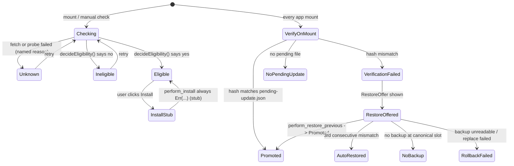
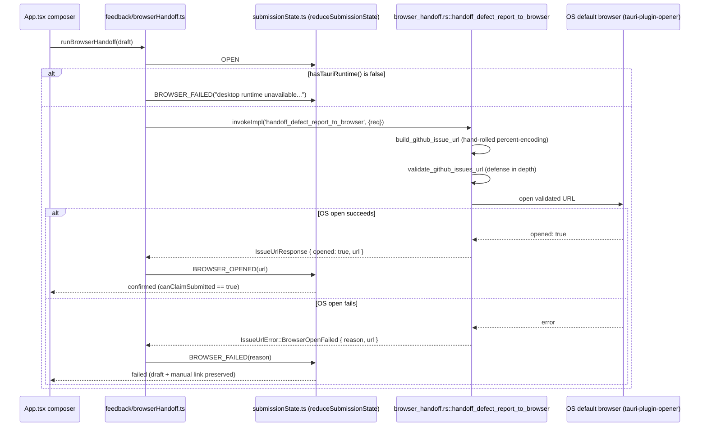

# Update & Feedback

> Scope: The desktop app's self-update chain and its feedback/defect-report submission chain, including exactly what is real vs. stubbed today.
> Last verified: **2026-09-20 against `tranche/16`, HEAD `424e93e93c`** — SD-36 docs-truth capability
> pass: checked this document's stub/real claims (`perform_install` stub, `perform_retention_sweep`
> unregistered, the transport-less submit flow) against the code and confirmed each is still precisely
> true; `testerWorkbench`/`TesterWorkbenchSurface` here are cited only as real path/type names, not as
> product-wide framing, so they needed no correction. No substantive change this pass beyond this
> header refresh. Prior pass **2026-09-20 against `b22ea9e113`** re-derived the four native transaction
> commands (unchanged in shape since the pass before that — `perform_retention_sweep` is still real,
> tested, and still not registered in `generate_handler!`), the `apps/desktop/src/update/Ui.tsx`
> composition (now assembled from separate panel components rather than described as one file), and
> the current feedback-directory layout, and added coverage of the controlled-defect SHA-256 mismatch
> harness (`update/controlledDefect.ts` / `feedback/controlledDefectPayload.ts`), which existed at the
> pass before that but was undocumented until then.
> Maintenance: updated at SD closure — see [README.md](./README.md) §Maintenance contract

Both subsystems share one ethos, stated verbatim in multiple places in the source: **never claim more than is proven.** A failed or missing piece degrades honestly to `'unknown'` / a named reason string, never to a fabricated success. This document traces both chains through the real files and calls out, precisely, where that posture currently means "not wired yet."

## Self-update lifecycle


*Two independent state machines share one mount point (`App.tsx`'s `UpdateSection`): the eligibility check on the left, `verify_relaunch_artifact`'s promote-or-offer-rollback path on the right. `InstallStub` is reachable in the type system but not from the live UI — see below.*

All paths below are under `apps/desktop/src/update/` unless noted.

**`updateModel.ts`** is the shared contract the UI renders against: `UPDATE_CHANNEL_OPTIONS = ['alpha', 'beta', 'stable']` (the release-promotion order, not a stability order); `InstalledState`, `LastCheckState`, and `PendingRollbackState` are the three state shapes threaded through `UpdateControllerDeps`. The `UpdateController` interface (`runCheck`/`computeEligibility`/`disabledReason`/`releaseNotes`) is the dependency seam: the UI never calls a fetcher or `invoke()` itself, only this interface. Until a real controller is supplied, `buildUnwiredUpdateDeps()` provides a deterministic "not wired" controller so the UI never fabricates an eligibility verdict before a real one exists.

**Discovery fetch** (`fetch.ts`) fetches two documents over plain `fetch` (indirected through an injectable `fetchImpl` so tests never touch the network): the channel index at the canonical `update-index` branch URL (`indexSource.ts`'s `channelIndexUrl` — locked at `AV-SCH-7`, "channel index fetched from `update-index`, not GitHub Release scanning"), and the update manifest at the URL the index names. Both are validated against canonical JSON Schemas — `schemas/update/channel-index.schema.json` and `schemas/update/update-manifest.schema.json` at the repo root — via the ajv-based parsers in `parseChannelIndex.ts` / `parseUpdateManifest.ts` (`loadSchemas.ts` imports the schema files as typed JSON modules, enabled by `tsconfig.json`'s additive `include` entries). Every failure mode — HTTP error, invalid JSON, schema violation, unsupported channel — returns a discriminated `FetchResult<T>` (`{ ok: false, failure: {...} }`); nothing throws on the happy-vs-sad-path boundary. `fetch.ts` also fetches and SHA-256-verifies the release-notes body named by the manifest (`fetchReleaseNotesBody`) — a hash mismatch fails exactly like an HTTP error.

**`eligibility.ts`** is a pure decision function, `decideEligibility(input: EligibilityInput): EligibilityDecision`, evaluated as a fixed, first-match-wins row order over installed-state, manifest identity, and fetch outcomes — so `install_disabled_reason` is deterministic. `unknown` outranks `ineligible`, which outranks `eligible`; `InstallControl.tsx` enables the Install button only when the result is exactly `'eligible'`. `compareVersions` is a minimal dotted-segment semver-like comparator.

**`controllerAdapter.ts`**'s `createUpdateControllerDeps()` builds the one real controller in the app, bridging `fetch.ts`'s fetch/validate, `eligibility.ts`'s pure table, and the three Tauri commands with real bodies (`verify_relaunch_artifact`, `perform_restore_previous`, `is_install_eligible`). Its `runCheck(channel)` fetches the index and manifest, then calls `is_install_eligible` and feeds the result into `decideEligibility`; every failing step degrades to `'unknown'` with a named reason (e.g. `NO_LOCAL_RECORD_REASON = 'no local installed-state record yet — is_install_eligible has nothing to compare the fetched manifest against'`). It calls `invoke()` directly rather than through a `boundary/*.ts` wrapper (see [desktop-app.md](./desktop-app.md)'s boundary-rule exceptions), but still guards `hasTauriRuntime()` and accepts an injectable `invokeImpl`.

### The four native transaction commands

All four are defined in `apps/desktop/src-tauri/src/update/transaction.rs`. Three are registered in `main.rs`'s `generate_handler![...]`; the fourth is not — see below.

- **`is_install_eligible`** — real. Reads `installed-state.json` from the resolved config root (`$CODEX_CONFIG_DIR` or `$HOME/.config`) and reports install-kind/version/hash/managed-path-writability facts. It deliberately renders no eligible/ineligible verdict itself — `decideEligibility` (TS) is the single source of that decision.
- **`perform_install`** — **stub, verified precisely.** Its Rust body is:
  ```rust
  pub fn perform_install(_args: PerformInstallArgs) -> Result<RelaunchPrompt, String> {
      Err(
          "perform_install is registered but not wired: downloading the AppImage artifact \
           requires an HTTP client this crate does not carry as a dependency yet; \
           execute_transaction itself is real and tested, but no install is performed here \
           until a download step lands"
              .to_string(),
      )
  }
  ```
  The staged-transaction body it would drive (`execute_transaction`, same file) is real and fully unit-tested against a fixture download closure — the only missing piece is a real HTTP client dependency, which `apps/desktop/src-tauri/Cargo.toml` still does not carry (`serde`, `serde_json`, `sha2`, `base64`, `uuid`, `tauri`, `tauri-plugin-opener`, `tauri-plugin-dialog`, `codex` — no `reqwest`/`ureq`/etc.). On the TypeScript side, `installAction.ts`'s `performInstall()` calls `invoke("perform_install", ...)` directly and is fully implemented (including mounting an `#install-relaunch-prompt` DOM hook on success) — but it is **never called from the live UI**: `Ui.tsx`'s composed `InstallControl` panel's install handler is documented as owning only the eligibility gate, not the transaction itself. So the stub is doubly inert: the Rust command always errors, and nothing in the shipped UI even calls it.
- **`perform_restore_previous`** — real. Implements the full AV-RB rollback decision tree (`perform_restore_previous_impl`): no pending update → `NoPending`; the 3-consecutive-mismatch auto-restore fast path (`AUTO_RESTORE_THRESHOLD = 3`, tracked in a `rollback-state.json` sidecar) → `AutoRestored`; no backup at the canonical slot → `NoBackup`; backup unreadable or atomic-replace fails → `RollbackFailed` (sidecar records `rollback_state: "rollback-failed"` with the exact reason, kept until explicit operator clear); otherwise → `Promoted`, which copies the most-recent backup (`Codex.previous.AppImage`) over the managed path, rewrites `installed-state.json`, deletes `pending-update.json`, and resets the sidecar.
- **`verify_relaunch_artifact`** — real. Hashes the running binary (`std::env::current_exe()` streamed through SHA-256) and compares it to `pending-update.json`'s expected hash. Match → promotes: writes a fresh `installed-state.json` and deletes the pending marker (`ReloadVerifyOutcome::Promoted`). Mismatch → flags the pending record `pending_update_state: Mismatch` but leaves `installed-state.json` untouched (`VerificationFailed`) so `restoreOffer.tsx` can offer a rollback. No pending file at all → `NoPendingUpdate`, a clean no-op. A corrupt/unreadable pending file is also treated as `NoPendingUpdate`.

**A fifth command, `perform_retention_sweep`, exists with a real, tested body** (`perform_retention_sweep_impl`, enforcing the two-slot backup cap, post-success staging cleanup, and the never-auto-delete-pending-while-unresolved rule) but is still not imported or registered in `main.rs`'s `generate_handler![...]` — it is unreachable from the frontend via `invoke()` today. Both `perform_restore_previous` and `perform_retention_sweep` in `transaction.rs` now carry `#[allow(dead_code)]` with a comment noting the real coverage runs through their `_impl` functions directly rather than through the `#[tauri::command]` shim in `cargo test` — this is a `cargo`-lint annotation, not a change to what is reachable from the frontend (`perform_restore_previous` remains registered in `generate_handler!`; `perform_retention_sweep` remains unregistered).

**Where the update data comes from at runtime**: the channel index and the manifest it points at both live on the `update-index` branch of the `codex` GitHub repo, published by the release lane — see [release-pipeline.md](./release-pipeline.md).

### The UI panels

`Ui.tsx`'s `UpdateUi` composes six separately-authored panel components — `ChannelSelector.tsx` (the pinned three-option select), `CheckPanel.tsx` (drives `controller.runCheck`), `InstallControl.tsx` (the eligibility badge + Install button, disabled unless `eligibility === 'eligible'`, with a deterministic `#install-disabled-reason` DOM hook), `installedPanel.tsx` (renders `deps.installed` verbatim), `lastCheckPanel.tsx`, `pendingRollbackPanel.tsx` — plus `restoreOffer.tsx`, mounted only when `App.tsx`'s `UpdateSection` supplies one after `verify_relaunch_artifact` reports a mismatch, wired to a live "Restore previous version" button calling `restorePreviousVersion()`. `diagnostics.ts` defines the three pure typed diagnostic shapes these panels render, matching the "Diagnostics Requirements" contract's field names verbatim, with deterministic default factories so every DOM hook (`#installed-panel`, `#last-check-panel`, `#pending-rollback-panel`) is always present even before a real value exists. `App.tsx`'s `UpdateSection` is the mount point: it calls `loadMountTimeState()` (which runs `verify_relaunch_artifact`) once per mount, builds `UpdateControllerDeps` via `createUpdateControllerDeps`, and re-runs both after a restore completes.

### The controlled-defect SHA-256 harness

A separate, test-only surface proves the staged-transaction's pre-replacement SHA-256 guard is
discriminating rather than a gate that cannot fail: `update/controlledDefect.ts` streams a real
AppImage download through an injected `fetchImpl`, computes its SHA-256 via Web Crypto
(`crypto.subtle.digest` in the webview, `node:crypto.webcrypto.subtle` under `npm test`), and compares
it against the manifest's declared `artifact_sha256` — never throwing across the module boundary, only
ever returning a typed result with a verbatim reason string. `feedback/controlledDefectPayload.ts` is
a pure, no-I/O function that assembles the GitHub issue body an operator files after a controlled
(intentionally-mismatching) release and its corrected follow-up both run through this path in real
tester conditions — it must include the controlled tag, actual/declared SHA-256, install-disabled
reason, and relaunch-prompt/hash-check text, and must exclude secrets, tokens, and raw full logs; it
throws if a forbidden token slips into the assembled payload. `feedback/docCommentHygiene.test.ts`
pins that these two files (and their siblings `submissionState.ts`/`submissionUiState.ts`) describe
their behavior in prose rather than pointing at external tranche/audit-id tags, with one named
exception: the literal `sd-16-e8` GitHub issue *label* string is real external taxonomy (an actual
label applied to filed issues), not a doc-comment tag, and is deliberately excluded from the sweep.

## Feedback / defect-report

### Evidence capture

`apps/desktop/src/testerWorkbench/feedback/evidence/` is the shared substrate both the bug-report and enhancement-request flows depend on, so their schemas and redaction rules cannot drift apart.

- **`captureFeedbackEvidence.ts`**'s `captureAutoEvidence(surface)` pulls a fixed backbone of fields from the live `TesterWorkbenchSurface` — build label, channel/support label, platform, current workflow, data-source identity, and (when available) release-truth fields like `releaseUnitId`/`sourceRevision`/`updateEligibilityState`/`trustGateStatus` — every string passed through `sanitizeReportableOutput`. `assembleFeedbackEvidence(input)` merges that backbone with tester-entered narrative fields (`observedBehavior`/`expectedBehavior`/`reproductionSteps` for bugs; `testerGoal`/`currentFriction`/`requestedCapability`/`affectedSurface` for enhancements) into one `FeedbackEvidencePayload`, categorizing every applicable field as auto-captured / tester-entered / redacted / optional and collecting `problems: string[]` for anything `required` but missing.
- **`redaction.ts`** enforces that nothing is captured silently: `evaluateAttachment()` returns `'requires-confirmation'` for any attachment that may contain sensitive data and lacks explicit `testerConfirmedInclude`; `validateRedaction()` additionally requires a non-empty redaction-declaration statement whenever any attachment is present.

### Bug + enhancement composers

`testerWorkbench/feedback/bug/composeBugReport.ts` and `testerWorkbench/feedback/enhancement/composeEnhancementRequest.ts` are structurally identical and deliberately non-interchangeable: each throws if handed a payload whose `flow` doesn't match its own kind. Each renders a `GithubBugIssueDraft` / equivalent enhancement draft as distinct markdown sections plus a derived label set (`bug`/`enhancement` base label, `channel:*`, `platform:*`, `surface:*`). `submittable` is true only when `payload.complete && title.length > 0`.

`submitBugReport.ts` / `submitEnhancementRequest.ts` accept an **injected transport** (`transport?: BugReportTransport | null`) and never fabricate a filed issue:
- `!composed.submittable` → `status: 'blocked-incomplete'`, draft preserved.
- `submittable` but `transport` is `null` (today's default) → `status: 'draft-preserved'`, message states plainly *"No GitHub submission transport is configured in this build."*
- `transport` throws, or returns `ok: false`, or returns no valid `issueUrl` → `status: 'draft-preserved'` again, never `'submitted'`.
- Only a transport call that returns `ok: true` **and** a URL that parses as `http(s)` → `status: 'submitted'`, `claimedSubmitted: true`, `resultHandle: { issueUrl, issueNumber }`.

Every outcome carries `copyablePayload` (the full rendered markdown) so a tester's evidence is never lost.

### Browser handoff


*The reducer states are `idle`/`opening`/`awaiting-issue-url`/`confirmed`/`failed` — deliberately no `submitted` state. `confirmed` is reachable only via `BROWSER_OPENED` carrying a non-empty URL; even an empty-URL `BROWSER_OPENED` routes to `failed(reason: 'empty-url')`.*

`App.tsx`'s composers route every `submittable` draft through this governed browser-handoff path instead of the (transport-less) `submitBugReport`/`submitEnhancementRequest` — only non-submittable drafts still call those, purely to get the honest `blocked-incomplete` preservation outcome. `canClaimSubmitted(state)` (`submissionState.ts`) — true only for `confirmed` with a non-empty URL — is the single source of truth `submissionUiState.ts`'s `deriveSubmissionUiState` re-derives from.

`feedback/browserHandoff.ts`'s `runBrowserHandoff(draft)` calls `invokeImpl('handoff_defect_report_to_browser', { req: { owner, repo, title, body, labels } })` (owner/repo pinned to `GITHUB_ISSUE_OWNER = 'electricm0nk'` / `GITHUB_ISSUE_REPO = 'codex'`). **Rust side** (`apps/desktop/src-tauri/src/browser_handoff.rs`): `handoff_defect_report_to_browser` builds a prefilled GitHub "new issue" URL (`build_github_issue_url`, hand-rolled percent-encoding — no `percent-encoding` crate dependency), shape-validates owner/repo/title/body/label lengths, **re-validates the built URL** as defense-in-depth (`validate_github_issues_url` — must be `https://github.com/<owner>/<repo>/issues/new`, ≤ `MAX_URL_LENGTH = 8192` bytes), then hands it to `tauri-plugin-opener`'s real OS browser open. `opened: true` is returned only after the OS-level open call itself reports success; a failed open returns `IssueUrlError::BrowserOpenFailed { reason, url }`, carrying the already-validated URL back so the shell can offer a manual link.

`App.tsx`'s `BrowserHandoffResultPanel` renders the honest framing directly in the UI copy: on `confirmed`, *"A prefilled GitHub issue form was opened in your browser. Review it and press 'Create' there to file the issue — the shell only confirms the form was opened; it does not claim the issue was submitted."*

## The honest-degradation ethos, concretely

Every degradation point traced above names its own reason rather than defaulting silently:

- `decideEligibility` returns `'unknown'` (never a guessed `'eligible'`/`'ineligible'`) whenever a fetch step or the local install probe hasn't completed, is missing, or has failed.
- `is_install_eligible`'s `Ok(InstallEligibilityProbe { installed: None, .. })` is documented as an honest "nothing to report" result for a fresh install.
- `perform_install` refuses to fabricate an install; its error message names the exact missing dependency class (an HTTP client), not a vague failure.
- `verify_relaunch_artifact` treats a hash-compute failure as `VerificationFailed` (prompting restore) rather than silently promoting.
- `runBrowserHandoff` never reaches `confirmed` without a real, non-empty, OS-confirmed URL; a corrupt or empty result always routes to `failed`.
- `submitBugReport`/`submitEnhancementRequest` never report `'submitted'` without a transport-confirmed issue handle, and always preserve the full draft as copyable text.
- The controlled-defect payload assembler throws rather than silently omitting a forbidden token from an issue body headed for a real GitHub issue.

## How to extend

**Add a new update-panel component** (worked example: following `installedPanel.tsx`'s precedent):
1. Add the pure diagnostic shape to `diagnostics.ts` if the panel needs a new field, with a deterministic default factory.
2. Write the panel as its own `.tsx` file under `apps/desktop/src/update/`, taking its data as props (no `invoke()` inside the panel).
3. Import and compose it into `Ui.tsx`'s `UpdateUi`.
4. Give it a stable DOM hook (`#foo-panel`) if the ui-smoke harness or a test needs to assert its presence.

**Add a new feedback field**: add it to `evidence/evidenceFields.ts`'s schema first, then to
`captureFeedbackEvidence.ts`'s auto-capture or the bug/enhancement composer's tester-entered fields —
never directly to a composer's rendered markdown without going through the shared evidence substrate,
or the bug and enhancement flows will drift apart.

## Pitfalls

- **`perform_install` being callable from TypeScript does not mean it is reachable from the UI.**
  `installAction.ts::performInstall()` is fully implemented and has its own test file, but nothing in
  `Ui.tsx`'s composed panels calls it. Do not treat "the function exists and is tested" as "a user can
  trigger this" for this one command.
- **`perform_retention_sweep` is real but not registered** — a change that assumes retention cleanup
  runs automatically after every install cycle is assuming a command path that does not fire, because
  it never reached `generate_handler!`.
- **The reducer has no `submitted` state, by design** — a UI change that tries to render a "submitted"
  status for the browser-handoff flow is fighting the reducer's own contract (`confirmed` only ever
  means "the browser opened," never "the issue was filed").
- **`GITHUB_ISSUE_OWNER`/`GITHUB_ISSUE_REPO` are hardcoded, not read from any config** — a fork or
  rename of this repo needs to update `feedback/browserHandoff.ts`'s literals directly.
- **The controlled-defect harness is a testing tool, not a shipped feature** — `controlledDefect.ts`
  and `controlledDefectPayload.ts` exist to let an operator prove the SHA-256 mismatch gate fires on a
  real, intentionally-broken release; they are not part of the ordinary update-check path any tester
  triggers.

## See also

- [desktop-app.md](./desktop-app.md) — the full Tauri command inventory (including these commands in context), the boundary-rule exception these modules represent, and the frontend directory map.
- [release-pipeline.md](./release-pipeline.md) — how the channel index / update manifest this chain fetches are published to the `update-index` branch.
- [testing.md](./testing.md) — how `fetch.ts`/`parseChannelIndex.ts`/`parseUpdateManifest.ts`/the transaction module's injected-closure seams are exercised without real network or filesystem access.
- [status.md](./status.md) — current capability/stub status across the whole repo.
