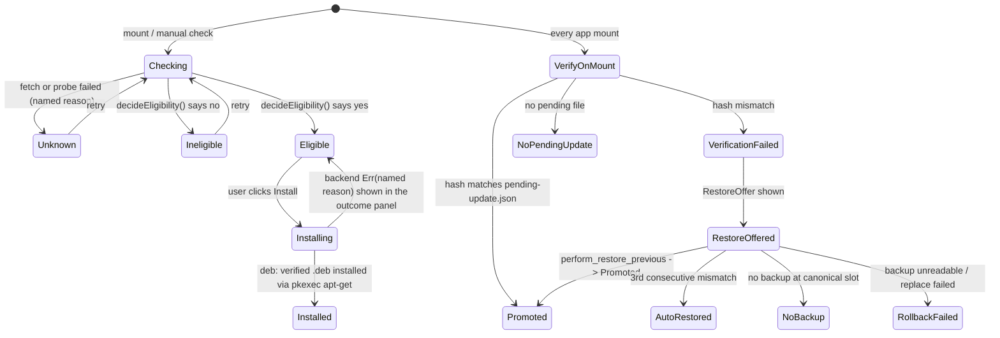
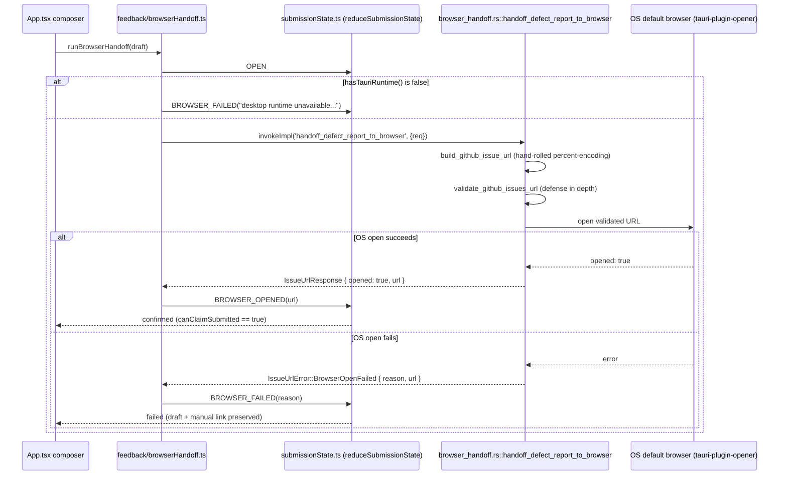

# Update & Feedback

> Scope: The desktop app's self-update chain and its feedback/defect-report submission chain, including exactly what is real vs. stubbed today.
> Last verified: **2026-10-07 against branch `tranche-16-ui` (base `develop` @ `157873a67e`)** — the
> self-update sections were re-derived against `update/transaction.rs`, `update/seed.rs`,
> `update/deb_install.rs` and `apps/desktop/src/update/`; `perform_retention_sweep` is still real,
> tested and unregistered.
> Maintenance: updated at SD closure — see [README.md](./README.md) §Maintenance contract

Both subsystems share one ethos, stated verbatim in multiple places in the source: **never claim more than is proven.** A failed or missing piece degrades honestly to `'unknown'` / a named reason string, never to a fabricated success. This document traces both chains through the real files and calls out, precisely, where that posture currently means "not wired yet."

## Self-update lifecycle

```mermaid
stateDiagram-v2
    [*] --> Checking: mount / manual check
    Checking --> Unknown: fetch or probe failed (named reason)
    Checking --> Ineligible: decideEligibility() says no
    Checking --> Eligible: decideEligibility() says yes
    Unknown --> Checking: retry
    Ineligible --> Checking: retry
    Eligible --> Installing: user clicks Install
    Installing --> Installed: deb: verified .deb installed via pkexec apt-get
    Installing --> Eligible: backend Err(named reason) shown in the outcome panel
    [*] --> VerifyOnMount: every app mount
    VerifyOnMount --> Promoted: hash matches pending-update.json
    VerifyOnMount --> VerificationFailed: hash mismatch
    VerifyOnMount --> NoPendingUpdate: no pending file
    VerificationFailed --> RestoreOffered: RestoreOffer shown
    RestoreOffered --> Promoted: perform_restore_previous -> Promoted
    RestoreOffered --> AutoRestored: 3rd consecutive mismatch
    RestoreOffered --> NoBackup: no backup at canonical slot
    RestoreOffered --> RollbackFailed: backup unreadable / replace failed
```
*Two independent state machines share one mount point (`App.tsx`'s `UpdateSection`): the eligibility check on the left, `verify_relaunch_artifact`'s promote-or-offer-rollback path on the right. `Installing` calls the real `perform_install`; only a `.deb` install can complete today — an AppImage install gets an explicit "not wired" error (see below).*

All paths below are under `apps/desktop/src/update/` unless noted.

**`updateModel.ts`** is the shared contract the UI renders against: `UPDATE_CHANNEL_OPTIONS = ['alpha', 'beta', 'stable']` (the release-promotion order, not a stability order); `InstalledState`, `LastCheckState`, and `PendingRollbackState` are the three state shapes threaded through `UpdateControllerDeps`. The `UpdateController` interface (`runCheck`/`computeEligibility`/`disabledReason`/`releaseNotes`/`install`) is the dependency seam: the UI never calls a fetcher or `invoke()` itself, only this interface. Until a real controller is supplied, `buildUnwiredUpdateDeps()` provides a deterministic "not wired" controller (its `install()` rejects) so the UI never fabricates an eligibility verdict or an install before a real one exists.

**Discovery fetch** (`fetch.ts`) fetches two documents over plain `fetch` (indirected through an injectable `fetchImpl` so tests never touch the network): the channel index at the canonical `update-index` branch URL (`indexSource.ts`'s `channelIndexUrl` — locked at `AV-SCH-7`, "channel index fetched from `update-index`, not GitHub Release scanning"), and the update manifest at the URL the index names. Both are validated against canonical JSON Schemas — `schemas/update/channel-index.schema.json` and `schemas/update/update-manifest.schema.json` at the repo root — via the ajv-based parsers in `parseChannelIndex.ts` / `parseUpdateManifest.ts` (`loadSchemas.ts` imports the schema files as typed JSON modules, enabled by `tsconfig.json`'s additive `include` entries). Every failure mode — HTTP error, invalid JSON, schema violation, unsupported channel — returns a discriminated `FetchResult<T>` (`{ ok: false, failure: {...} }`); nothing throws on the happy-vs-sad-path boundary. `fetch.ts` also fetches and SHA-256-verifies the release-notes body named by the manifest (`fetchReleaseNotesBody`) — a hash mismatch fails exactly like an HTTP error.

**`eligibility.ts`** is a pure decision function, `decideEligibility(input: EligibilityInput): EligibilityDecision`, evaluated as a fixed, first-match-wins row order over installed-state, manifest identity, and fetch outcomes — so `install_disabled_reason` is deterministic. `unknown` outranks `ineligible`, which outranks `eligible`; `InstallControl.tsx` enables the Install button only when the result is exactly `'eligible'`. `compareVersions` is a minimal dotted-segment semver-like comparator. Install kinds are `appimage | deb | dev | tarball | unknown`. A `deb` install is exempt from the managed-path-writability row (it updates through the package manager, not a user-writable path) and from the installed-hash-equals-manifest-hash row (the installed hash is the unpacked binary's, the manifest's is the `.deb`'s); instead `manifest.artifact_sha256` is `null` when the release publishes no `linux_deb`, which resolves `ineligible` with *"this release publishes no .deb artifact for a deb install"*. `controllerAdapter.ts` picks `linux_deb.sha256` for a deb install and `linux_appimage.sha256` otherwise.

**`controllerAdapter.ts`**'s `createUpdateControllerDeps()` builds the one real controller in the app, bridging `fetch.ts`'s fetch/validate, `eligibility.ts`'s pure table, and the three Tauri commands with real bodies (`verify_relaunch_artifact`, `perform_restore_previous`, `is_install_eligible`). Its `runCheck(channel)` fetches the index and manifest, then calls `is_install_eligible` and feeds the result into `decideEligibility`; every failing step degrades to `'unknown'` with a named reason (e.g. `NO_LOCAL_RECORD_REASON = 'no local installed-state record yet — is_install_eligible has nothing to compare the fetched manifest against'`). It calls `invoke()` directly rather than through a `boundary/*.ts` wrapper (see [desktop-app.md](./desktop-app.md)'s boundary-rule exceptions), but still guards `hasTauriRuntime()` and accepts an injectable `invokeImpl`. It also owns `install()`: it refuses unless a Check fetched a manifest and `computeDecision` is `eligible`, then invokes `perform_install` with the validated manifest exactly as fetched and the index URL, and re-throws the backend's own `Err(String)` text so the UI can show the real reason. `loadMountTimeState()` fills the Installed panel from the same `is_install_eligible` probe (whatever `verify_relaunch_artifact` reported), so the panel shows the real record; a probe failure is shown in the panel's reason field, not hidden.

### The four native transaction commands

The four native commands live in `apps/desktop/src-tauri/src/update/` (`transaction.rs` for the commands themselves; `seed.rs` and `deb_install.rs` for installed-state seeding and the `.deb` install). All four are registered in `main.rs`'s `generate_handler![...]`; a fifth, `perform_retention_sweep`, is not — see below.

- **`is_install_eligible`** — real. Reads `installed-state.json` from the resolved config root (`$CODEX_CONFIG_DIR` or `$HOME/.config`) and reports install-kind/version/hash/managed-path-writability facts. It deliberately renders no eligible/ineligible verdict itself — `decideEligibility` (TS) is the single source of that decision. **The record now exists on every machine**: `update/seed.rs`'s `seed_installed_state_for_running_build` runs in `main.rs`'s `setup` hook and calls `reconcile_installed_state`, which writes `installed-state.json` when absent (kind from `detect_install_kind`: `$APPIMAGE` set → AppImage, executable under `/usr/`, `/opt/` or `/snap/` → Deb, anything else → DevLocal and `update_eligible: false`), refreshes a Deb/DevLocal record whenever the binary hash or version changed (a package manager replaced the binary without going through the verifier), leaves an AppImage record to `verify_relaunch_artifact`, and reports an unreadable record as an error instead of overwriting it. Its version is Tauri's `package_info().version` (the stamped one), its commit is the build-time `CODEX_GIT_SHA`, and its channel is the compile-time `CODEX_UPDATE_CHANNEL` (default `alpha`).
- **`perform_install`** — real for `.deb`, AppImage and Windows installer installs. `perform_install_impl` reads the installed-state record and dispatches on its kind:
  - **Deb** → `deb_install::perform_deb_install`: parses `linux_deb` from the manifest, refuses any URL outside `https://github.com/electricm0nk/codex/releases/download/` and any artifact name that is not a bare `.deb` file name, downloads through `ureq` (the crate's only HTTP client, rustls, 15 s connect / 60 s read timeout) into `<config>/codex/update/staging/`, checks size and sha256 against the manifest, runs `dpkg-deb -f` and requires `Package: codex` and `Version:` equal to the release version, then installs with `pkexec apt-get install -y <file>` (the desktop's polkit password prompt; cancel and "no polkit agent" map to named errors). Every check runs before the installer because the installer is root. The staged copy is deleted whether or not the install succeeded, and the returned `RelaunchPrompt` carries from/to versions (its `pending_update_path` is the installed-state path: a deb update has no pending record, because the next startup's `reconcile_installed_state` records the new binary). The user restarts the app; nothing relaunches it automatically.
  - **AppImage** → `appimage_install::perform_appimage_install`: parses `linux_appimage` from the manifest, applies the same URL/name allow-list as the deb path (`update/download.rs`), requires `$APPIMAGE` (the `.AppImage` file this process was launched from; the executable inside the mount is not the file to replace), then runs `transaction::execute_transaction` with a streaming download: size and sha256 against the manifest, the running file's identity against `installed-state.json`, a two-slot rolling backup, `pending-update.json`, and an atomic replace. The next launch's `verify_relaunch_artifact` hashes `$APPIMAGE` (`running_artifact_path`; hashing `current_exe()` would hash a file inside the mount and never match) and promotes the record. The user restarts the app.
  - **WindowsNsis** → `windows_install::perform_windows_install`: parses `windows_nsis`, applies the allow-list (`.exe`), downloads the installer, checks size and sha256, writes `staging/codex-update.cmd` and starts it detached. The script waits for this process to exit, runs the installer with `/S` (silent; the per-user NSIS install needs no elevation) and starts Codex again, so the UI says "Close Codex to finish the update" (`InstallResult.closesToFinish`). Paths are refused if they contain characters that could inject commands. The release's installer is not code-signed, so the manifest hash and the URL allow-list are the integrity and provenance checks. The record is refreshed on the next start by `reconcile_installed_state` (Windows installs are not verifier-owned). The side-effecting edges sit behind the `WindowsSystem` trait; the real spawn is `cfg(windows)` and has been compiled for Windows but never run (see status.md).
  - **DevLocal** → `Err("dev builds are not update-eligible")`; **no record** → an error naming the missing installed-state record.
  The side-effecting edges (`download`, `inspect`, `install`) sit behind the `DebSystem` trait so the verification logic is tested without root, network or dpkg; the real implementation is `SystemDebInstaller`. `installAction.ts`'s `performInstall()` is no longer on the Install button's path (the button goes through `controller.install()`); see the pitfall below.
- **`perform_restore_previous`** — real. Implements the full AV-RB rollback decision tree (`perform_restore_previous_impl`): no pending update → `NoPending`; the 3-consecutive-mismatch auto-restore fast path (`AUTO_RESTORE_THRESHOLD = 3`, tracked in a `rollback-state.json` sidecar) → `AutoRestored`; no backup at the canonical slot → `NoBackup`; backup unreadable or atomic-replace fails → `RollbackFailed` (sidecar records `rollback_state: "rollback-failed"` with the exact reason, kept until explicit operator clear); otherwise → `Promoted`, which copies the most-recent backup (`Codex.previous.AppImage`) over the managed path, rewrites `installed-state.json`, deletes `pending-update.json`, and resets the sidecar.
- **`verify_relaunch_artifact`** — real. Hashes the running binary (`std::env::current_exe()` streamed through SHA-256) and compares it to `pending-update.json`'s expected hash. Match → promotes: writes a fresh `installed-state.json` and deletes the pending marker (`ReloadVerifyOutcome::Promoted`). Mismatch → flags the pending record `pending_update_state: Mismatch` but leaves `installed-state.json` untouched (`VerificationFailed`) so `restoreOffer.tsx` can offer a rollback. No pending file at all → `NoPendingUpdate`, a clean no-op. A corrupt/unreadable pending file is also treated as `NoPendingUpdate`.

**A fifth command, `perform_retention_sweep`, exists with a real, tested body** (`perform_retention_sweep_impl`, enforcing the two-slot backup cap, post-success staging cleanup, and the never-auto-delete-pending-while-unresolved rule) but is still not imported or registered in `main.rs`'s `generate_handler![...]` — it is unreachable from the frontend via `invoke()` today. Both `perform_restore_previous` and `perform_retention_sweep` in `transaction.rs` now carry `#[allow(dead_code)]` with a comment noting the real coverage runs through their `_impl` functions directly rather than through the `#[tauri::command]` shim in `cargo test` — this is a `cargo`-lint annotation, not a change to what is reachable from the frontend (`perform_restore_previous` remains registered in `generate_handler!`; `perform_retention_sweep` remains unregistered).

**Where the update data comes from at runtime**: the channel index and the manifest it points at both live on the `update-index` branch of the `codex` GitHub repo, published by the release lane — see [release-pipeline.md](./release-pipeline.md).

### The UI panels

`Ui.tsx`'s `UpdateUi` composes six separately-authored panel components — `ChannelSelector.tsx` (the pinned three-option select), `CheckPanel.tsx` (drives `controller.runCheck`), `InstallControl.tsx` (the eligibility badge + Install button, disabled unless `eligibility === 'eligible'`, with a deterministic `#install-disabled-reason` DOM hook), `installedPanel.tsx` (renders `deps.installed` verbatim — which `loadMountTimeState` now fills from the real record), `lastCheckPanel.tsx`, `pendingRollbackPanel.tsx` — plus `restoreOffer.tsx`, mounted only when `App.tsx`'s `UpdateSection` supplies one after `verify_relaunch_artifact` reports a mismatch, wired to a live "Restore previous version" button calling `restorePreviousVersion()`. `diagnostics.ts` defines the three pure typed diagnostic shapes these panels render, matching the "Diagnostics Requirements" contract's field names verbatim, with deterministic default factories so every DOM hook (`#installed-panel`, `#last-check-panel`, `#pending-rollback-panel`) is always present even before a real value exists. `App.tsx`'s `UpdateSection` is the mount point: it calls `loadMountTimeState()` (which runs `verify_relaunch_artifact`) once per mount, builds `UpdateControllerDeps` via `createUpdateControllerDeps`, and re-runs both after a restore completes. `InstallControl.tsx` also exports `InstallOutcomePanel`, the `#install-outcome` block `Ui.tsx` renders after an Install click: *"Installed X (was Y). Restart Codex to finish the update."* or *"Install failed: <the backend's reason>"* (`role="status"` / `role="alert"`). `Ui.tsx`'s `handleInstall` awaits `deps.controller.install()`.

### The controlled-defect SHA-256 harness

A separate, test-only surface proves the staged-transaction's pre-replacement SHA-256 guard is
discriminating rather than a gate that cannot fail: `update/controlledDefect.ts` streams a real
AppImage download through an injected `fetchImpl`, computes its SHA-256 via Web Crypto
(`crypto.subtle.digest` in the webview, `node:crypto.webcrypto.subtle` under `npm test`), and compares
it against the manifest's declared `artifact_sha256` — never throwing across the module boundary, only
ever returning a typed result with a verbatim reason string. `feedback/controlledDefectPayload.ts` is
a pure, no-I/O function that assembles the GitHub issue body an operator files after a controlled
(intentionally-mismatching) release and its corrected follow-up both run through this path in real
tester conditions — it must include the controlled tag, actual/declared SHA-256, install-disabled
reason, and relaunch-prompt/hash-check text, and must exclude secrets, tokens, and raw full logs; it
throws if a forbidden token slips into the assembled payload. `feedback/docCommentHygiene.test.ts`
pins that these two files (and their siblings `submissionState.ts`/`submissionUiState.ts`) describe
their behavior in prose rather than pointing at external tranche/audit-id tags, with one named
exception: the literal `sd-16-e8` GitHub issue *label* string is real external taxonomy (an actual
label applied to filed issues), not a doc-comment tag, and is deliberately excluded from the sweep.

## Feedback / defect-report

### Evidence capture

`apps/desktop/src/testerWorkbench/feedback/evidence/` is the shared substrate both the bug-report and enhancement-request flows depend on, so their schemas and redaction rules cannot drift apart.

- **`captureFeedbackEvidence.ts`**'s `captureAutoEvidence(surface)` pulls a fixed backbone of fields from the live `TesterWorkbenchSurface` — build label, channel/support label, platform, current workflow, data-source identity, and (when available) release-truth fields like `releaseUnitId`/`sourceRevision`/`updateEligibilityState`/`trustGateStatus` — every string passed through `sanitizeReportableOutput`. `assembleFeedbackEvidence(input)` merges that backbone with tester-entered narrative fields (`observedBehavior`/`expectedBehavior`/`reproductionSteps` for bugs; `testerGoal`/`currentFriction`/`requestedCapability`/`affectedSurface` for enhancements) into one `FeedbackEvidencePayload`, categorizing every applicable field as auto-captured / tester-entered / redacted / optional and collecting `problems: string[]` for anything `required` but missing.
- **`redaction.ts`** enforces that nothing is captured silently: `evaluateAttachment()` returns `'requires-confirmation'` for any attachment that may contain sensitive data and lacks explicit `testerConfirmedInclude`; `validateRedaction()` additionally requires a non-empty redaction-declaration statement whenever any attachment is present.

### Bug + enhancement composers

`testerWorkbench/feedback/bug/composeBugReport.ts` and `testerWorkbench/feedback/enhancement/composeEnhancementRequest.ts` are structurally identical and deliberately non-interchangeable: each throws if handed a payload whose `flow` doesn't match its own kind. Each renders a `GithubBugIssueDraft` / equivalent enhancement draft as distinct markdown sections plus a derived label set (`bug`/`enhancement` base label, `channel:*`, `platform:*`, `surface:*`). `submittable` is true only when `payload.complete && title.length > 0`.

`submitBugReport.ts` / `submitEnhancementRequest.ts` accept an **injected transport** (`transport?: BugReportTransport | null`) and never fabricate a filed issue:
- `!composed.submittable` → `status: 'blocked-incomplete'`, draft preserved.
- `submittable` but `transport` is `null` (today's default) → `status: 'draft-preserved'`, message states plainly *"No GitHub submission transport is configured in this build."*
- `transport` throws, or returns `ok: false`, or returns no valid `issueUrl` → `status: 'draft-preserved'` again, never `'submitted'`.
- Only a transport call that returns `ok: true` **and** a URL that parses as `http(s)` → `status: 'submitted'`, `claimedSubmitted: true`, `resultHandle: { issueUrl, issueNumber }`.

Every outcome carries `copyablePayload` (the full rendered markdown) so a tester's evidence is never lost.

### Browser handoff

```mermaid
sequenceDiagram
    participant App as App.tsx composer
    participant Handoff as feedback/browserHandoff.ts
    participant Reducer as submissionState.ts (reduceSubmissionState)
    participant Rust as browser_handoff.rs::handoff_defect_report_to_browser
    participant OS as OS default browser (tauri-plugin-opener)

    App->>Handoff: runBrowserHandoff(draft)
    Handoff->>Reducer: OPEN
    alt hasTauriRuntime() is false
        Handoff->>Reducer: BROWSER_FAILED("desktop runtime unavailable...")
    else
        Handoff->>Rust: invokeImpl('handoff_defect_report_to_browser', {req})
        Rust->>Rust: build_github_issue_url (hand-rolled percent-encoding)
        Rust->>Rust: validate_github_issues_url (defense in depth)
        Rust->>OS: open validated URL
        alt OS open succeeds
            OS-->>Rust: opened: true
            Rust-->>Handoff: IssueUrlResponse { opened: true, url }
            Handoff->>Reducer: BROWSER_OPENED(url)
            Reducer-->>App: confirmed (canClaimSubmitted == true)
        else OS open fails
            OS-->>Rust: error
            Rust-->>Handoff: IssueUrlError::BrowserOpenFailed { reason, url }
            Handoff->>Reducer: BROWSER_FAILED(reason)
            Reducer-->>App: failed (draft + manual link preserved)
        end
    end
```
*The reducer states are `idle`/`opening`/`awaiting-issue-url`/`confirmed`/`failed` — deliberately no `submitted` state. `confirmed` is reachable only via `BROWSER_OPENED` carrying a non-empty URL; even an empty-URL `BROWSER_OPENED` routes to `failed(reason: 'empty-url')`.*

`App.tsx`'s composers route every `submittable` draft through this governed browser-handoff path instead of the (transport-less) `submitBugReport`/`submitEnhancementRequest` — only non-submittable drafts still call those, purely to get the honest `blocked-incomplete` preservation outcome. `canClaimSubmitted(state)` (`submissionState.ts`) — true only for `confirmed` with a non-empty URL — is the single source of truth `submissionUiState.ts`'s `deriveSubmissionUiState` re-derives from.

`feedback/browserHandoff.ts`'s `runBrowserHandoff(draft)` calls `invokeImpl('handoff_defect_report_to_browser', { req: { owner, repo, title, body, labels } })` (owner/repo pinned to `GITHUB_ISSUE_OWNER = 'electricm0nk'` / `GITHUB_ISSUE_REPO = 'codex'`). **Rust side** (`apps/desktop/src-tauri/src/browser_handoff.rs`): `handoff_defect_report_to_browser` builds a prefilled GitHub "new issue" URL (`build_github_issue_url`, hand-rolled percent-encoding — no `percent-encoding` crate dependency), shape-validates owner/repo/title/body/label lengths, **re-validates the built URL** as defense-in-depth (`validate_github_issues_url` — must be `https://github.com/<owner>/<repo>/issues/new`, ≤ `MAX_URL_LENGTH = 8192` bytes), then hands it to `tauri-plugin-opener`'s real OS browser open. `opened: true` is returned only after the OS-level open call itself reports success; a failed open returns `IssueUrlError::BrowserOpenFailed { reason, url }`, carrying the already-validated URL back so the shell can offer a manual link.

`App.tsx`'s `BrowserHandoffResultPanel` renders the honest framing directly in the UI copy: on `confirmed`, *"A prefilled GitHub issue form was opened in your browser. Review it and press 'Create' there to file the issue — the shell only confirms the form was opened; it does not claim the issue was submitted."*

## The honest-degradation ethos, concretely

Every degradation point traced above names its own reason rather than defaulting silently:

- `decideEligibility` returns `'unknown'` (never a guessed `'eligible'`/`'ineligible'`) whenever a fetch step or the local install probe hasn't completed, is missing, or has failed.
- `is_install_eligible`'s `Ok(InstallEligibilityProbe { installed: None, .. })` is documented as an honest "nothing to report" result for a fresh install.
- `perform_install` refuses to fabricate an install: every verification failure (URL, name, size, sha256, package name, package version, installer exit) is a named `Err`, and an AppImage install says outright that its path is not connected.
- `verify_relaunch_artifact` treats a hash-compute failure as `VerificationFailed` (prompting restore) rather than silently promoting.
- `runBrowserHandoff` never reaches `confirmed` without a real, non-empty, OS-confirmed URL; a corrupt or empty result always routes to `failed`.
- `submitBugReport`/`submitEnhancementRequest` never report `'submitted'` without a transport-confirmed issue handle, and always preserve the full draft as copyable text.
- The controlled-defect payload assembler throws rather than silently omitting a forbidden token from an issue body headed for a real GitHub issue.

## How to extend

**Add a new update-panel component** (worked example: following `installedPanel.tsx`'s precedent):
1. Add the pure diagnostic shape to `diagnostics.ts` if the panel needs a new field, with a deterministic default factory.
2. Write the panel as its own `.tsx` file under `apps/desktop/src/update/`, taking its data as props (no `invoke()` inside the panel).
3. Import and compose it into `Ui.tsx`'s `UpdateUi`.
4. Give it a stable DOM hook (`#foo-panel`) if the ui-smoke harness or a test needs to assert its presence.

**Add a new feedback field**: add it to `evidence/evidenceFields.ts`'s schema first, then to
`captureFeedbackEvidence.ts`'s auto-capture or the bug/enhancement composer's tester-entered fields —
never directly to a composer's rendered markdown without going through the shared evidence substrate,
or the bug and enhancement flows will drift apart.

## Pitfalls

- **`installAction.ts::performInstall()` is not the Install button's path.** It is still implemented and tested (including the `#install-relaunch-prompt` DOM hook), but the button calls `controller.install()` in `controllerAdapter.ts`, which carries the eligibility guard and the injectable `invokeImpl`. Wiring a new caller to `performInstall` bypasses both.
- **A deb or Windows install cannot be offered a release without its artifact, and vice versa.** The manifest must carry `linux_deb` (written by `write_release_manifest.py` whenever a `.deb` is staged) or `windows_nsis` (schema 1.3.0, written whenever the NSIS installer is staged); `required_install_kind` is `any`. Adding an install kind means touching the schema, the writer and `eligibility.ts`/`controllerAdapter.ts` together.
- **The deb package version is the app version.** `reconcile_installed_state` and the eligibility comparison trust `package_info().version`; if the stamp does not reach `tauri.conf.json` (see [release-pipeline.md](./release-pipeline.md) §Stamp delivery) every build looks identical to the installed one and nothing is ever offered.
- **`perform_retention_sweep` is real but not registered** — a change that assumes retention cleanup
  runs automatically after every install cycle is assuming a command path that does not fire, because
  it never reached `generate_handler!`.
- **The reducer has no `submitted` state, by design** — a UI change that tries to render a "submitted"
  status for the browser-handoff flow is fighting the reducer's own contract (`confirmed` only ever
  means "the browser opened," never "the issue was filed").
- **`GITHUB_ISSUE_OWNER`/`GITHUB_ISSUE_REPO` are hardcoded, not read from any config** — a fork or
  rename of this repo needs to update `feedback/browserHandoff.ts`'s literals directly.
- **The controlled-defect harness is a testing tool, not a shipped feature** — `controlledDefect.ts`
  and `controlledDefectPayload.ts` exist to let an operator prove the SHA-256 mismatch gate fires on a
  real, intentionally-broken release; they are not part of the ordinary update-check path any tester
  triggers.

## See also

- [desktop-app.md](./desktop-app.md) — the full Tauri command inventory (including these commands in context), the boundary-rule exception these modules represent, and the frontend directory map.
- [release-pipeline.md](./release-pipeline.md) — how the channel index / update manifest this chain fetches are published to the `update-index` branch.
- [testing.md](./testing.md) — how `fetch.ts`/`parseChannelIndex.ts`/`parseUpdateManifest.ts`/the transaction module's injected-closure seams are exercised without real network or filesystem access.
- [status.md](./status.md) — current capability/stub status across the whole repo.
